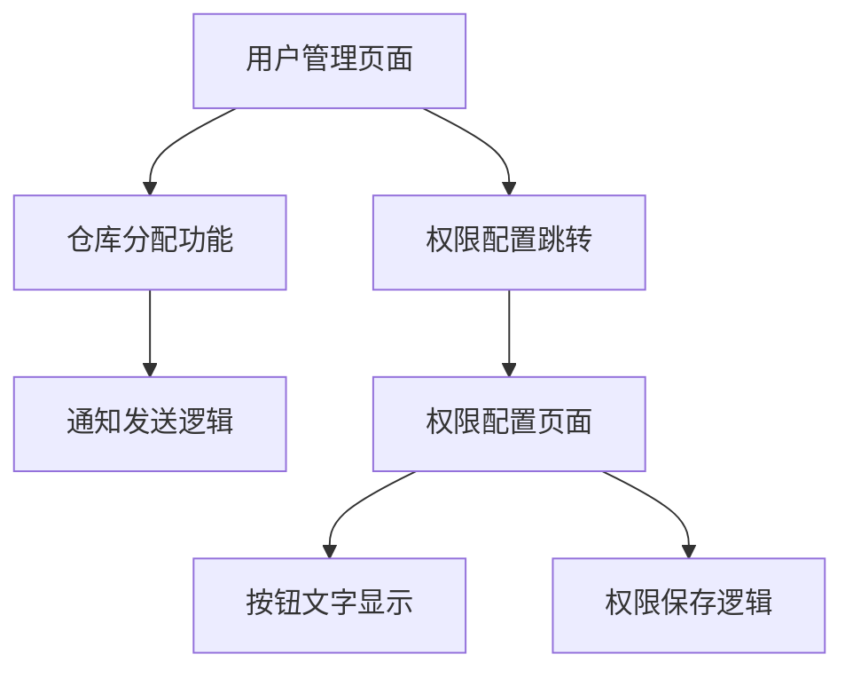

# Design Document

## Overview

本设计文档描述了老板端用户管理功能中管理员管理模块的问题修复方案。主要解决三个问题：
1. 车队长被分配仓库时，司机不应该收到通知
2. 权限设置中变更权限点击创建权限没有响应
3. 权限配置按钮文字应该统一显示为"变更权限"

## Architecture

本次修复涉及以下组件：

## Components and Interfaces

### 1. 用户管理页面 (user-management/index.tsx)

#### 修改点 1：仓库分配通知逻辑
- **位置**：`handleSaveWarehouseAssignment` 函数
- **问题**：当前代码在给车队长分配仓库时，会向 `userId`（车队长）发送通知，但同时也会通知相关仓库的车队长（包括自己），导致逻辑混乱
- **修复**：添加角色判断，只有当目标用户是司机时才发送通知给相关车队长

#### 修改点 2：权限配置跳转
- **位置**：`handleConfigPermission` 函数
- **问题**：跳转时没有传递 `userRole` 参数
- **修复**：在 URL 中添加 `userRole` 参数

### 2. 权限配置页面 (permission-config/index.tsx)

#### 修改点 3：按钮文字
- **位置**：保存按钮的文字
- **问题**：当前根据 `currentPermission` 状态显示"更新权限"或"创建权限"
- **修复**：统一显示为"变更权限"

## Data Models

无数据模型变更。

## Correctness Properties

*A property is a characteristic or behavior that should hold true across all valid executions of a system-essentially, a formal statement about what the system should do. Properties serve as the bridge between human-readable specifications and machine-verifiable correctness guarantees.*

### Property 1: 车队长仓库分配通知隔离
*For any* 仓库分配操作，当目标用户是车队长时，通知列表中应该只包含该车队长本人，不应该包含任何司机
**Validates: Requirements 1.1, 1.2**

### Property 2: 司机仓库分配通知正确性
*For any* 仓库分配操作，当目标用户是司机时，通知列表中应该包含该司机和相关仓库的车队长
**Validates: Requirements 1.3, 1.4**

### Property 3: 权限配置页面数据加载
*For any* 有效的 userRole 参数（MANAGER、PEER_ADMIN、SCHEDULER），权限配置页面应该能正确加载该用户的权限信息
**Validates: Requirements 2.2**

### Property 4: 变更权限按钮功能
*For any* 权限配置操作，点击"变更权限"按钮后应该正确执行保存操作（创建或更新权限）
**Validates: Requirements 3.2**

## Error Handling

1. **权限配置页面加载失败**：如果 `userRole` 参数缺失或无效，显示错误提示并返回上一页
2. **通知发送失败**：记录错误日志，不影响主流程

## Testing Strategy

### 单元测试
- 测试 `handleConfigPermission` 函数生成的 URL 是否包含正确的参数
- 测试通知列表生成逻辑是否根据用户角色正确过滤

### 属性测试
使用 Vitest 进行属性测试：
- 测试车队长仓库分配时通知列表的正确性
- 测试司机仓库分配时通知列表的正确性

### 手动测试
1. 在老板端给车队长分配仓库，验证司机不会收到通知
2. 点击车队长的权限按钮，验证能正常进入权限配置页面
3. 验证权限配置页面的按钮文字为"变更权限"
