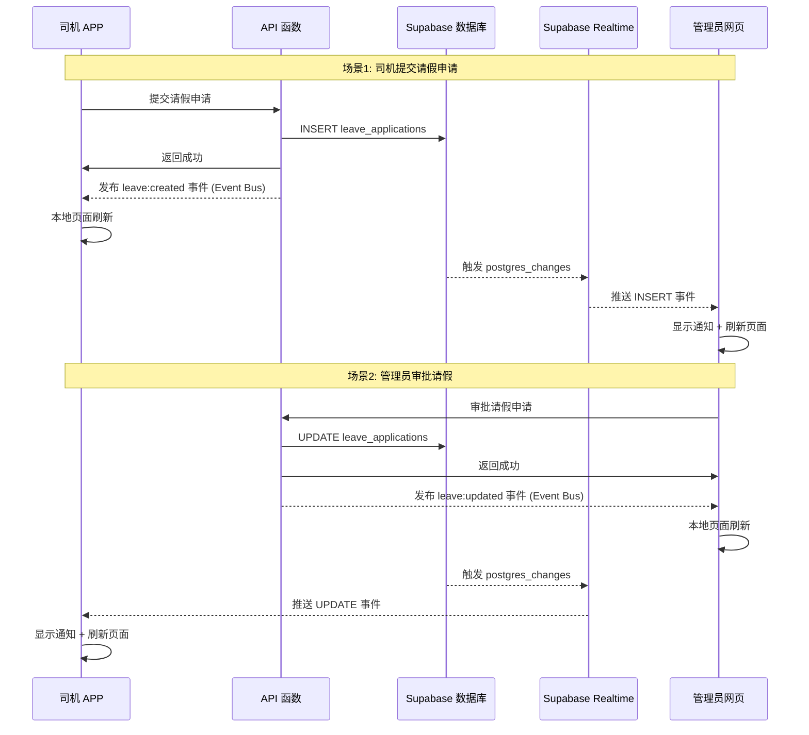
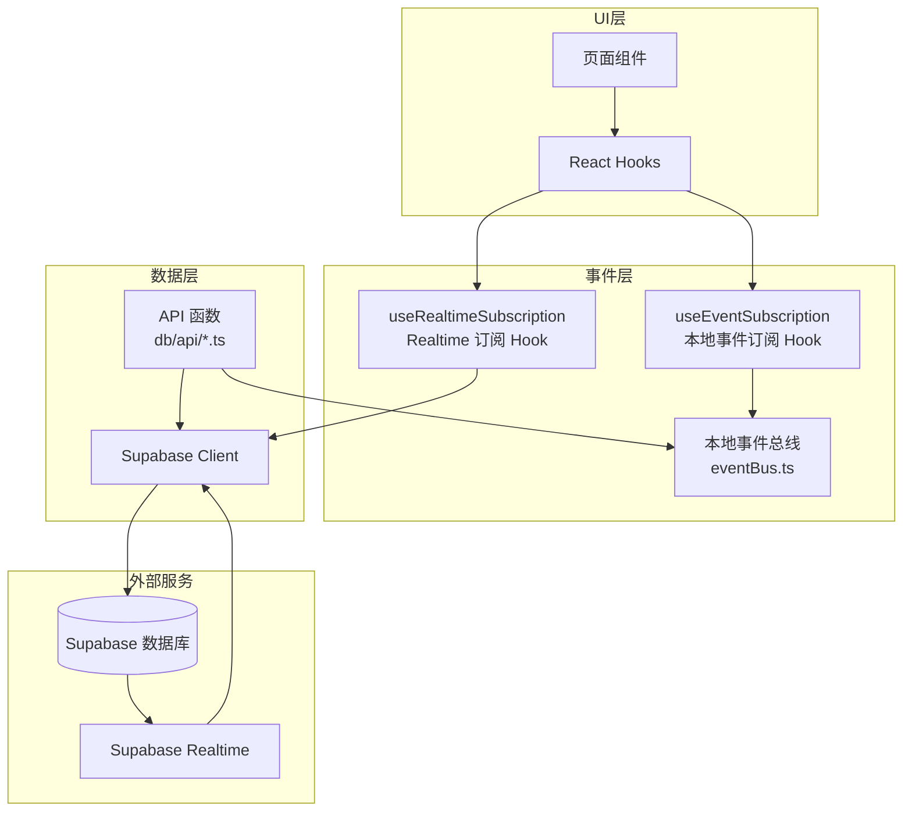

# 事件驱动数据刷新系统设计文档

## Overview

本设计文档描述了将轮询机制改为混合事件驱动机制的技术方案。核心思想是：

1. **本地事件总线 (Event Bus)**：用于同一客户端内的组件通信，实现本地页面即时刷新
2. **Supabase Realtime**：用于跨端实时通知，让管理员能够实时收到司机的申请

### 数据流架构



## Architecture

### 系统分层架构



### 混合策略决策表

| 场景 | 触发方 | 接收方 | 机制 | 原因 |
|------|--------|--------|------|------|
| 司机提交申请 | 司机 APP | 司机 APP (自己) | Event Bus | 同一客户端，无需网络 |
| 司机提交申请 | 司机 APP | 管理员网页 | Realtime | 跨端通知 |
| 管理员审批 | 管理员网页 | 管理员网页 (自己) | Event Bus | 同一客户端，无需网络 |
| 管理员审批 | 管理员网页 | 司机 APP | Realtime | 跨端通知 |

## Components and Interfaces

### 1. 本地事件总线 (Event Bus)

**文件**: `src/utils/eventBus.ts` (已存在)

```typescript
/** 事件类型定义 */
export type EventType =
  | 'leave:created'           // 请假申请创建
  | 'leave:updated'           // 请假申请更新（审批）
  | 'resignation:created'     // 离职申请创建
  | 'resignation:updated'     // 离职申请更新（审批）
  | 'attendance:created'      // 打卡记录创建
  | 'piece_work:created'      // 计件记录创建
  | 'piece_work:updated'      // 计件记录更新
  | 'notification:created'    // 通知创建
  | 'notification:read'       // 通知已读
  | 'data:refresh'            // 通用数据刷新

/** 事件数据接口 */
interface EventData {
  /** 记录 ID */
  id?: string
  /** 状态 */
  status?: string
  /** 用户 ID */
  userId?: string
  /** 额外数据 */
  [key: string]: unknown
}

/** 订阅事件 */
function subscribe(event: EventType, callback: (data?: EventData) => void): () => void

/** 发布事件 */
function publish(event: EventType, data?: EventData): void
```

### 2. Realtime 订阅 Hook

**文件**: `src/hooks/useRealtimeSubscription.ts` (新建)

```typescript
interface RealtimeSubscriptionOptions {
  /** 监听的表名 */
  table: string
  /** 监听的事件类型 */
  event?: 'INSERT' | 'UPDATE' | 'DELETE' | '*'
  /** 过滤条件 (如 user_id=eq.xxx) */
  filter?: string
  /** 变更回调 */
  onChange: (payload: RealtimePayload) => void
  /** 是否启用 */
  enabled?: boolean
}

interface RealtimePayload {
  eventType: 'INSERT' | 'UPDATE' | 'DELETE'
  new: Record<string, unknown>
  old?: Record<string, unknown>
}

function useRealtimeSubscription(options: RealtimeSubscriptionOptions): {
  isConnected: boolean
  error: Error | null
}
```

### 3. 本地事件订阅 Hook

**文件**: `src/hooks/useEventSubscription.ts` (已存在)

```typescript
/** 订阅单个事件 */
function useEventSubscription(event: EventType, callback: () => void): void

/** 订阅多个事件 */
function useMultiEventSubscription(events: EventType[], callback: () => void): void
```

### 4. API 函数事件发布

**文件**: `src/db/api/*.ts` (修改现有文件)

在每个 API 函数成功执行后发布对应事件：

```typescript
// 示例：请假申请 API
export async function createLeaveApplication(data: LeaveApplicationInput): Promise<LeaveApplication> {
  const result = await supabase
    .from('leave_applications')
    .insert(data)
    .select()
    .single()

  if (result.error) {
    throw result.error
  }

  // 成功后发布本地事件
  eventBus.publish('leave:created', {
    id: result.data.id,
    userId: data.user_id
  })

  return result.data
}
```

## Data Models

### 事件数据结构

```typescript
/** 请假事件数据 */
interface LeaveEventData {
  id: string
  userId: string
  status?: 'pending' | 'approved' | 'rejected'
}

/** 离职事件数据 */
interface ResignationEventData {
  id: string
  userId: string
  status?: 'pending' | 'approved' | 'rejected'
}

/** 打卡事件数据 */
interface AttendanceEventData {
  id: string
  userId: string
  type: 'clock_in' | 'clock_out'
}

/** 计件事件数据 */
interface PieceWorkEventData {
  id: string
  userId: string
  date: string
}
```

### Supabase Realtime 配置

需要在 Supabase 控制台启用以下表的 Realtime：

- `leave_applications`
- `resignation_applications`
- `attendance`
- `piece_work_records`


## Correctness Properties

*A property is a characteristic or behavior that should hold true across all valid executions of a system-essentially, a formal statement about what the system should do. Properties serve as the bridge between human-readable specifications and machine-verifiable correctness guarantees.*

基于需求分析，以下是可测试的正确性属性：

### Property 1: 数据变更操作发出对应本地事件

*For any* 成功的数据变更操作（创建请假、离职、打卡、计件记录），系统应该通过 Event Bus 发出对应类型的事件，且事件数据包含记录 ID。

**Validates: Requirements 2.1, 2.2, 2.3, 2.4**

### Property 2: 审批操作发出更新事件

*For any* 成功的审批操作（批准或拒绝请假、离职申请），系统应该通过 Event Bus 发出对应的 `updated` 事件，且事件数据包含新的状态值。

**Validates: Requirements 4.1, 4.2**

### Property 3: API 失败不发出事件

*For any* 失败的 API 调用（数据库错误、网络错误等），系统不应该发出任何事件到 Event Bus。

**Validates: Requirements 5.3**

### Property 4: 事件数据完整性

*For any* 发布到 Event Bus 的事件，事件数据应该包含必要的字段：记录 ID、用户 ID（如适用）、状态（如适用）。

**Validates: Requirements 5.2**

### Property 5: 通知防抖

*For any* 在 3 秒内发生的多个相同类型的事件，系统应该只显示一次通知，避免通知轰炸。

**Validates: Requirements 3.5**

### Property 6: 本地事件订阅生命周期

*For any* 使用 `useEventSubscription` 或 `useMultiEventSubscription` 的组件，当组件卸载时，所有订阅应该被自动清理，不会有内存泄漏。

**Validates: Requirements 7.3**

### Property 7: 本地事件触发回调

*For any* 订阅了本地事件的组件，当对应事件被发布时，组件的回调函数应该被调用。

**Validates: Requirements 7.4**

### Property 8: Realtime 订阅生命周期

*For any* 使用 `useRealtimeSubscription` 的组件，当组件卸载时，Realtime channel 应该被自动移除。

**Validates: Requirements 6.3**

### Property 9: Realtime 事件触发回调

*For any* 订阅了 Realtime 的组件，当数据库发生对应变更时，组件的 onChange 回调应该被调用。

**Validates: Requirements 6.4**

## Error Handling

### 1. Supabase Realtime 连接失败

```typescript
// 错误处理策略
const handleRealtimeError = (error: Error) => {
  // 1. 记录错误日志
  console.error('[Realtime] 连接失败:', error)
  
  // 2. 显示用户友好的提示
  Taro.showToast({
    title: '实时通知暂时不可用',
    icon: 'none',
    duration: 2000
  })
  
  // 3. 不影响应用核心功能
  // 用户仍可通过手动刷新获取最新数据
}
```

### 2. Event Bus 事件处理失败

```typescript
// 事件处理器中的错误不应影响其他处理器
export function publish(event: EventType, data?: unknown): void {
  listeners.get(event)?.forEach((callback) => {
    try {
      callback(data)
    } catch (error) {
      console.error(`[EventBus] 事件处理失败: ${event}`, error)
      // 继续执行其他处理器
    }
  })
}
```

### 3. 降级策略

| 场景 | 降级方案 |
|------|----------|
| Realtime 不可用 | 提供手动刷新按钮，用户可下拉刷新 |
| Event Bus 事件丢失 | 页面 onShow 时自动刷新数据 |
| 网络断开 | 显示离线提示，恢复后自动重连 |

## Testing Strategy

### 单元测试

使用 Vitest 进行单元测试：

1. **Event Bus 测试**
   - 测试订阅和发布功能
   - 测试取消订阅功能
   - 测试多个订阅者

2. **Hook 测试**
   - 测试 `useEventSubscription` 订阅和清理
   - 测试 `useMultiEventSubscription` 多事件订阅
   - 测试 `useRealtimeSubscription` 连接和断开

### 属性测试

使用 fast-check 进行属性测试：

1. **事件发布属性测试**
   - 生成随机的 API 调用结果
   - 验证成功时发出事件，失败时不发出事件

2. **防抖属性测试**
   - 生成随机时间间隔的事件序列
   - 验证 3 秒内的事件被正确防抖

3. **订阅生命周期测试**
   - 模拟组件挂载和卸载
   - 验证订阅被正确清理

### 集成测试

1. **端到端流程测试**
   - 司机提交申请 → 管理员收到通知
   - 管理员审批 → 司机收到通知

2. **错误恢复测试**
   - 模拟 Realtime 断开
   - 验证重连和数据恢复

### 测试框架配置

```typescript
// vitest.config.ts
export default defineConfig({
  test: {
    environment: 'jsdom',
    globals: true,
    setupFiles: ['./src/test/setup.ts'],
    coverage: {
      provider: 'v8',
      reporter: ['text', 'json', 'html'],
      exclude: ['node_modules/', 'src/test/']
    }
  }
})
```

### 属性测试库

使用 `fast-check` 进行属性测试：

```typescript
import fc from 'fast-check'

// 示例：测试事件发布属性
fc.assert(
  fc.property(
    fc.record({
      id: fc.uuid(),
      userId: fc.uuid(),
      status: fc.constantFrom('pending', 'approved', 'rejected')
    }),
    (eventData) => {
      // 验证事件数据包含必要字段
      return eventData.id !== undefined && eventData.userId !== undefined
    }
  )
)
```
