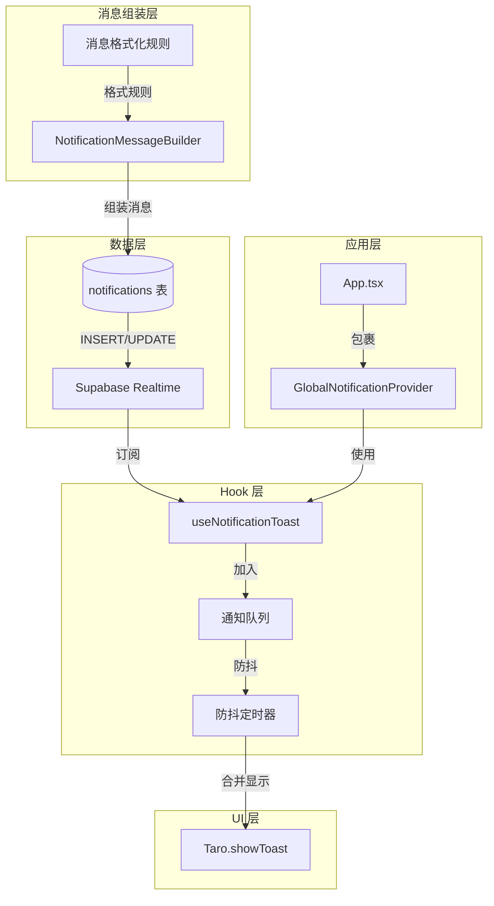
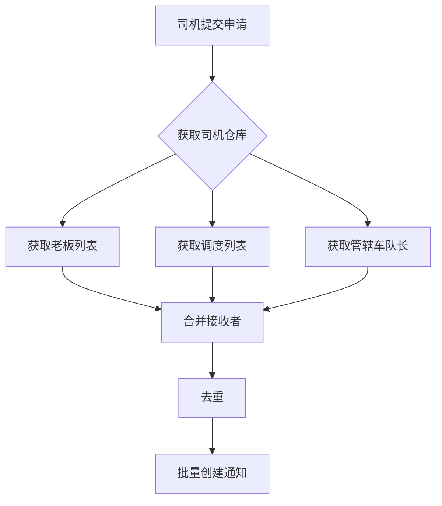

# Design Document

## Overview

本设计实现通知 Toast 弹窗功能，通过 Supabase Realtime 订阅 notifications 表的变更，当收到新通知时自动弹出 Toast 提示用户。支持多条通知防抖合并显示，避免频繁弹窗。

**v1.3.18 更新**：优化通知消息格式，使用统一的消息组装规则，包含唯一标识、仓库信息、司机类型、操作者角色等完整信息。

## Architecture



## Components and Interfaces

### 1. useNotificationToast Hook

已创建的核心 Hook，负责订阅通知并显示 Toast。

```typescript
/**
 * 通知 Toast Hook
 * @param userId - 用户 ID
 * @param enabled - 是否启用
 */
function useNotificationToast(userId: string | undefined, enabled?: boolean): void
```

### 2. GlobalNotificationProvider 组件

全局通知提供者组件，在应用根级别订阅通知。

```typescript
interface GlobalNotificationProviderProps {
  children: React.ReactNode
}
```

### 3. NotificationMessageBuilder 消息组装器

**新增组件**：负责统一组装通知消息内容，确保消息格式一致且包含完整信息。

```typescript
/**
 * 通知消息组装器
 * 负责根据不同场景组装统一格式的通知消息
 */
interface NotificationMessageBuilder {
  /**
   * 组装司机提交申请的通知消息
   * @param driverInfo - 司机信息（仓库、类型、姓名）
   * @param applicationType - 申请类型（请假/离职/车辆）
   * @returns 格式化的消息内容
   */
  buildSubmissionMessage(driverInfo: DriverInfo, applicationType: ApplicationType): string
  
  /**
   * 组装审批结果的通知消息
   * @param originalMessage - 原始提交消息
   * @param approverInfo - 审批人信息（角色、姓名）
   * @param result - 审批结果（通过/拒绝）
   * @returns 格式化的消息内容
   */
  buildApprovalMessage(originalMessage: string, approverInfo: ApproverInfo, result: ApprovalResult): string
  
  /**
   * 组装仓库分配变更的通知消息
   * @param operatorInfo - 操作者信息
   * @param warehouseName - 仓库名称
   * @param action - 操作类型（分配/取消分配）
   * @returns 格式化的消息内容
   */
  buildWarehouseAssignmentMessage(operatorInfo: OperatorInfo, warehouseName: string, action: 'assign' | 'unassign'): string
  
  /**
   * 组装司机类型变更的通知消息
   * @param operatorInfo - 操作者信息
   * @param newDriverType - 新的司机类型
   * @returns 格式化的消息内容
   */
  buildDriverTypeChangeMessage(operatorInfo: OperatorInfo, newDriverType: DriverType): string
}
```

### 4. 通知消息格式规范

#### 4.1 司机提交申请消息格式

| 场景 | 消息格式 | 示例 |
|------|---------|------|
| 单仓库司机提交 | `{仓库名} {司机类型} {姓名} 提交了{申请类型}申请` | `北京仓 纯司机 张三 提交了请假申请` |
| 多仓库司机提交 | `多仓库 {司机类型} {姓名} 提交了{申请类型}申请` | `多仓库 带车司机 李四 提交了离职申请` |

#### 4.2 审批结果消息格式

| 场景 | 消息格式 | 示例 |
|------|---------|------|
| 审批通过 | `{审批人角色} {审批人姓名} 通过 {原始消息}` | `老板 王五 通过 北京仓 纯司机 张三 提交了请假申请` |
| 审批拒绝 | `{审批人角色} {审批人姓名} 拒绝 {原始消息}` | `车队长 赵六 拒绝 多仓库 带车司机 李四 提交了离职申请` |

#### 4.3 仓库分配变更消息格式

| 场景 | 消息格式 | 示例 |
|------|---------|------|
| 分配仓库 | `您被 {操作者角色} {操作者姓名} 分配到 {仓库名} 仓库` | `您被 老板 王五 分配到 北京仓 仓库` |
| 取消分配 | `您被 {操作者角色} {操作者姓名} 取消分配 {仓库名} 仓库` | `您被 老板 王五 取消分配 北京仓 仓库` |

#### 4.4 司机类型变更消息格式

| 场景 | 消息格式 | 示例 |
|------|---------|------|
| 类型变更 | `您被 {操作者角色} {操作者姓名} 变更为{新司机类型}` | `您被 老板 王五 变更为带车司机` |

### 5. 数据模型扩展

#### 5.1 司机信息接口

```typescript
/**
 * 司机信息，用于组装通知消息
 */
interface DriverInfo {
  /** 司机ID */
  id: string
  /** 司机姓名 */
  name: string
  /** 司机类型：纯司机/带车司机 */
  driverType: 'pure' | 'with_vehicle'
  /** 分配的仓库列表 */
  warehouses: Array<{
    id: string
    name: string
  }>
}
```

#### 5.2 审批人信息接口

```typescript
/**
 * 审批人信息
 */
interface ApproverInfo {
  /** 审批人ID */
  id: string
  /** 审批人姓名 */
  name: string
  /** 审批人角色 */
  role: 'BOSS' | 'MANAGER' | 'PEER_ADMIN'
  /** 角色显示名称 */
  roleLabel: '老板' | '车队长' | '调度'
}
```

#### 5.3 申请类型枚举

```typescript
/**
 * 申请类型
 */
type ApplicationType = 'leave' | 'resignation' | 'vehicle'

/**
 * 申请类型显示名称映射
 */
const APPLICATION_TYPE_LABELS: Record<ApplicationType, string> = {
  leave: '请假',
  resignation: '离职',
  vehicle: '车辆'
}
```

### 6. 通知类型映射（更新）

| 通知类型 | 角色 | Toast 内容来源 |
|---------|------|---------------|
| leave_application_submitted | 管理员 | 使用 `content` 字段（包含完整司机信息） |
| resignation_application_submitted | 管理员 | 使用 `content` 字段（包含完整司机信息） |
| vehicle_review_pending | 管理员 | 使用 `content` 字段（包含完整司机信息） |
| leave_approved | 司机 | 使用 `content` 字段（包含审批人信息） |
| leave_rejected | 司机 | 使用 `content` 字段（包含审批人信息） |
| resignation_approved | 司机 | 使用 `content` 字段（包含审批人信息） |
| resignation_rejected | 司机 | 使用 `content` 字段（包含审批人信息） |
| vehicle_review_approved | 司机 | 使用 `content` 字段（包含审批人信息） |
| vehicle_review_need_supplement | 司机 | 使用 `content` 字段（包含审批人信息） |
| warehouse_assigned | 司机 | 使用 `content` 字段（包含操作者信息） |
| warehouse_unassigned | 司机 | 使用 `content` 字段（包含操作者信息） |
| driver_type_changed | 司机 | 使用 `content` 字段（包含操作者信息） |

### 7. 通知接收者权限规则

#### 7.1 车队长权限限制

车队长只能收到自己管辖仓库的司机申请通知：

```typescript
/**
 * 获取对司机有管辖权的车队长
 * @param driverId - 司机ID
 * @returns 有管辖权的车队长列表
 */
async function getManagersWithJurisdiction(driverId: string): Promise<NotificationRecipient[]> {
  // 1. 获取司机所在的仓库列表
  const driverWarehouses = await getDriverWarehouses(driverId)
  
  // 2. 获取管理这些仓库的车队长
  const managers = await getWarehouseManagers(driverWarehouses)
  
  // 3. 返回有管辖权的车队长
  return managers
}
```

#### 7.2 通知接收者规则

| 角色 | 接收规则 | 说明 |
|------|---------|------|
| 老板 (BOSS) | 接收所有申请 | 不受仓库限制 |
| 调度 (PEER_ADMIN) | 接收所有申请 | 不受仓库限制 |
| 车队长 (MANAGER) | 只接收管辖仓库的申请 | 根据 warehouse_assignments 表判断 |

#### 7.3 通知发送流程



#### 7.4 现有实现位置

车队长权限过滤已在 `src/services/notificationService.ts` 的 `getManagersWithJurisdiction` 函数中实现：

```typescript
// 步骤1：获取司机所在的仓库
const driverWarehouses = await supabase
  .from('warehouse_assignments')
  .select('warehouse_id')
  .eq('user_id', driverId)

// 步骤2：获取管理这些仓库的车队长
const managerWarehouses = await supabase
  .from('warehouse_assignments')
  .select('user_id')
  .in('warehouse_id', driverWarehouseIds)

// 步骤3：过滤出 MANAGER 角色
const managers = await supabase
  .from('users')
  .select('id, name, role')
  .eq('role', 'MANAGER')
  .in('id', managerIds)
```

## Data Models

### 通知队列结构

```typescript
/** 待处理的通知队列 */
let pendingNotifications: Notification[] = []

/** 防抖定时器 */
let debounceTimer: ReturnType<typeof setTimeout> | null = null
```

### 通知分组配置

```typescript
const NOTIFICATION_GROUPS = {
  // 司机端 - 审批结果
  leave_result: ['leave_approved', 'leave_rejected'],
  resignation_result: ['resignation_approved', 'resignation_rejected'],
  vehicle_result: ['vehicle_review_approved', 'vehicle_review_need_supplement'],
  // 管理端 - 新申请
  leave_application: ['leave_application_submitted'],
  resignation_application: ['resignation_application_submitted'],
  vehicle_application: ['vehicle_review_pending']
}
```

### 消息组装辅助函数

```typescript
/**
 * 获取司机类型显示名称
 * @param hasVehicle - 是否有车
 * @returns 司机类型显示名称
 */
function getDriverTypeLabel(hasVehicle: boolean): string {
  return hasVehicle ? '带车司机' : '纯司机'
}

/**
 * 获取仓库显示名称
 * @param warehouses - 仓库列表
 * @returns 仓库显示名称（单仓库显示名称，多仓库显示"多仓库"）
 */
function getWarehouseLabel(warehouses: Array<{name: string}>): string {
  if (warehouses.length === 0) return '未分配仓库'
  if (warehouses.length === 1) return warehouses[0].name
  return '多仓库'
}

/**
 * 获取角色显示名称
 * @param role - 用户角色
 * @returns 角色显示名称
 */
function getRoleLabel(role: 'BOSS' | 'MANAGER' | 'PEER_ADMIN'): string {
  const roleLabels: Record<string, string> = {
    BOSS: '老板',
    MANAGER: '车队长',
    PEER_ADMIN: '调度'
  }
  return roleLabels[role] || '管理员'
}

/**
 * 获取申请类型显示名称
 * @param type - 申请类型
 * @returns 申请类型显示名称
 */
function getApplicationTypeLabel(type: 'leave' | 'resignation' | 'vehicle'): string {
  const typeLabels: Record<string, string> = {
    leave: '请假',
    resignation: '离职',
    vehicle: '车辆'
  }
  return typeLabels[type] || '申请'
}
```

### 消息组装实现

```typescript
/**
 * 组装司机提交申请的通知消息
 * 格式：{仓库名} {司机类型} {姓名} 提交了{申请类型}申请
 */
function buildSubmissionMessage(
  driverName: string,
  driverType: 'pure' | 'with_vehicle',
  warehouses: Array<{name: string}>,
  applicationType: 'leave' | 'resignation' | 'vehicle'
): string {
  const warehouseLabel = getWarehouseLabel(warehouses)
  const driverTypeLabel = getDriverTypeLabel(driverType === 'with_vehicle')
  const applicationLabel = getApplicationTypeLabel(applicationType)
  
  return `${warehouseLabel} ${driverTypeLabel} ${driverName} 提交了${applicationLabel}申请`
}

/**
 * 组装审批结果的通知消息
 * 格式：{审批人角色} {审批人姓名} {通过/拒绝} {原始消息}
 */
function buildApprovalMessage(
  originalMessage: string,
  approverName: string,
  approverRole: 'BOSS' | 'MANAGER' | 'PEER_ADMIN',
  isApproved: boolean
): string {
  const roleLabel = getRoleLabel(approverRole)
  const resultLabel = isApproved ? '通过' : '拒绝'
  
  return `${roleLabel} ${approverName} ${resultLabel} ${originalMessage}`
}

/**
 * 组装仓库分配变更的通知消息
 * 格式：您被 {操作者角色} {操作者姓名} {分配到/取消分配} {仓库名} 仓库
 */
function buildWarehouseAssignmentMessage(
  operatorName: string,
  operatorRole: 'BOSS' | 'MANAGER' | 'PEER_ADMIN',
  warehouseName: string,
  isAssign: boolean
): string {
  const roleLabel = getRoleLabel(operatorRole)
  const actionLabel = isAssign ? '分配到' : '取消分配'
  
  return `您被 ${roleLabel} ${operatorName} ${actionLabel} ${warehouseName} 仓库`
}

/**
 * 组装司机类型变更的通知消息
 * 格式：您被 {操作者角色} {操作者姓名} 变更为{新司机类型}
 */
function buildDriverTypeChangeMessage(
  operatorName: string,
  operatorRole: 'BOSS' | 'MANAGER' | 'PEER_ADMIN',
  newDriverType: 'pure' | 'with_vehicle'
): string {
  const roleLabel = getRoleLabel(operatorRole)
  const driverTypeLabel = getDriverTypeLabel(newDriverType === 'with_vehicle')
  
  return `您被 ${roleLabel} ${operatorName} 变更为${driverTypeLabel}`
}
```

## Correctness Properties

*A property is a characteristic or behavior that should hold true across all valid executions of a system-essentially, a formal statement about what the system should do. Properties serve as the bridge between human-readable specifications and machine-verifiable correctness guarantees.*

### Property 1: 通知类型正确映射

*For any* 通知类型，调用 getSingleToastMessage 函数应返回对应的中文提示内容，不应返回空字符串或 undefined。

**Validates: Requirements 1.1-1.6, 2.1-2.3**

### Property 2: 防抖合并正确性

*For any* 在防抖时间内收到的多条通知，flushNotifications 执行后队列应被清空，且只显示一次 Toast。

**Validates: Requirements 3.1-3.3**

### Property 3: 合并消息完整性

*For any* 多条不同类型的通知，getMergedToastMessage 返回的消息应包含所有通知类型的描述。

**Validates: Requirements 3.2, 3.3**

## Error Handling

1. **订阅失败**: 记录日志，不影响应用正常使用
2. **用户未登录**: 不启动订阅，避免无效请求
3. **Toast 显示失败**: 静默失败，不抛出异常

## Testing Strategy

### 单元测试

- 测试 `getSingleToastMessage` 函数对各种通知类型的映射
- 测试 `getMergedToastMessage` 函数的合并逻辑
- 测试 `getNotificationGroup` 函数的分组逻辑

### 集成测试

- 测试 Hook 的订阅和取消订阅流程
- 测试防抖合并机制

### 测试框架

使用 Vitest 进行单元测试。
