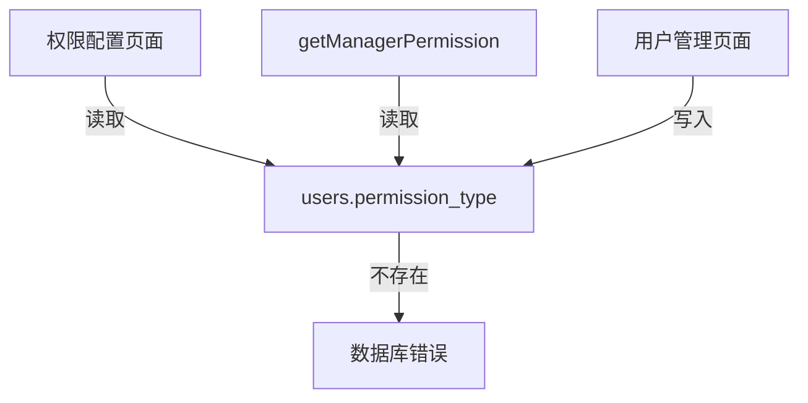
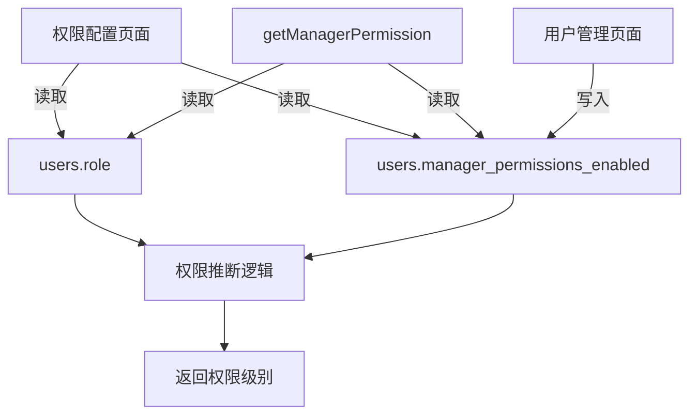

# Design Document - 权限系统字段修复

## Overview

本设计文档描述如何修复权限系统中对不存在的 `permission_type` 数据库字段的引用问题。采用应用层权限控制方案，移除对该字段的依赖，改为基于用户角色（role）和现有字段（manager_permissions_enabled）推断权限级别。

## Architecture

### 当前问题



### 修复后架构



## Components and Interfaces

### 1. 权限推断逻辑

基于用户角色推断权限级别的核心逻辑：

```typescript
/**
 * 根据用户角色和权限启用状态推断权限级别
 * @param role - 用户角色
 * @param managerPermissionsEnabled - 管理员权限是否启用（仅对 MANAGER/PEER_ADMIN 有效）
 * @returns 权限级别：'full_control' 或 'view_only'
 */
function inferPermissionLevel(
  role: UserRole,
  managerPermissionsEnabled?: boolean | null
): 'full_control' | 'view_only' {
  // BOSS 角色始终拥有完整权限
  if (role === 'BOSS') {
    return 'full_control'
  }
  
  // MANAGER 和 PEER_ADMIN 角色根据 manager_permissions_enabled 字段确定
  if (role === 'MANAGER' || role === 'PEER_ADMIN') {
    // 默认为 true（完整权限），除非明确设置为 false
    return managerPermissionsEnabled !== false ? 'full_control' : 'view_only'
  }
  
  // DRIVER 和其他角色默认为仅查看权限
  return 'view_only'
}
```

### 2. 需要修改的文件

| 文件 | 修改内容 |
|------|---------|
| `src/db/api/users.ts` | 修改 `getManagerPermission` 函数，移除对 `permission_type` 的引用 |
| `src/pages/super-admin/permission-config/index.tsx` | 修改加载和保存逻辑，使用 `manager_permissions_enabled` 字段 |
| `src/pages/super-admin/user-management/index.tsx` | 移除创建用户时设置 `permission_type` 的代码 |
| `src/pages/super-admin/user-management/hooks/useUserManagement.ts` | 移除设置 `permission_type` 的代码 |

## Data Models

### 用户表字段（保留）

| 字段 | 类型 | 说明 |
|------|------|------|
| `role` | UserRole | 用户角色（BOSS/PEER_ADMIN/MANAGER/DRIVER） |
| `manager_permissions_enabled` | boolean | 管理员权限是否启用（仅对 MANAGER/PEER_ADMIN 有效） |

### 权限级别映射

| 角色 | manager_permissions_enabled | 权限级别 |
|------|---------------------------|---------|
| BOSS | - | full_control |
| PEER_ADMIN | true/null | full_control |
| PEER_ADMIN | false | view_only |
| MANAGER | true/null | full_control |
| MANAGER | false | view_only |
| DRIVER | - | view_only |

## Correctness Properties

*A property is a characteristic or behavior that should hold true across all valid executions of a system-essentially, a formal statement about what the system should do. Properties serve as the bridge between human-readable specifications and machine-verifiable correctness guarantees.*

### Property 1: 角色到权限级别的映射一致性

*For any* 用户角色和 manager_permissions_enabled 值的组合，权限推断函数应该返回确定的、一致的权限级别。

**Validates: Requirements 2.1**

### Property 2: BOSS 角色始终拥有完整权限

*For any* BOSS 角色用户，无论 manager_permissions_enabled 字段的值如何，权限推断函数应该返回 'full_control'。

**Validates: Requirements 2.2**

### Property 3: MANAGER/PEER_ADMIN 权限由 manager_permissions_enabled 决定

*For any* MANAGER 或 PEER_ADMIN 角色用户，当 manager_permissions_enabled 为 false 时返回 'view_only'，否则返回 'full_control'。

**Validates: Requirements 2.3**

### Property 4: API 函数健壮性

*For any* 有效的用户 ID，调用 getManagerPermission 函数应该返回有效的权限对象或 null，而不是抛出数据库错误。

**Validates: Requirements 3.2**

## Error Handling

### 数据库查询错误

- 当查询用户信息失败时，返回 `null` 而不是抛出错误
- 记录错误日志以便调试

### 字段缺失处理

- 当 `manager_permissions_enabled` 字段为 `null` 或 `undefined` 时，默认为 `true`（完整权限）
- 这确保了向后兼容性

## Testing Strategy

### 单元测试

1. **权限推断函数测试**
   - 测试各种角色和 manager_permissions_enabled 组合
   - 验证返回的权限级别正确

2. **API 函数测试**
   - 测试 getManagerPermission 函数不会抛出数据库错误
   - 测试返回的权限对象结构正确

### 属性测试

使用 Vitest 的属性测试功能验证：
- 权限推断的一致性
- 角色到权限的映射正确性

### 集成测试

1. **权限配置页面测试**
   - 验证页面能正常加载
   - 验证保存权限变更能正常工作

2. **用户管理页面测试**
   - 验证创建用户不会设置 permission_type 字段
   - 验证权限配置按钮能正常跳转

