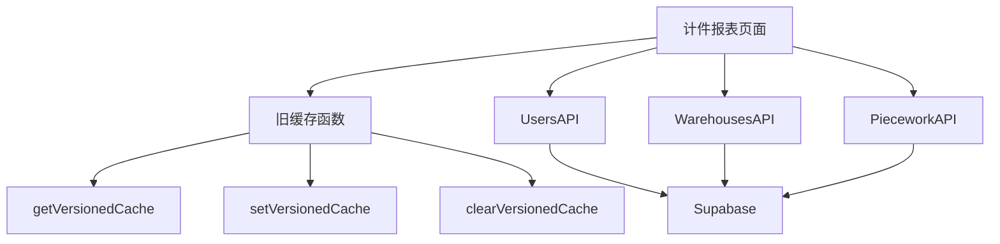
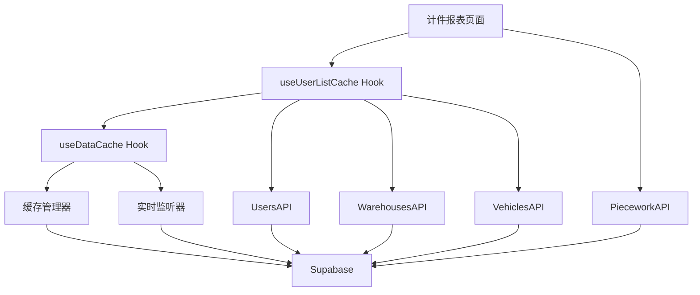

# Design Document

## Overview

本设计文档描述了将计件报表页面从旧缓存系统迁移到新缓存系统的技术方案。迁移的核心目标是：

1. 使用统一的 `useUserListCache` Hook 替代旧的缓存函数
2. 保持页面功能和用户体验不变
3. 提高代码可维护性和性能
4. 遵循项目编码规范

## Architecture

### 当前架构（迁移前）



**问题**：
- 使用多个独立的缓存键，难以统一管理
- 缓存失效策略分散在各处
- 没有实时更新机制
- 代码重复度高

### 目标架构（迁移后）



**优势**：
- 统一的缓存管理
- 自动实时更新
- 更好的性能（减少重复请求）
- 代码更简洁

## Components and Interfaces

### 1. useUserListCache Hook

**功能**：提供用户列表的缓存和实时更新

**接口**：
```typescript
interface UseUserListCacheReturn {
  users: UserWithRealName[]
  userDetails: Map<string, DriverDetailInfo>
  userWarehouseIdsMap: Map<string, string[]>
  loading: boolean
  error: Error | null
  fromCache: boolean
  refresh: () => Promise<void>
  clearCache: () => void
}

function useUserListCache(): UseUserListCacheReturn
```

**特性**：
- 自动加载用户列表、详情、仓库分配
- 支持实时更新（监听 users, warehouse_assignments, vehicles 表）
- 30 分钟缓存 TTL
- 提供刷新和清除缓存方法

### 2. 计件报表页面组件

**老板端**: `src/pages/super-admin/piece-work-report/index.tsx`
**车队长端**: `src/pages/manager/piece-work-report/index.tsx`

**主要状态**：
```typescript
interface PieceWorkReportState {
  // 基础数据（从 useUserListCache 获取）
  drivers: Profile[]
  warehouses: Warehouse[]
  
  // 计件数据（仍需单独加载）
  pieceWorkRecords: PieceWorkRecord[]
  categories: PieceWorkCategory[]
  
  // UI 状态
  loading: boolean
  currentWarehouseIndex: number
  startDate: string
  endDate: string
}
```

## Data Models

### UserWithRealName

```typescript
interface UserWithRealName extends Profile {
  real_name?: string      // 真实姓名（从驾驶证获取）
  login_account?: string  // 登录账号
}
```

### DriverDetailInfo

```typescript
type DriverDetailInfo = {
  license: DriverLicense | null
  vehicle: Vehicle | null
  // ... 其他详情
}
```

### 缓存数据结构

```typescript
interface UserListCacheData {
  users: UserWithRealName[]
  userDetails: Record<string, DriverDetailInfo>
  userWarehouses: Record<string, string[]>
}
```

## Correctness Properties

*A property is a characteristic or behavior that should hold true across all valid executions of a system-essentially, a formal statement about what the system should do. Properties serve as the bridge between human-readable specifications and machine-verifiable correctness guarantees.*

### Property 1: 缓存数据一致性

*For any* 计件报表页面实例，当使用 `useUserListCache` 加载数据时，返回的用户列表应该与直接调用 API 获取的数据一致（在缓存有效期内）

**Validates: Requirements 1.1, 2.1**

### Property 2: 实时更新响应性

*For any* 用户数据变更（新增、修改、删除），计件报表页面应该在合理时间内（< 5秒）自动更新显示

**Validates: Requirements 1.2, 2.2**

### Property 3: 资源清理完整性

*For any* 页面卸载操作，所有缓存订阅和监听器应该被正确清理，不应该有内存泄漏

**Validates: Requirements 1.3, 2.3**

### Property 4: 功能等价性

*For any* 用户操作（刷新、切换仓库、修改日期范围），迁移后的页面行为应该与迁移前完全一致

**Validates: Requirements 4.1, 4.2**

### Property 5: 代码质量合规性

*For all* 新增或修改的代码，应该包含完整的 JSDoc 注释和行内注释，并通过 lint 检查

**Validates: Requirements 5.1, 5.2, 5.3, 5.4**

### Property 6: 旧代码移除完整性

*For all* 计件报表页面文件，迁移完成后不应该包含任何对 `getVersionedCache`, `setVersionedCache`, `clearVersionedCache` 的调用

**Validates: Requirements 3.1, 3.2, 3.3, 3.4**

## Error Handling

### 1. 缓存加载失败

**场景**: `useUserListCache` 加载数据失败

**处理**:
```typescript
if (error) {
  Taro.showToast({
    title: '加载用户数据失败',
    icon: 'none'
  })
  // 显示错误状态，允许用户重试
}
```

### 2. 计件记录加载失败

**场景**: 加载计件记录时网络错误

**处理**:
```typescript
try {
  const records = await PieceworkAPI.getPieceWorkRecordsByWarehouse(...)
} catch (error) {
  console.error('加载计件记录失败:', error)
  Taro.showToast({
    title: '加载计件记录失败，请重试',
    icon: 'none'
  })
  // 保持当前状态，不清空已有数据
}
```

### 3. 实时更新失败

**场景**: Supabase 实时订阅断开

**处理**:
- `useDataCache` 内部会自动重连
- 页面无需特殊处理
- 用户可以手动刷新获取最新数据

### 4. 权限错误

**场景**: 车队长访问非自己管理的仓库数据

**处理**:
```typescript
// 过滤仓库列表，只显示有权限的仓库
const accessibleWarehouses = warehouses.filter(w => 
  userWarehouseIdsMap.get(user.id)?.includes(w.id)
)
```

## Testing Strategy

### 单元测试

**不需要编写新的单元测试**，因为：
1. `useUserListCache` 已经有完整的测试覆盖
2. 这是代码迁移，不是新功能开发
3. 主要验证点是功能等价性，通过手动测试更有效

### 集成测试（手动）

**测试场景**：

#### 1. 老板端计件报表页面

**测试步骤**：
1. 登录老板账号
2. 访问计件报表页面
3. 验证页面正常加载，显示所有仓库和司机
4. 切换不同仓库，验证数据正确
5. 修改日期范围，验证数据更新
6. 下拉刷新，验证数据重新加载
7. 在另一个页面添加新司机，返回计件报表页面，验证自动更新

**预期结果**：
- 所有功能正常工作
- 数据显示正确
- 性能良好（首次加载 < 2秒，缓存加载 < 500ms）
- 无控制台错误

#### 2. 车队长端计件报表页面

**测试步骤**：
1. 登录车队长账号
2. 访问计件报表页面
3. 验证只显示自己管理的仓库
4. 验证只显示自己仓库的司机
5. 切换不同仓库，验证数据正确
6. 修改日期范围，验证数据更新
7. 下拉刷新，验证数据重新加载

**预期结果**：
- 权限控制正确
- 数据过滤正确
- 功能正常工作
- 无控制台错误

#### 3. 性能测试

**测试指标**：
- 首次加载时间：< 2秒
- 缓存加载时间：< 500ms
- 切换仓库响应时间：< 300ms
- 内存占用：无明显增长
- 无内存泄漏

#### 4. 边界测试

**测试场景**：
- 无司机数据
- 无仓库数据
- 无计件记录
- 网络断开
- 数据加载失败
- 快速切换仓库

### 回归测试

**验证点**：
- 所有现有功能继续工作
- 数据显示正确
- 交互行为一致
- 无新增 bug

## Implementation Plan

### Phase 1: 准备工作

1. 备份当前代码
2. 确认 `useUserListCache` 可用
3. 分析当前缓存使用模式

### Phase 2: 迁移老板端页面

1. 引入 `useUserListCache` Hook
2. 替换基础数据加载逻辑
3. 移除旧缓存函数调用
4. 更新下拉刷新逻辑
5. 添加完整注释
6. 测试验证

### Phase 3: 迁移车队长端页面

1. 引入 `useUserListCache` Hook
2. 替换基础数据加载逻辑
3. 添加权限过滤逻辑
4. 移除旧缓存函数调用
5. 更新下拉刷新逻辑
6. 添加完整注释
7. 测试验证

### Phase 4: 清理和优化

1. 确认所有旧缓存调用已移除
2. 运行 lint 检查
3. 更新相关文档
4. 最终测试

## Migration Details

### 迁移前后对比

#### 基础数据加载

**迁移前**：
```typescript
// 老板端
const cacheKey = 'super_admin_piece_work_base_data'
const cached = getVersionedCache<{
  warehouses: Warehouse[]
  drivers: Profile[]
}>(cacheKey)

if (cached) {
  setWarehouses(cached.warehouses)
  setDrivers(cached.drivers)
} else {
  const [warehousesData, driversData] = await Promise.all([
    WarehousesAPI.getAllWarehouses(),
    UsersAPI.getAllUsers()
  ])
  setVersionedCache(cacheKey, {
    warehouses: warehousesData,
    drivers: driversData.filter(u => u.role === 'DRIVER')
  }, 5 * 60 * 1000)
}
```

**迁移后**：
```typescript
// 使用 useUserListCache Hook
const {users, userWarehouseIdsMap, loading, refresh, clearCache} = useUserListCache()

// 过滤司机
const drivers = useMemo(() => 
  users.filter(u => u.role === 'DRIVER'),
  [users]
)

// 获取所有仓库（仍需单独加载，因为 useUserListCache 不提供完整仓库列表）
const [warehouses, setWarehouses] = useState<Warehouse[]>([])
useEffect(() => {
  WarehousesAPI.getAllWarehouses().then(setWarehouses)
}, [])
```

#### 下拉刷新

**迁移前**：
```typescript
usePullDownRefresh(() => {
  clearVersionedCache('super_admin_piece_work_base_data')
  warehouses.forEach((warehouse) => {
    clearVersionedCache(`super_admin_piece_work_records_${warehouse.id}_${startDate}_${endDate}`)
  })
  loadData()
})
```

**迁移后**：
```typescript
usePullDownRefresh(async () => {
  // 清除用户列表缓存
  clearCache()
  // 刷新数据
  await refresh()
  // 重新加载计件记录
  await loadPieceWorkRecords()
  Taro.stopPullDownRefresh()
})
```

#### 页面显示时刷新

**迁移前**：
```typescript
useDidShow(() => {
  clearVersionedCache('super_admin_piece_work_base_data')
  warehouses.forEach((warehouse) => {
    clearVersionedCache(`super_admin_piece_work_records_${warehouse.id}_${startDate}_${endDate}`)
  })
  loadData()
})
```

**迁移后**：
```typescript
useDidShow(() => {
  // useUserListCache 会自动处理实时更新
  // 只需重新加载计件记录
  loadPieceWorkRecords()
})
```

### 注意事项

1. **仓库数据加载**：`useUserListCache` 只提供用户-仓库映射，不提供完整仓库列表，仍需单独加载
2. **计件记录缓存**：计件记录数据量大且变化频繁，暂不纳入统一缓存，保持现有逻辑
3. **权限过滤**：车队长端需要根据 `userWarehouseIdsMap` 过滤可访问的仓库
4. **实时更新**：用户数据会自动更新，但计件记录需要手动刷新

## Performance Considerations

### 优化点

1. **减少 API 请求**：用户列表数据从缓存加载，减少重复请求
2. **并行加载**：`useUserListCache` 内部使用 `Promise.all` 并行加载
3. **按需加载**：计件记录按仓库和日期范围按需加载
4. **缓存预热**：切换仓库时预加载相邻仓库的数据

### 性能指标

- **首次加载**：< 2秒（包含所有数据）
- **缓存加载**：< 500ms（从缓存读取）
- **切换仓库**：< 300ms（计件记录加载）
- **实时更新**：< 5秒（Supabase 实时推送延迟）

## Documentation Updates

### 需要更新的文档

1. **代码注释**：所有修改的代码必须添加完整注释
2. **CLEANUP_PLAN.md**：更新迁移状态
3. **PROGRESS.md**：记录迁移进度
4. **README.md**：更新功能说明（如有必要）

### 文档同步清单

- [ ] 所有函数添加 JSDoc 注释
- [ ] 复杂逻辑添加行内注释
- [ ] 更新 CLEANUP_PLAN.md 中的迁移状态
- [ ] 更新 PROGRESS.md 记录完成情况
- [ ] 确认文档与代码 100% 同步
