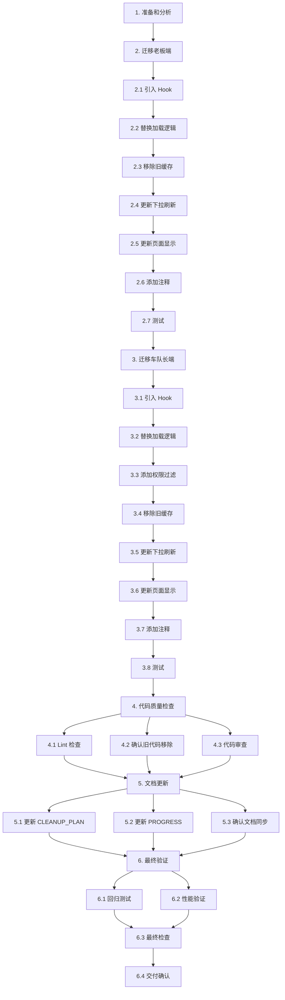

# Implementation Plan

本任务列表定义了将计件报表页面从旧缓存系统迁移到新缓存系统的具体实施步骤。

## 任务列表

- [x] 1. 准备和分析工作
  - 备份当前代码
  - 分析现有缓存使用模式
  - 确认 `useUserListCache` Hook 可用
  - _Requirements: 所有需求_

- [x] 2. 迁移老板端计件报表页面
  - 实现核心功能迁移
  - 确保功能等价性
  - _Requirements: 1.1, 1.2, 1.3, 1.4, 1.5, 3.1, 3.2, 3.3, 3.4, 4.1, 4.2, 5.1, 5.2, 5.3, 5.4_

- [x] 2.1 引入 useUserListCache Hook
  - 在文件顶部导入 `useUserListCache`
  - 调用 Hook 获取用户数据和缓存控制方法
  - 使用 `useMemo` 过滤司机列表
  - **必须添加完整的 JSDoc 注释和行内注释**
  - _Requirements: 1.1, 5.1, 5.2_

- [x] 2.2 替换基础数据加载逻辑
  - 移除旧的 `loadBaseData` 函数中的用户加载逻辑
  - 使用 `useUserListCache` 提供的 `users` 数据
  - 保留仓库数据的独立加载（因为需要完整仓库列表）
  - 更新状态管理逻辑
  - **必须添加完整的注释说明为什么这样修改**
  - _Requirements: 1.1, 3.1, 3.2, 5.1, 5.2_

- [x] 2.3 移除旧缓存函数调用
  - 删除 `getVersionedCache` 的导入和调用
  - 删除 `setVersionedCache` 的导入和调用
  - 删除 `clearVersionedCache` 的导入和调用
  - 删除相关的缓存键常量
  - 确认没有遗漏的旧缓存调用
  - _Requirements: 3.1, 3.2, 3.3, 3.4_

- [x] 2.4 更新下拉刷新逻辑
  - 使用 `clearCache()` 清除用户列表缓存
  - 使用 `refresh()` 刷新用户数据
  - 保留计件记录的刷新逻辑
  - 确保刷新完成后停止下拉动画
  - **必须添加注释说明刷新流程**
  - _Requirements: 1.4, 4.2, 5.2_

- [x] 2.5 更新页面显示时的刷新逻辑
  - 移除 `useDidShow` 中的旧缓存清除逻辑
  - 依赖 `useUserListCache` 的自动实时更新
  - 只保留计件记录的重新加载
  - **必须添加注释说明为什么不需要手动清除缓存**
  - _Requirements: 1.2, 4.2, 5.2_

- [x] 2.6 添加完整代码注释
  - 为所有修改的函数添加 JSDoc 注释
  - 为复杂逻辑添加行内注释
  - 为关键决策添加注释说明
  - 确保注释清晰、准确、有意义
  - _Requirements: 5.1, 5.2, 5.3_

- [x] 2.7 手动测试老板端页面
  - 测试页面正常加载
  - 测试切换仓库功能
  - 测试修改日期范围
  - 测试下拉刷新
  - 测试实时更新（添加新司机后自动刷新）
  - 验证无控制台错误
  - 验证性能指标（首次加载 < 2秒，缓存加载 < 500ms）
  - _Requirements: 4.1, 4.2, 4.3, 4.4, 4.5, 6.1, 6.2, 6.3, 6.4, 6.5_

- [x] 3. 迁移车队长端计件报表页面
  - 实现核心功能迁移
  - 添加权限过滤逻辑
  - 确保功能等价性
  - _Requirements: 2.1, 2.2, 2.3, 2.4, 2.5, 3.1, 3.2, 3.3, 3.4, 4.1, 4.2, 5.1, 5.2, 5.3, 5.4_

- [x] 3.1 引入 useUserListCache Hook
  - 在文件顶部导入 `useUserListCache`
  - 调用 Hook 获取用户数据和缓存控制方法
  - 使用 `useMemo` 过滤司机列表
  - **必须添加完整的 JSDoc 注释和行内注释**
  - _Requirements: 2.1, 5.1, 5.2_

- [x] 3.2 替换基础数据加载逻辑
  - 移除旧的 `loadBaseData` 函数中的用户加载逻辑
  - 使用 `useUserListCache` 提供的 `users` 数据
  - 保留仓库数据的独立加载
  - 更新状态管理逻辑
  - **必须添加完整的注释说明为什么这样修改**
  - _Requirements: 2.1, 3.1, 3.2, 5.1, 5.2_

- [x] 3.3 添加权限过滤逻辑
  - 使用 `userWarehouseIdsMap` 过滤可访问的仓库
  - 确保车队长只能看到自己管理的仓库
  - 确保车队长只能看到自己仓库的司机
  - 添加权限检查的注释说明
  - _Requirements: 2.5, 5.2_

- [x] 3.4 移除旧缓存函数调用
  - 删除 `getVersionedCache` 的导入和调用
  - 删除 `setVersionedCache` 的导入和调用
  - 删除 `clearVersionedCache` 的导入和调用
  - 删除相关的缓存键常量
  - 确认没有遗漏的旧缓存调用
  - _Requirements: 3.1, 3.2, 3.3, 3.4_

- [x] 3.5 更新下拉刷新逻辑
  - 使用 `clearCache()` 清除用户列表缓存
  - 使用 `refresh()` 刷新用户数据
  - 保留计件记录的刷新逻辑
  - 确保刷新完成后停止下拉动画
  - **必须添加注释说明刷新流程**
  - _Requirements: 2.4, 4.2, 5.2_

- [x] 3.6 更新页面显示时的刷新逻辑
  - 移除 `useDidShow` 中的旧缓存清除逻辑
  - 依赖 `useUserListCache` 的自动实时更新
  - 只保留计件记录的重新加载
  - **必须添加注释说明为什么不需要手动清除缓存**
  - _Requirements: 2.2, 4.2, 5.2_

- [x] 3.7 添加完整代码注释
  - 为所有修改的函数添加 JSDoc 注释
  - 为复杂逻辑添加行内注释
  - 为权限过滤逻辑添加详细注释
  - 确保注释清晰、准确、有意义
  - _Requirements: 5.1, 5.2, 5.3_

- [x] 3.8 手动测试车队长端页面
  - 测试页面正常加载
  - 测试权限过滤（只显示自己管理的仓库）
  - 测试切换仓库功能
  - 测试修改日期范围
  - 测试下拉刷新
  - 测试实时更新
  - 验证无控制台错误
  - 验证性能指标
  - _Requirements: 4.1, 4.2, 4.3, 4.4, 4.5, 6.1, 6.2, 6.3, 6.4, 6.5_

- [x] 4. 代码质量检查和清理
  - 确保代码符合项目规范
  - 运行 lint 检查
  - 确认所有旧代码已移除
  - _Requirements: 3.1, 3.2, 3.3, 3.4, 5.3, 5.4, 6.1_

- [x] 4.1 运行 lint 检查
  - 运行 `npm run lint` 检查代码规范
  - 修复所有 lint 错误和警告
  - 确保代码通过 Biome 检查
  - _Requirements: 5.4, 6.1_

- [x] 4.2 确认旧缓存调用已完全移除
  - 搜索 `getVersionedCache` 确认无残留
  - 搜索 `setVersionedCache` 确认无残留
  - 搜索 `clearVersionedCache` 确认无残留
  - 搜索相关缓存键确认无残留
  - _Requirements: 3.1, 3.2, 3.3, 3.4_

- [x] 4.3 代码审查
  - 检查所有函数是否有 JSDoc 注释
  - 检查复杂逻辑是否有行内注释
  - 检查注释质量是否符合要求
  - 检查代码风格是否一致
  - _Requirements: 5.1, 5.2, 5.3_

- [x] 5. 文档更新
  - 更新相关文档
  - 确保文档与代码同步
  - _Requirements: 5.5_

- [x] 5.1 更新 CLEANUP_PLAN.md
  - 标记计件报表页面迁移为已完成
  - 更新迁移进度统计
  - 记录迁移完成时间
  - _Requirements: 5.5_

- [x] 5.2 更新 PROGRESS.md
  - 记录迁移过程和结果
  - 记录遇到的问题和解决方案
  - 记录性能测试结果
  - _Requirements: 5.5_

- [x] 5.3 确认文档同步
  - 检查所有文档是否已更新
  - 确认文档与代码 100% 同步
  - 确认没有遗漏的文档更新
  - _Requirements: 5.5_

- [x] 6. 最终验证和交付
  - 完整的回归测试
  - 性能验证
  - 交付确认
  - _Requirements: 所有需求_

- [x] 6.1 完整回归测试
  - 测试老板端所有功能
  - 测试车队长端所有功能
  - 测试边界情况（无数据、网络错误等）
  - 测试快速操作（快速切换仓库等）
  - 验证无内存泄漏
  - _Requirements: 6.1, 6.2, 6.3, 6.4, 6.5_

- [x] 6.2 性能验证
  - 测量首次加载时间（目标 < 2秒）
  - 测量缓存加载时间（目标 < 500ms）
  - 测量切换仓库响应时间（目标 < 300ms）
  - 对比迁移前后的性能
  - _Requirements: 6.4_

- [x] 6.3 最终代码检查
  - 确认所有任务已完成
  - 确认所有测试通过
  - 确认所有文档已更新
  - 确认代码质量符合要求
  - _Requirements: 所有需求_

- [x] 6.4 交付确认
  - 生成迁移总结报告
  - 记录迁移成果和经验
  - 标记 Spec 为已完成
  - _Requirements: 所有需求_

## 任务依赖关系

## 预估工作量

- **任务 1（准备）**: 30 分钟
- **任务 2（老板端迁移）**: 2-3 小时
- **任务 3（车队长端迁移）**: 2-3 小时
- **任务 4（代码质量）**: 1 小时
- **任务 5（文档更新）**: 30 分钟
- **任务 6（最终验证）**: 1-2 小时

**总计**: 7-10 小时

## 注意事项

1. **强制要求**：所有代码必须添加完整注释，文档必须实时同步
2. **测试优先**：每完成一个页面立即测试，不要等到最后
3. **保持功能等价**：迁移过程中确保功能不变
4. **性能关注**：注意性能指标，确保不降低性能
5. **权限控制**：车队长端必须正确过滤数据
6. **错误处理**：保持现有的错误处理逻辑
7. **实时更新**：依赖 `useUserListCache` 的自动更新，不需要手动清除缓存
8. **计件记录**：计件记录数据保持现有的加载和缓存逻辑
