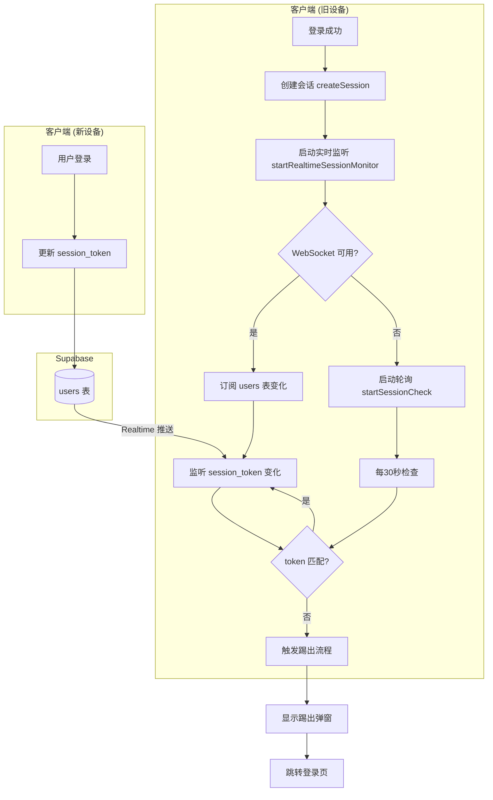
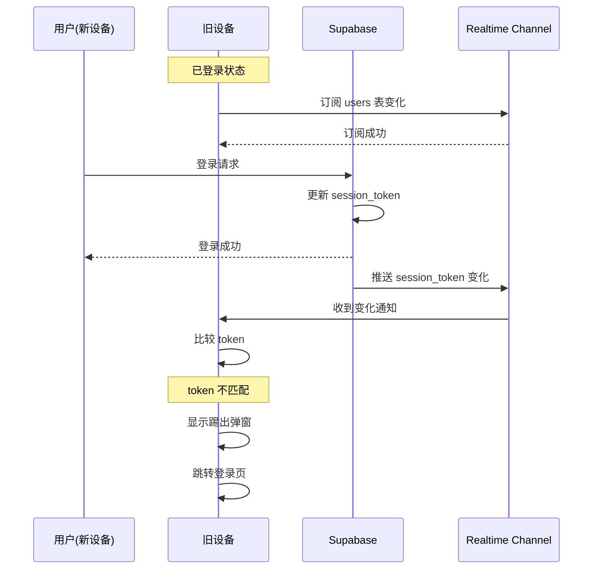

# Design Document

## Overview

本设计文档描述如何将现有的单点登录会话管理系统从轮询模式升级为实时检测模式。通过利用 Supabase Realtime（WebSocket）技术，当用户在其他设备登录时，旧设备能够即时收到通知并被踢出。

### 当前实现问题
- 使用 30 秒轮询检查会话状态
- 最坏情况下，用户需要等待 30 秒才能被踢出
- 轮询方式消耗更多服务器资源

### 改进方案
- 使用 Supabase Realtime 监听 `users` 表的 `session_token` 字段变化
- 当检测到 token 变化且与本地不匹配时，立即触发踢出流程
- 保留轮询作为 WebSocket 不可用时的降级方案

## Architecture



## Components and Interfaces

### 1. 会话实时监听器 (SessionRealtimeMonitor)

新增模块，负责实时监听会话状态变化。

```typescript
/**
 * 会话实时监听器接口
 */
interface SessionRealtimeMonitor {
  /**
   * 启动实时会话监听
   * @param userId - 当前用户ID
   * @param localSessionToken - 本地存储的会话令牌
   * @param onSessionInvalid - 会话失效回调
   */
  start(
    userId: string, 
    localSessionToken: string,
    onSessionInvalid: () => void
  ): void;
  
  /**
   * 停止实时会话监听
   */
  stop(): void;
  
  /**
   * 检查是否正在监听
   */
  isMonitoring(): boolean;
  
  /**
   * 获取当前连接状态
   */
  getConnectionStatus(): 'connected' | 'connecting' | 'disconnected' | 'error';
}
```

### 2. 修改后的会话管理器 (SessionManager)

扩展现有的 `sessionManager.ts`，集成实时监听功能。

```typescript
/**
 * 扩展的会话管理器接口
 */
interface ExtendedSessionManager {
  // 现有方法
  createSession(userId: string): Promise<boolean>;
  verifySession(userId: string): Promise<boolean>;
  clearSession(userId: string): Promise<void>;
  startSessionCheck(): void;
  stopSessionCheck(): void;
  
  // 新增方法
  startRealtimeMonitor(userId: string): void;
  stopRealtimeMonitor(): void;
  isRealtimeMonitorActive(): boolean;
}
```

### 3. 组件交互流程



## Data Models

### 现有数据结构（无需修改）

```typescript
/**
 * users 表中的会话相关字段
 */
interface UserSessionFields {
  /** 当前有效的会话令牌 */
  session_token: string | null;
  /** 会话创建时间 */
  session_created_at: string | null;
}
```

### Realtime 事件数据结构

```typescript
/**
 * Supabase Realtime 变更事件
 */
interface RealtimeChangeEvent {
  eventType: 'UPDATE';
  schema: 'public';
  table: 'users';
  new: {
    id: string;
    session_token: string | null;
    session_created_at: string | null;
    // ... 其他字段
  };
  old: {
    id: string;
    session_token: string | null;
    // ... 其他字段
  };
}
```

### 本地存储结构（无需修改）

```typescript
/**
 * 本地存储的会话信息
 */
interface LocalSessionStorage {
  /** 存储键名 */
  key: 'current_session_token';
  /** 会话令牌值 */
  value: string;
}
```

## Correctness Properties

*A property is a characteristic or behavior that should hold true across all valid executions of a system-essentially, a formal statement about what the system should do. Properties serve as the bridge between human-readable specifications and machine-verifiable correctness guarantees.*

### Property 1: Fallback to Polling on WebSocket Failure

*For any* WebSocket connection failure scenario, the system should automatically activate the polling mechanism and continue session monitoring without interruption.

**Validates: Requirements 1.4, 3.4, 4.2**

### Property 2: Token Mismatch Triggers Kickout

*For any* session token change event where the new database token does not match the local token, the system should trigger the kickout process.

**Validates: Requirements 2.2, 2.3**

### Property 3: Network Errors Do Not Force Logout

*For any* network error occurring during session verification (either via Realtime or polling), the system should NOT force the user to logout, maintaining the current session state.

**Validates: Requirements 4.3**

## Error Handling

### 1. WebSocket 连接错误

```typescript
/**
 * WebSocket 连接错误处理策略
 */
const handleWebSocketError = {
  // 连接失败：降级到轮询模式
  onConnectionFailed: () => {
    logger.warn('WebSocket 连接失败，降级到轮询模式');
    stopRealtimeMonitor();
    startSessionCheck(); // 启动轮询
  },
  
  // 连接超时：尝试重连
  onTimeout: () => {
    logger.warn('WebSocket 连接超时，尝试重连');
    // Supabase Realtime 会自动重连
  },
  
  // 连接断开：等待自动重连
  onDisconnected: () => {
    logger.info('WebSocket 连接断开，等待重连');
    // 不立即降级，等待自动重连
  }
};
```

### 2. 网络错误处理

```typescript
/**
 * 网络错误处理策略
 * 网络错误时不强制退出，保持当前状态
 */
const handleNetworkError = (error: Error) => {
  logger.error('网络错误', error);
  // 不触发踢出流程
  // 等待网络恢复后继续监听
};
```

### 3. 认证错误处理

```typescript
/**
 * 认证错误处理策略
 */
const handleAuthError = () => {
  logger.error('认证错误，需要重新登录');
  // 清除本地会话
  clearStoredSessionToken();
  // 跳转登录页
  smartLogout();
};
```

## Testing Strategy

### 单元测试

1. **Token 比较逻辑测试**
   - 测试 token 匹配时不触发踢出
   - 测试 token 不匹配时触发踢出
   - 测试 token 为 null 时的处理

2. **降级逻辑测试**
   - 测试 WebSocket 不可用时启动轮询
   - 测试 WebSocket 恢复后停止轮询

3. **错误处理测试**
   - 测试网络错误不触发踢出
   - 测试连接超时的处理

### 属性测试 (Property-Based Testing)

使用 `fast-check` 库进行属性测试：

1. **Property 1: Fallback to Polling**
   - 生成各种 WebSocket 错误场景
   - 验证系统总是降级到轮询模式

2. **Property 2: Token Mismatch Triggers Kickout**
   - 生成随机的 token 对（本地 vs 数据库）
   - 验证不匹配时总是触发踢出

3. **Property 3: Network Errors Do Not Force Logout**
   - 生成各种网络错误类型
   - 验证用户不会被强制退出

### 集成测试

1. **端到端会话踢出测试**
   - 模拟两个设备登录同一账号
   - 验证旧设备被踢出

2. **降级恢复测试**
   - 模拟 WebSocket 断开和恢复
   - 验证系统正确切换监听模式

### 测试框架

- **单元测试**: Vitest
- **属性测试**: fast-check
- **集成测试**: Vitest + MSW (Mock Service Worker)
