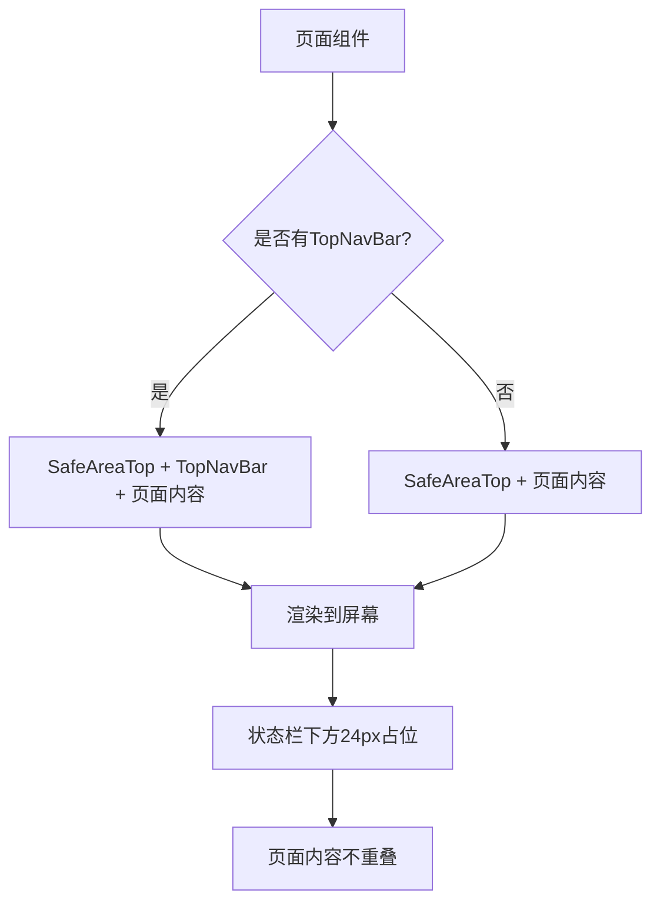

# Design Document

## Overview

本设计文档描述了如何为项目中的所有页面统一添加 SafeAreaTop 组件,以解决页面内容与系统状态栏重叠的问题。SafeAreaTop 组件已存在于项目中(`src/components/SafeAreaTop/index.tsx`),提供 24px 高度的占位空间。

项目中约有 80 个页面文件,分布在不同的角色目录下(driver、manager、super-admin、profile、shared 等)。部分页面已使用 TopNavBar 组件,需要在 TopNavBar 之前添加 SafeAreaTop。

## Architecture

### 系统架构



### 组件层次结构

```
Page Component
├── SafeAreaTop (新增)
│   └── 24px 占位空间
├── TopNavBar (如果存在)
│   └── 导航栏内容
└── Page Content
    └── 页面主要内容
```

## Components and Interfaces

### SafeAreaTop 组件

**已存在的组件**,位于 `src/components/SafeAreaTop/index.tsx`

```typescript
interface SafeAreaTopProps {
  /** 背景颜色,默认透明 */
  backgroundColor?: string
  /** 自定义类名 */
  className?: string
}

const SafeAreaTop: React.FC<SafeAreaTopProps> = ({
  backgroundColor = 'transparent',
  className = ''
}) => {
  return (
    <View
      className={`safe-area-top ${className}`}
      style={{
        height: '24px',
        backgroundColor,
        width: '100%',
        flexShrink: 0
      }}
    />
  )
}
```

**特性:**
- 固定高度 24px
- 默认透明背景
- 支持自定义背景色
- 支持自定义类名
- 使用 flexShrink: 0 防止被压缩

### 页面集成模式

#### 模式 1: 无 TopNavBar 的页面

```typescript
// 修改前
const PageComponent: React.FC = () => {
  return (
    <View className="page-container">
      {/* 页面内容 */}
    </View>
  )
}

// 修改后
import SafeAreaTop from '@/components/SafeAreaTop'

const PageComponent: React.FC = () => {
  return (
    <View className="page-container">
      <SafeAreaTop />
      {/* 页面内容 */}
    </View>
  )
}
```

#### 模式 2: 有 TopNavBar 的页面

```typescript
// 修改前
import TopNavBar from '@/components/TopNavBar'

const PageComponent: React.FC = () => {
  return (
    <View className="page-container">
      <TopNavBar />
      {/* 页面内容 */}
    </View>
  )
}

// 修改后
import SafeAreaTop from '@/components/SafeAreaTop'
import TopNavBar from '@/components/TopNavBar'

const PageComponent: React.FC = () => {
  return (
    <View className="page-container">
      <SafeAreaTop />
      <TopNavBar />
      {/* 页面内容 */}
    </View>
  )
}
```

#### 模式 3: 需要自定义背景色的页面

```typescript
import SafeAreaTop from '@/components/SafeAreaTop'

const PageComponent: React.FC = () => {
  return (
    <View className="page-container" style={{background: '#F8FAFC'}}>
      <SafeAreaTop backgroundColor="#F8FAFC" />
      {/* 页面内容 */}
    </View>
  )
}
```

## Data Models

### 页面分类数据模型

```typescript
/**
 * 页面信息
 */
interface PageInfo {
  /** 页面文件路径 */
  filePath: string
  /** 页面名称 */
  pageName: string
  /** 是否已有 TopNavBar */
  hasTopNavBar: boolean
  /** 是否已有 SafeAreaTop */
  hasSafeAreaTop: boolean
  /** 页面类型 */
  pageType: 'driver' | 'manager' | 'super-admin' | 'profile' | 'shared' | 'common' | 'login' | 'index'
  /** 是否需要自定义背景色 */
  needsCustomBackground: boolean
  /** 自定义背景色值 */
  customBackgroundColor?: string
}

/**
 * 集成结果
 */
interface IntegrationResult {
  /** 成功集成的页面数 */
  successCount: number
  /** 跳过的页面数 */
  skippedCount: number
  /** 失败的页面数 */
  failedCount: number
  /** 详细结果列表 */
  details: PageIntegrationDetail[]
}

/**
 * 单个页面集成详情
 */
interface PageIntegrationDetail {
  /** 页面路径 */
  filePath: string
  /** 集成状态 */
  status: 'success' | 'skipped' | 'failed'
  /** 说明信息 */
  message: string
}
```

## Correctness Properties

*A property is a characteristic or behavior that should hold true across all valid executions of a system-essentially, a formal statement about what the system should do. Properties serve as the bridge between human-readable specifications and machine-verifiable correctness guarantees.*

### Property 1: SafeAreaTop 组件渲染位置正确性

*For any* 页面组件,当页面渲染时,SafeAreaTop 组件应该是第一个渲染的子组件(或在 TopNavBar 之前)

**Validates: Requirements 1.1, 1.3, 1.4**

### Property 2: SafeAreaTop 高度一致性

*For any* 渲染的 SafeAreaTop 组件,其高度应始终为 24px

**Validates: Requirements 1.2**

### Property 3: 背景色属性正确应用

*For any* SafeAreaTop 组件,当提供 backgroundColor 属性时,该属性应正确应用到渲染的元素上

**Validates: Requirements 2.1, 2.3**

### Property 4: 默认属性正确性

*For any* SafeAreaTop 组件,当未提供可选属性时,应使用默认值(透明背景)

**Validates: Requirements 2.4**

### Property 5: 页面扫描完整性

*For any* src/pages 目录下的页面文件,系统应能够识别并处理该页面

**Validates: Requirements 3.1**

### Property 6: TopNavBar 识别准确性

*For any* 使用 TopNavBar 的页面,系统应正确识别并在 TopNavBar 之前添加 SafeAreaTop

**Validates: Requirements 3.2**

### Property 7: 代码结构保持性

*For any* 修改后的页面文件,原有的代码结构和格式应保持不变(除了添加的 SafeAreaTop 相关代码)

**Validates: Requirements 3.3**

### Property 8: 导入语句位置正确性

*For any* 添加 SafeAreaTop 导入的页面,导入语句应位于文件顶部的导入区域

**Validates: Requirements 3.4**

### Property 9: 组件位置正确性

*For any* 添加 SafeAreaTop 的页面,组件应位于正确的位置(最顶部或 TopNavBar 之前)

**Validates: Requirements 3.5**

### Property 10: 跨平台渲染一致性

*For any* 平台(H5/小程序/Android),SafeAreaTop 组件应正确渲染并提供相同的占位效果

**Validates: Requirements 4.3**

## Error Handling

### 错误类型

1. **文件读取错误**
   - 场景: 无法读取页面文件
   - 处理: 记录错误,跳过该文件,继续处理其他文件

2. **文件写入错误**
   - 场景: 无法写入修改后的文件
   - 处理: 记录错误,保留原文件,通知用户

3. **代码解析错误**
   - 场景: 无法解析页面组件结构
   - 处理: 记录错误,跳过该文件,标记为需要手动处理

4. **导入冲突**
   - 场景: 页面已有 SafeAreaTop 导入
   - 处理: 跳过该文件,标记为已处理

5. **组件已存在**
   - 场景: 页面已使用 SafeAreaTop 组件
   - 处理: 跳过该文件,标记为已处理

### 错误恢复策略

```typescript
/**
 * 错误处理策略
 */
interface ErrorHandlingStrategy {
  /** 错误类型 */
  errorType: 'file-read' | 'file-write' | 'parse-error' | 'import-conflict' | 'component-exists'
  /** 处理动作 */
  action: 'skip' | 'retry' | 'manual' | 'abort'
  /** 是否记录日志 */
  logError: boolean
  /** 是否通知用户 */
  notifyUser: boolean
}
```

## Testing Strategy

### 单元测试

#### 1. SafeAreaTop 组件测试
- 测试组件正确渲染
- 测试默认属性
- 测试自定义背景色
- 测试自定义类名
- 测试高度固定为 24px

#### 2. 页面扫描功能测试
- 测试扫描所有页面文件
- 测试识别 TopNavBar 使用情况
- 测试识别 SafeAreaTop 已存在情况

#### 3. 代码修改功能测试
- 测试添加导入语句
- 测试添加组件到正确位置
- 测试保持原有代码格式

### 集成测试

#### 1. 端到端集成测试
- 测试完整的集成流程
- 测试多个页面批量处理
- 测试错误处理和恢复

#### 2. 页面渲染测试
- 测试修改后的页面能正确渲染
- 测试 SafeAreaTop 在不同页面的显示效果
- 测试与 TopNavBar 的配合

### 手动测试

#### 1. 视觉测试
- 在 H5 平台测试页面显示
- 在小程序平台测试页面显示
- 在 Android 平台测试页面显示
- 验证内容不与状态栏重叠

#### 2. 交互测试
- 测试页面滚动行为
- 测试固定定位元素
- 测试不同屏幕尺寸

### 测试覆盖目标

- 单元测试覆盖率: > 70%
- 集成测试: 覆盖所有主要流程
- 手动测试: 覆盖所有页面类型和平台

## Implementation Approach

### 实施策略

采用**渐进式集成**策略:

1. **阶段 1: 准备和验证**
   - 验证 SafeAreaTop 组件功能
   - 扫描所有页面文件
   - 分类页面(有/无 TopNavBar)

2. **阶段 2: 小范围试点**
   - 选择 3-5 个代表性页面
   - 手动添加 SafeAreaTop
   - 验证效果和兼容性

3. **阶段 3: 批量集成**
   - 为所有页面添加 SafeAreaTop
   - 按页面类型分批处理
   - 每批处理后进行验证

4. **阶段 4: 验证和优化**
   - 全面测试所有页面
   - 修复发现的问题
   - 优化特殊情况

### 特殊页面处理

#### 登录页面
- 评估: 登录页面通常是全屏设计,可能需要特殊处理
- 建议: 添加 SafeAreaTop,使用与背景匹配的颜色

#### 首页/索引页
- 评估: 首页可能有特殊布局
- 建议: 添加 SafeAreaTop,确保与整体设计协调

#### 测试页面
- 评估: 测试页面可能不需要生产级别的处理
- 建议: 可以跳过或简单处理

### 回滚策略

如果集成后发现问题:
1. 使用 Git 回滚到集成前的版本
2. 分析问题原因
3. 修复问题后重新集成

## Performance Considerations

### 性能影响分析

1. **渲染性能**
   - SafeAreaTop 是简单的 View 组件,渲染开销极小
   - 不会影响页面加载速度

2. **内存占用**
   - 每个页面增加一个组件实例,内存增加可忽略不计

3. **包大小**
   - SafeAreaTop 组件已存在,不增加包大小

### 优化建议

1. **组件复用**
   - SafeAreaTop 已经是纯函数组件,React 会自动优化

2. **避免重复渲染**
   - SafeAreaTop 没有状态,不会触发额外渲染

## Documentation Updates

### 需要更新的文档

1. **组件文档**
   - 更新 SafeAreaTop 组件文档
   - 添加使用示例和最佳实践

2. **开发指南**
   - 添加新页面开发规范
   - 说明必须包含 SafeAreaTop

3. **迁移指南**
   - 记录本次集成的详细过程
   - 提供问题排查指南

## Deployment Plan

### 部署步骤

1. **代码审查**
   - 审查所有修改的页面文件
   - 确保代码质量和一致性

2. **测试验证**
   - 运行所有自动化测试
   - 进行手动测试验证

3. **分阶段部署**
   - 先部署到测试环境
   - 验证无问题后部署到生产环境

4. **监控和反馈**
   - 监控用户反馈
   - 快速响应和修复问题

### 回滚计划

如果部署后发现严重问题:
1. 立即回滚到上一个稳定版本
2. 分析问题根因
3. 修复后重新部署
