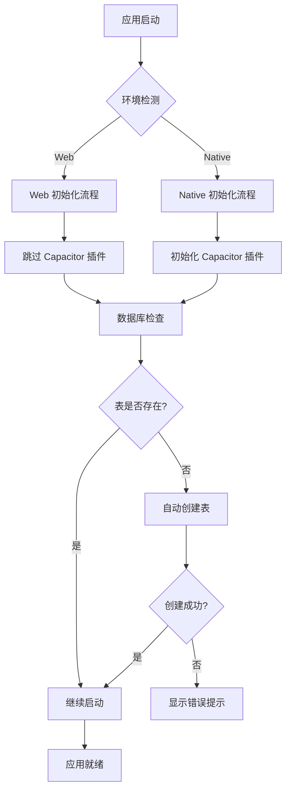
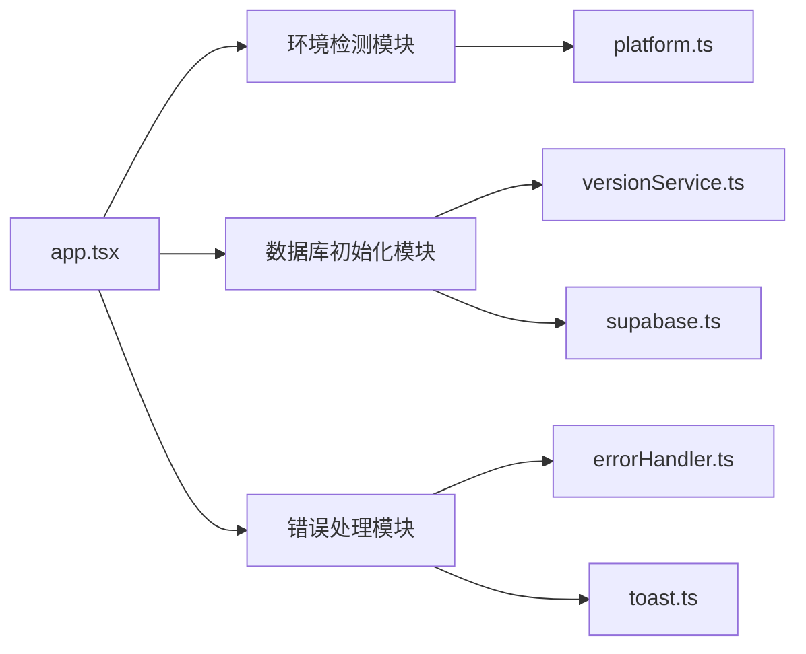
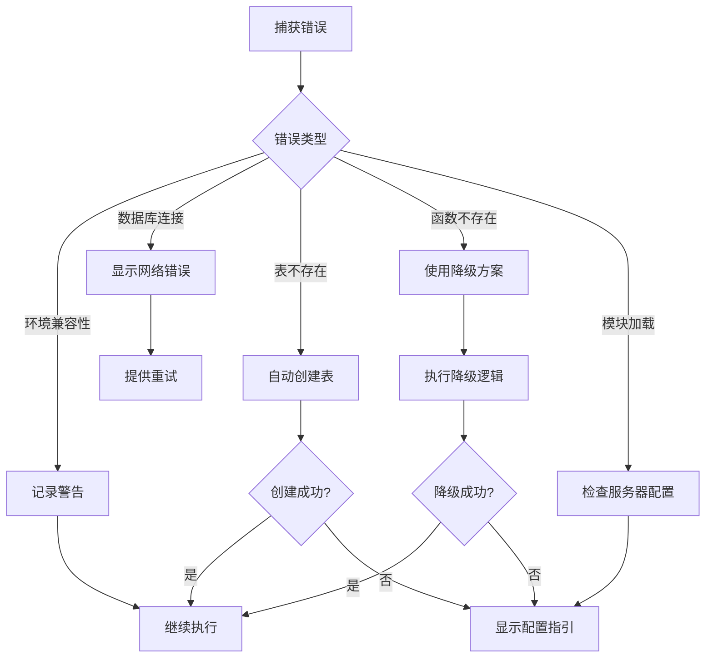

# 超级管理员 H5 兼容性修复 - 设计文档

## 概述

本设计文档描述了如何修复超级管理员页面在 H5 环境下的兼容性问题。核心策略是：
1. 环境检测和条件初始化
2. 数据库资源自动管理
3. 优雅降级和错误处理
4. 开发友好的调试支持

## 架构

### 整体架构



### 模块依赖关系



## 组件和接口

### 1. 环境检测模块

**文件位置**：`src/utils/platform.ts`

**接口定义**：
```typescript
/**
 * 平台环境检测工具
 */
export interface PlatformUtils {
  /**
   * 检测是否为 Web 环境
   * @returns true 表示 Web 环境，false 表示原生环境
   */
  isWeb(): boolean;
  
  /**
   * 检测是否为原生环境
   * @returns true 表示原生环境，false 表示 Web 环境
   */
  isNative(): boolean;
  
  /**
   * 检测 Capacitor 是否可用
   * @returns true 表示 Capacitor 可用
   */
  isCapacitorAvailable(): boolean;
  
  /**
   * 获取当前平台名称
   * @returns 平台名称：'web' | 'ios' | 'android'
   */
  getPlatform(): 'web' | 'ios' | 'android';
}
```

**实现要点**：
- 使用 `Taro.getEnv()` 检测运行环境
- 检查 `window.Capacitor` 对象是否存在
- 提供缓存机制避免重复检测

### 2. 数据库初始化模块

**文件位置**：`src/services/versionService.ts`

**接口定义**：
```typescript
/**
 * 版本管理服务
 */
export interface VersionService {
  /**
   * 初始化版本管理系统
   * 检查并创建必要的数据库表
   * @returns 初始化结果
   */
  initialize(): Promise<InitializeResult>;
  
  /**
   * 检查表是否存在
   * @param tableName - 表名
   * @returns true 表示表存在
   */
  checkTableExists(tableName: string): Promise<boolean>;
  
  /**
   * 创建 app_versions 表
   * @returns 创建结果
   */
  createAppVersionsTable(): Promise<CreateTableResult>;
}

/**
 * 初始化结果
 */
export interface InitializeResult {
  success: boolean;
  message: string;
  details?: {
    tableExists: boolean;
    tableCreated: boolean;
  };
}

/**
 * 创建表结果
 */
export interface CreateTableResult {
  success: boolean;
  message: string;
  error?: Error;
}
```

**实现要点**：
- 首先尝试查询表（SELECT 1 FROM table LIMIT 1）
- 如果表不存在，使用 CREATE TABLE IF NOT EXISTS
- 提供降级方案：如果 exec_sql 不可用，使用直接 SQL
- 记录详细的操作日志

### 3. Capacitor 插件管理模块

**文件位置**：`src/utils/capacitor.ts`

**接口定义**：
```typescript
/**
 * Capacitor 插件管理器
 */
export interface CapacitorPluginManager {
  /**
   * 初始化 LiveUpdate 插件
   * 在 Web 环境下会跳过初始化
   * @returns 初始化结果
   */
  initializeLiveUpdate(): Promise<InitResult>;
  
  /**
   * 安全地调用 Capacitor 插件
   * @param pluginName - 插件名称
   * @param method - 方法名
   * @param args - 参数
   * @returns 调用结果
   */
  safeCall<T>(
    pluginName: string,
    method: string,
    ...args: any[]
  ): Promise<T | null>;
}

/**
 * 初始化结果
 */
export interface InitResult {
  success: boolean;
  skipped: boolean;
  reason?: string;
  error?: Error;
}
```

**实现要点**：
- 在调用插件前检查环境
- Web 环境下返回 skipped: true
- 捕获并记录所有插件错误
- 不阻塞应用启动流程

### 4. 错误处理模块增强

**文件位置**：`src/utils/errorHandler.ts`

**新增接口**：
```typescript
/**
 * 环境兼容性错误
 */
export class EnvironmentCompatibilityError extends Error {
  constructor(
    message: string,
    public readonly environment: string,
    public readonly feature: string,
    public readonly suggestion?: string
  ) {
    super(message);
    this.name = 'EnvironmentCompatibilityError';
  }
}

/**
 * 数据库初始化错误
 */
export class DatabaseInitializationError extends Error {
  constructor(
    message: string,
    public readonly tableName: string,
    public readonly operation: 'check' | 'create',
    public readonly originalError?: Error
  ) {
    super(message);
    this.name = 'DatabaseInitializationError';
  }
}

/**
 * 错误处理器增强
 */
export interface ErrorHandlerEnhanced {
  /**
   * 处理环境兼容性错误
   * @param error - 错误对象
   */
  handleEnvironmentError(error: EnvironmentCompatibilityError): void;
  
  /**
   * 处理数据库初始化错误
   * @param error - 错误对象
   */
  handleDatabaseError(error: DatabaseInitializationError): void;
  
  /**
   * 显示用户友好的错误提示
   * @param error - 错误对象
   * @param context - 错误上下文
   */
  showUserFriendlyError(error: Error, context?: string): void;
}
```

## 数据模型

### app_versions 表结构

```sql
CREATE TABLE IF NOT EXISTS app_versions (
  id UUID PRIMARY KEY DEFAULT gen_random_uuid(),
  version VARCHAR(50) NOT NULL,
  platform VARCHAR(20) NOT NULL,
  build_number INTEGER NOT NULL,
  download_url TEXT,
  release_notes TEXT,
  is_mandatory BOOLEAN DEFAULT false,
  created_at TIMESTAMPTZ DEFAULT NOW(),
  updated_at TIMESTAMPTZ DEFAULT NOW(),
  
  CONSTRAINT unique_version_platform UNIQUE (version, platform)
);

-- 创建索引
CREATE INDEX IF NOT EXISTS idx_app_versions_platform 
  ON app_versions(platform);
CREATE INDEX IF NOT EXISTS idx_app_versions_created_at 
  ON app_versions(created_at DESC);
```

## 正确性属性

*属性是关于系统行为的形式化陈述，应该在所有有效执行中保持为真。*

### 属性 1：环境检测一致性

*对于任何*应用启动实例，环境检测结果应该在整个应用生命周期内保持一致。

**验证**：需求 2.1, 2.2

### 属性 2：插件初始化安全性

*对于任何*Capacitor 插件调用，在 Web 环境下应该被安全跳过，不应该抛出未捕获的异常。

**验证**：需求 2.3, 2.4

### 属性 3：数据库表创建幂等性

*对于任何*数据库表创建操作，多次执行应该产生相同的结果（表存在），不应该产生错误。

**验证**：需求 3.1, 3.2, 3.5

### 属性 4：降级方案可用性

*对于任何*数据库函数调用失败，系统应该能够使用降级方案完成操作或提供清晰的错误信息。

**验证**：需求 4.1, 4.2, 4.4

### 属性 5：错误信息可理解性

*对于任何*用户可见的错误，错误信息应该是非技术性的、可操作的，不应该包含原始错误堆栈。

**验证**：需求 5.1, 5.2, 5.3

## 错误处理

### 错误分类

1. **环境兼容性错误**
   - Capacitor 插件在 Web 环境不可用
   - 处理：跳过初始化，记录警告日志

2. **数据库连接错误**
   - Supabase 连接失败
   - 处理：显示网络错误提示，提供重试按钮

3. **数据库表不存在错误**
   - 表查询返回 404
   - 处理：自动创建表，如果失败则提示手动创建

4. **数据库函数不存在错误**
   - RPC 调用返回 PGRST202
   - 处理：使用直接 SQL 降级方案

5. **模块加载错误**
   - MIME 类型错误
   - 处理：检查服务器配置，提供配置指引

### 错误处理流程



## 测试策略

### 单元测试

1. **环境检测测试**
   - 测试 `isWeb()` 在不同环境下的返回值
   - 测试 `isCapacitorAvailable()` 的准确性
   - 测试平台名称获取的正确性

2. **数据库初始化测试**
   - 测试表存在检查逻辑
   - 测试表创建逻辑
   - 测试降级方案逻辑
   - 测试错误处理逻辑

3. **插件管理测试**
   - 测试 Web 环境下插件调用被跳过
   - 测试原生环境下插件正常调用
   - 测试错误捕获和记录

4. **错误处理测试**
   - 测试不同错误类型的处理
   - 测试用户友好错误信息生成
   - 测试错误日志记录

### 集成测试

1. **应用启动流程测试**
   - 测试 Web 环境完整启动流程
   - 测试原生环境完整启动流程
   - 测试数据库表自动创建流程

2. **降级方案测试**
   - 测试 exec_sql 不可用时的降级
   - 测试降级方案的功能完整性

3. **错误恢复测试**
   - 测试网络错误后的重试
   - 测试表创建失败后的手动创建

### 端到端测试

1. **H5 环境测试**
   - 在浏览器中测试完整流程
   - 验证所有功能正常工作
   - 验证错误提示友好

2. **原生环境测试**
   - 在 Android 设备测试
   - 验证 Capacitor 插件正常工作
   - 验证热更新功能

## 实现计划

### 阶段 1：环境检测和插件管理（优先级：高）
- 增强 `src/utils/platform.ts`
- 创建 `src/utils/capacitor.ts`
- 修改 `src/app.tsx` 添加环境检测

### 阶段 2：数据库初始化（优先级：高）
- 增强 `src/services/versionService.ts`
- 实现表存在检查
- 实现表自动创建
- 实现降级方案

### 阶段 3：错误处理增强（优先级：中）
- 增强 `src/utils/errorHandler.ts`
- 添加新的错误类型
- 实现用户友好错误提示

### 阶段 4：测试和文档（优先级：中）
- 编写单元测试
- 编写集成测试
- 更新文档

## 性能考虑

1. **环境检测缓存**
   - 首次检测后缓存结果
   - 避免重复检测开销

2. **数据库检查优化**
   - 使用轻量级查询检查表存在
   - 避免全表扫描

3. **错误日志节流**
   - 相同错误不重复记录
   - 避免日志洪水

## 安全考虑

1. **SQL 注入防护**
   - 使用参数化查询
   - 验证表名和字段名

2. **错误信息脱敏**
   - 生产环境不暴露敏感信息
   - 开发环境提供详细信息

3. **权限检查**
   - 表创建需要适当权限
   - 提供权限不足的友好提示
