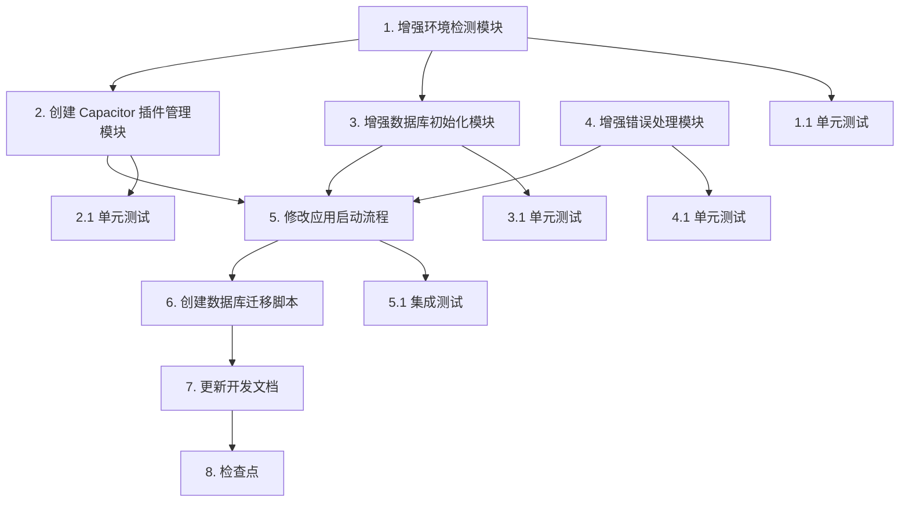

# 超级管理员 H5 兼容性修复 - 任务列表

## 任务概述

本任务列表将设计文档转化为可执行的开发任务，按照依赖关系和优先级组织。

## 任务列表

- [ ] 1. 增强环境检测模块
  - 增强 `src/utils/platform.ts` 文件，添加完整的环境检测功能
  - 实现 `isWeb()`, `isNative()`, `isCapacitorAvailable()`, `getPlatform()` 方法
  - 添加结果缓存机制，避免重复检测
  - 添加完整的 JSDoc 注释
  - _需求: 2.1, 2.2_

- [ ]* 1.1 编写环境检测模块单元测试
  - 创建 `src/utils/platform.test.ts`
  - 测试各种环境下的检测结果
  - 测试缓存机制
  - _需求: 2.1, 2.2_

- [ ] 2. 创建 Capacitor 插件管理模块
  - 创建 `src/utils/capacitor.ts` 文件
  - 实现 `CapacitorPluginManager` 类
  - 实现 `initializeLiveUpdate()` 方法，在 Web 环境下跳过初始化
  - 实现 `safeCall()` 方法，安全地调用 Capacitor 插件
  - 添加完整的错误捕获和日志记录
  - 添加完整的 JSDoc 注释
  - _需求: 2.3, 2.4_

- [ ]* 2.1 编写插件管理模块单元测试
  - 创建 `src/utils/capacitor.test.ts`
  - 测试 Web 环境下插件调用被跳过
  - 测试原生环境下插件正常调用
  - 测试错误捕获
  - _需求: 2.3, 2.4_

- [ ] 3. 增强数据库初始化模块
  - 修改 `src/services/versionService.ts` 文件
  - 实现 `initialize()` 方法，检查并创建必要的表
  - 实现 `checkTableExists()` 方法，检查表是否存在
  - 实现 `createAppVersionsTable()` 方法，创建 app_versions 表
  - 实现降级方案：如果 exec_sql 不可用，使用直接 SQL
  - 添加详细的操作日志
  - 添加完整的 JSDoc 注释
  - _需求: 3.1, 3.2, 3.3, 3.4, 3.5, 4.1, 4.2, 4.3, 4.4, 4.5_

- [ ]* 3.1 编写数据库初始化模块单元测试
  - 创建 `src/services/versionService.test.ts`
  - 测试表存在检查逻辑
  - 测试表创建逻辑
  - 测试降级方案
  - 测试错误处理
  - _需求: 3.1, 3.2, 3.3, 3.4, 3.5, 4.1, 4.2, 4.3, 4.4, 4.5_

- [ ] 4. 增强错误处理模块
  - 修改 `src/utils/errorHandler.ts` 文件
  - 添加 `EnvironmentCompatibilityError` 错误类
  - 添加 `DatabaseInitializationError` 错误类
  - 实现 `handleEnvironmentError()` 方法
  - 实现 `handleDatabaseError()` 方法
  - 实现 `showUserFriendlyError()` 方法，显示用户友好的错误提示
  - 添加完整的 JSDoc 注释
  - _需求: 5.1, 5.2, 5.3, 5.4, 5.5_

- [ ]* 4.1 编写错误处理模块单元测试
  - 创建或更新 `src/utils/errorHandler.test.ts`
  - 测试不同错误类型的处理
  - 测试用户友好错误信息生成
  - 测试错误日志记录
  - _需求: 5.1, 5.2, 5.3, 5.4, 5.5_

- [ ] 5. 修改应用启动流程
  - 修改 `src/app.tsx` 文件
  - 在应用启动时添加环境检测
  - 根据环境决定是否初始化 Capacitor 插件
  - 调用数据库初始化模块
  - 添加错误处理和用户提示
  - 添加完整的代码注释
  - _需求: 2.1, 2.2, 2.3, 2.4, 3.1, 3.2, 5.1, 5.2_

- [ ]* 5.1 编写应用启动流程集成测试
  - 创建 `src/app.test.tsx`
  - 测试 Web 环境启动流程
  - 测试原生环境启动流程
  - 测试数据库初始化流程
  - _需求: 2.1, 2.2, 2.3, 2.4, 3.1, 3.2_

- [ ] 6. 创建数据库迁移脚本
  - 创建 `supabase/migrations/xxxxx_create_app_versions_table.sql`
  - 定义 app_versions 表结构
  - 添加必要的索引
  - 添加 RLS 策略（如需要）
  - 添加注释说明
  - _需求: 3.1, 3.2_

- [ ] 7. 更新开发文档
  - 更新 `README.md`，添加环境兼容性说明
  - 创建 `docs/troubleshooting/h5-compatibility.md`，添加常见问题和解决方案
  - 更新 API 文档（如有接口变更）
  - _需求: 6.1, 6.2, 6.3_

- [ ] 8. 检查点 - 确保所有测试通过
  - 运行所有单元测试：`npm run test`
  - 运行代码检查：`npm run lint`
  - 在浏览器中测试 H5 环境
  - 在 Android 设备测试原生环境
  - 确认所有错误都有友好的提示
  - 确认文档已同步更新

## 任务依赖关系

## 实施说明

### 开发顺序
1. 先实现核心功能（任务 1-5）
2. 然后创建数据库迁移（任务 6）
3. 最后更新文档（任务 7）
4. 运行完整测试（任务 8）

### 测试策略
- **实现优先**：先实现功能，确保功能正常工作
- **测试跟进**：功能实现后立即编写测试
- 可选任务（标记 *）可以根据时间安排选择性实施

### 注意事项
1. **所有代码必须添加完整注释**（强制要求）
2. **代码变更时必须立即更新文档**（强制要求）
3. 每完成一个任务，立即验证功能
4. 遇到问题及时记录和沟通

### 验收标准
- [ ] 所有代码有完整的 JSDoc 注释
- [ ] 所有文件有文件说明注释
- [ ] 所有复杂逻辑有行内注释
- [ ] H5 环境下应用正常启动，无错误
- [ ] 原生环境下应用正常启动，Capacitor 插件正常工作
- [ ] app_versions 表自动创建成功
- [ ] 错误提示友好，用户可理解
- [ ] 所有测试通过
- [ ] 文档已同步更新

## 预估工作量

- 任务 1: 2 小时
- 任务 2: 3 小时
- 任务 3: 4 小时
- 任务 4: 2 小时
- 任务 5: 2 小时
- 任务 6: 1 小时
- 任务 7: 1 小时
- 任务 8: 2 小时

**总计**: 约 17 小时（不包括可选测试任务）
