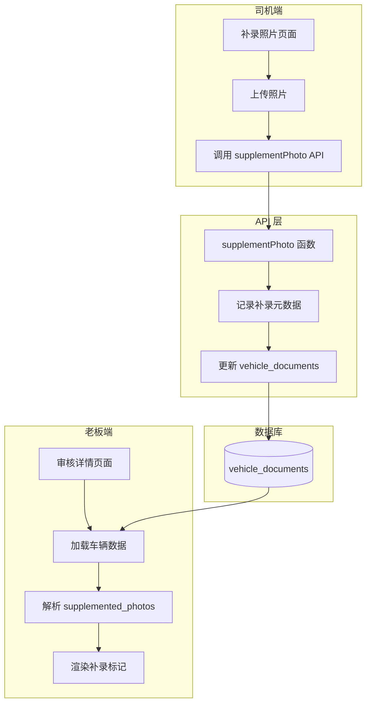

# Design Document: 补录照片标记功能

## Overview

本功能为车辆审核流程添加补录照片标记功能。通过在 `vehicle_documents` 表中新增 `supplemented_photos` 字段，记录每张补录照片的元数据（包括补录时间、原始照片URL等），使老板在审核时能够快速识别和定位补录的照片。

## Architecture



## Components and Interfaces

### 1. 数据存储层

#### supplemented_photos 字段结构
```typescript
/**
 * 补录照片元数据
 * 存储在 vehicle_documents.supplemented_photos 字段中
 */
interface SupplementedPhotoMeta {
  /** 照片字段名，如 "pickup_photos" */
  field: string
  /** 照片在数组中的索引 */
  index: number
  /** 补录时间戳 */
  supplemented_at: string
  /** 原始照片URL（如果有） */
  original_url?: string | null
  /** 补录次数 */
  supplement_count: number
}

/**
 * supplemented_photos 字段类型
 * 键为 "{field}_{index}"，值为补录元数据
 */
type SupplementedPhotos = Record<string, SupplementedPhotoMeta>
```

### 2. API 层

#### 修改 supplementPhoto 函数
```typescript
/**
 * 补录照片（增强版）
 * 在更新照片的同时记录补录元数据
 * @param vehicleId - 车辆ID
 * @param photoField - 照片字段名
 * @param photoIndex - 照片索引
 * @param photoUrl - 新照片URL
 * @returns 是否补录成功
 */
export async function supplementPhoto(
  vehicleId: string,
  photoField: string,
  photoIndex: number,
  photoUrl: string
): Promise<boolean>
```

#### 新增 getSupplementedPhotos 函数
```typescript
/**
 * 获取补录照片元数据
 * @param vehicleId - 车辆ID
 * @returns 补录照片元数据映射
 */
export async function getSupplementedPhotos(
  vehicleId: string
): Promise<SupplementedPhotos>
```

### 3. UI 组件层

#### SupplementedBadge 组件
```typescript
/**
 * 补录标记徽章组件
 * 显示在补录照片上的视觉标识
 */
interface SupplementedBadgeProps {
  /** 补录时间 */
  supplementedAt: string
  /** 补录次数 */
  supplementCount?: number
}
```

## Data Models

### vehicle_documents 表扩展

| 字段名 | 类型 | 说明 |
|--------|------|------|
| supplemented_photos | JSONB | 补录照片元数据，键为 "{field}_{index}"，值为 SupplementedPhotoMeta |

### 数据示例
```json
{
  "supplemented_photos": {
    "pickup_photos_0": {
      "field": "pickup_photos",
      "index": 0,
      "supplemented_at": "2024-12-17T10:30:00Z",
      "original_url": "https://xxx/old_photo.jpg",
      "supplement_count": 1
    },
    "pickup_photos_2": {
      "field": "pickup_photos",
      "index": 2,
      "supplemented_at": "2024-12-17T11:00:00Z",
      "original_url": null,
      "supplement_count": 2
    }
  }
}
```

## Correctness Properties

*A property is a characteristic or behavior that should hold true across all valid executions of a system-essentially, a formal statement about what the system should do. Properties serve as the bridge between human-readable specifications and machine-verifiable correctness guarantees.*

### Property 1: 补录操作记录完整性
*For any* 补录操作，当照片成功补录后，supplemented_photos 字段应包含该照片的完整元数据（field、index、supplemented_at、supplement_count）
**Validates: Requirements 1.1, 2.2**

### Property 2: 补录标记视觉一致性
*For any* 标记为补录的照片，在审核页面渲染时应显示"补录"徽章和高亮样式
**Validates: Requirements 1.2, 1.3**

### Property 3: 补录时间显示准确性
*For any* 补录照片，查看详情时应显示正确的补录时间戳
**Validates: Requirements 1.4, 2.3**

### Property 4: 照片历史记录完整性
*For any* 补录操作，应保留原始照片URL（如果存在），并正确累加补录次数
**Validates: Requirements 3.1, 3.2, 3.3**

## Error Handling

### 数据库操作错误
- 补录元数据更新失败时，回滚照片更新操作
- 记录详细错误日志，包含 vehicleId、photoField、photoIndex

### 数据一致性错误
- 如果 supplemented_photos 字段格式异常，使用空对象作为默认值
- 解析 JSON 失败时记录警告日志并继续处理

### UI 渲染错误
- 补录元数据缺失时，不显示补录标记（降级处理）
- 时间格式化失败时显示原始时间字符串

## Testing Strategy

### 单元测试
1. **supplementPhoto 函数测试**
   - 测试正常补录流程
   - 测试补录元数据记录
   - 测试补录次数累加
   - 测试原始照片URL保留

2. **getSupplementedPhotos 函数测试**
   - 测试正常获取补录元数据
   - 测试空数据处理
   - 测试异常数据处理

### 属性测试
使用 fast-check 进行属性测试：
- 生成随机的照片字段和索引
- 验证补录操作后元数据的完整性
- 验证多次补录后计数的正确性

### 集成测试
1. 完整补录流程测试
2. 审核页面补录标记显示测试
3. 补录历史查询测试
