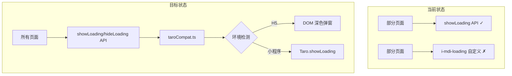

# Design Document

## Overview

本设计文档描述了统一加载指示器功能的技术实现方案。项目中已经在 `taroCompat.ts` 中实现了统一的加载样式（深色半透明背景配合圆形旋转图标），但部分页面仍在使用自定义的 `i-mdi-loading` 图标。本次任务是将所有页面统一使用 `showLoading/hideLoading` API。

### 设计目标

1. **统一视觉风格**：所有页面使用 `taroCompat.ts` 中已实现的加载样式
2. **移除自定义加载**：替换所有使用 `i-mdi-loading` 的自定义加载样式
3. **简化代码**：使用统一的 API 调用，减少重复代码

## Architecture



## Components and Interfaces

### 现有 API（无需修改）

项目中已有的 `taroCompat.ts` 提供了统一的加载 API：

```typescript
// src/utils/taroCompat.ts - 已实现
interface ShowLoadingOptions {
  title: string
  mask?: boolean
}

function showLoading(options: ShowLoadingOptions): void
function hideLoading(): void
```

### 使用方式

```typescript
import {showLoading, hideLoading} from '@/utils/taroCompat'

// 显示加载
showLoading({title: '加载中...'})

// 隐藏加载
hideLoading()
```

## Data Models

无需新增数据模型，使用现有实现。

## Correctness Properties

*A property is a characteristic or behavior that should hold true across all valid executions of a system-essentially, a formal statement about what the system should do. Properties serve as the bridge between human-readable specifications and machine-verifiable correctness guarantees.*

### Property Reflection

经过分析，以下属性可以合并：
- 1.1 和 2.1 都是关于 showLoading 显示加载指示器的测试，可以合并
- 1.4 和 2.2 都是关于 hideLoading 隐藏加载指示器的测试，可以合并
- 2.4 是关于自定义 tip 的测试，是独立的属性

### Properties

**Property 1: showLoading 显示加载指示器**
*For any* 调用 showLoading 函数，系统应该在 DOM 中创建一个包含深色背景和旋转图标的加载弹窗元素
**Validates: Requirements 1.1, 2.1**

**Property 2: hideLoading 隐藏加载指示器**
*For any* 调用 hideLoading 函数，系统应该从 DOM 中移除当前显示的加载弹窗元素
**Validates: Requirements 1.4, 2.2**

**Property 3: 自定义提示文字**
*For any* 传入的 title/tip 参数，加载指示器应该显示该自定义文字而非默认文字
**Validates: Requirements 2.4**

## Error Handling

现有 `taroCompat.ts` 已处理所有错误场景：
- 重复调用 showLoading 时自动移除旧元素
- hideLoading 在无加载时静默处理
- DOM 操作失败时使用 try-catch 包裹

## Testing Strategy

本次任务主要是代码重构（替换加载样式），不涉及新功能开发。测试策略：

1. **手动测试**：在各页面验证加载样式是否统一
2. **回归测试**：确保页面功能正常，加载状态正确显示和隐藏

## Visual Design

使用 `taroCompat.ts` 中已实现的样式（深色背景 + 白色圆环旋转图标 + "加载中..."文字）。

## Implementation Notes

### 修改策略

将所有使用 `i-mdi-loading` 自定义加载样式的页面，改为使用 `showLoading/hideLoading` API。

### 修改模式

**Before（自定义加载）：**
```tsx
const [loading, setLoading] = useState(false)

// 加载开始
setLoading(true)
// 加载结束
setLoading(false)

// 渲染
{loading && (
  <View className="flex items-center justify-center py-20">
    <View className="i-mdi-loading animate-spin text-5xl text-blue-600 mb-4"></View>
    <Text className="text-gray-600">加载中...</Text>
  </View>
)}
```

**After（统一 API）：**
```tsx
import {showLoading, hideLoading} from '@/utils/taroCompat'

// 加载开始
showLoading({title: '加载中...'})
// 加载结束
hideLoading()

// 无需渲染加载 UI，API 会自动处理
```

### 需要替换的页面列表

根据代码搜索，以下页面使用了 `i-mdi-loading` 需要替换：

**Super Admin 页面：**
1. `src/pages/super-admin/vehicle-rental-edit/index.tsx`
2. `src/pages/super-admin/vehicle-review-detail/index.tsx`
3. `src/pages/super-admin/vehicle-management/index.tsx`
4. `src/pages/super-admin/user-detail/index.tsx`
5. `src/pages/super-admin/user-management/index.tsx`
6. `src/pages/super-admin/staff-management/index.tsx`
7. `src/pages/super-admin/index.tsx`

**Manager 页面：**
8. `src/pages/manager/staff-management/index.tsx`
9. `src/pages/manager/driver-profile/index.tsx`
10. `src/pages/manager/index.tsx`

**Driver 页面：**
11. `src/pages/driver/notifications/index.tsx`
12. `src/pages/driver/vehicle-list/index.tsx`
13. `src/pages/driver/vehicle-detail/index.tsx`
14. `src/pages/driver/supplement-photos/index.tsx`
15. `src/pages/driver/return-vehicle/index.tsx`
16. `src/pages/driver/index.tsx`
17. `src/pages/driver/edit-vehicle/index.tsx`

**Common 页面：**
18. `src/pages/common/notifications/index.tsx`
19. `src/pages/index/index.tsx`

**组件：**
20. `src/components/RefreshButton/index.tsx`（保留，因为是按钮内的小图标）
