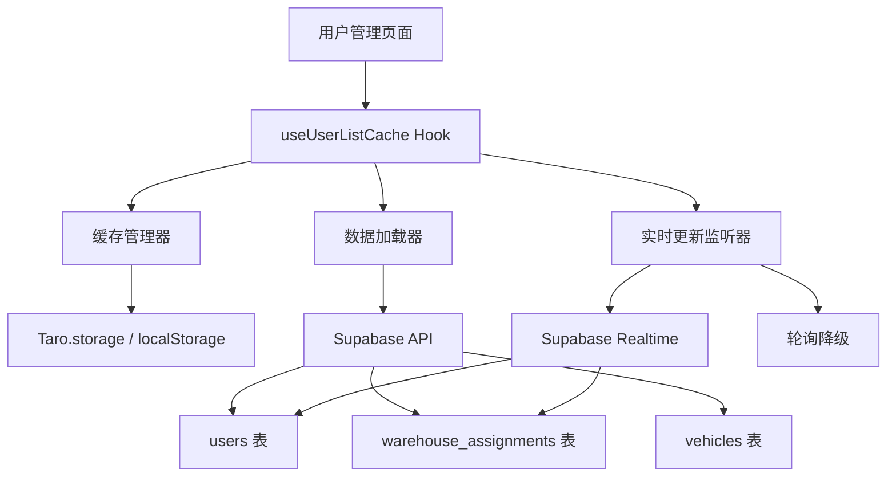
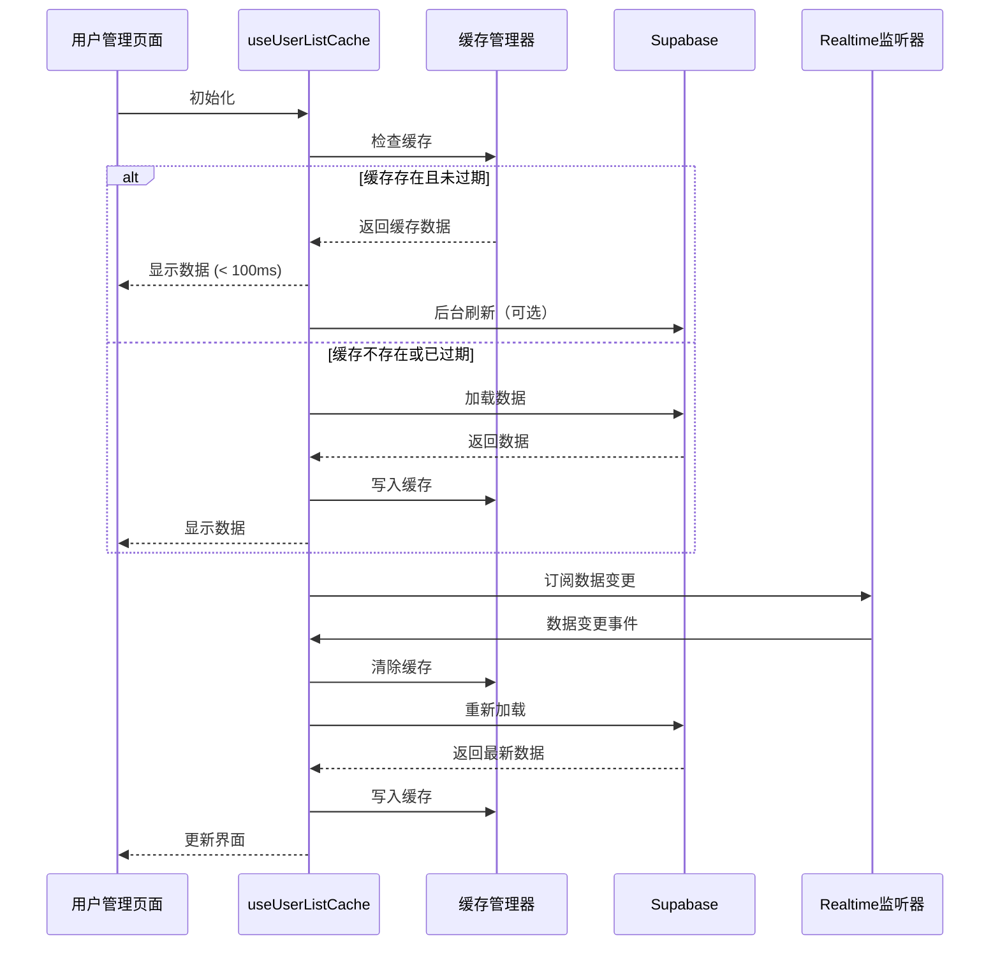

# 用户列表缓存优化 - 设计文档

## 概述

本设计文档描述了用户列表缓存优化的技术实现方案。通过增强缓存策略、实时更新机制和智能预加载，显著提升老板端和车队长端用户列表的加载性能和用户体验。

### 核心目标

1. **性能提升**: 缓存加载时间 < 100ms，首次加载 < 2s
2. **实时同步**: 数据变更后自动更新缓存和界面
3. **智能缓存**: 30 分钟长缓存 + 自动失效机制
4. **用户体验**: 快速响应 + 离线可用 + 无感知更新

### 技术栈

- **缓存存储**: Taro.storage (小程序/APP) / localStorage (H5)
- **实时更新**: Supabase Realtime + 轮询降级
- **状态管理**: React Hooks (useState, useEffect, useCallback)
- **性能优化**: useMemo, 分层加载, 智能预加载

## 架构设计

### 整体架构



### 数据流向



## 核心组件设计

### 1. 缓存管理器 (CacheManager)

**职责**: 统一管理所有缓存的读写、失效和清理

**接口设计**:


```typescript
/**
 * 缓存管理器
 * 提供统一的缓存读写、失效和清理接口
 */
interface CacheManager {
  /**
   * 获取缓存数据
   * @param key - 缓存键
   * @returns 缓存数据，如果不存在或已过期则返回 null
   */
  get<T>(key: string): T | null
  
  /**
   * 设置缓存数据
   * @param key - 缓存键
   * @param data - 缓存数据
   * @param ttl - 过期时间（毫秒），默认 30 分钟
   */
  set<T>(key: string, data: T, ttl?: number): void
  
  /**
   * 清除指定缓存
   * @param keys - 缓存键数组
   */
  invalidate(keys: string[]): void
  
  /**
   * 清除所有缓存
   */
  clear(): void
  
  /**
   * 检查缓存是否存在且未过期
   * @param key - 缓存键
   */
  has(key: string): boolean
}
```

### 2. 用户列表缓存 Hook (useUserListCache)

**职责**: 封装用户列表的加载、缓存和实时更新逻辑

**接口设计**:

```typescript
/**
 * 用户列表缓存 Hook
 * 提供用户列表的加载、缓存和实时更新功能
 */
interface UseUserListCacheOptions {
  /** 是否启用缓存 */
  cacheEnabled?: boolean
  /** 缓存有效期（毫秒），默认 30 分钟 */
  cacheTTL?: number
  /** 是否启用实时更新 */
  realtimeEnabled?: boolean
  /** 是否启用智能预加载 */
  preloadEnabled?: boolean
}

interface UseUserListCacheReturn {
  /** 用户列表数据 */
  users: UserWithRealName[]
  /** 加载状态 */
  loading: boolean
  /** 错误信息 */
  error: Error | null
  /** 是否来自缓存 */
  fromCache: boolean
  /** 刷新数据（强制重新加载） */
  refresh: () => Promise<void>
  /** 清除缓存 */
  clearCache: () => void
}

function useUserListCache(
  options?: UseUserListCacheOptions
): UseUserListCacheReturn
```


### 3. 实时更新监听器 (RealtimeListener)

**职责**: 监听数据库变更事件，触发缓存失效和重新加载

**接口设计**:

```typescript
/**
 * 实时更新监听器
 * 监听 Supabase Realtime 事件，触发缓存更新
 */
interface RealtimeListenerOptions {
  /** 监听的表名 */
  tables: string[]
  /** 变更回调 */
  onChange: (event: RealtimeEvent) => void
  /** 错误回调 */
  onError?: (error: Error) => void
  /** 是否启用轮询降级 */
  enablePolling?: boolean
  /** 轮询间隔（毫秒），默认 30 秒 */
  pollingInterval?: number
}

interface RealtimeEvent {
  /** 事件类型 */
  type: 'INSERT' | 'UPDATE' | 'DELETE'
  /** 表名 */
  table: string
  /** 变更的数据 */
  record: any
  /** 旧数据（UPDATE 和 DELETE 时） */
  old?: any
}

class RealtimeListener {
  constructor(options: RealtimeListenerOptions)
  
  /** 开始监听 */
  start(): void
  
  /** 停止监听 */
  stop(): void
  
  /** 是否正在监听 */
  isListening(): boolean
}
```

## 数据模型

### 缓存数据结构

```typescript
/**
 * 缓存条目
 */
interface CacheEntry<T> {
  /** 缓存数据 */
  data: T
  /** 创建时间戳 */
  timestamp: number
  /** 过期时间戳 */
  expiresAt: number
  /** 版本号 */
  version: string
}

/**
 * 用户列表缓存数据
 */
interface UserListCacheData {
  /** 用户列表 */
  users: UserWithRealName[]
  /** 用户详情映射 */
  userDetails: Record<string, DriverDetailInfo>
  /** 用户仓库映射 */
  userWarehouses: Record<string, string[]>
}
```

### 缓存键定义

```typescript
/**
 * 缓存键常量
 */
export const CACHE_KEYS = {
  /** 老板端用户列表 */
  SUPER_ADMIN_USERS: 'super_admin_users',
  /** 老板端用户详情 */
  SUPER_ADMIN_USER_DETAILS: 'super_admin_user_details',
  /** 老板端用户仓库 */
  SUPER_ADMIN_USER_WAREHOUSES: 'super_admin_user_warehouses',
  /** 车队长端司机列表 */
  MANAGER_DRIVERS: 'manager_drivers',
  /** 车队长端司机详情 */
  MANAGER_DRIVER_DETAILS: 'manager_driver_details',
  /** 车队长端司机仓库 */
  MANAGER_DRIVER_WAREHOUSES: 'manager_driver_warehouses',
} as const
```


## 正确性属性

*一个属性是一个特征或行为，应该在系统的所有有效执行中保持为真——本质上是关于系统应该做什么的正式陈述。属性作为人类可读规范和机器可验证正确性保证之间的桥梁。*

### 属性 1：缓存加载性能
*对于任何*已缓存的用户列表数据，从缓存加载到显示的时间应小于 100ms
**验证：需求 1.3, 8.1**

### 属性 2：缓存失效一致性
*对于任何*用户数据变更操作（添加、修改、删除、仓库分配、类型切换），操作成功后应立即清除相关缓存并触发重新加载
**验证：需求 2.2, 2.3, 2.4, 4.1, 4.2, 4.3, 4.4, 4.5**

### 属性 3：实时更新响应性
*对于任何*数据库变更事件（INSERT、UPDATE、DELETE），系统应在 500ms 内清除缓存并触发重新加载
**验证：需求 3.1, 3.2, 3.3, 3.4, 8.3**

### 属性 4：缓存过期时间正确性
*对于任何*新写入的缓存数据，其过期时间应设置为当前时间 + 30 分钟
**验证：需求 2.1**

### 属性 5：缓存命中率
*对于任何*正常使用场景（无数据变更），缓存命中率应达到 80% 以上
**验证：需求 8.5**

### 属性 6：首次加载性能
*对于任何*包含 50 个用户的列表，首次从数据库加载的时间应小于 2 秒
**验证：需求 8.2**

### 属性 7：详情加载性能
*对于任何*用户详情，按需加载的时间应小于 1 秒
**验证：需求 8.4**

### 属性 8：离线数据可用性
*对于任何*网络请求失败的情况，如果存在缓存数据，系统应显示缓存数据并提示"显示的是离线数据"
**验证：需求 9.1**

### 属性 9：缓存清除完整性
*对于任何*缓存失效操作，所有相关的缓存键（用户列表、用户详情、用户仓库）应被完全清除
**验证：需求 4.6**

### 属性 10：实时订阅资源清理
*对于任何*页面卸载事件，所有实时订阅应被取消以释放资源
**验证：需求 3.6**

## 错误处理策略

### 1. 缓存读取失败

**场景**: 缓存数据损坏或读取异常

**处理策略**:
1. 记录错误日志
2. 清除损坏的缓存
3. 直接从数据库加载数据
4. 不向用户显示错误（静默处理）

### 2. 缓存写入失败

**场景**: 存储空间不足或写入异常

**处理策略**:
1. 记录错误日志
2. 尝试清理旧缓存释放空间
3. 重试写入一次
4. 如果仍失败，继续正常显示数据（不影响用户）

### 3. 网络请求失败

**场景**: 数据库连接失败或超时

**处理策略**:
1. 检查是否有缓存数据
2. 如果有缓存，显示缓存数据 + "显示的是离线数据"提示
3. 如果无缓存，显示友好错误提示 + 重试按钮
4. 提供手动刷新功能

### 4. 实时更新连接失败

**场景**: Supabase Realtime 连接失败

**处理策略**:
1. 记录错误日志
2. 自动降级到轮询模式（每 30 秒检查一次）
3. 定期尝试重新连接 Realtime（每 5 分钟）
4. 不向用户显示错误（静默降级）


### 5. 数据重新加载失败

**场景**: 缓存失效后重新加载失败

**处理策略**:
1. 显示错误提示："数据更新失败，请重试"
2. 提供重试按钮
3. 保留旧的缓存数据（如果存在）
4. 记录错误日志供调试

## 测试策略

### 单元测试

**测试范围**:
- 缓存管理器的读写、失效、清理功能
- 缓存过期时间计算
- 缓存键生成逻辑
- 错误处理逻辑

**测试工具**: Vitest

**测试示例**:
```typescript
describe('CacheManager', () => {
  it('应该正确设置和获取缓存', () => {
    const cache = new CacheManager()
    const data = {users: []}
    cache.set('test_key', data, 30 * 60 * 1000)
    expect(cache.get('test_key')).toEqual(data)
  })
  
  it('应该在过期后返回 null', () => {
    const cache = new CacheManager()
    cache.set('test_key', {users: []}, 0) // 立即过期
    expect(cache.get('test_key')).toBeNull()
  })
})
```

### 集成测试

**测试范围**:
- useUserListCache Hook 的完整流程
- 缓存 + 数据库加载的协作
- 实时更新触发缓存刷新
- 降级到轮询模式

**测试工具**: Vitest + React Testing Library

**测试示例**:
```typescript
describe('useUserListCache', () => {
  it('应该优先从缓存加载数据', async () => {
    // 预设缓存
    mockCache.set(CACHE_KEYS.SUPER_ADMIN_USERS, mockUsers)
    
    const {result} = renderHook(() => useUserListCache())
    
    // 应该立即从缓存加载
    expect(result.current.fromCache).toBe(true)
    expect(result.current.users).toEqual(mockUsers)
    expect(result.current.loading).toBe(false)
  })
  
  it('应该在数据变更后清除缓存并重新加载', async () => {
    const {result} = renderHook(() => useUserListCache())
    
    // 模拟数据变更事件
    act(() => {
      mockRealtime.emit('INSERT', {table: 'users', record: newUser})
    })
    
    // 应该清除缓存并重新加载
    await waitFor(() => {
      expect(mockCache.has(CACHE_KEYS.SUPER_ADMIN_USERS)).toBe(false)
      expect(result.current.users).toContain(newUser)
    })
  })
})
```

### 性能测试

**测试范围**:
- 缓存加载时间 < 100ms
- 首次加载时间 < 2s（50 个用户）
- 实时更新延迟 < 500ms
- 详情加载时间 < 1s

**测试工具**: Vitest + performance.now()

**测试示例**:
```typescript
describe('性能测试', () => {
  it('缓存加载应小于 100ms', async () => {
    mockCache.set(CACHE_KEYS.SUPER_ADMIN_USERS, mockUsers)
    
    const start = performance.now()
    const {result} = renderHook(() => useUserListCache())
    await waitFor(() => expect(result.current.loading).toBe(false))
    const end = performance.now()
    
    expect(end - start).toBeLessThan(100)
  })
})
```

## 实现细节

### 1. 缓存管理器实现

**文件位置**: `src/utils/cacheManager.ts`

**核心逻辑**:
```typescript
/**
 * 缓存管理器实现
 * 支持 H5 (localStorage) 和小程序/APP (Taro.storage)
 */
class CacheManagerImpl implements CacheManager {
  private isH5 = process.env.TARO_ENV === 'h5'
  
  get<T>(key: string): T | null {
    try {
      const json = this.isH5 
        ? localStorage.getItem(key)
        : Taro.getStorageSync(key)
      
      if (!json) return null
      
      const entry: CacheEntry<T> = JSON.parse(json)
      
      // 检查是否过期
      if (Date.now() > entry.expiresAt) {
        this.invalidate([key])
        return null
      }
      
      return entry.data
    } catch (error) {
      console.error('[CacheManager] 读取缓存失败:', error)
      return null
    }
  }
  
  set<T>(key: string, data: T, ttl: number = 30 * 60 * 1000): void {
    try {
      const entry: CacheEntry<T> = {
        data,
        timestamp: Date.now(),
        expiresAt: Date.now() + ttl,
        version: APP_VERSION
      }
      
      const json = JSON.stringify(entry)
      
      if (this.isH5) {
        localStorage.setItem(key, json)
      } else {
        Taro.setStorageSync(key, json)
      }
    } catch (error) {
      console.error('[CacheManager] 写入缓存失败:', error)
      // 尝试清理旧缓存后重试
      this.clearOldCache()
      try {
        const json = JSON.stringify(entry)
        if (this.isH5) {
          localStorage.setItem(key, json)
        } else {
          Taro.setStorageSync(key, json)
        }
      } catch (retryError) {
        console.error('[CacheManager] 重试写入缓存失败:', retryError)
      }
    }
  }
  
  invalidate(keys: string[]): void {
    keys.forEach(key => {
      try {
        if (this.isH5) {
          localStorage.removeItem(key)
        } else {
          Taro.removeStorageSync(key)
        }
      } catch (error) {
        console.error(`[CacheManager] 清除缓存失败: ${key}`, error)
      }
    })
  }
  
  clear(): void {
    try {
      if (this.isH5) {
        localStorage.clear()
      } else {
        Taro.clearStorageSync()
      }
    } catch (error) {
      console.error('[CacheManager] 清除所有缓存失败:', error)
    }
  }
  
  has(key: string): boolean {
    return this.get(key) !== null
  }
  
  private clearOldCache(): void {
    // 清理最旧的缓存数据
    // 实现逻辑...
  }
}

export const cacheManager = new CacheManagerImpl()
```


### 2. useUserListCache Hook 实现

**文件位置**: `src/hooks/useUserListCache.ts`

**核心逻辑**:
```typescript
/**
 * 用户列表缓存 Hook
 * 提供缓存、加载和实时更新功能
 */
export function useUserListCache(
  options: UseUserListCacheOptions = {}
): UseUserListCacheReturn {
  const {
    cacheEnabled = true,
    cacheTTL = 30 * 60 * 1000, // 30 分钟
    realtimeEnabled = true,
    preloadEnabled = false
  } = options
  
  const [users, setUsers] = useState<UserWithRealName[]>([])
  const [loading, setLoading] = useState(true)
  const [error, setError] = useState<Error | null>(null)
  const [fromCache, setFromCache] = useState(false)
  
  const realtimeRef = useRef<RealtimeListener | null>(null)
  
  // 加载用户列表
  const loadUsers = useCallback(async (forceRefresh: boolean = false) => {
    try {
      setLoading(true)
      setError(null)
      
      // 尝试从缓存加载
      if (cacheEnabled && !forceRefresh) {
        const cached = cacheManager.get<UserWithRealName[]>(
          CACHE_KEYS.SUPER_ADMIN_USERS
        )
        
        if (cached) {
          setUsers(cached)
          setFromCache(true)
          setLoading(false)
          return
        }
      }
      
      // 从数据库加载
      setFromCache(false)
      const data = await UsersAPI.getAllUsers()
      
      // 批量加载详细信息
      // ... 实现逻辑
      
      setUsers(data)
      
      // 写入缓存
      if (cacheEnabled) {
        cacheManager.set(CACHE_KEYS.SUPER_ADMIN_USERS, data, cacheTTL)
      }
      
      setLoading(false)
    } catch (err) {
      console.error('[useUserListCache] 加载失败:', err)
      setError(err as Error)
      setLoading(false)
      
      // 如果有缓存，显示缓存数据
      if (cacheEnabled) {
        const cached = cacheManager.get<UserWithRealName[]>(
          CACHE_KEYS.SUPER_ADMIN_USERS
        )
        if (cached) {
          setUsers(cached)
          setFromCache(true)
        }
      }
    }
  }, [cacheEnabled, cacheTTL])
  
  // 刷新数据
  const refresh = useCallback(async () => {
    await loadUsers(true)
  }, [loadUsers])
  
  // 清除缓存
  const clearCache = useCallback(() => {
    cacheManager.invalidate([
      CACHE_KEYS.SUPER_ADMIN_USERS,
      CACHE_KEYS.SUPER_ADMIN_USER_DETAILS,
      CACHE_KEYS.SUPER_ADMIN_USER_WAREHOUSES
    ])
  }, [])
  
  // 初始加载
  useEffect(() => {
    loadUsers()
  }, [loadUsers])
  
  // 实时更新监听
  useEffect(() => {
    if (!realtimeEnabled) return
    
    const listener = new RealtimeListener({
      tables: ['users', 'warehouse_assignments'],
      onChange: (event) => {
        console.log('[useUserListCache] 数据变更:', event)
        // 清除缓存并重新加载
        clearCache()
        loadUsers(true)
      },
      onError: (err) => {
        console.error('[useUserListCache] Realtime 错误:', err)
      },
      enablePolling: true,
      pollingInterval: 30000 // 30 秒
    })
    
    listener.start()
    realtimeRef.current = listener
    
    return () => {
      listener.stop()
      realtimeRef.current = null
    }
  }, [realtimeEnabled, clearCache, loadUsers])
  
  return {
    users,
    loading,
    error,
    fromCache,
    refresh,
    clearCache
  }
}
```

### 3. 实时更新监听器实现

**文件位置**: `src/utils/realtimeListener.ts`

**核心逻辑**:
```typescript
/**
 * 实时更新监听器实现
 * 支持 Supabase Realtime + 轮询降级
 */
export class RealtimeListener {
  private subscription: RealtimeChannel | null = null
  private pollingTimer: NodeJS.Timeout | null = null
  private isActive = false
  
  constructor(private options: RealtimeListenerOptions) {}
  
  start(): void {
    if (this.isActive) return
    
    this.isActive = true
    
    // 尝试启动 Realtime 监听
    try {
      this.startRealtime()
    } catch (error) {
      console.error('[RealtimeListener] Realtime 启动失败:', error)
      this.options.onError?.(error as Error)
      
      // 降级到轮询模式
      if (this.options.enablePolling) {
        this.startPolling()
      }
    }
  }
  
  stop(): void {
    this.isActive = false
    
    // 停止 Realtime 监听
    if (this.subscription) {
      supabase.removeChannel(this.subscription)
      this.subscription = null
    }
    
    // 停止轮询
    if (this.pollingTimer) {
      clearInterval(this.pollingTimer)
      this.pollingTimer = null
    }
  }
  
  isListening(): boolean {
    return this.isActive
  }
  
  private startRealtime(): void {
    const channel = supabase.channel('user-list-changes')
    
    // 监听所有表的变更
    this.options.tables.forEach(table => {
      channel.on(
        'postgres_changes',
        {
          event: '*',
          schema: 'public',
          table
        },
        (payload) => {
          const event: RealtimeEvent = {
            type: payload.eventType as any,
            table: payload.table,
            record: payload.new,
            old: payload.old
          }
          this.options.onChange(event)
        }
      )
    })
    
    channel.subscribe((status) => {
      if (status === 'SUBSCRIBED') {
        console.log('[RealtimeListener] Realtime 已连接')
      } else if (status === 'CHANNEL_ERROR') {
        console.error('[RealtimeListener] Realtime 连接错误')
        // 降级到轮询
        if (this.options.enablePolling) {
          this.startPolling()
        }
      }
    })
    
    this.subscription = channel
  }
  
  private startPolling(): void {
    console.log('[RealtimeListener] 启动轮询模式')
    
    const interval = this.options.pollingInterval || 30000
    
    this.pollingTimer = setInterval(() => {
      // 触发变更回调（简化版，实际应检查数据版本）
      this.options.onChange({
        type: 'UPDATE',
        table: 'polling',
        record: {}
      })
    }, interval)
  }
}
```

## 部署和配置

### 环境变量

无需额外环境变量

### 配置项

```typescript
/**
 * 缓存配置
 */
export const CACHE_CONFIG = {
  /** 默认缓存有效期（30 分钟） */
  DEFAULT_TTL: 30 * 60 * 1000,
  /** 最大缓存大小（10MB） */
  MAX_CACHE_SIZE: 10 * 1024 * 1024,
  /** 轮询间隔（30 秒） */
  POLLING_INTERVAL: 30 * 1000,
  /** Realtime 重连间隔（5 分钟） */
  REALTIME_RECONNECT_INTERVAL: 5 * 60 * 1000
}
```

### 性能监控

建议添加性能监控埋点：
- 缓存命中率
- 加载时间（缓存 vs 数据库）
- 实时更新延迟
- 错误率

## 兼容性说明

### 平台支持

- ✅ H5 (localStorage)
- ✅ 微信小程序 (Taro.storage)
- ✅ Android APP (Taro.storage)

### 浏览器支持

- ✅ Chrome 60+
- ✅ Safari 11+
- ✅ Firefox 55+
- ✅ Edge 79+

### 降级方案

- Realtime 不可用 → 轮询模式
- 缓存不可用 → 直接从数据库加载
- 网络不可用 → 显示缓存数据（离线模式）

## 安全考虑

### 数据加密

敏感数据（如用户手机号）在缓存前应加密：

```typescript
function encryptSensitiveData(data: any): any {
  // 实现加密逻辑
  return encrypted
}

function decryptSensitiveData(encrypted: any): any {
  // 实现解密逻辑
  return data
}
```

### 权限控制

缓存数据应包含权限标识，确保不同角色看到不同的数据：

```typescript
interface CacheEntry<T> {
  data: T
  userId: string // 缓存所属用户
  role: UserRole // 用户角色
  // ...
}
```

## 维护和扩展

### 添加新的缓存类型

1. 在 `CACHE_KEYS` 中添加新的缓存键
2. 创建对应的 Hook（如 `useWarehouseListCache`）
3. 在 `RealtimeListener` 中添加对应表的监听

### 调试工具

建议添加缓存调试工具：

```typescript
/**
 * 缓存调试工具
 */
export const CacheDebugger = {
  /** 查看所有缓存 */
  listAll(): void {
    // 实现逻辑
  },
  
  /** 查看缓存详情 */
  inspect(key: string): void {
    // 实现逻辑
  },
  
  /** 清除所有缓存 */
  clearAll(): void {
    cacheManager.clear()
  }
}

// 在开发环境暴露到全局
if (process.env.NODE_ENV === 'development') {
  (window as any).CacheDebugger = CacheDebugger
}
```

## 总结

本设计文档详细描述了用户列表缓存优化的技术方案，通过以下核心机制实现性能提升：

1. **智能缓存**: 30 分钟长缓存 + 自动失效机制
2. **实时同步**: Supabase Realtime + 轮询降级
3. **分层加载**: 基本信息优先 + 详情按需加载
4. **性能优化**: 缓存 < 100ms，首次加载 < 2s

该方案已充分考虑错误处理、性能监控、安全性和可维护性，可直接用于实现。
