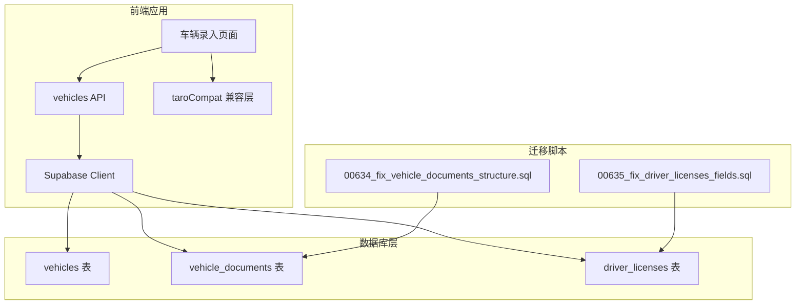
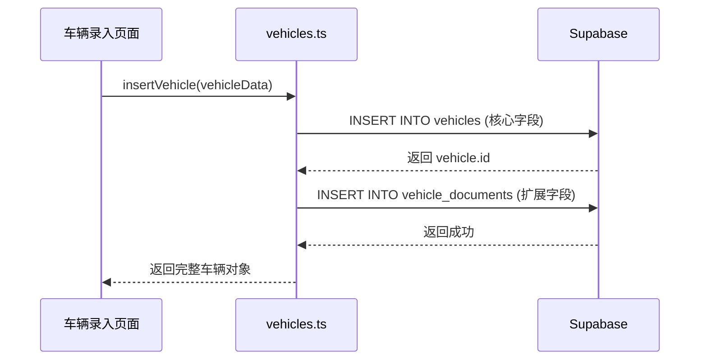

# Design Document

## Overview

本设计文档描述了修复车辆管理系统中数据库字段缺失和代码兼容性问题的技术方案。主要解决三类问题：

1. **vehicle_documents 表结构统一**：合并两个版本的表定义，确保所有扩展字段存在
2. **driver_licenses 表字段补充**：添加缺失的 `id_card_address` 和 `driving_license_photo` 字段
3. **Taro 兼容层完善**：实现 `removeStorage` 异步函数

## Architecture

### 系统架构图



### 数据流图



## Components and Interfaces

### 1. 数据库迁移组件

#### 1.1 vehicle_documents 表修复迁移

**文件**: `supabase/migrations/00634_fix_vehicle_documents_structure.sql`

**功能**:
- 检查并移除 `document_type NOT NULL` 约束
- 添加所有缺失的扩展字段
- 使用幂等性语法确保可重复执行

#### 1.2 driver_licenses 表修复迁移

**文件**: `supabase/migrations/00635_fix_driver_licenses_fields.sql`

**功能**:
- 添加 `id_card_address` 字段（如果不存在）
- 添加 `driving_license_photo` 字段（如果不存在）
- 使用幂等性语法确保可重复执行

### 2. Taro 兼容层组件

#### 2.1 removeStorage 函数

**文件**: `src/utils/taroCompat.ts`

**接口定义**:
```typescript
interface RemoveStorageOptions {
  key: string
  success?: () => void
  fail?: (error: any) => void
  complete?: () => void
}

function removeStorage(options: RemoveStorageOptions): Promise<void>
```

**实现逻辑**:
- H5 环境：使用 `localStorage.removeItem(key)`
- 非 H5 环境：调用 `Taro.removeStorage(options)`

## Data Models

### 1. vehicle_documents 表完整结构

```sql
CREATE TABLE vehicle_documents (
  -- 主键和外键
  id uuid PRIMARY KEY DEFAULT gen_random_uuid(),
  vehicle_id uuid NOT NULL REFERENCES vehicles(id) ON DELETE CASCADE,
  
  -- 行驶证信息（20列）
  owner_name text,
  use_character text,
  register_date date,
  issue_date date,
  engine_number text,
  archive_number text,
  total_mass numeric,
  approved_passengers integer,
  curb_weight numeric,
  approved_load numeric,
  overall_dimension_length numeric,
  overall_dimension_width numeric,
  overall_dimension_height numeric,
  inspection_valid_until date,
  inspection_date date,
  mandatory_scrap_date date,
  driving_license_main_photo text,
  driving_license_sub_photo text,
  driving_license_back_photo text,
  driving_license_sub_back_photo text,
  
  -- 车辆照片（7列）
  left_front_photo text,
  right_front_photo text,
  left_rear_photo text,
  right_rear_photo text,
  dashboard_photo text,
  rear_door_photo text,
  cargo_box_photo text,
  
  -- 租赁信息（8列）
  lessor_name text,
  lessor_contact text,
  lessee_name text,
  lessee_contact text,
  monthly_rent numeric,
  lease_start_date date,
  lease_end_date date,
  rent_payment_day integer,
  
  -- 审核和其他信息（9列）
  review_notes text,
  locked_photos jsonb DEFAULT '{}'::jsonb,
  required_photos text[] DEFAULT ARRAY[]::text[],
  damage_photos text[],
  pickup_photos text[],
  pickup_time timestamptz,
  registration_photos text[],
  return_photos text[],
  return_time timestamptz,
  
  -- 时间戳
  created_at timestamptz NOT NULL DEFAULT now(),
  updated_at timestamptz NOT NULL DEFAULT now()
);
```

### 2. driver_licenses 表完整结构

```sql
CREATE TABLE driver_licenses (
  -- 主键和外键
  id UUID PRIMARY KEY DEFAULT gen_random_uuid(),
  driver_id UUID UNIQUE NOT NULL,
  
  -- 身份证信息（6个字段）
  id_card_name TEXT,              -- 身份证姓名
  id_card_number TEXT,            -- 身份证号码
  id_card_photo_front TEXT,       -- 身份证正面照片
  id_card_photo_back TEXT,        -- 身份证反面照片
  id_card_address TEXT,           -- 身份证地址 ⚠️ 需要确保存在
  id_card_birth_date DATE,        -- 出生日期
  
  -- 驾驶证信息（8个字段）
  license_number TEXT,            -- 驾驶证号
  license_class TEXT,             -- 准驾车型
  first_issue_date DATE,          -- 初次领证日期
  valid_from DATE,                -- 驾驶证有效期起
  valid_to DATE,                  -- 驾驶证有效期至
  issue_authority TEXT,           -- 签发机关
  driving_license_photo TEXT,     -- 驾驶证照片 ⚠️ 需要确保存在
  
  -- 状态和时间戳
  status TEXT DEFAULT 'active',
  created_at TIMESTAMPTZ DEFAULT NOW() NOT NULL,
  updated_at TIMESTAMPTZ DEFAULT NOW() NOT NULL
);
```

**需要确保存在的字段**：
- `id_card_address` - 身份证地址（错误日志显示缺失）
- `driving_license_photo` - 驾驶证照片（00633 迁移中添加）

**所有身份证相关字段**：
| 字段名 | 类型 | 说明 |
|--------|------|------|
| id_card_name | TEXT | 身份证姓名 |
| id_card_number | TEXT | 身份证号码 |
| id_card_photo_front | TEXT | 身份证正面照片 URL |
| id_card_photo_back | TEXT | 身份证反面照片 URL |
| id_card_address | TEXT | 身份证地址 |
| id_card_birth_date | DATE | 出生日期 |


## Correctness Properties

*A property is a characteristic or behavior that should hold true across all valid executions of a system-essentially, a formal statement about what the system should do. Properties serve as the bridge between human-readable specifications and machine-verifiable correctness guarantees.*

### Property 1: 车辆信息保存一致性

*For any* 有效的车辆输入数据，调用 insertVehicle 函数后，查询 vehicles 表和 vehicle_documents 表应该返回与输入数据一致的记录。

**Validates: Requirements 1.1, 1.2, 1.5**

### Property 2: 驾驶员证件字段保存一致性

*For any* 包含 id_card_address 和 driving_license_photo 字段的驾驶员证件数据，调用 upsertDriverLicense 函数后，查询 driver_licenses 表应该返回包含这些字段的完整数据。

**Validates: Requirements 2.1, 2.2, 2.3**

### Property 3: 可选字段 NULL 值处理

*For any* 只包含必需字段的驾驶员证件数据，保存到 driver_licenses 表后，可选字段应该为 NULL 且不报错。

**Validates: Requirements 2.4**

### Property 4: removeStorage 函数正确性

*For any* 存储键值对，先调用 setStorage 设置值，再调用 removeStorage 删除，最后调用 getStorage 应该返回 null，且 success 回调被调用，Promise 正确 resolve。

**Validates: Requirements 3.1, 3.3**

## Error Handling

### 1. 数据库迁移错误处理

- **字段已存在**：使用 `IF NOT EXISTS` 语法，跳过已存在的字段
- **约束冲突**：先检查约束是否存在，再进行修改
- **外键约束**：确保 vehicle_id 引用有效的 vehicles 记录

### 2. API 错误处理

- **插入失败**：记录错误日志，返回 null
- **扩展信息保存失败**：核心信息已保存时，记录警告日志但不回滚
- **Schema Cache 未刷新**：提示用户刷新 Schema Cache

### 3. Taro 兼容层错误处理

- **localStorage 不可用**：捕获异常，调用 fail 回调
- **键不存在**：正常执行，不报错

## Testing Strategy

### 双重测试方法

本项目采用单元测试和属性测试相结合的方法：

- **单元测试**：验证特定示例、边界条件和错误情况
- **属性测试**：验证应在所有输入中保持的通用属性

### 测试框架

- **单元测试**：Vitest
- **属性测试**：fast-check（JavaScript/TypeScript 的属性测试库）

### 属性测试配置

每个属性测试配置运行最少 100 次迭代，以确保充分覆盖输入空间。

### 测试标注格式

每个属性测试必须使用以下格式标注：
```typescript
// **Feature: vehicle-database-fields-fix, Property {number}: {property_text}**
```

### 测试用例

#### 单元测试

1. **数据库迁移测试**
   - 验证迁移脚本执行成功
   - 验证字段存在性
   - 验证约束正确性

2. **API 功能测试**
   - 验证 insertVehicle 函数正常工作
   - 验证 upsertDriverLicense 函数正常工作
   - 验证错误处理逻辑

3. **Taro 兼容层测试**
   - 验证 removeStorage 函数在 H5 环境下正常工作
   - 验证回调函数正确调用
   - 验证 Promise 正确 resolve/reject

#### 属性测试

1. **Property 1: 车辆信息保存一致性**
   - 生成随机车辆数据
   - 调用 insertVehicle
   - 验证数据一致性

2. **Property 2: 驾驶员证件字段保存一致性**
   - 生成随机证件数据
   - 调用 upsertDriverLicense
   - 验证字段完整性

3. **Property 3: 可选字段 NULL 值处理**
   - 生成只包含必需字段的数据
   - 验证保存成功且可选字段为 NULL

4. **Property 4: removeStorage 函数正确性**
   - 生成随机键值对
   - 验证存储-删除-查询流程

