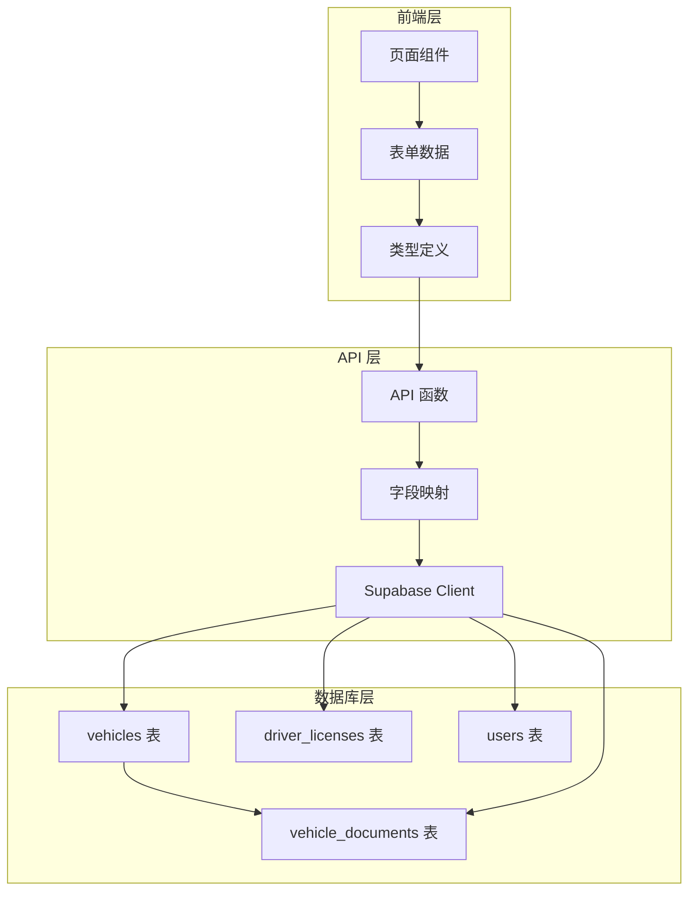
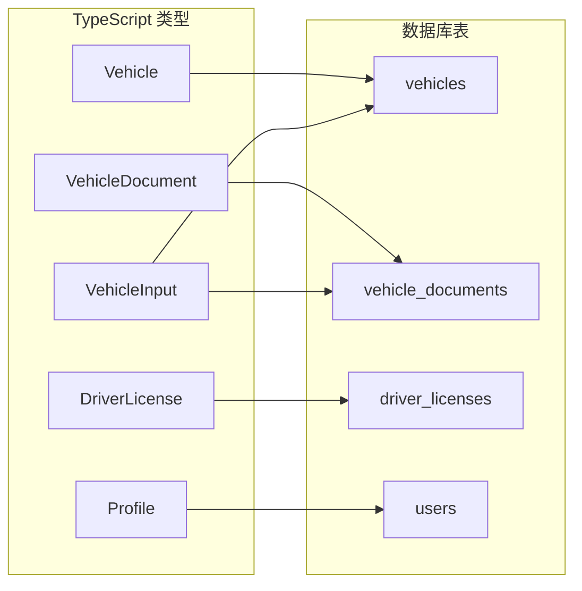

# Design Document: 车辆管理与个人信息字段完整性审计

## Overview

本设计文档描述了车辆管理和个人信息功能的字段完整性审计方案。通过系统性地检查 TypeScript 类型定义、API 层、数据库迁移文件和前端页面，确保数据结构在整个系统中保持一致。

### 设计目标

1. **类型一致性**：确保 TypeScript 接口与数据库表结构完全匹配
2. **字段完整性**：确保所有必要字段在各层都有正确定义
3. **数据流正确性**：确保数据在前端、API、数据库之间正确传递
4. **向后兼容性**：修复问题时不破坏现有功能

## Architecture

### 数据流架构



### 字段映射关系



## Components and Interfaces

### 1. 车辆相关接口

#### Vehicle 接口（核心字段）

```typescript
interface Vehicle {
  // 主键和关联
  id: string
  user_id: string | null
  driver_id: string | null
  warehouse_id: string | null
  owner_id: string | null
  current_driver_id: string | null
  
  // 基本信息
  plate_number: string
  brand: string | null
  model: string | null
  color: string | null
  vin: string | null
  vehicle_type: string | null
  purchase_date: string | null
  ownership_type: string | null
  
  // 状态字段
  status: string
  is_active: boolean
  review_status: string | null
  reviewed_at: string | null
  reviewed_by: string | null
  
  // 时间戳
  created_at: string
  updated_at: string
  notes: string | null
  
  // 扩展字段（从 vehicle_documents 平铺）
  // ... 照片字段、行驶证信息等
}
```

#### VehicleDocument 接口（扩展字段）

```typescript
interface VehicleDocument {
  id: string
  vehicle_id: string
  
  // 行驶证信息（20个字段）
  owner_name: string | null
  use_character: string | null
  register_date: string | null
  issue_date: string | null
  engine_number: string | null
  archive_number: string | null
  total_mass: number | null
  approved_passengers: number | null
  curb_weight: number | null
  approved_load: number | null
  overall_dimension_length: number | null
  overall_dimension_width: number | null
  overall_dimension_height: number | null
  inspection_valid_until: string | null
  inspection_date: string | null
  mandatory_scrap_date: string | null
  driving_license_main_photo: string | null
  driving_license_sub_photo: string | null
  driving_license_back_photo: string | null
  driving_license_sub_back_photo: string | null
  
  // 车辆照片（7个字段）
  left_front_photo: string | null
  right_front_photo: string | null
  left_rear_photo: string | null
  right_rear_photo: string | null
  dashboard_photo: string | null
  rear_door_photo: string | null
  cargo_box_photo: string | null
  
  // 租赁信息（8个字段）
  lessor_name: string | null
  lessor_contact: string | null
  lessee_name: string | null
  lessee_contact: string | null
  monthly_rent: number | null
  lease_start_date: string | null
  lease_end_date: string | null
  rent_payment_day: number | null
  
  // 照片数组（4个字段）
  pickup_photos: string[] | null
  return_photos: string[] | null
  registration_photos: string[] | null
  damage_photos: string[] | null
  
  // 时间字段
  pickup_time: string | null
  return_time: string | null
  
  // 其他
  review_notes: string | null
  locked_photos: Record<string, unknown> | null
  required_photos: string[] | null
  created_at: string
  updated_at: string
}
```

### 2. 驾驶证相关接口

#### DriverLicense 接口

```typescript
interface DriverLicense {
  id: string
  driver_id: string
  
  // 身份证信息
  id_card_name: string | null
  id_card_number: string | null
  id_card_address: string | null
  id_card_birth_date: string | null
  id_card_photo_front: string | null
  id_card_photo_back: string | null
  
  // 驾驶证信息
  license_number: string
  license_type: string
  license_class: string | null
  first_issue_date: string | null
  valid_from: string | null
  valid_to: string | null
  issue_authority: string | null
  driving_license_photo: string | null
  
  // 时间戳
  issue_date: string
  expiry_date: string
  created_at: string
  updated_at: string
}
```

### 3. 用户资料相关接口

#### Profile 接口

```typescript
interface Profile {
  id: string
  phone: string | null
  email: string | null
  name: string
  role: UserRole
  avatar_url: string | null
  created_at: string
  updated_at: string
  
  // 扩展字段
  driver_type: string | null
  nickname: string | null
  join_date: string | null
  company_name: string | null
  vehicle_plate: string | null
  manager_permissions_enabled: boolean | null
  main_account_id: string | null
  is_active: boolean | null
  status: string | null
  login_account: string | null
  peer_account_permission: boolean | null
  
  // 地址信息
  address_province: string | null
  address_city: string | null
  address_district: string | null
  address_detail: string | null
  
  // 紧急联系人
  emergency_contact_name: string | null
  emergency_contact_phone: string | null
  emergency_contact_relationship: string | null
  
  // 租赁信息（兼容旧代码）
  lease_start_date: string | null
  lease_end_date: string | null
  monthly_fee: number | null
  notes: string | null
}
```

## Data Models

### 数据库表结构对照

| 表名 | TypeScript 接口 | 主要用途 |
|------|----------------|---------|
| vehicles | Vehicle | 车辆核心信息 |
| vehicle_documents | VehicleDocument | 车辆扩展信息（行驶证、照片等） |
| driver_licenses | DriverLicense | 驾驶证和身份证信息 |
| users | Profile | 用户基本信息和角色 |

### 字段平铺策略

当查询车辆信息时，需要将 `vehicle_documents` 表的字段平铺到 `Vehicle` 对象中：

```typescript
// 平铺逻辑示例
const vehicleWithPhotos = {
  ...vehicle,
  // 从 document 平铺照片字段
  left_front_photo: doc?.left_front_photo || vehicle.left_front_photo,
  right_front_photo: doc?.right_front_photo || vehicle.right_front_photo,
  // ... 其他字段
}
```

**优先级规则**：`vehicle_documents` 表的值优先于 `vehicles` 表的值。

## Correctness Properties

*A property is a characteristic or behavior that should hold true across all valid executions of a system-essentially, a formal statement about what the system should do. Properties serve as the bridge between human-readable specifications and machine-verifiable correctness guarantees.*

### Property 1: 车辆数据 Round-Trip 一致性

*For any* 有效的 VehicleInput 对象，插入到数据库后再查询，返回的 Vehicle 对象应包含所有输入的非空字段值。

**Validates: Requirements 5.1, 5.3, 5.4**

### Property 2: 驾驶证数据 Round-Trip 一致性

*For any* 有效的 DriverLicenseInput 对象，插入到数据库后再查询，返回的 DriverLicense 对象应包含所有输入的非空字段值。

**Validates: Requirements 3.3, 5.1**

### Property 3: 照片数组字段 Round-Trip 一致性

*For any* 包含照片数组的车辆数据（pickup_photos, return_photos, registration_photos, damage_photos），插入后查询返回的数组应与输入数组完全相等。

**Validates: Requirements 8.1, 8.3**

### Property 4: 字段平铺完整性

*For any* 车辆及其关联的 vehicle_documents 记录，调用 getDriverVehicles 或 getVehicleById 返回的对象应包含所有 vehicle_documents 中的非空字段。

**Validates: Requirements 5.3, 5.4**

### Property 5: Profile 转换完整性

*For any* users 表中的用户记录，convertUserToProfile 函数返回的 Profile 对象应包含所有必要的基本信息字段（id, name, phone, email, role, avatar_url）。

**Validates: Requirements 4.1, 4.4**

### Property 6: 类型定义与数据库 Schema 一致性

*For any* 数据库表中定义的字段，对应的 TypeScript 接口应包含该字段的类型定义。

**Validates: Requirements 1.1, 1.2, 6.1, 6.2, 6.3, 6.4**

## Error Handling

### 字段缺失处理

1. **可选字段**：使用 `| null` 或 `?` 标记，允许为空
2. **必填字段**：在 API 层进行验证，缺失时返回明确错误
3. **默认值**：对于有默认值的字段，在插入时自动填充

### 类型不匹配处理

1. **数字字段**：使用 `Number()` 转换，无效值设为 `null`
2. **日期字段**：使用 ISO 8601 格式字符串
3. **数组字段**：确保始终返回数组或 `null`，不返回 `undefined`

## Testing Strategy

### 双重测试方法

本项目采用单元测试和属性测试相结合的方法：

- **单元测试**：验证特定示例和边界情况
- **属性测试**：验证应在所有输入上成立的通用属性

### 属性测试框架

使用 **fast-check** 作为属性测试库，配置每个属性测试运行至少 100 次迭代。

### 测试用例设计

#### 单元测试

1. **字段存在性测试**：验证接口包含所有必要字段
2. **类型正确性测试**：验证字段类型与数据库一致
3. **边界情况测试**：测试 null 值、空数组、空字符串等

#### 属性测试

1. **Round-Trip 测试**：插入后查询，验证数据一致性
2. **字段平铺测试**：验证 vehicle_documents 字段正确平铺
3. **数组处理测试**：验证数组字段的序列化和反序列化

### 测试标注格式

每个属性测试必须使用以下格式标注：

```typescript
/**
 * **Feature: vehicle-profile-field-audit, Property 1: 车辆数据 Round-Trip 一致性**
 * **Validates: Requirements 5.1, 5.3, 5.4**
 */
```
