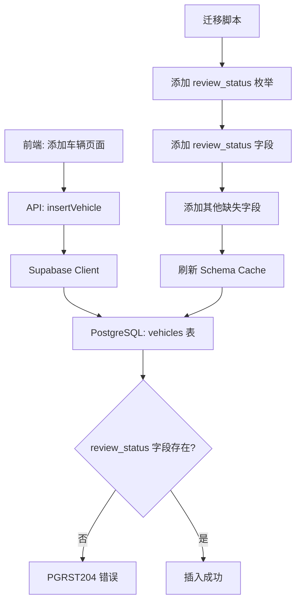

# Design Document: Vehicles Review Status Fix

## Overview

本设计文档描述了修复 vehicles 表中 `review_status` 字段缺失问题的技术方案。当前系统在添加车辆时报错 `PGRST204`，表明数据库 schema cache 中找不到 `review_status` 列。

### 问题分析

1. **根本原因**：vehicles 表结构在某次迁移后被简化，丢失了 `review_status` 等审核相关字段
2. **影响范围**：所有车辆添加、审核功能无法正常工作
3. **解决方案**：创建数据库迁移脚本，添加缺失的字段

## Architecture

## Components and Interfaces

### 1. 数据库迁移脚本

**文件**: `supabase/migrations/00632_add_vehicles_review_status_field.sql`

**职责**:
- 创建 `review_status` 枚举类型（如果不存在）
- 添加 `review_status` 字段到 vehicles 表
- 添加其他缺失的审核相关字段
- 刷新 schema cache

### 2. 现有 API 接口

**文件**: `src/db/api/vehicles.ts`

**相关函数**:
- `insertVehicle()`: 添加车辆，使用 review_status 字段
- `submitVehicleForReview()`: 提交车辆审核，更新 review_status
- `getPendingReviewVehicles()`: 获取待审核车辆列表

## Data Models

### vehicles 表结构（需要添加的字段）

| 字段名 | 类型 | 默认值 | 说明 |
|--------|------|--------|------|
| user_id | UUID | NULL | 车辆录入人ID |
| warehouse_id | UUID | NULL | 所属仓库ID |
| driver_id | UUID | NULL | 当前司机ID |
| owner_id | UUID | NULL | 车主ID |
| current_driver_id | UUID | NULL | 当前驾驶员ID |
| color | TEXT | NULL | 车辆颜色 |
| vin | TEXT | NULL | 车架号 |
| purchase_date | DATE | NULL | 购买日期 |
| ownership_type | TEXT | NULL | 所有权类型 |
| is_active | BOOLEAN | TRUE | 是否激活 |
| notes | TEXT | NULL | 备注 |
| review_status | TEXT | 'drafting' | 审核状态 |
| reviewed_at | TIMESTAMPTZ | NULL | 审核时间 |
| reviewed_by | UUID | NULL | 审核人ID |

### review_status 枚举值

- `drafting`: 草稿状态
- `pending_review`: 待审核
- `need_supplement`: 需要补充资料
- `approved`: 已通过

## Correctness Properties

*A property is a characteristic or behavior that should hold true across all valid executions of a system-essentially, a formal statement about what the system should do. Properties serve as the bridge between human-readable specifications and machine-verifiable correctness guarantees.*

### Property Reflection

经过分析，以下属性可以合并：
- 3.1 和 3.2 可以合并为一个"插入-查询一致性"属性
- 1.1 和 3.1 本质上测试相同的功能，保留 3.1

### Property 1: 车辆插入-查询一致性

*For any* 有效的车辆数据（包含 review_status 字段），插入后查询应返回相同的 review_status 值

**Validates: Requirements 1.1, 3.1, 3.2**

### Property 2: 审核状态更新一致性

*For any* 已存在的车辆和有效的 review_status 值，更新后查询应返回新的状态值

**Validates: Requirements 3.3**

### Property 3: 默认值正确性

*For any* 不指定 review_status 的车辆插入，查询后 review_status 应为 'drafting'

**Validates: Requirements 1.3**

## Error Handling

### 迁移错误处理

1. **枚举类型已存在**: 使用 `DO $$ ... EXCEPTION WHEN duplicate_object THEN null; END $$;` 语法
2. **字段已存在**: 使用 `ADD COLUMN IF NOT EXISTS` 语法
3. **外键约束失败**: 确保引用的表和字段存在

### API 错误处理

1. **PGRST204 错误**: 提示用户执行数据库迁移
2. **插入失败**: 记录详细错误日志，返回友好错误信息

## Testing Strategy

### 单元测试

1. **迁移脚本验证**: 验证迁移脚本语法正确
2. **字段存在性检查**: 验证迁移后字段存在

### 属性测试

使用 Vitest 进行属性测试：

1. **Property 1 测试**: 生成随机车辆数据，验证插入-查询一致性
2. **Property 2 测试**: 生成随机状态更新，验证更新一致性
3. **Property 3 测试**: 验证默认值行为

### 集成测试

1. **端到端测试**: 验证添加车辆功能正常工作
2. **审核流程测试**: 验证车辆审核状态流转正常

### 测试框架

- **属性测试库**: fast-check（与 Vitest 集成）
- **测试运行**: `npm run test`
- **最小迭代次数**: 100 次
