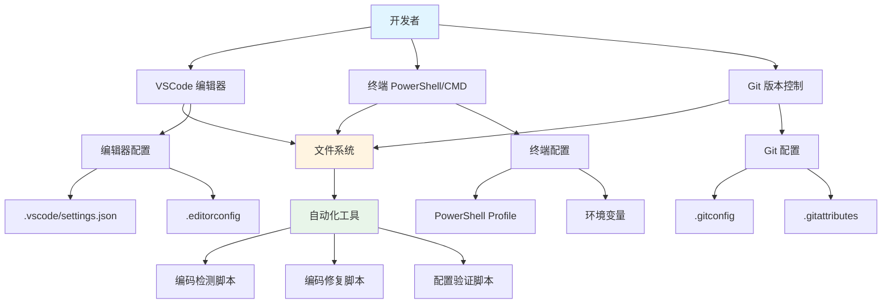

# Windows 编码问题修复 - 设计文档

## 概述

本文档设计了一套完整的解决方案，从系统配置、工具配置、脚本修复到自动化工具，彻底解决 Windows 系统上的编码问题。解决方案采用多层次配置策略，确保从文件创建、编辑、执行到版本控制的整个流程都使用统一的 UTF-8 编码。

## 架构

### 整体架构图



### 配置层次

1. **系统层**：Windows 系统编码配置
2. **终端层**：PowerShell/CMD 编码配置
3. **编辑器层**：VSCode 编码配置
4. **版本控制层**：Git 编码配置
5. **脚本层**：Node.js/Python/PowerShell 脚本编码处理
6. **自动化层**：检测和修复工具

## 组件和接口

### 1. VSCode 配置组件

**文件**：`.vscode/settings.json`

**配置项**：
```json
{
  "files.encoding": "utf8",
  "files.autoGuessEncoding": false,
  "files.eol": "\n",
  "[javascript]": {
    "files.encoding": "utf8"
  },
  "[typescript]": {
    "files.encoding": "utf8"
  },
  "[markdown]": {
    "files.encoding": "utf8"
  },
  "[json]": {
    "files.encoding": "utf8"
  },
  "terminal.integrated.defaultProfile.windows": "PowerShell",
  "terminal.integrated.profiles.windows": {
    "PowerShell": {
      "source": "PowerShell",
      "args": ["-NoExit", "-Command", "chcp 65001"]
    }
  }
}
```

**功能**：
- 强制所有文件使用 UTF-8 编码
- 禁用自动编码检测，避免误判
- 统一行尾符为 LF
- 配置集成终端使用 UTF-8

### 2. EditorConfig 配置组件

**文件**：`.editorconfig`

**配置项**：
```ini
root = true

[*]
charset = utf-8
end_of_line = lf
insert_final_newline = true
trim_trailing_whitespace = true

[*.{js,ts,jsx,tsx,json,md,yml,yaml}]
charset = utf-8

[*.{ps1,sh}]
charset = utf-8
```

**功能**：
- 跨编辑器统一编码配置
- 确保所有文本文件使用 UTF-8
- 统一行尾符和文件格式

### 3. Git 配置组件

**文件**：`.gitconfig` (用户级) 和 `.git/config` (项目级)

**配置项**：
```ini
[core]
    quotepath = false
    autocrlf = false
    safecrlf = false
    filemode = false
[gui]
    encoding = utf-8
[i18n]
    commitencoding = utf-8
    logoutputencoding = utf-8
```

**文件**：`.gitattributes`

**配置项**：
```
* text=auto eol=lf
*.js text eol=lf
*.ts text eol=lf
*.json text eol=lf
*.md text eol=lf
*.sh text eol=lf
*.ps1 text eol=lf
```

**功能**：
- 正确显示中文文件名（quotepath = false）
- 禁用自动换行符转换（autocrlf = false）
- 统一提交和日志编码为 UTF-8
- 通过 .gitattributes 控制文件行尾符

### 4. PowerShell Profile 配置组件

**文件**：`$PROFILE` (通常在 `Documents\PowerShell\Microsoft.PowerShell_profile.ps1`)

**配置内容**：
```powershell
# 设置控制台编码为 UTF-8
[Console]::OutputEncoding = [System.Text.Encoding]::UTF8
[Console]::InputEncoding = [System.Text.Encoding]::UTF8
$OutputEncoding = [System.Text.Encoding]::UTF8

# 设置代码页为 65001 (UTF-8)
chcp 65001 > $null

# 设置 PSDefaultParameterValues
$PSDefaultParameterValues['*:Encoding'] = 'utf8'

# 设置环境变量
$env:PYTHONIOENCODING = "utf-8"
$env:NODE_OPTIONS = "--max-old-space-size=8192"
```

**功能**：
- 每次启动 PowerShell 自动设置 UTF-8 编码
- 配置输入输出编码
- 设置默认文件操作编码
- 配置 Python 和 Node.js 环境变量

### 5. Node.js 脚本编码处理组件

**模块**：`scripts/encoding-utils.js`

**接口**：
```javascript
/**
 * 编码工具模块
 * 提供统一的文件读写接口，确保使用 UTF-8 编码
 */

/**
 * 读取文件内容
 * @param {string} filePath - 文件路径
 * @returns {Promise<string>} 文件内容
 */
async function readFileUTF8(filePath) {
  const fs = require('fs').promises;
  return await fs.readFile(filePath, 'utf-8');
}

/**
 * 写入文件内容
 * @param {string} filePath - 文件路径
 * @param {string} content - 文件内容
 * @returns {Promise<void>}
 */
async function writeFileUTF8(filePath, content) {
  const fs = require('fs').promises;
  return await fs.writeFile(filePath, content, 'utf-8');
}

/**
 * 执行命令并正确处理编码
 * @param {string} command - 命令
 * @returns {Promise<{stdout: string, stderr: string}>}
 */
async function execUTF8(command) {
  const { exec } = require('child_process');
  const util = require('util');
  const execPromise = util.promisify(exec);
  
  return await execPromise(command, {
    encoding: 'utf-8',
    env: { ...process.env, CHCP: '65001' }
  });
}

module.exports = {
  readFileUTF8,
  writeFileUTF8,
  execUTF8
};
```

**功能**：
- 提供统一的文件读写接口
- 确保所有文件操作使用 UTF-8 编码
- 正确处理子进程编码

### 6. PowerShell 脚本编码处理组件

**模板**：PowerShell 脚本头部模板

```powershell
# 设置脚本编码为 UTF-8
[Console]::OutputEncoding = [System.Text.Encoding]::UTF8
$OutputEncoding = [System.Text.Encoding]::UTF8
chcp 65001 > $null

# 设置错误处理
$ErrorActionPreference = "Stop"

# 脚本主体
# ...
```

**功能**：
- 每个 PowerShell 脚本开头设置编码
- 确保脚本执行过程中使用 UTF-8
- 统一错误处理

### 7. Python 脚本编码处理组件

**模板**：Python 脚本头部模板

```python
#!/usr/bin/env python
# -*- coding: utf-8 -*-
"""
脚本说明
"""

import sys
import io

# 设置标准输出编码为 UTF-8
sys.stdout = io.TextIOWrapper(sys.stdout.buffer, encoding='utf-8')
sys.stderr = io.TextIOWrapper(sys.stderr.buffer, encoding='utf-8')

# 设置默认编码
import locale
locale.setlocale(locale.LC_ALL, '')

# 脚本主体
# ...
```

**功能**：
- 声明文件编码为 UTF-8
- 设置标准输出编码
- 确保文件操作使用 UTF-8

### 8. 编码检测工具组件

**文件**：`scripts/check-encoding.js`

**功能**：
- 扫描项目中的所有文本文件
- 检测文件编码
- 报告非 UTF-8 编码的文件
- 生成检测报告

**接口**：
```javascript
/**
 * 检测文件编码
 * @param {string} filePath - 文件路径
 * @returns {Promise<string>} 编码类型 (utf-8, gbk, etc.)
 */
async function detectEncoding(filePath)

/**
 * 扫描目录中的所有文件
 * @param {string} dirPath - 目录路径
 * @param {string[]} extensions - 要检查的文件扩展名
 * @returns {Promise<Array<{path: string, encoding: string}>>}
 */
async function scanDirectory(dirPath, extensions)

/**
 * 生成检测报告
 * @param {Array} results - 检测结果
 * @returns {string} 报告内容
 */
function generateReport(results)
```

### 9. 编码修复工具组件

**文件**：`scripts/fix-encoding.js`

**功能**：
- 将非 UTF-8 文件转换为 UTF-8
- 备份原文件
- 生成转换报告
- 验证转换结果

**接口**：
```javascript
/**
 * 转换文件编码为 UTF-8
 * @param {string} filePath - 文件路径
 * @param {string} fromEncoding - 源编码
 * @returns {Promise<boolean>} 是否成功
 */
async function convertToUTF8(filePath, fromEncoding)

/**
 * 批量转换文件
 * @param {Array<{path: string, encoding: string}>} files - 文件列表
 * @returns {Promise<Array<{path: string, success: boolean}>>}
 */
async function batchConvert(files)

/**
 * 备份文件
 * @param {string} filePath - 文件路径
 * @returns {Promise<string>} 备份文件路径
 */
async function backupFile(filePath)
```

### 10. 配置验证工具组件

**文件**：`scripts/verify-encoding-config.js`

**功能**：
- 验证所有编码配置是否正确
- 检查 VSCode 配置
- 检查 Git 配置
- 检查 PowerShell Profile
- 生成验证报告

**接口**：
```javascript
/**
 * 验证 VSCode 配置
 * @returns {Promise<{valid: boolean, issues: string[]}>}
 */
async function verifyVSCodeConfig()

/**
 * 验证 Git 配置
 * @returns {Promise<{valid: boolean, issues: string[]}>}
 */
async function verifyGitConfig()

/**
 * 验证 PowerShell Profile
 * @returns {Promise<{valid: boolean, issues: string[]}>}
 */
async function verifyPowerShellProfile()

/**
 * 生成完整验证报告
 * @returns {Promise<string>} 报告内容
 */
async function generateVerificationReport()
```

## 数据模型

### 编码检测结果

```typescript
interface EncodingCheckResult {
  filePath: string;           // 文件路径
  encoding: string;           // 检测到的编码
  isUTF8: boolean;           // 是否为 UTF-8
  fileSize: number;          // 文件大小
  lastModified: Date;        // 最后修改时间
}
```

### 编码转换结果

```typescript
interface ConversionResult {
  filePath: string;           // 文件路径
  fromEncoding: string;       // 源编码
  toEncoding: string;         // 目标编码
  success: boolean;           // 是否成功
  backupPath?: string;        // 备份文件路径
  error?: string;             // 错误信息
}
```

### 配置验证结果

```typescript
interface ConfigVerificationResult {
  component: string;          // 组件名称 (VSCode, Git, PowerShell)
  valid: boolean;            // 是否有效
  issues: string[];          // 问题列表
  recommendations: string[]; // 建议
}
```

## 正确性属性

*属性是一个特征或行为，应该在系统的所有有效执行中保持为真——本质上是关于系统应该做什么的正式声明。属性作为人类可读规范和机器可验证正确性保证之间的桥梁。*

### 属性 1：文件编码一致性
*对于任何*项目中的文本文件，读取文件时应该能够正确解析 UTF-8 编码的内容，不应出现乱码或解析错误
**验证：需求 1.2, 1.3**

### 属性 2：终端输出正确性
*对于任何*包含中文的输出，在 PowerShell 或 CMD 终端中显示时应该正确显示中文字符，而不是乱码或问号
**验证：需求 2.2, 2.3**

### 属性 3：脚本执行稳定性
*对于任何*包含中文的脚本（Node.js/Python/PowerShell），执行时应该能够正确处理中文字符串和文件路径，不应因编码问题而失败
**验证：需求 3.3, 4.4, 7.4**

### 属性 4：Git 操作正确性
*对于任何*包含中文的文件名或提交信息，Git 操作（status, log, diff）应该正确显示中文，而不是转义序列
**验证：需求 5.1, 5.2, 5.3**

### 属性 5：编码转换可逆性
*对于任何*非 UTF-8 编码的文件，转换为 UTF-8 后再转换回原编码，应该保持内容不变（对于支持的编码）
**验证：需求 9.4**

### 属性 6：配置持久性
*对于任何*编码相关的配置，在系统重启或工具重启后应该保持有效，不需要重新配置
**验证：需求 2.1, 4.1, 6.1**

### 属性 7：跨工具一致性
*对于任何*文件，在不同工具（VSCode, Git, PowerShell, Node.js）中查看或处理时，应该显示相同的内容，不应因工具不同而出现编码差异
**验证：需求 1.2, 2.4, 3.1, 5.4**

## 错误处理

### 1. 文件编码检测失败
- **场景**：无法确定文件编码
- **处理**：记录警告，跳过该文件，继续处理其他文件
- **日志**：记录文件路径和错误原因

### 2. 编码转换失败
- **场景**：文件转换过程中出错
- **处理**：恢复备份文件，记录错误，通知用户
- **日志**：记录文件路径、源编码、错误信息

### 3. 配置文件不存在
- **场景**：必需的配置文件缺失
- **处理**：创建默认配置文件，记录操作
- **日志**：记录创建的配置文件路径

### 4. PowerShell Profile 权限问题
- **场景**：无法修改 PowerShell Profile
- **处理**：提示用户手动配置，提供配置内容
- **日志**：记录权限错误和建议操作

### 5. Git 配置冲突
- **场景**：现有 Git 配置与建议配置冲突
- **处理**：备份现有配置，应用新配置，提供回滚选项
- **日志**：记录配置变更和备份位置

## 测试策略

### 单元测试

1. **编码检测测试**
   - 测试各种编码的文件检测
   - 测试边界情况（空文件、二进制文件）
   - 测试错误处理

2. **编码转换测试**
   - 测试 GBK 到 UTF-8 转换
   - 测试 UTF-8 BOM 到 UTF-8 无 BOM 转换
   - 测试转换后内容正确性

3. **配置验证测试**
   - 测试各配置文件的验证逻辑
   - 测试配置缺失的检测
   - 测试配置错误的识别

### 集成测试

1. **端到端编码流程测试**
   - 创建文件 → 编辑 → 保存 → Git 提交 → 验证编码
   - 执行脚本 → 验证输出编码
   - 终端操作 → 验证显示编码

2. **跨工具一致性测试**
   - 在 VSCode 中创建文件，在 PowerShell 中读取
   - 在 Node.js 中写入文件，在 Git 中查看
   - 在 Python 中处理文件，在 VSCode 中编辑

### 属性测试

使用 fast-check 进行属性测试：

1. **属性 1 测试**：生成随机中文内容，写入文件，读取验证
2. **属性 2 测试**：生成随机中文字符串，输出到终端，验证显示
3. **属性 3 测试**：生成随机中文路径，在脚本中使用，验证处理
4. **属性 5 测试**：生成随机内容，转换编码，验证可逆性

### 测试工具

- **单元测试**：Vitest
- **属性测试**：fast-check
- **集成测试**：自定义测试脚本
- **手动测试**：验证清单

## 部署和配置流程

### 自动配置脚本

创建 `scripts/setup-encoding.ps1`，自动执行所有配置：

1. 检查当前配置状态
2. 备份现有配置
3. 应用 VSCode 配置
4. 应用 Git 配置
5. 配置 PowerShell Profile
6. 验证配置结果
7. 生成配置报告

### 手动配置清单

提供详细的手动配置步骤文档，包括：
- 每个配置项的说明
- 配置前后对比
- 验证方法
- 常见问题解决

### 配置验证

提供 `scripts/verify-encoding-setup.js`，验证所有配置是否正确：
- 检查所有配置文件
- 测试编码处理
- 生成验证报告
- 提供修复建议
