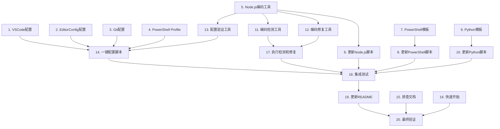

# Windows 编码问题修复 - 任务列表

## 实现计划

本任务列表将设计文档转化为可执行的实现步骤，按照依赖关系组织，确保每个任务都可以独立验证。

---

## 任务

- [x] 1. 配置 VSCode 编辑器编码设置

  - 更新 `.vscode/settings.json` 文件
  - 添加文件编码配置（强制 UTF-8）
  - 添加终端编码配置（PowerShell UTF-8）
  - 添加各语言文件的编码配置
  - _需求：1.1, 1.2, 1.3, 6.1, 6.2, 6.3, 6.4_

- [x] 2. 配置 EditorConfig 跨编辑器编码设置

  - 更新 `.editorconfig` 文件
  - 添加全局 UTF-8 编码配置
  - 添加各文件类型的编码配置
  - 确保行尾符统一为 LF
  - _需求：1.1, 1.3_

- [x] 3. 配置 Git 编码和中文显示

  - 创建 Git 配置脚本 `scripts/setup-git-encoding.ps1`
  - 配置 `core.quotepath = false`（显示中文文件名）
  - 配置 `core.autocrlf = false`（禁用自动换行转换）
  - 配置 `gui.encoding` 和 `i18n` 编码为 UTF-8
  - 创建 `.gitattributes` 文件，统一行尾符
  - _需求：5.1, 5.2, 5.3, 5.4, 5.5_

- [x] 4. 创建 PowerShell Profile 配置

  - 创建 PowerShell Profile 配置脚本 `scripts/setup-powershell-profile.ps1`
  - 检测 PowerShell Profile 位置
  - 添加 UTF-8 编码配置到 Profile
  - 添加代码页设置（chcp 65001）
  - 添加环境变量配置（PYTHONIOENCODING, NODE_OPTIONS）
  - 测试 Profile 加载和生效
  - _需求：2.1, 4.1_

- [x] 5. 创建 Node.js 编码工具模块

  - 创建 `scripts/encoding-utils.js` 模块
  - 实现 `readFileUTF8()` 函数（UTF-8 文件读取）
  - 实现 `writeFileUTF8()` 函数（UTF-8 文件写入）
  - 实现 `execUTF8()` 函数（UTF-8 子进程执行）
  - 添加完整的 JSDoc 注释
  - _需求：3.1, 3.2, 3.4, 3.5_

- [ ]* 5.1 为 Node.js 编码工具编写属性测试
  - **属性 1：文件编码一致性**
  - **验证：需求 1.2, 1.3**
  - 使用 fast-check 生成随机中文内容
  - 测试写入后读取的内容一致性
  - 测试各种特殊字符的处理

- [ ] 6. 更新现有 Node.js 脚本使用编码工具
  - 识别所有需要更新的 Node.js 脚本
  - 导入 `encoding-utils.js` 模块
  - 替换 `fs.readFile` 为 `readFileUTF8`
  - 替换 `fs.writeFile` 为 `writeFileUTF8`
  - 替换 `exec` 为 `execUTF8`
  - 添加文件头部注释说明编码处理
  - _需求：3.1, 3.2, 3.3, 3.4, 3.5_

- [ ] 7. 创建 PowerShell 脚本编码模板
  - 创建 `scripts/templates/powershell-template.ps1` 模板文件
  - 添加编码设置头部（OutputEncoding, chcp）
  - 添加错误处理配置
  - 添加使用说明注释
  - _需求：4.1, 4.2, 4.3_

- [ ] 8. 更新现有 PowerShell 脚本使用编码模板
  - 识别所有 PowerShell 脚本
  - 在每个脚本开头添加编码设置
  - 确保文件读写使用 UTF-8 编码参数
  - 测试脚本执行和中文处理
  - _需求：4.1, 4.2, 4.3, 4.4, 4.5_

- [ ] 9. 创建 Python 脚本编码模板
  - 创建 `scripts/templates/python-template.py` 模板文件
  - 添加文件编码声明（# -*- coding: utf-8 -*-）
  - 添加标准输出编码设置
  - 添加使用说明注释
  - _需求：7.1, 7.2, 7.3, 7.5_

- [ ] 10. 更新现有 Python 脚本使用编码模板
  - 识别所有 Python 脚本
  - 添加文件编码声明
  - 添加标准输出编码设置
  - 确保文件操作使用 UTF-8 编码
  - 测试脚本执行和中文处理
  - _需求：7.1, 7.2, 7.3, 7.4, 7.5_

- [ ] 11. 创建编码检测工具
  - 创建 `scripts/check-encoding.js` 脚本
  - 实现 `detectEncoding()` 函数（检测文件编码）
  - 实现 `scanDirectory()` 函数（扫描目录）
  - 实现 `generateReport()` 函数（生成报告）
  - 支持排除 node_modules 等目录
  - 添加命令行参数支持
  - 添加完整的 JSDoc 注释
  - _需求：9.1, 9.2_

- [ ]* 11.1 为编码检测工具编写单元测试
  - 测试各种编码的文件检测
  - 测试边界情况（空文件、二进制文件）
  - 测试错误处理

- [ ] 12. 创建编码修复工具
  - 创建 `scripts/fix-encoding.js` 脚本
  - 实现 `convertToUTF8()` 函数（转换文件编码）
  - 实现 `batchConvert()` 函数（批量转换）
  - 实现 `backupFile()` 函数（备份文件）
  - 添加转换前确认提示
  - 生成转换报告
  - 添加完整的 JSDoc 注释
  - _需求：9.3, 9.4, 9.5_

- [ ]* 12.1 为编码修复工具编写属性测试
  - **属性 5：编码转换可逆性**
  - **验证：需求 9.4**
  - 测试 GBK 到 UTF-8 转换
  - 测试转换后内容正确性
  - 测试备份和恢复功能

- [ ] 13. 创建配置验证工具
  - 创建 `scripts/verify-encoding-config.js` 脚本
  - 实现 `verifyVSCodeConfig()` 函数（验证 VSCode 配置）
  - 实现 `verifyGitConfig()` 函数（验证 Git 配置）
  - 实现 `verifyPowerShellProfile()` 函数（验证 PowerShell Profile）
  - 实现 `generateVerificationReport()` 函数（生成报告）
  - 添加修复建议
  - 添加完整的 JSDoc 注释
  - _需求：10.5_

- [ ]* 13.1 为配置验证工具编写单元测试
  - 测试各配置文件的验证逻辑
  - 测试配置缺失的检测
  - 测试配置错误的识别

- [x] 14. 创建一键配置脚本

  - 创建 `scripts/setup-encoding.ps1` 主配置脚本
  - 检查当前配置状态
  - 备份现有配置文件
  - 执行 Git 配置
  - 执行 PowerShell Profile 配置
  - 执行 VSCode 配置
  - 运行配置验证
  - 生成配置报告
  - 提供回滚选项
  - _需求：10.1, 10.3_

- [ ] 15. 创建编码问题排查文档
  - 创建 `docs/开发指南/开发指南/编码问题解决指南.md` 文档
  - 说明 Windows 编码问题的根源
  - 列出所有配置项和说明
  - 提供手动配置步骤
  - 提供常见问题和解决方案
  - 提供验证方法和测试步骤
  - 添加配置前后对比截图说明
  - _需求：10.1, 10.2, 10.3, 10.4, 10.5_

- [x] 16. 创建快速开始指南

  - 创建 `docs/开发指南/开发指南/编码配置快速开始.md` 文档
  - 提供一键配置命令
  - 提供验证命令
  - 提供常见问题快速解决
  - 添加配置清单
  - _需求：10.3, 10.4_

- [ ] 17. 执行编码检测和修复
  - 运行 `scripts/check-encoding.js` 检测所有文件
  - 审查检测报告，识别问题文件
  - 运行 `scripts/fix-encoding.js` 修复问题文件
  - 验证修复结果
  - 提交修复后的文件到 Git
  - _需求：9.1, 9.2, 9.3, 9.4, 9.5_

- [ ]* 18. 执行集成测试
  - 测试端到端编码流程（创建→编辑→保存→提交）
  - 测试跨工具一致性（VSCode→PowerShell→Git→Node.js）
  - 测试终端中文显示
  - 测试脚本中文处理
  - 测试 Git 中文文件名和提交信息
  - 记录测试结果

- [ ]* 18.1 执行属性测试
  - **属性 2：终端输出正确性**
  - **验证：需求 2.2, 2.3**
  - 生成随机中文字符串，输出到终端，验证显示
  
- [ ]* 18.2 执行属性测试
  - **属性 3：脚本执行稳定性**
  - **验证：需求 3.3, 4.4, 7.4**
  - 生成随机中文路径，在脚本中使用，验证处理
  
- [ ]* 18.3 执行属性测试
  - **属性 4：Git 操作正确性**
  - **验证：需求 5.1, 5.2, 5.3**
  - 创建包含中文的文件名和提交信息，验证 Git 显示

- [x] 19. 更新项目 README

  - 在 README.md 中添加编码配置说明
  - 添加快速配置命令
  - 添加常见问题链接
  - 添加编码配置验证命令
  - _需求：10.1, 10.3_

- [ ] 20. 最终验证和文档同步
  - 运行 `scripts/verify-encoding-config.js` 验证所有配置
  - 确保所有文档已更新
  - 确保所有代码有完整注释
  - 生成最终验证报告
  - 提交所有更改到 Git

---

## 任务依赖关系

---

## 注意事项

1. **任务 4（PowerShell Profile）** 需要管理员权限或用户确认
2. **任务 6, 8, 10** 需要仔细审查每个脚本，避免破坏现有功能
3. **任务 17** 在修复编码前务必备份文件
4. **任务 18** 需要手动验证，确保所有场景都正确工作
5. **所有代码必须添加完整注释**（强制规则）
6. **所有文档必须实时更新**（强制规则）

---

## 验证清单

完成所有任务后，使用以下清单验证：

- [ ] VSCode 中创建新文件自动使用 UTF-8 编码
- [ ] PowerShell 终端正确显示中文
- [ ] Node.js 脚本正确处理中文文件名和内容
- [ ] PowerShell 脚本正确处理中文
- [ ] Python 脚本正确处理中文
- [ ] Git 正确显示中文文件名
- [ ] Git 正确显示中文提交信息
- [ ] 所有文本文件都是 UTF-8 编码
- [ ] 配置在系统重启后仍然有效
- [ ] 所有工具显示的内容一致

---

**任务总数**：20 个主任务，6 个可选测试任务
**预计完成时间**：根据项目规模，2-4 小时
