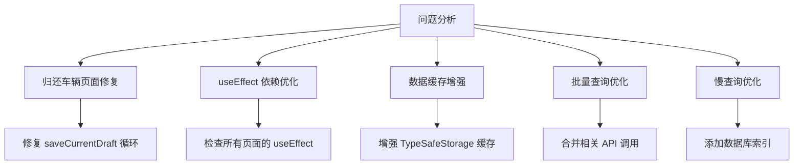

# Design Document - API 优化

## Overview

基于 E2E 测试报告，对司机端应用进行全面的 API 优化，主要解决以下问题：
1. 归还车辆页面无限循环（165 次 API 调用）
2. 多个页面存在重复请求（43 处）
3. 慢查询优化（5 处超过 500ms）
4. 请求过多的页面优化（5 个页面超过 10 次请求）

## Architecture



## 问题分析与解决方案

### 1. 归还车辆页面无限循环（最高优先级）

**问题根因：**
```typescript
// 问题代码 - saveCurrentDraft 依赖了 vehiclePhotos 和 damagePhotos
const saveCurrentDraft = useCallback(async () => {
  // ...
}, [user?.id, vehicleId, vehiclePhotos, damagePhotos])

// 这个 useEffect 依赖 saveCurrentDraft，会在每次 vehiclePhotos/damagePhotos 变化时触发
useEffect(() => {
  const timer = setTimeout(() => {
    saveCurrentDraft()
  }, 1000)
  return () => clearTimeout(timer)
}, [saveCurrentDraft])
```

**解决方案：**
使用 useRef 存储最新的状态值，避免 useCallback 依赖状态变化：

```typescript
// 使用 ref 存储最新状态
const vehiclePhotosRef = useRef(vehiclePhotos)
const damagePhotosRef = useRef(damagePhotos)

// 更新 ref
useEffect(() => {
  vehiclePhotosRef.current = vehiclePhotos
}, [vehiclePhotos])

useEffect(() => {
  damagePhotosRef.current = damagePhotos
}, [damagePhotos])

// saveCurrentDraft 不再依赖状态
const saveCurrentDraft = useCallback(async () => {
  if (!user?.id || !vehicleId) return
  const draft: VehicleDraft = {
    vehicle_photos: Object.values(vehiclePhotosRef.current),
    damage_photos: damagePhotosRef.current.map((p) => p.path)
  }
  await saveDraft('return', `${user.id}_${vehicleId}`, draft)
}, [user?.id, vehicleId])

// 使用防抖保存，不依赖 saveCurrentDraft
useEffect(() => {
  const timer = setTimeout(() => {
    saveCurrentDraft()
  }, 1000)
  return () => clearTimeout(timer)
}, [vehiclePhotos, damagePhotos]) // 直接依赖状态，而不是 saveCurrentDraft
```

### 2. 司机工作台重复请求优化

**问题：** 26 次 API 调用，多个数据被重复请求

**解决方案：**
1. 合并 `useDidShow` 中的刷新逻辑，避免重复调用
2. 使用更长的缓存时间
3. 避免在 `useDidShow` 和 `useEffect` 中重复加载相同数据

### 3. 计件录入页面优化

**问题：** category_prices 被调用 9 次

**解决方案：**
1. 检查 useEffect 依赖，确保只在必要时加载
2. 使用缓存避免重复请求
3. 合并相关查询

### 4. 慢查询优化

**问题页面和查询：**
- 车辆列表：warehouse_assignments 2642ms
- 设置页面：attendance 2544ms
- 申请请假：leave_applications 1208ms

**解决方案：**
1. 添加数据库索引
2. 优化查询条件，减少返回数据量
3. 使用分页加载

## 数据模型

### 缓存配置增强

```typescript
interface CacheConfig {
  key: string
  expiry: number // 毫秒
  version: number // 缓存版本，用于强制刷新
}

// 不同数据类型的缓存配置
const CACHE_CONFIGS = {
  userProfile: { expiry: 5 * 60 * 1000, version: 1 },
  warehouses: { expiry: 1 * 60 * 1000, version: 1 },
  dashboard: { expiry: 5 * 60 * 1000, version: 1 },
  categoryPrices: { expiry: 10 * 60 * 1000, version: 1 },
}
```

## 优化规则

### 1. useEffect 依赖规则

```typescript
// ❌ 错误：依赖整个对象
useEffect(() => {
  loadData()
}, [user])

// ✅ 正确：只依赖需要的属性
useEffect(() => {
  loadData()
}, [user?.id])
```

### 2. useCallback 依赖规则

```typescript
// ❌ 错误：依赖频繁变化的状态
const saveData = useCallback(() => {
  save(data)
}, [data])

// ✅ 正确：使用 ref 存储状态
const dataRef = useRef(data)
useEffect(() => { dataRef.current = data }, [data])

const saveData = useCallback(() => {
  save(dataRef.current)
}, [])
```

### 3. 数据加载规则

```typescript
// ❌ 错误：在多个地方重复加载
useEffect(() => { loadProfile() }, [])
useDidShow(() => { loadProfile() })

// ✅ 正确：统一管理加载逻辑
const { data, refresh } = useDataHook()
useDidShow(() => { refresh() })
```

## Testing Strategy

1. 运行 E2E 测试验证优化效果
2. 检查 API 调用次数是否减少
3. 检查页面加载时间是否改善
4. 确保功能正常工作

## 实施顺序

1. **第一阶段：修复归还车辆页面**（最高优先级）
   - 修复无限循环问题
   - 验证页面正常工作

2. **第二阶段：优化高频页面**
   - 司机工作台
   - 计件录入
   - 计件记录

3. **第三阶段：优化慢查询**
   - 添加数据库索引
   - 优化查询条件

4. **第四阶段：全面测试**
   - 运行 E2E 测试
   - 验证优化效果
