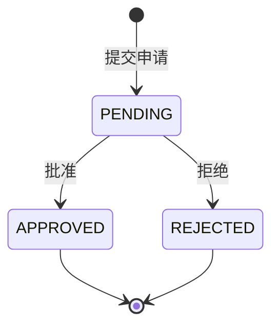
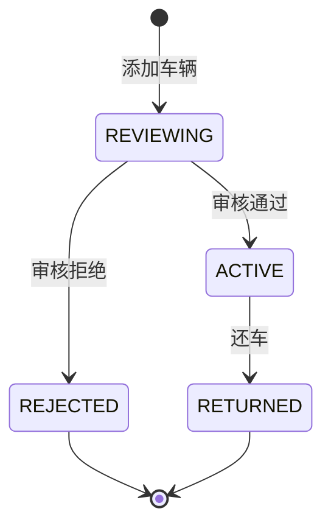

# Design Document: 审批功能完整性测试

## Overview

本设计文档定义了对请假申请、离职审批和车辆审批功能进行全面测试的技术方案。测试将覆盖核心审批流程、权限控制和状态管理，确保系统功能的完整性和正确性。

## Architecture

测试架构基于现有的 pytest 测试框架，使用 SQLite 内存数据库进行隔离测试。

```mermaid
graph TB
    subgraph "测试层"
        T1[请假申请测试]
        T2[离职审批测试]
        T3[车辆审批测试]
        T4[权限控制测试]
    end
    
    subgraph "测试基础设施"
        F[工厂类 factories.py]
        H[辅助函数 helpers.py]
        C[配置 conftest.py]
    end
    
    subgraph "被测系统"
        L[/api/leave 路由]
        V[/api/vehicles 路由]
        M[数据模型]
    end
    
    T1 --> F
    T2 --> F
    T3 --> F
    T4 --> H
    
    F --> L
    F --> V
    H --> L
    H --> V
    
    L --> M
    V --> M
```

## Components and Interfaces

### 测试组件

| 组件 | 职责 | 文件位置 |
|------|------|----------|
| TestLeaveApplication | 请假申请提交测试 | test_leave.py |
| TestLeaveApproval | 请假审批测试 | test_leave.py |
| TestResignApplication | 离职申请测试 | test_leave.py |
| TestVehicleAdd | 车辆添加测试 | test_vehicles.py |
| TestVehicleReview | 车辆审核测试 | test_vehicles.py |
| TestVehicleReturn | 车辆还车测试 | test_vehicles.py |

### API 接口

| 端点 | 方法 | 功能 |
|------|------|------|
| /api/leave | POST | 提交请假/离职申请 |
| /api/leave | GET | 获取申请列表 |
| /api/leave/{id} | GET | 获取申请详情 |
| /api/leave/{id}/approve | PUT | 审批申请 |
| /api/vehicles | POST | 添加车辆 |
| /api/vehicles | GET | 获取车辆列表 |
| /api/vehicles/{id}/review | PUT | 审核车辆 |
| /api/vehicles/{id}/return | POST | 还车操作 |

## Data Models

### 请假申请状态流转



### 车辆状态流转



## Correctness Properties

*A property is a characteristic or behavior that should hold true across all valid executions of a system-essentially, a formal statement about what the system should do. Properties serve as the bridge between human-readable specifications and machine-verifiable correctness guarantees.*

### Property 1: 申请创建状态一致性

*For any* 有效的请假或离职申请数据，提交后系统返回的申请状态应始终为 pending。

**Validates: Requirements 1.1, 2.1**

### Property 2: 审批状态变更正确性

*For any* 待审批的申请（请假或离职），当管理员执行审批操作时，申请状态应正确更新为 approved 或 rejected，且审批人信息应被正确记录。

**Validates: Requirements 2.2, 2.3, 3.1, 3.2**

### Property 3: 司机资源隔离

*For any* 司机用户，查询请假列表或车辆列表时，返回的所有记录的 user_id 应等于该司机的 id。

**Validates: Requirements 1.5, 4.4**

### Property 4: 车辆初始状态一致性

*For any* 有效的车辆信息，添加后系统返回的车辆状态应始终为 reviewing。

**Validates: Requirements 4.1**

### Property 5: 车辆审核状态变更正确性

*For any* 待审核的车辆，当老板执行审核操作时，车辆状态应正确更新为 active（通过）或 rejected（拒绝）。

**Validates: Requirements 5.1, 5.2**

### Property 6: 还车状态变更正确性

*For any* 使用中的车辆，执行还车操作后，车辆状态应更新为 returned。

**Validates: Requirements 6.1, 6.2**

## Error Handling

### 权限错误处理

| 场景 | 预期响应 |
|------|----------|
| 未认证用户访问 | 401 Unauthorized |
| 司机尝试审批 | 403 Forbidden |
| 司机尝试审核车辆 | 403 Forbidden |
| 访问不存在的资源 | 404 Not Found |
| 重复审批已处理的申请 | 400 Bad Request |

### 边界条件

| 场景 | 处理方式 |
|------|----------|
| 结束日期早于开始日期 | 根据当前实现可能接受或拒绝 |
| 车牌号重复 | 返回错误 |

## Testing Strategy

### 测试类型

1. **单元测试**: 验证具体的 API 端点行为
2. **属性测试**: 使用 Hypothesis 库验证通用属性

### 属性测试配置

- 测试框架: pytest + hypothesis
- 最小迭代次数: 100 次
- 每个属性测试需标注对应的设计属性编号

### 测试覆盖范围

| 功能模块 | 单元测试 | 属性测试 |
|----------|----------|----------|
| 请假申请提交 | ✓ | Property 1 |
| 离职申请提交 | ✓ | Property 1 |
| 请假/离职审批 | ✓ | Property 2 |
| 资源隔离 | ✓ | Property 3 |
| 车辆添加 | ✓ | Property 4 |
| 车辆审核 | ✓ | Property 5 |
| 车辆还车 | ✓ | Property 6 |
| 权限控制 | ✓ | - |

### 测试标注格式

```python
# Feature: approval-testing, Property 1: 申请创建状态一致性
# Validates: Requirements 1.1, 2.1
@given(...)
def test_property_application_initial_status(self, ...):
    ...
```
