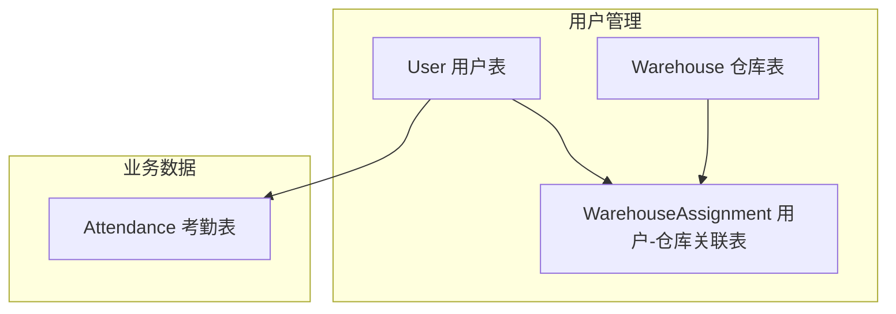
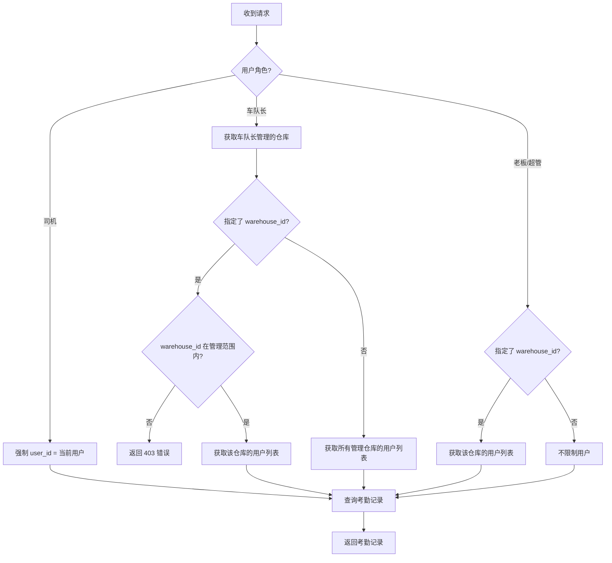

# 考勤功能优化设计

## 系统架构

### 现有架构（保持不变）



### 数据关系

- `User` 通过 `WarehouseAssignment` 关联到 `Warehouse`
- `Attendance` 只关联 `User`，不直接关联 `Warehouse`
- 按仓库筛选考勤时，通过 `WarehouseAssignment` 间接关联

## 详细设计

### 1. 修改考勤列表 API

#### 1.1 接口变更

**端点**：`GET /api/attendance`

**新增参数**：
| 参数 | 类型 | 必填 | 说明 |
|------|------|------|------|
| `warehouse_id` | int | 否 | 按仓库筛选，返回该仓库分配用户的考勤记录 |

**现有参数**（保持不变）：
| 参数 | 类型 | 必填 | 说明 |
|------|------|------|------|
| `user_id` | int | 否 | 按用户筛选 |
| `start_date` | date | 否 | 开始日期 |
| `end_date` | date | 否 | 结束日期 |
| `skip` | int | 否 | 跳过记录数，默认 0 |
| `limit` | int | 否 | 返回记录数上限，默认 100 |

#### 1.2 筛选逻辑



#### 1.3 SQL 查询逻辑

按仓库筛选时的查询逻辑：

```sql
-- 1. 先获取仓库下的用户ID列表
SELECT user_id FROM warehouse_assignments WHERE warehouse_id = :warehouse_id

-- 2. 再查询这些用户的考勤记录
SELECT * FROM attendance WHERE user_id IN (:user_ids)
```

### 2. 权限控制设计

#### 2.1 角色权限矩阵

| 角色 | 查看范围 | warehouse_id 参数 |
|------|----------|-------------------|
| 司机 | 只能查看自己 | 忽略 |
| 车队长 | 管理仓库的用户 | 必须在管理范围内 |
| 调度 | 所有用户 | 可选 |
| 老板 | 所有用户 | 可选 |

#### 2.2 车队长权限验证流程

```python
# 1. 获取车队长管理的仓库
manager_warehouses = crud.get_user_warehouses(session, current_user.id)
manager_warehouse_ids = [w.id for w in manager_warehouses]

# 2. 验证 warehouse_id 参数
if warehouse_id and warehouse_id not in manager_warehouse_ids:
    raise HTTPException(status_code=403, detail="无权查看该仓库的考勤记录")

# 3. 获取允许查看的用户列表
target_warehouse_ids = [warehouse_id] if warehouse_id else manager_warehouse_ids
allowed_user_ids = set()
for wid in target_warehouse_ids:
    warehouse_users = crud.get_warehouse_users(session, wid)
    for user in warehouse_users:
        allowed_user_ids.add(user.id)
```

## 接口变更总结

### 修改接口

| 方法 | 路径 | 变更 |
|------|------|------|
| GET | `/api/attendance` | 新增 `warehouse_id` 可选参数 |

### 不新增接口

本次优化不新增任何 API，复用现有接口。

## CRUD 函数变更

### 修改 `get_attendance_records` 函数

**文件**：`fleet-manager/backend/crud.py`

**新增参数**：
- `user_ids: Optional[List[int]]` - 按用户ID列表筛选

**修改后签名**：
```python
def get_attendance_records(
    session: Session,
    user_id: Optional[int] = None,
    user_ids: Optional[List[int]] = None,  # 新增
    start_date: Optional[date] = None,
    end_date: Optional[date] = None,
    skip: int = 0,
    limit: int = 100
) -> List[Attendance]:
```

## 测试计划

### 单元测试

1. **CRUD 函数测试**
   - 测试 `user_ids` 参数筛选功能
   - 测试 `user_id` 和 `user_ids` 同时传入的情况

2. **API 测试**
   - 测试 `warehouse_id` 参数筛选功能
   - 测试车队长权限控制
   - 测试老板/超管无限制访问

### 集成测试

1. 车队长按仓库筛选考勤正常
2. 车队长访问非管理仓库返回 403
3. 老板按仓库筛选考勤正常
4. 不传 `warehouse_id` 时保持原有逻辑

## 风险评估

| 风险 | 影响 | 缓解措施 |
|------|------|----------|
| API 兼容性 | 低 | 新增参数为可选，不影响现有调用 |
| 性能影响 | 低 | 先查用户列表再查考勤，数据量可控 |
