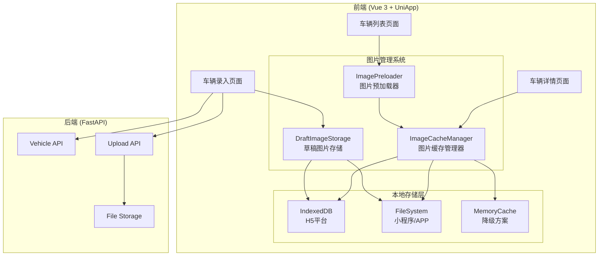
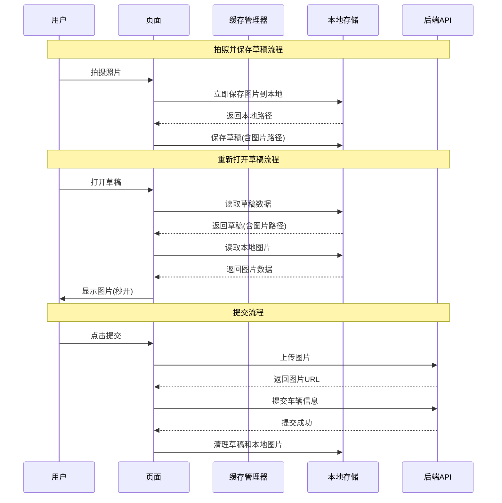

# Design Document: 后端车辆 API 与图片缓存系统

## Overview

本设计文档描述了 fleet-manager 后端系统新增的车辆管理 API 端点，以及前端图片本地缓存系统的技术方案。主要包括：
1. 后端：还车、分配车辆、获取车辆列表等 API
2. 前端：跨平台图片缓存、草稿图片持久化、提交失败恢复

## Architecture

### 系统架构图



### 数据流图



## Components and Interfaces

### 1. 后端 API 接口

#### 1.1 还车 API

```python
@app.put("/api/vehicles/{vehicle_id}/return")
async def return_vehicle(
    vehicle_id: int,
    request: VehicleReturnRequest,
    current_user: User = Depends(get_current_user),
    session: Session = Depends(get_session)
) -> VehicleResponse:
    """
    还车操作
    - 验证车辆归属
    - 存储还车照片
    - 更新车辆状态
    """
```

#### 1.2 分配车辆 API

```python
@app.put("/api/vehicles/{vehicle_id}/assign")
async def assign_vehicle(
    vehicle_id: int,
    request: VehicleAssignRequest,
    current_user: User = Depends(require_management),
    session: Session = Depends(get_session)
) -> VehicleResponse:
    """
    分配车辆给司机
    - 验证管理权限
    - 更新车辆归属
    """
```

#### 1.3 获取所有车辆 API

```python
@app.get("/api/vehicles/all")
async def get_all_vehicles(
    warehouse_id: Optional[int] = None,
    status: Optional[VehicleStatus] = None,
    skip: int = 0,
    limit: int = 100,
    current_user: User = Depends(require_management),
    session: Session = Depends(get_session)
) -> List[VehicleResponse]:
    """
    获取所有车辆（管理员用）
    """
```

#### 1.4 获取仓库车辆 API

```python
@app.get("/api/warehouses/{warehouse_id}/vehicles")
async def get_warehouse_vehicles(
    warehouse_id: int,
    status: Optional[VehicleStatus] = None,
    skip: int = 0,
    limit: int = 100,
    current_user: User = Depends(get_current_user),
    session: Session = Depends(get_session)
) -> List[VehicleResponse]:
    """
    获取仓库下的车辆
    """
```

#### 1.5 图片上传 API

```python
@app.post("/api/upload/image")
async def upload_image(
    file: UploadFile = File(...),
    category: str = Query("vehicle", description="图片分类"),
    current_user: User = Depends(get_current_user)
) -> ImageUploadResponse:
    """
    上传图片文件
    - 验证图片格式和大小
    - 保存到文件存储
    - 返回访问URL
    """
```

#### 1.6 车辆历史 API

```python
@app.get("/api/vehicles/{vehicle_id}/history")
async def get_vehicle_history(
    vehicle_id: int,
    skip: int = 0,
    limit: int = 20,
    current_user: User = Depends(require_management),
    session: Session = Depends(get_session)
) -> List[VehicleHistoryResponse]:
    """
    获取车辆使用历史
    - 返回提车/还车记录
    - 包含照片和时间信息
    - 包含车损照片记录
    """
```

### 2. 前端图片缓存接口

#### 2.1 图片缓存管理器 (ImageCacheManager)

```typescript
/**
 * 图片缓存管理器
 * 提供跨平台的图片缓存功能
 */
interface ImageCacheManager {
  /**
   * 获取图片（优先从缓存）
   * @param url - 图片URL
   * @returns 本地路径或base64
   */
  getImage(url: string): Promise<string>;
  
  /**
   * 缓存图片到本地
   * @param url - 图片URL
   * @param data - 图片数据
   */
  cacheImage(url: string, data: Blob | ArrayBuffer): Promise<void>;
  
  /**
   * 检查缓存是否存在
   * @param url - 图片URL
   */
  hasCache(url: string): Promise<boolean>;
  
  /**
   * 清理过期缓存
   * @param maxAge - 最大缓存时间（毫秒）
   */
  cleanExpiredCache(maxAge: number): Promise<void>;
  
  /**
   * 清理所有缓存
   */
  clearAllCache(): Promise<void>;
  
  /**
   * 获取缓存大小
   */
  getCacheSize(): Promise<number>;
}
```

#### 2.2 草稿图片存储 (DraftImageStorage)

```typescript
/**
 * 草稿图片存储
 * 管理草稿关联的本地图片
 */
interface DraftImageStorage {
  /**
   * 保存图片到草稿目录
   * @param draftId - 草稿ID
   * @param imageData - 图片数据
   * @param filename - 文件名
   * @returns 本地存储路径
   */
  saveImage(draftId: string, imageData: Blob | string, filename: string): Promise<string>;
  
  /**
   * 读取草稿图片
   * @param localPath - 本地路径
   * @returns 图片数据（base64或临时路径）
   */
  readImage(localPath: string): Promise<string>;
  
  /**
   * 删除草稿的所有图片
   * @param draftId - 草稿ID
   */
  deleteDraftImages(draftId: string): Promise<void>;
  
  /**
   * 检查图片是否存在
   * @param localPath - 本地路径
   */
  imageExists(localPath: string): Promise<boolean>;
  
  /**
   * 获取草稿的所有图片路径
   * @param draftId - 草稿ID
   */
  getDraftImagePaths(draftId: string): Promise<string[]>;
}
```

#### 2.3 平台存储适配器 (PlatformStorageAdapter)

```typescript
/**
 * 平台存储适配器接口
 * 不同平台实现此接口
 */
interface PlatformStorageAdapter {
  /** 平台名称 */
  platform: 'h5' | 'weapp' | 'app';
  
  /** 写入文件 */
  writeFile(path: string, data: ArrayBuffer | string): Promise<void>;
  
  /** 读取文件 */
  readFile(path: string): Promise<ArrayBuffer | string>;
  
  /** 删除文件 */
  deleteFile(path: string): Promise<void>;
  
  /** 检查文件是否存在 */
  fileExists(path: string): Promise<boolean>;
  
  /** 列出目录文件 */
  listFiles(directory: string): Promise<string[]>;
  
  /** 获取可用存储空间 */
  getAvailableSpace(): Promise<number>;
  
  /** 创建目录 */
  mkdir(path: string): Promise<void>;
}
```

#### 2.4 照片对比组件 (PhotoCompare)

```typescript
/**
 * 照片对比组件
 * 支持选择2张照片并排对比
 */
interface PhotoCompareProps {
  /** 可选照片列表 */
  photos: PhotoItem[];
  /** 照片类型：basic=7张基本照片, damage=车损照片 */
  type: 'basic' | 'damage';
  /** 对比模式：side=并排, overlay=叠加 */
  mode?: 'side' | 'overlay';
}

interface PhotoItem {
  /** 照片URL */
  url: string;
  /** 照片角度（基本照片用） */
  angle?: 'left_front' | 'right_front' | 'left_rear' | 'right_rear' | 'dashboard' | 'rear_door' | 'cargo_box';
  /** 拍摄时间 */
  takenAt: string;
  /** 来源：pickup=提车, return=还车 */
  source: 'pickup' | 'return';
}
```

#### 2.5 相册连续选择器 (AlbumMultiSelector)

```typescript
/**
 * 相册连续选择器
 * 支持滑动连续选取多张照片
 */
interface AlbumMultiSelectorProps {
  /** 最大选择数量，0表示无限制 */
  maxCount?: number;
  /** 已选照片 */
  selected: string[];
  /** 选择变化回调 */
  onChange: (selected: string[]) => void;
  /** 是否启用滑动选择 */
  enableSwipeSelect?: boolean;
}
```

### 3. 请求/响应模式

#### 3.1 还车请求

```python
class VehicleReturnRequest(BaseModel):
    """还车请求模式"""
    return_photos: List[str] = Field(..., min_length=7, max_length=7, description="还车照片URL（7张）")
    damage_photos: Optional[List[str]] = Field(default=None, description="车损照片URL（无数量限制）")
    return_time: Optional[datetime] = Field(default=None, description="还车时间")
    remark: Optional[str] = Field(default=None, max_length=500, description="备注")
```

#### 3.2 分配车辆请求

```python
class VehicleAssignRequest(BaseModel):
    """分配车辆请求模式"""
    user_id: int = Field(..., description="目标司机ID")
    warehouse_id: Optional[int] = Field(default=None, description="仓库ID")
```

#### 3.3 图片上传响应

```python
class ImageUploadResponse(BaseModel):
    """图片上传响应模式"""
    success: bool = Field(..., description="是否成功")
    url: str = Field(..., description="图片访问URL")
    filename: str = Field(..., description="文件名")
    size: int = Field(..., description="文件大小（字节）")
```

## Data Models

### 1. 车辆模型扩展

```python
class Vehicle(SQLModel, table=True):
    """车辆信息表（扩展字段）"""
    # ... 现有字段 ...
    
    # 新增字段
    warehouse_id: Optional[int] = Field(default=None, foreign_key="warehouses.id", description="所属仓库ID")
    return_photos: Optional[str] = Field(default=None, description="还车照片JSON数组")
    damage_photos: Optional[str] = Field(default=None, description="车损照片JSON数组")
    return_time: Optional[datetime] = Field(default=None, description="还车时间")
    pickup_photos: Optional[str] = Field(default=None, description="提车照片JSON数组")
    pickup_time: Optional[datetime] = Field(default=None, description="提车时间")
```

### 2. 前端草稿数据结构

```typescript
/**
 * 车辆草稿数据结构
 */
interface VehicleDraft {
  /** 草稿ID */
  id: string;
  /** 草稿类型：add=添加车辆, return=还车 */
  type: 'add' | 'return';
  /** 用户ID */
  userId: number;
  /** 车辆ID（还车时使用） */
  vehicleId?: number;
  /** 创建时间 */
  createdAt: string;
  /** 更新时间 */
  updatedAt: string;
  /** 表单数据 */
  formData: {
    licensePlate?: string;
    brand?: string;
    model?: string;
    // ... 其他表单字段
  };
  /** 图片数据 */
  images: {
    /** 行驶证照片（本地路径） */
    licensePhotos: string[];
    /** 车辆照片（本地路径） */
    vehiclePhotos: string[];
    /** 驾驶员证件（本地路径） */
    driverPhotos: string[];
    /** 车损照片（本地路径） */
    damagePhotos: string[];
  };
  /** 已上传的图片URL（用于断点续传） */
  uploadedUrls: {
    [localPath: string]: string;
  };
}
```

### 3. 图片缓存元数据

```typescript
/**
 * 图片缓存元数据
 */
interface ImageCacheMeta {
  /** 原始URL */
  url: string;
  /** 本地存储路径 */
  localPath: string;
  /** 缓存时间 */
  cachedAt: number;
  /** 文件大小 */
  size: number;
  /** 最后访问时间 */
  lastAccessedAt: number;
  /** 访问次数 */
  accessCount: number;
}
```

### 4. 车辆历史记录模型

```python
class VehicleHistory(SQLModel, table=True):
    """车辆使用历史表"""
    id: Optional[int] = Field(default=None, primary_key=True)
    vehicle_id: int = Field(foreign_key="vehicles.id", description="车辆ID")
    user_id: int = Field(foreign_key="users.id", description="司机ID")
    action_type: str = Field(description="操作类型：pickup=提车, return=还车")
    action_time: datetime = Field(description="操作时间")
    photos: Optional[str] = Field(default=None, description="照片JSON数组（7张基本照片）")
    damage_photos: Optional[str] = Field(default=None, description="车损照片JSON数组")
    remark: Optional[str] = Field(default=None, description="备注")
    created_at: datetime = Field(default_factory=datetime.utcnow)
```

```typescript
/**
 * 车辆历史记录响应
 */
interface VehicleHistoryResponse {
  /** 记录ID */
  id: number;
  /** 车辆ID */
  vehicleId: number;
  /** 司机ID */
  userId: number;
  /** 司机姓名 */
  userName: string;
  /** 操作类型 */
  actionType: 'pickup' | 'return';
  /** 操作时间 */
  actionTime: string;
  /** 7张基本照片 */
  photos: {
    leftFront?: string;
    rightFront?: string;
    leftRear?: string;
    rightRear?: string;
    dashboard?: string;
    rearDoor?: string;
    cargoBox?: string;
  };
  /** 车损照片数组 */
  damagePhotos: string[];
  /** 备注 */
  remark?: string;
}
```

## Correctness Properties

*A property is a characteristic or behavior that should hold true across all valid executions of a system-essentially, a formal statement about what the system should do. Properties serve as the bridge between human-readable specifications and machine-verifiable correctness guarantees.*

### Property 1: 车辆归属验证

*For any* 还车请求，如果车辆不属于当前用户，则请求应该返回 403 错误
**Validates: Requirements 1.1, 1.6**

### Property 2: 还车照片数量验证

*For any* 还车请求，return_photos 数组长度必须等于 7，否则返回 400 错误
**Validates: Requirements 1.2**

### Property 3: 还车状态转换

*For any* 成功的还车操作，车辆状态应该从 active 变为 returned
**Validates: Requirements 1.4**

### Property 4: 管理权限验证

*For any* 分配车辆或获取所有车辆请求，如果当前用户不是管理角色，则返回 403 错误
**Validates: Requirements 2.1, 2.6, 3.5**

### Property 5: 分配后归属更新

*For any* 成功的分配操作，车辆的 user_id 应该等于请求中的 user_id
**Validates: Requirements 2.2**

### Property 6: 仓库过滤正确性

*For any* 带 warehouse_id 参数的车辆查询，返回的所有车辆的 warehouse_id 都应该等于查询参数
**Validates: Requirements 3.2, 4.1**

### Property 7: 状态过滤正确性

*For any* 带 status 参数的车辆查询，返回的所有车辆的 status 都应该等于查询参数
**Validates: Requirements 3.3, 4.2**

### Property 8: 缓存读写一致性

*For any* 图片，缓存写入后再读取应该返回相同的图片数据
**Validates: Requirements 7.1, 7.2, 7.3**

### Property 9: 缓存过期清理

*For any* 缓存图片，如果缓存时间超过有效期，则 hasCache 应该返回 false
**Validates: Requirements 7.4**

### Property 10: 草稿图片持久化

*For any* 保存到草稿的图片，重新读取草稿后图片应该能正常显示
**Validates: Requirements 10.1, 10.2, 10.3, 10.4**

### Property 11: 提交失败图片保留

*For any* 提交失败的操作，本地图片文件应该保持不变
**Validates: Requirements 11.1, 11.2**

### Property 12: 断点续传正确性

*For any* 部分上传成功的提交，重试时应该跳过已上传的图片
**Validates: Requirements 11.5**

### Property 13: 相册连续选择正确性

*For any* 滑动选择操作，选中的照片集合应该包含滑动路径上的所有照片
**Validates: Requirements 13.1, 13.2**

### Property 14: 照片对比选择限制

*For any* 照片对比操作，选中的照片数量必须等于 2
**Validates: Requirements 14.2, 14.3**

### Property 15: 车辆历史完整性

*For any* 车辆历史查询，返回的记录应该包含该车辆所有的提车和还车操作
**Validates: Requirements 15.1, 15.2, 15.3**

## Error Handling

### 1. 后端错误处理

| 错误场景 | HTTP 状态码 | 错误信息 |
|---------|------------|---------|
| 车辆不存在 | 404 | "车辆不存在" |
| 无权操作该车辆 | 403 | "无权操作该车辆" |
| 无管理权限 | 403 | "需要管理权限" |
| 目标用户不存在 | 404 | "目标用户不存在" |
| 仓库不存在 | 404 | "仓库不存在" |
| 照片数量不正确 | 400 | "还车照片必须为7张" |
| 图片格式不支持 | 400 | "不支持的图片格式" |
| 图片大小超限 | 400 | "图片大小超过限制（最大10MB）" |

### 2. 前端错误处理

| 错误场景 | 处理方式 |
|---------|---------|
| 本地存储空间不足 | 清理最旧的缓存，提示用户 |
| 图片读取失败 | 显示占位图，提供重试按钮 |
| 草稿图片丢失 | 提示用户重新拍照 |
| 上传失败 | 保存草稿，提示重试 |
| 网络超时 | 自动重试3次，然后保存草稿 |

## Testing Strategy

### 单元测试

使用 pytest 进行后端单元测试：

1. **API 端点测试** - 测试各 API 的正常和异常情况
2. **权限验证测试** - 测试不同角色的访问权限
3. **数据验证测试** - 测试请求参数验证

使用 Vitest 进行前端单元测试：

1. **缓存管理器测试** - 测试缓存读写、过期清理
2. **草稿存储测试** - 测试草稿图片保存和读取
3. **平台适配器测试** - 测试不同平台的存储实现

### Property-Based Testing

使用 Hypothesis (Python) 进行后端属性测试：

1. **车辆归属验证属性** - 生成随机用户和车辆组合
2. **过滤正确性属性** - 生成随机查询参数

使用 fast-check (TypeScript) 进行前端属性测试：

1. **缓存一致性属性** - 生成随机图片数据
2. **草稿持久化属性** - 生成随机草稿数据

### 集成测试

1. **完整还车流程测试** - 从拍照到提交的完整流程
2. **草稿恢复测试** - 模拟退出后重新进入
3. **提交失败恢复测试** - 模拟网络失败后重试

