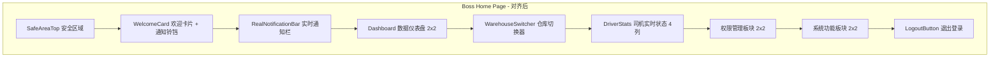
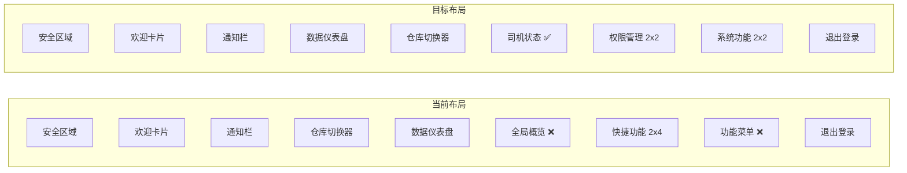

# Design Document: Boss Page Alignment

## Overview

本设计文档描述了 fleet-manager 项目老板端首页与主项目对齐的技术实现方案。主要目标是补充缺失的功能、调整布局结构，使两个项目的老板端首页保持一致的用户体验。

### 设计目标

1. **添加司机实时状态统计**: 在仓库切换器下方显示司机状态
2. **调整功能入口布局**: 分为"权限管理"和"系统功能"两个板块
3. **添加离线模式提示**: 网络异常时显示提示
4. **实现下拉刷新**: 支持下拉刷新数据
5. **添加加载超时处理**: 8秒超时显示提示
6. **移除冗余区域**: 移除全局概览和功能菜单
7. **添加欢迎通知**: 首次访问显示欢迎通知

## Architecture

### 页面布局结构



### 对比：当前布局 vs 目标布局



## Components and Interfaces

### 1. DriverStats 组件（已存在，需集成到老板端）

```typescript
/**
 * 司机实时状态统计组件
 * 显示司机总数、在线、已计件、未计件
 */
interface DriverStatsProps {
  /** 统计数据 */
  stats: DriverStatsData | null
  /** 加载状态 */
  loading: boolean
  /** 当前仓库名称 */
  warehouseName?: string
}

interface DriverStatsData {
  /** 总司机数 */
  totalDrivers: number
  /** 在线司机数 */
  onlineDrivers: number
  /** 已计件司机数 */
  busyDrivers: number
  /** 未计件司机数 */
  idleDrivers: number
}
```

### 2. 离线提示组件

```typescript
/**
 * 离线模式提示组件
 */
interface OfflineIndicatorProps {
  /** 是否显示 */
  visible: boolean
}
```

### 3. 加载超时组件

```typescript
/**
 * 加载超时提示组件
 */
interface LoadTimeoutProps {
  /** 重试回调 */
  onRetry: () => void
}
```

## Data Models

### 页面状态

```typescript
interface BossHomeState {
  /** 加载状态 */
  loading: boolean
  /** 加载超时 */
  loadTimeout: boolean
  /** 离线模式（使用缓存数据） */
  isOffline: boolean
  /** 仓库列表 */
  warehouses: Warehouse[]
  /** 当前仓库索引 */
  currentWarehouseIndex: number
  /** 仪表盘统计 */
  dashboardStats: DashboardStats | null
  /** 司机统计 */
  driverStats: DriverStatsData | null
  /** 未读通知数量 */
  unreadCount: number
}
```

### 功能入口配置

```typescript
// 权限管理功能
const permissionFeatures = [
  { icon: '👥', label: '用户管理', url: '/pages/boss/users/index', color: 'blue' },
  { icon: '🏭', label: '仓库管理', url: '/pages/boss/warehouses/index', color: 'green' },
  { icon: '📂', label: '计件品类', url: '/pages/boss/categories/index', color: 'purple' },
  { icon: '🚗', label: '车辆管理', url: '/pages/boss/vehicles/index', color: 'orange' },
]

// 系统功能
const systemFeatures = [
  { icon: '📈', label: '件数报表', url: '/pages/boss/stats/index', color: 'orange' },
  { icon: '✅', label: '考勤管理', url: '/pages/boss/approval/index', color: 'red' },
  { icon: '🔔', label: '通知中心', url: '/pages/notifications/index', color: 'blue' },
  { icon: '📢', label: '发送通知', url: '/pages/boss/templates/index', color: 'purple' },
]
```

## Correctness Properties

*A property is a characteristic or behavior that should hold true across all valid executions of a system-essentially, a formal statement about what the system should do. Properties serve as the bridge between human-readable specifications and machine-verifiable correctness guarantees.*

### Property 1: 仓库切换数据联动

*For any* 仓库切换操作，切换后司机状态统计应显示对应仓库的数据

**Validates: Requirements 1.3**

### Property 2: 离线模式状态一致性

*For any* 网络请求失败的情况，当使用缓存数据时应显示离线提示，当网络恢复时应隐藏离线提示

**Validates: Requirements 3.1, 3.3**

### Property 3: 下拉刷新并行加载

*For any* 下拉刷新操作，应并行刷新所有统计数据（仪表盘、司机状态、仓库列表）

**Validates: Requirements 4.2**

### Property 4: 加载超时触发

*For any* 数据加载操作，当加载时间超过 8 秒时应显示超时提示页面

**Validates: Requirements 5.1**

### Property 5: 欢迎通知首次显示

*For any* 用户访问，首次访问时应显示欢迎通知，再次访问时不应显示

**Validates: Requirements 7.1, 7.3**

## Error Handling

### 网络异常

- 当 API 请求失败时，使用本地缓存数据
- 显示离线模式提示
- 网络恢复后自动刷新数据

### 加载超时

- 设置 8 秒超时计时器
- 超时后显示超时提示页面
- 提供重试按钮

### 数据加载失败

- 显示错误提示 Toast
- 记录错误日志
- 提供重试机制

## Testing Strategy

### 单元测试

使用 Vitest 进行单元测试：

1. **组件渲染测试**: 验证司机状态组件在不同数据下的渲染
2. **状态管理测试**: 验证离线状态、超时状态的切换
3. **事件处理测试**: 验证下拉刷新、重试按钮的处理

### 属性测试

使用 fast-check 进行属性测试：

1. **仓库切换测试**: 验证切换仓库后数据正确更新
2. **超时测试**: 验证超时逻辑正确触发
3. **欢迎通知测试**: 验证首次/再次访问的通知显示逻辑

