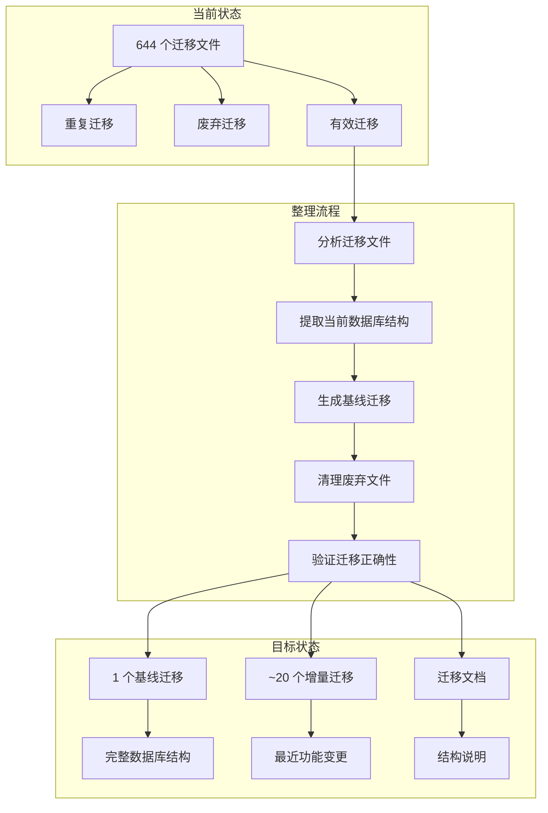
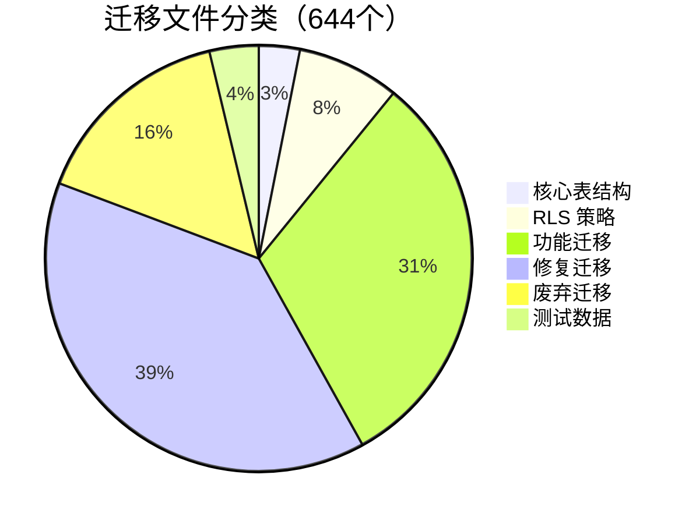

# Design Document - 数据库迁移整理

## Overview

本设计文档描述如何将 644 个 Supabase 迁移文件合并为一个干净的基线迁移，同时保留必要的增量迁移。整理后的迁移目录将更易于维护和部署。

## Architecture

### 整体架构



### 迁移文件分类



## Components and Interfaces

### 1. 迁移分析器 (Migration Analyzer)

**职责**: 分析现有迁移文件，分类并识别可删除的文件

**接口**:
```typescript
interface MigrationAnalyzer {
  // 分析所有迁移文件
  analyzeAll(): MigrationAnalysisResult;
  
  // 识别重复迁移
  findDuplicates(): DuplicateMigration[];
  
  // 识别废弃迁移
  findDeprecated(): DeprecatedMigration[];
  
  // 识别有效迁移
  findValid(): ValidMigration[];
}

interface MigrationAnalysisResult {
  total: number;
  duplicates: number;
  deprecated: number;
  valid: number;
  toDelete: string[];
  toKeep: string[];
}
```

### 2. 基线生成器 (Baseline Generator)

**职责**: 从当前数据库结构生成基线迁移

**接口**:
```typescript
interface BaselineGenerator {
  // 提取当前数据库结构
  extractSchema(): DatabaseSchema;
  
  // 生成基线迁移 SQL
  generateBaseline(schema: DatabaseSchema): string;
  
  // 验证基线迁移
  validateBaseline(sql: string): ValidationResult;
}

interface DatabaseSchema {
  tables: TableDefinition[];
  indexes: IndexDefinition[];
  functions: FunctionDefinition[];
  triggers: TriggerDefinition[];
  policies: PolicyDefinition[];
  enums: EnumDefinition[];
}
```

### 3. 迁移验证器 (Migration Validator)

**职责**: 验证迁移合并的正确性

**接口**:
```typescript
interface MigrationValidator {
  // 对比两个数据库结构
  compareSchemas(before: DatabaseSchema, after: DatabaseSchema): SchemaDiff;
  
  // 验证 RLS 策略
  validatePolicies(): PolicyValidationResult;
  
  // 验证函数和触发器
  validateFunctions(): FunctionValidationResult;
  
  // 生成差异报告
  generateDiffReport(diff: SchemaDiff): string;
}
```

### 4. 文档生成器 (Documentation Generator)

**职责**: 生成数据库结构文档

**接口**:
```typescript
interface DocumentationGenerator {
  // 生成表结构文档
  generateTableDocs(tables: TableDefinition[]): string;
  
  // 生成 RLS 策略文档
  generatePolicyDocs(policies: PolicyDefinition[]): string;
  
  // 生成函数文档
  generateFunctionDocs(functions: FunctionDefinition[]): string;
  
  // 更新 README
  updateReadme(): void;
}
```

## Data Models

### 迁移文件分类

```typescript
// 迁移文件类型
type MigrationType = 
  | 'core_table'      // 核心表结构
  | 'rls_policy'      // RLS 策略
  | 'function'        // 函数/触发器
  | 'test_data'       // 测试数据
  | 'fix'             // 修复迁移
  | 'deprecated';     // 废弃迁移

// 迁移文件信息
interface MigrationFile {
  filename: string;
  number: string;
  type: MigrationType;
  description: string;
  createdAt: Date;
  isDeprecated: boolean;
  isDuplicate: boolean;
  duplicateOf?: string;
}

// 废弃迁移规则
const DEPRECATED_PATTERNS = [
  /^99999_/,           // 临时修复
  /tenant_id/,         // 多租户相关
  /boss_id/,           // 多租户相关
  /lease_admin/,       // 租赁管理员相关
  /tenant_schema/,     // 租户 schema 相关
  /multi_tenant/,      // 多租户相关
];
```

### 数据库结构模型

```typescript
// 表定义
interface TableDefinition {
  name: string;
  columns: ColumnDefinition[];
  primaryKey: string[];
  foreignKeys: ForeignKeyDefinition[];
  indexes: string[];
}

// 列定义
interface ColumnDefinition {
  name: string;
  type: string;
  nullable: boolean;
  defaultValue?: string;
  comment?: string;
}

// RLS 策略定义
interface PolicyDefinition {
  name: string;
  table: string;
  command: 'SELECT' | 'INSERT' | 'UPDATE' | 'DELETE' | 'ALL';
  roles: string[];
  using?: string;
  withCheck?: string;
}

// 函数定义
interface FunctionDefinition {
  name: string;
  parameters: ParameterDefinition[];
  returnType: string;
  language: string;
  body: string;
  securityDefiner: boolean;
}
```

## Correctness Properties

*A property is a characteristic or behavior that should hold true across all valid executions of a system-essentially, a formal statement about what the system should do. Properties serve as the bridge between human-readable specifications and machine-verifiable correctness guarantees.*

### Property 1: 基线迁移结构完整性

*For any* 空数据库，执行基线迁移后，数据库结构应与当前生产环境完全一致（包括所有表、列、索引、函数、触发器、RLS 策略）。

**Validates: Requirements 1.1, 1.2**

### Property 2: 迁移文件数量减少

*For any* 清理操作完成后，迁移文件数量应从 644 个减少到 50 个以内。

**Validates: Requirements 2.4**

### Property 3: 增量迁移注释完整性

*For any* 保留的增量迁移文件，文件开头应包含清晰的注释说明（功能描述、创建日期、相关需求）。

**Validates: Requirements 3.3**

### Property 4: 迁移验证完整性

*For any* 迁移验证操作，应能检测并报告所有数据库对象的差异（表、列、索引、函数、触发器、RLS 策略）。

**Validates: Requirements 4.1, 4.2, 4.3**

## Error Handling

### 迁移执行失败

1. **语法错误**: 记录错误位置和原因，提供修复建议
2. **依赖缺失**: 检测缺失的依赖对象，建议执行顺序
3. **权限不足**: 提示需要的数据库权限
4. **回滚方案**: 提供回滚 SQL 脚本

### 验证失败

1. **结构差异**: 生成详细的差异报告
2. **RLS 策略缺失**: 列出缺失的策略并提供创建 SQL
3. **函数签名不匹配**: 对比函数定义并提供修复建议

## Testing Strategy

### 单元测试

1. **迁移分析器测试**
   - 测试重复迁移识别
   - 测试废弃迁移识别
   - 测试有效迁移识别

2. **基线生成器测试**
   - 测试 SQL 生成正确性
   - 测试特殊字符处理
   - 测试大型表结构处理

### 属性测试

使用 Vitest 进行属性测试：

1. **Property 1 测试**: 在测试数据库上执行基线迁移，对比结构
2. **Property 2 测试**: 执行清理脚本，验证文件数量
3. **Property 3 测试**: 检查所有增量迁移文件的注释
4. **Property 4 测试**: 模拟结构差异，验证检测能力

### 集成测试

1. **端到端迁移测试**
   - 在空数据库上执行完整迁移流程
   - 验证所有功能正常工作

2. **回滚测试**
   - 测试迁移失败后的回滚流程
   - 验证数据库状态恢复

## Implementation Notes

### 执行顺序

1. **备份**: 先备份当前迁移目录
2. **分析**: 运行迁移分析器，生成分析报告
3. **提取**: 从生产数据库提取当前结构
4. **生成**: 生成基线迁移文件
5. **验证**: 在测试环境验证基线迁移
6. **清理**: 删除废弃迁移文件
7. **文档**: 生成数据库文档

### 风险控制

1. **备份策略**: 清理前完整备份迁移目录
2. **渐进式清理**: 分批删除，每批验证
3. **回滚能力**: 保留备份，支持快速回滚

