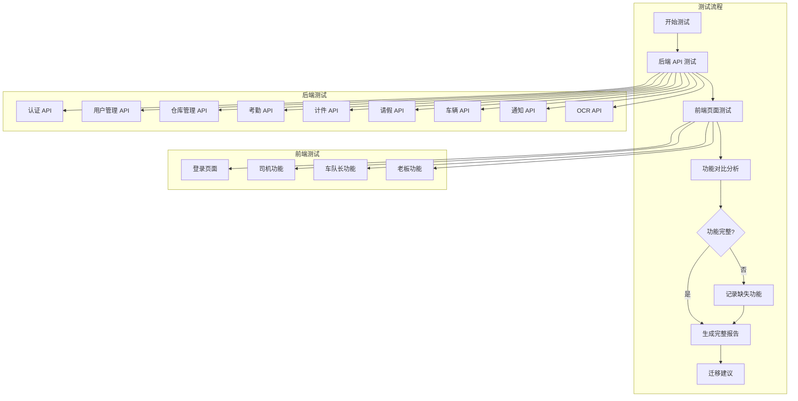

# Design Document

## Overview

本设计文档描述 fleet-manager 新框架（FastAPI + UniApp Vue 3）的深度功能测试方案，以及与主项目（Taro + Supabase）的功能对比验证。

### 测试目标
1. 验证 fleet-manager 后端 API 的完整性和正确性
2. 验证 fleet-manager 前端页面的功能完整性
3. 对比两个系统的功能差异，生成功能对比报告
4. 根据测试结果决定是否可以用新框架替代主项目

### 技术栈对比

| 层级 | 主项目 (Taro) | 新框架 (fleet-manager) |
|------|--------------|----------------------|
| 前端框架 | Taro 4.1.5 + React 18 | UniApp + Vue 3 |
| 后端服务 | Supabase (BaaS) | FastAPI + SQLModel |
| 数据库 | PostgreSQL (Supabase) | SQLite/PostgreSQL |
| 认证 | Supabase Auth | JWT Token |
| 实时通知 | Supabase Realtime | SSE (Server-Sent Events) |
| 部署 | Supabase + Capacitor | Docker |

## Architecture



## Components and Interfaces

### 1. 后端 API 测试组件

#### 1.1 认证 API 测试
- **POST /api/auth/login** - 用户登录
- **GET /api/auth/me** - 获取当前用户
- **PUT /api/auth/password** - 修改密码

#### 1.2 用户管理 API 测试
- **GET /api/users** - 获取用户列表
- **POST /api/users** - 创建用户
- **GET /api/users/{id}** - 获取用户详情
- **PUT /api/users/{id}** - 更新用户
- **DELETE /api/users/{id}** - 删除用户

#### 1.3 仓库管理 API 测试
- **GET /api/warehouses** - 获取仓库列表
- **POST /api/warehouses** - 创建仓库
- **GET /api/warehouses/{id}** - 获取仓库详情
- **PUT /api/warehouses/{id}** - 更新仓库
- **DELETE /api/warehouses/{id}** - 删除仓库
- **POST /api/warehouses/{id}/assign** - 分配用户
- **GET /api/warehouses/{id}/users** - 获取仓库用户

#### 1.4 考勤 API 测试
- **POST /api/attendance/clock-in** - 上班打卡
- **POST /api/attendance/clock-out** - 下班打卡
- **GET /api/attendance/today** - 获取今日打卡状态
- **GET /api/attendance** - 获取考勤记录

#### 1.5 计件 API 测试
- **GET /api/piece-work/categories** - 获取分类列表
- **POST /api/piece-work/categories** - 创建分类
- **PUT /api/piece-work/categories/{id}** - 更新分类
- **GET /api/piece-work/records** - 获取计件记录
- **POST /api/piece-work/records** - 录入计件
- **PUT /api/piece-work/records/{id}** - 更新记录
- **DELETE /api/piece-work/records/{id}** - 删除记录
- **GET /api/piece-work/stats** - 获取统计

#### 1.6 请假 API 测试
- **GET /api/leave** - 获取请假列表
- **POST /api/leave** - 提交请假申请
- **GET /api/leave/{id}** - 获取请假详情
- **PUT /api/leave/{id}/approve** - 审批请假

#### 1.7 车辆 API 测试
- **GET /api/vehicles** - 获取车辆列表
- **POST /api/vehicles** - 添加车辆
- **GET /api/vehicles/{id}** - 获取车辆详情
- **PUT /api/vehicles/{id}** - 更新车辆
- **PUT /api/vehicles/{id}/review** - 审核车辆
- **POST /api/vehicles/{id}/documents** - 上传证件

#### 1.8 通知 API 测试
- **GET /api/notifications** - 获取通知列表
- **POST /api/notifications** - 发送通知
- **PUT /api/notifications/{id}/read** - 标记已读
- **GET /api/notifications/unread-count** - 获取未读数量
- **GET /api/notifications/stream** - SSE 实时推送

#### 1.9 OCR API 测试
- **POST /api/ocr/driving-license** - 驾驶证识别
- **GET /api/ocr/status** - OCR 服务状态

#### 1.10 健康检查 API 测试
- **GET /api/health** - 健康检查
- **GET /api/health/live** - 存活检查
- **GET /api/health/ready** - 就绪检查

### 2. 前端页面测试组件

#### 2.1 页面结构对比

| 功能模块 | 主项目页面 | 新框架页面 |
|---------|-----------|-----------|
| 登录 | /pages/login | /pages/login |
| 首页 | /pages/index | /pages/index |
| 司机打卡 | /pages/driver/clock-in | /pages/driver/clock |
| 司机考勤 | /pages/driver/attendance | /pages/driver/attendance |
| 司机计件 | /pages/driver/piece-work | /pages/driver/piece-work |
| 司机请假 | /pages/driver/leave | /pages/driver/leave |
| 司机车辆 | /pages/driver/vehicle-list | /pages/driver/vehicle |
| 车队长司机管理 | /pages/manager/driver-management | /pages/manager/drivers |
| 车队长审批 | /pages/manager/leave-approval | /pages/manager/approval |
| 车队长统计 | /pages/manager/piece-work-report | /pages/manager/stats |
| 老板用户管理 | /pages/super-admin/user-management | /pages/boss/users |
| 老板仓库管理 | /pages/super-admin/warehouse-management | /pages/boss/warehouses |
| 老板车辆审核 | /pages/super-admin/vehicle-management | /pages/boss/vehicles |
| 老板分类管理 | /pages/super-admin/category-management | /pages/boss/categories |
| 通知 | /pages/common/notifications | /pages/notifications |
| 个人中心 | /pages/profile | /pages/profile |

### 3. 功能对比组件

#### 3.1 角色权限对比

| 角色 | 主项目 | 新框架 | 状态 |
|------|--------|--------|------|
| 司机 (DRIVER) | ✅ | ✅ | 已实现 |
| 车队长 (MANAGER) | ✅ | ✅ | 已实现 |
| 老板 (BOSS) | ✅ | ✅ | 已实现 |
| **调度 (PEER_ADMIN)** | ✅ | ❌ | **必须实现** |
| **超级管理员 (SUPER_ADMIN)** | ✅ | ❌ | **必须实现** |

#### 3.2 功能模块对比

| 功能 | 主项目 | 新框架 | 状态 | 备注 |
|------|--------|--------|------|------|
| 用户认证 | ✅ | ✅ | 已实现 | |
| 用户管理 | ✅ | ✅ | 已实现 | |
| 仓库管理 | ✅ | ✅ | 已实现 | |
| 考勤打卡 | ✅ | ✅ | 已实现 | |
| 计件录入 | ✅ | ✅ | 已实现 | |
| 请假审批 | ✅ | ✅ | 已实现 | |
| 车辆管理 | ✅ | ✅ | 已实现 | |
| 车辆审核 | ✅ | ✅ | 已实现 | |
| 通知系统 | ✅ | ✅ | 已实现 | |
| 实时推送 | ✅ (Supabase Realtime) | ✅ (SSE) | 已实现 | |
| OCR 识别 | ✅ | ✅ | 已实现 | |
| 多租户 | ✅ | ❌ | 可选 | 单租户场景可不需要 |
| **热更新** | ✅ | ❌ | **必须实现** | 移动端热更新功能 |
| **补录照片** | ✅ | ❌ | **必须实现** | 车辆照片补录功能 |
| **车辆租赁** | ✅ | ❌ | **必须实现** | 车辆租赁信息管理 |
| **定时通知** | ✅ | ❌ | **必须实现** | 定时发送通知功能 |
| **通知模板** | ✅ | ❌ | **必须实现** | 通知模板管理 |
| **调度角色** | ✅ | ❌ | **必须实现** | PEER_ADMIN 角色 |
| **超级管理员角色** | ✅ | ❌ | **必须实现** | SUPER_ADMIN 角色 |

### 3.3 必须补充实现的功能清单

以下功能是新框架必须实现的，否则无法替代主项目：

1. **热更新功能**
   - 移动端 App 热更新机制
   - 版本管理和更新检测
   - 增量更新包下载和应用

2. **补录照片功能**
   - 车辆照片补录标记
   - 补录照片元数据管理
   - 补录照片显示和编辑

3. **车辆租赁功能**
   - 租赁信息管理（租金、租期、缴费日）
   - 租金到期提醒
   - 租赁历史记录

4. **定时通知功能**
   - 定时任务调度
   - 通知发送计划
   - 定时任务管理

5. **通知模板功能**
   - 通知模板 CRUD
   - 模板变量替换
   - 模板分类管理

6. **调度角色 (PEER_ADMIN)**
   - 角色权限定义
   - 调度员功能页面
   - 权限控制实现

7. **超级管理员角色 (SUPER_ADMIN)**
   - 角色权限定义
   - 超级管理员功能页面
   - 系统级管理功能

## Data Models

### 主项目数据模型 (Supabase)

```typescript
// 用户相关
interface User {
  id: string
  phone: string
  name: string
  role: 'BOSS' | 'PEER_ADMIN' | 'MANAGER' | 'DRIVER'
  tenant_id: string
  // ... 更多字段
}

// 车辆相关
interface Vehicle {
  id: string
  plate_number: string
  brand: string
  driver_id: string
  review_status: 'pending' | 'approved' | 'rejected'
  // ... 更多字段
}
```

### 新框架数据模型 (SQLModel)

```python
# 用户模型
class User(SQLModel, table=True):
    id: int
    username: str
    name: str
    phone: str
    role: UserRole  # DRIVER, MANAGER, BOSS
    is_active: bool

# 车辆模型
class Vehicle(SQLModel, table=True):
    id: int
    user_id: int
    license_plate: str
    brand: str
    status: VehicleStatus  # PENDING, APPROVED, REJECTED
```

## Correctness Properties

*A property is a characteristic or behavior that should hold true across all valid executions of a system-essentially, a formal statement about what the system should do. Properties serve as the bridge between human-readable specifications and machine-verifiable correctness guarantees.*

由于本测试任务主要是功能验证和对比分析，大部分验收标准是具体的功能测试用例，不适合属性测试。以下是可验证的属性：

### Property 1: API 响应格式一致性
*For any* API 请求，返回的响应格式应该符合 OpenAPI 规范定义的 schema
**Validates: Requirements 1.1-1.10**

### Property 2: 权限控制正确性
*For any* 需要权限的 API 请求，未授权用户应该收到 401 或 403 错误
**Validates: Requirements 1.2, 1.3, 1.5, 1.6, 1.7, 1.8**

### Property 3: 数据完整性
*For any* 创建操作后，查询应该能返回刚创建的数据
**Validates: Requirements 1.2, 1.3, 1.4, 1.5, 1.6, 1.7, 1.8**

## Error Handling

### API 测试错误处理
1. **连接失败**：记录错误，标记测试失败
2. **认证失败**：检查 Token 是否正确
3. **权限不足**：验证是否符合预期
4. **数据验证失败**：检查请求参数

### 前端测试错误处理
1. **页面加载失败**：记录错误，截图保存
2. **元素未找到**：增加等待时间或检查选择器
3. **操作超时**：重试或标记失败

## Testing Strategy

### 1. 后端 API 测试策略

使用 Python 的 `httpx` 或 `requests` 库进行 API 测试：

```python
import httpx

# 测试登录
def test_login():
    response = httpx.post(
        "http://localhost:8000/api/auth/login",
        json={"username": "admin", "password": "admin123"}
    )
    assert response.status_code == 200
    assert "access_token" in response.json()
```

### 2. 前端页面测试策略

使用手动测试或 Playwright 进行 E2E 测试：

```typescript
// 测试登录页面
test('login page', async ({ page }) => {
  await page.goto('http://localhost:5173');
  await page.fill('input[name="username"]', 'admin');
  await page.fill('input[name="password"]', 'admin123');
  await page.click('button[type="submit"]');
  await expect(page).toHaveURL(/.*index/);
});
```

### 3. 功能对比测试策略

1. 列出主项目所有功能
2. 逐一验证新框架是否实现
3. 记录差异和缺失功能
4. 生成对比报告

### 4. 测试环境准备

```bash
# 启动新框架后端
cd fleet-manager/backend
python -m venv venv
.\venv\Scripts\activate
pip install -r requirements.txt
python main.py

# 启动新框架前端
cd fleet-manager/frontend
npm install
npm run dev:h5
```

### 5. 测试检查清单

#### 后端 API 测试
- [ ] 认证 API 测试通过
- [ ] 用户管理 API 测试通过
- [ ] 仓库管理 API 测试通过
- [ ] 考勤 API 测试通过
- [ ] 计件 API 测试通过
- [ ] 请假 API 测试通过
- [ ] 车辆 API 测试通过
- [ ] 通知 API 测试通过
- [ ] OCR API 测试通过
- [ ] 健康检查 API 测试通过

#### 前端页面测试
- [ ] 登录页面测试通过
- [ ] 司机功能测试通过
- [ ] 车队长功能测试通过
- [ ] 老板功能测试通过
- [ ] 通知功能测试通过
- [ ] 个人中心测试通过

#### 功能对比
- [ ] 角色权限对比完成
- [ ] 功能模块对比完成
- [ ] 数据模型对比完成
- [ ] 缺失功能列表生成

