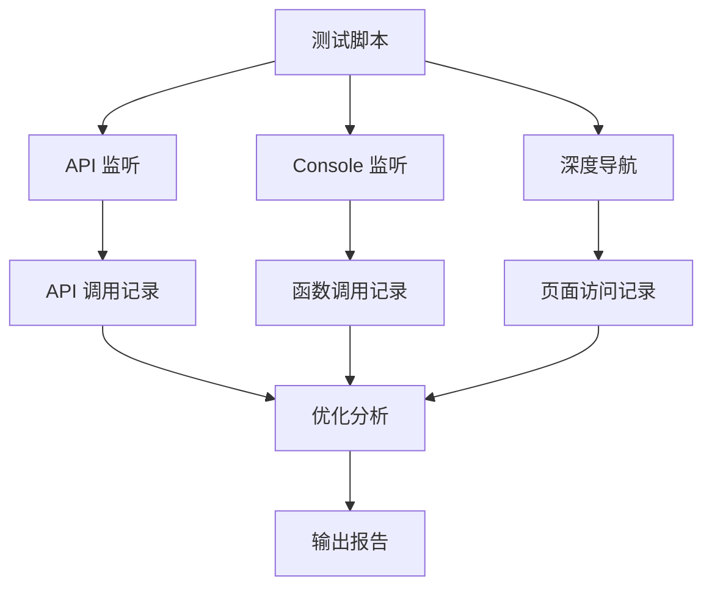

# Design Document - 司机端深度测试与代码优化分析

## Overview

深度 E2E 测试脚本，遍历司机端所有页面到最终界面，记录 API 调用和函数调用，并分析代码是否为最优解。

## Architecture



## 完整测试路径

### 路径 1: 登录流程
```
登录页 → 司机工作台
```

### 路径 2: 计件录入
```
工作台 → 计件录入 → 返回
```

### 路径 3: 考勤打卡
```
工作台 → 考勤打卡 → 返回
```

### 路径 4: 请假申请（深度）
```
工作台 → 请假申请 → 申请请假 → 返回 → 离职申请 → 返回 → 返回
```

### 路径 5: 车辆管理（深度）
```
工作台 → 车辆列表 → 添加车辆 → 驾照OCR → 返回 → 返回
                  → 车辆详情(如有车辆) → 编辑车辆 → 返回
                                      → 补充照片 → 返回
                                      → 归还车辆 → 返回
                                      → 返回
                  → 返回
```

### 路径 6: 数据统计
```
工作台 → 计件记录 → 返回
工作台 → 仓库统计 → 返回
工作台 → 考勤记录 → 返回
```

### 路径 7: 通知中心
```
工作台 → 通知中心 → 返回
```

### 路径 8: 个人中心（深度）
```
工作台 → 个人中心 → 个人资料 → 返回
                 → 设置 → 返回
                 → 账号管理 → 修改手机号 → 返回
                           → 修改密码 → 返回
                           → 返回
                 → 帮助中心 → 返回
                 → 返回
```

## 数据模型

### ApiCall - API 调用记录

```typescript
interface ApiCall {
  table: string      // 表名或操作类型
  method: string     // HTTP 方法
  status: number     // 状态码
  duration: number   // 耗时(ms)
  timestamp: number  // 时间戳
}
```

### FunctionCall - 函数调用记录

```typescript
interface FunctionCall {
  name: string       // 函数名
  timestamp: number  // 时间戳
  args?: string      // 参数（可选）
}
```

### PageVisit - 页面访问记录

```typescript
interface PageVisit {
  name: string           // 页面名称
  path: string           // 页面路径
  depth: number          // 深度层级
  apiCalls: ApiCall[]    // API 调用
  functionCalls: FunctionCall[]  // 函数调用
  issues: string[]       // 发现的问题
}
```

## 优化分析规则

### 1. 重复请求检测

```typescript
// 同一页面内，同一 API 被调用 2 次以上
if (sameApiCallCount >= 2) {
  issues.push(`重复请求: ${table} 被调用 ${count} 次`)
}
```

### 2. 请求过多检测

```typescript
// 页面加载时 API 调用超过 10 次
if (apiCalls.length > 10) {
  issues.push(`请求过多: 共 ${apiCalls.length} 次 API 调用`)
}
```

### 3. 慢请求检测

```typescript
// API 响应时间超过 500ms
if (duration > 500) {
  issues.push(`慢请求: ${table} 耗时 ${duration}ms`)
}
```

### 4. N+1 查询检测

```typescript
// 短时间内对同一表发起多次请求
if (sameTableCallsInShortTime >= 3) {
  issues.push(`疑似 N+1 查询: ${table}`)
}
```

## 输出报告格式

```
═══════════════════════════════════════════════════════════
📊 司机端深度测试报告
═══════════════════════════════════════════════════════════

📍 测试概览
───────────────────────────────────────────────────────────
总页面数: 15
总 API 调用: 120
总函数调用: 45
发现问题: 8

📄 各页面详情
───────────────────────────────────────────────────────────
✅ 登录页面 (/pages/login/index)
   API 调用: 5
   - auth:token (POST) 200 652ms
   - users (GET) 200 394ms
   函数调用: 3
   - handleLogin
   - validateForm
   - redirectToHome
   ⚠️ 问题: 无

✅ 车辆管理 (/pages/driver/vehicle-list)
   API 调用: 3
   - vehicles (GET) 200 155ms
   - vehicles (GET) 200 120ms  ← 重复
   函数调用: 2
   - fetchVehicles
   - fetchVehicles  ← 重复调用
   ⚠️ 问题:
   - 重复请求: vehicles 被调用 2 次

🔧 优化建议
───────────────────────────────────────────────────────────
1. 车辆管理页面存在重复请求，建议检查 useEffect 依赖
2. 计件录入页面 API 调用过多(25次)，建议合并请求
3. 登录页面 auth:user 被调用 4 次，建议缓存结果

📈 代码质量评分: 75/100
───────────────────────────────────────────────────────────
- API 效率: 70/100 (存在重复请求)
- 响应速度: 85/100 (大部分请求 <200ms)
- 代码复用: 75/100 (部分函数重复调用)
```

## Testing Strategy

直接运行 E2E 测试，观察控制台输出和生成的报告。
