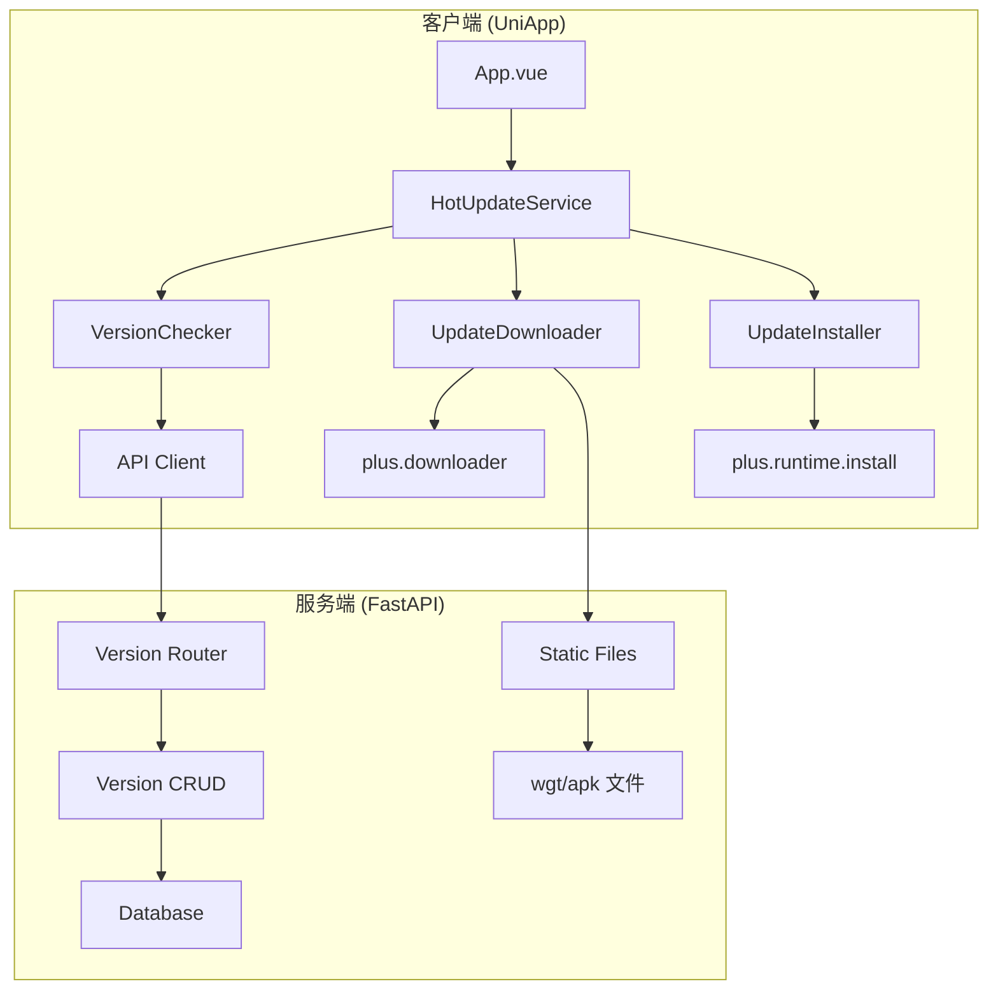
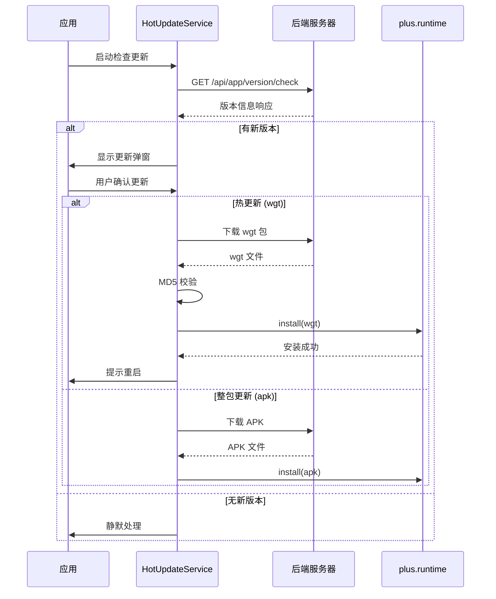

# Design Document: 热更新系统

## Overview

热更新系统为车队管家应用提供无需重新安装即可更新前端资源的能力。系统支持两种更新模式：

1. **热更新（wgt 包）**：仅更新前端资源，用户无感知，适用于小版本迭代
2. **整包更新（APK）**：需要下载完整安装包，适用于原生代码变更

系统采用客户端-服务器架构，后端提供版本管理 API，前端负责检测、下载和安装更新。

## Architecture



### 更新流程



## Components and Interfaces

### 1. 前端组件

#### HotUpdateService (热更新服务)

主服务类，协调版本检查、下载和安装流程。

```typescript
interface HotUpdateService {
  // 检查更新（启动时自动调用）
  checkUpdateOnLaunch(): Promise<void>;
  
  // 手动检查更新
  checkForUpdate(): Promise<UpdateCheckResult | null>;
  
  // 显示更新弹窗
  showUpdateDialog(updateInfo: UpdateCheckResult): void;
  
  // 下载并安装更新
  downloadAndInstall(updateInfo: UpdateCheckResult): Promise<void>;
}
```

#### VersionChecker (版本检查器)

负责与后端通信，获取版本信息。

```typescript
interface VersionChecker {
  // 获取当前应用版本信息
  getCurrentVersion(): VersionInfo;
  
  // 向服务器检查更新
  checkVersion(currentVersion: VersionInfo): Promise<UpdateCheckResult>;
}

interface VersionInfo {
  versionName: string;    // 如 "1.2.0"
  versionCode: number;    // 如 120
  platform: 'android' | 'ios' | 'h5';
}
```

#### UpdateDownloader (更新下载器)

负责下载更新包，支持进度回调。

```typescript
interface UpdateDownloader {
  // 下载更新包
  download(
    url: string,
    onProgress: (progress: DownloadProgress) => void
  ): Promise<string>;  // 返回本地文件路径
  
  // 验证文件 MD5
  verifyMD5(filePath: string, expectedMD5: string): Promise<boolean>;
}

interface DownloadProgress {
  downloaded: number;   // 已下载字节数
  total: number;        // 总字节数
  percent: number;      // 百分比 0-100
}
```

#### UpdateInstaller (更新安装器)

负责安装更新包。

```typescript
interface UpdateInstaller {
  // 安装 wgt 热更新包
  installWgt(filePath: string): Promise<InstallResult>;
  
  // 安装 APK 整包
  installApk(filePath: string): Promise<void>;
  
  // 重启应用
  restart(): void;
}

interface InstallResult {
  success: boolean;
  error?: string;
}
```

### 2. 后端组件

#### Version Router (版本路由)

提供版本管理 API 端点。

```python
# API 端点
GET  /api/app/version/check    # 检查更新
GET  /api/app/version/latest   # 获取最新版本
POST /api/app/version          # 发布新版本（管理员）
GET  /api/app/version/history  # 版本历史
POST /api/app/version/upload   # 上传更新包
```

#### Version CRUD (版本数据操作)

数据库操作层。

```python
class VersionCRUD:
    def create_version(self, version: VersionCreate) -> Version
    def get_latest_version(self, platform: str) -> Version | None
    def get_version_history(self, platform: str, limit: int) -> list[Version]
    def increment_download_count(self, version_id: int) -> None
    def check_update(self, current_code: int, platform: str) -> UpdateCheckResponse
```

## Data Models

### 前端类型定义

```typescript
/** 更新检查请求 */
interface UpdateCheckRequest {
  current_version: string;      // 当前版本名称
  current_version_code: number; // 当前版本号
  platform: 'android' | 'ios' | 'h5';
}

/** 更新检查响应 */
interface UpdateCheckResult {
  has_update: boolean;          // 是否有更新
  update_type?: 'wgt' | 'apk';  // 更新类型
  latest_version?: string;      // 最新版本名称
  latest_version_code?: number; // 最新版本号
  download_url?: string;        // 下载地址
  file_size?: number;           // 文件大小（字节）
  md5?: string;                 // MD5 校验值
  description?: string;         // 更新说明
  is_force_update?: boolean;    // 是否强制更新
  min_compatible_version?: number; // 最低兼容版本
}
```

### 后端数据模型

```python
class AppVersion(SQLModel, table=True):
    """应用版本表"""
    __tablename__ = "app_versions"
    
    id: int = Field(primary_key=True)
    version_name: str           # 版本名称，如 "1.2.0"
    version_code: int           # 版本号，如 120
    platform: str               # 平台：android, ios
    update_type: str            # 更新类型：wgt, apk
    download_url: str           # 下载地址
    file_size: int              # 文件大小（字节）
    md5: str                    # MD5 校验值
    description: str | None     # 更新说明
    is_force_update: bool       # 是否强制更新
    min_compatible_version: int # 最低兼容版本号
    download_count: int         # 下载次数
    is_active: bool             # 是否启用
    created_at: datetime        # 创建时间
    created_by: int | None      # 创建人ID
```

### API 响应 Schema

```python
class VersionCheckRequest(BaseModel):
    """版本检查请求"""
    current_version: str
    current_version_code: int
    platform: str  # android, ios, h5

class VersionCheckResponse(BaseModel):
    """版本检查响应"""
    has_update: bool
    update_type: str | None = None  # wgt, apk
    latest_version: str | None = None
    latest_version_code: int | None = None
    download_url: str | None = None
    file_size: int | None = None
    md5: str | None = None
    description: str | None = None
    is_force_update: bool = False

class VersionCreate(BaseModel):
    """创建版本请求"""
    version_name: str
    version_code: int
    platform: str
    update_type: str
    download_url: str
    file_size: int
    md5: str
    description: str | None = None
    is_force_update: bool = False
    min_compatible_version: int = 0
```

## Correctness Properties

*A property is a characteristic or behavior that should hold true across all valid executions of a system—essentially, a formal statement about what the system should do. Properties serve as the bridge between human-readable specifications and machine-verifiable correctness guarantees.*

### Property 1: 版本比较正确性

*For any* 两个版本号 A 和 B，当 A.version_code < B.version_code 时，版本检查应返回 has_update: true；当 A.version_code >= B.version_code 时，应返回 has_update: false。

**Validates: Requirements 2.1, 8.2, 8.3**

### Property 2: 版本检查请求完整性

*For any* 版本检查请求，请求体必须包含 current_version（字符串）、current_version_code（整数）和 platform（字符串）三个字段。

**Validates: Requirements 1.3**

### Property 3: 版本检查响应完整性

*For any* 有更新的版本检查响应，响应必须包含 has_update、update_type、latest_version、latest_version_code、download_url、file_size、md5、description、is_force_update 字段，且 update_type 值为 "wgt" 或 "apk"。

**Validates: Requirements 8.1, 8.4, 8.5**

### Property 4: 错误处理静默性

*For any* 网络请求失败的情况，热更新系统不应抛出未捕获的异常，且应记录错误日志。

**Validates: Requirements 1.4**

### Property 5: 最低兼容版本逻辑

*For any* 客户端版本低于服务器配置的 min_compatible_version 时，update_type 必须为 "apk"（整包更新）。

**Validates: Requirements 2.6**

### Property 6: MD5 校验正确性

*For any* 文件和其对应的 MD5 值，verifyMD5 函数应在文件内容匹配时返回 true，不匹配时返回 false。

**Validates: Requirements 3.2**

### Property 7: 版本数据持久化完整性

*For any* 创建的版本记录，数据库中必须存储 version_name、version_code、platform、update_type、download_url、md5、is_force_update、created_at 字段。

**Validates: Requirements 7.1, 7.2**

### Property 8: 平台筛选正确性

*For any* 按平台筛选的版本查询，返回结果中所有版本的 platform 字段必须与查询参数一致。

**Validates: Requirements 7.3**

### Property 9: 下载统计累加正确性

*For any* 版本下载操作，该版本的 download_count 应增加 1。

**Validates: Requirements 7.4**

## Error Handling

### 前端错误处理

| 错误场景 | 处理方式 |
|---------|---------|
| 网络请求失败 | 静默处理，记录日志，不影响用户使用 |
| wgt 下载失败 | 提示用户，允许重试或跳过 |
| MD5 校验失败 | 提示下载失败，建议重新下载 |
| wgt 安装失败 | 提示错误，建议整包更新 |
| APK 下载失败 | 提示用户，支持断点续传 |

### 后端错误处理

| 错误场景 | HTTP 状态码 | 响应内容 |
|---------|------------|---------|
| 版本不存在 | 200 | `{ has_update: false }` |
| 参数缺失 | 422 | 验证错误详情 |
| 无权限发布版本 | 403 | 权限不足 |
| 文件上传失败 | 500 | 上传失败原因 |

## Testing Strategy

### 单元测试

1. **版本比较逻辑测试**
   - 测试各种版本号组合的比较结果
   - 测试边界情况（相同版本、版本号为 0）

2. **MD5 校验测试**
   - 测试正确 MD5 返回 true
   - 测试错误 MD5 返回 false

3. **API 响应格式测试**
   - 测试有更新时的响应格式
   - 测试无更新时的响应格式

### 属性测试（Property-Based Testing）

使用 Hypothesis (Python) 进行属性测试：

1. **Property 1**: 生成随机版本号对，验证比较逻辑
2. **Property 3**: 生成随机版本数据，验证响应完整性
3. **Property 5**: 生成随机版本号和最低兼容版本，验证更新类型
4. **Property 7**: 生成随机版本数据，验证持久化完整性
5. **Property 8**: 生成随机平台和版本数据，验证筛选正确性

### 集成测试

1. **完整更新流程测试**
   - 模拟版本检查 → 下载 → 安装流程
   
2. **API 端点测试**
   - 测试所有版本管理 API 端点

### 测试配置

- 属性测试最少运行 100 次迭代
- 使用 pytest + hypothesis 进行后端测试
- 每个属性测试标注对应的设计属性编号
