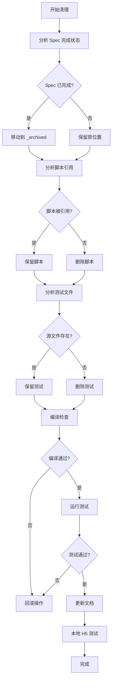

# Design Document

## Overview

本设计文档描述项目清理和归档的详细方案。清理范围包括：
1. 已完成的 Spec 文档归档
2. 临时脚本删除
3. 不再需要的测试文件清理
4. 项目文档更新

所有删除操作必须遵循严格的关联性扫描和深度测试流程，确保不影响现有功能。

## Architecture



## Components and Interfaces

### 1. Spec 归档组件

**功能**：分析 Spec 完成状态并归档已完成的 Spec

**输入**：
- Spec 目录路径
- tasks.md 文件内容

**输出**：
- 归档后的 Spec 目录结构

**规则**：
- 检查 tasks.md 中所有任务是否标记为 `[x]`
- 已完成的 Spec 移动到 `.kiro/specs/_archived/`
- 保留 requirements.md、design.md、tasks.md
- 删除临时报告文件（*_SUMMARY.md、*_REPORT.md 等）

### 2. 脚本清理组件

**功能**：识别和删除不再需要的临时脚本

**核心脚本列表（必须保留）**：
- `quick-deploy-h5.js` - 热更新部署
- `setup-database.js` - 数据库初始化
- `rollback-version.js` - 版本回滚
- `encoding-utils.js` - 编码工具
- `dev-local.ps1` - 本地开发
- `dev-rebuild.ps1` - 重新构建
- `deploy.bat` - 部署脚本
- `checkAuth.sh` - 认证检查
- `checkNavigation.sh` - 导航检查

**临时脚本列表（可删除）**：
- `add-*.js` - 一次性数据库字段添加脚本
- `debug-*.js` - 调试脚本
- `check-*.js` - 检查脚本
- `fix-*.js` - 修复脚本
- `migrate-*.js` - 迁移脚本
- `execute-*.js` - 执行脚本
- `test-*.js` - 测试脚本
- `delete-*.js` - 删除脚本
- `list-*.js` - 列表脚本
- `refresh-*.js` - 刷新脚本
- `run-migration*.js` - 迁移运行脚本
- `supabase-sql-exec.js` - SQL 执行脚本
- `db-migrate-direct.js` - 直接迁移脚本

### 3. 测试文件清理组件

**功能**：识别和清理不再需要的测试文件

**当前测试文件**：
- `src/utils/permissionInference.test.ts` - 权限推断测试（保留）
- `src/utils/notificationDebounce.test.ts` - 通知防抖测试（保留）
- `src/utils/taroCompat.test.ts` - Taro 兼容层测试（保留）
- `src/services/permission-test.ts` - 权限测试（检查是否需要）
- `src/db/helpers.test.ts` - 数据库辅助函数测试（保留）
- `src/db/api/vehicles.test.ts` - 车辆 API 测试（保留）
- `src/components/SupplementedBadge/index.test.tsx` - 补录标记组件测试（保留）

### 4. 文档更新组件

**功能**：更新项目文档以反映清理后的状态

**需要更新的文档**：
- `README.md` - 项目说明
- `CHANGELOG.md` - 变更日志
- `scripts/README.md` - 脚本说明

## Data Models

### Spec 状态模型

```typescript
interface SpecStatus {
  name: string;           // Spec 名称
  path: string;           // Spec 路径
  isCompleted: boolean;   // 是否已完成
  totalTasks: number;     // 总任务数
  completedTasks: number; // 已完成任务数
  hasDesign: boolean;     // 是否有设计文档
  hasRequirements: boolean; // 是否有需求文档
  hasTasks: boolean;      // 是否有任务文档
  extraFiles: string[];   // 额外文件列表
}
```

### 脚本分类模型

```typescript
interface ScriptCategory {
  core: string[];      // 核心脚本（必须保留）
  temporary: string[]; // 临时脚本（可删除）
  unknown: string[];   // 未分类脚本（需人工确认）
}
```

## Correctness Properties

*A property is a characteristic or behavior that should hold true across all valid executions of a system-essentially, a formal statement about what the system should do. Properties serve as the bridge between human-readable specifications and machine-verifiable correctness guarantees.*

由于本清理任务主要是文件系统操作和人工验证流程，大部分验收标准不适合自动化属性测试。以下是可验证的属性：

### Property 1: 编译完整性
*For any* 删除操作后的代码库状态，运行 TypeScript 编译应该无错误
**Validates: Requirements 2.3, 5.1**

### Property 2: 测试完整性
*For any* 删除操作后的代码库状态，运行测试套件应该全部通过
**Validates: Requirements 3.3, 5.2**

### Property 3: 核心脚本保留
*For any* 清理操作后的 scripts 目录，核心脚本列表中的所有脚本应该仍然存在
**Validates: Requirements 2.5**

## Error Handling

### 删除失败处理

1. **文件被占用**：等待并重试，最多 3 次
2. **权限不足**：记录错误，跳过该文件
3. **路径不存在**：记录警告，继续处理

### 回滚策略

1. **编译失败**：使用 git 恢复删除的文件
2. **测试失败**：使用 git 恢复删除的文件
3. **功能异常**：使用 git 恢复到清理前的状态

```bash
# 回滚命令
git checkout HEAD -- <deleted-file-path>
```

## Testing Strategy

### 验证流程

1. **每次删除后**：
   - 运行 `npx tsc --noEmit`
   - 运行 `npx vitest run`

2. **批量删除后**：
   - 运行 `pnpm taro build --type h5`
   - 启动本地服务器测试

3. **最终验证**：
   - 测试登录功能
   - 测试车辆管理功能
   - 测试审核流程
   - 测试热更新功能

### 测试检查清单

- [ ] TypeScript 编译无错误
- [ ] 所有单元测试通过
- [ ] H5 构建成功
- [ ] 登录功能正常
- [ ] 车辆列表加载正常
- [ ] 车辆详情显示正常
- [ ] 审核流程正常
- [ ] 补录功能正常
