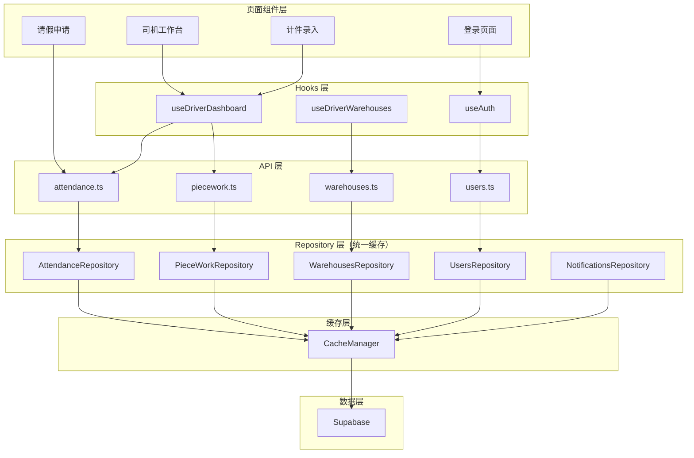
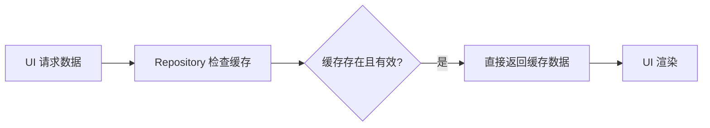
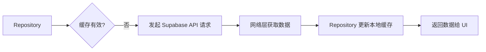
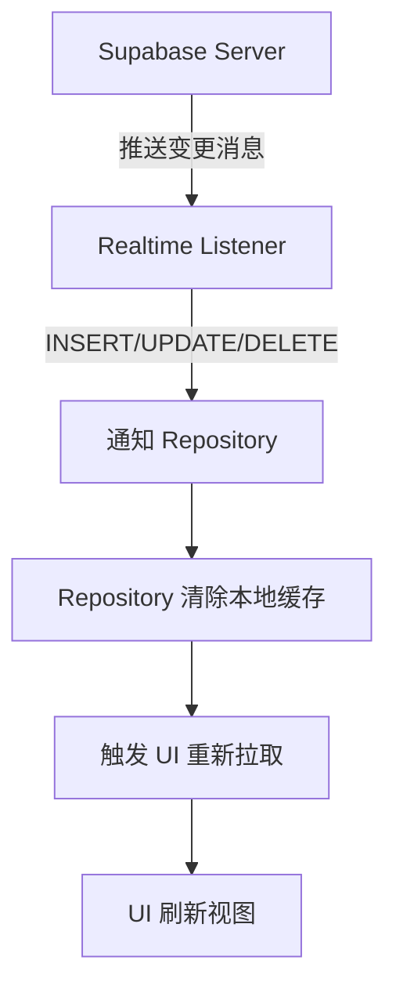
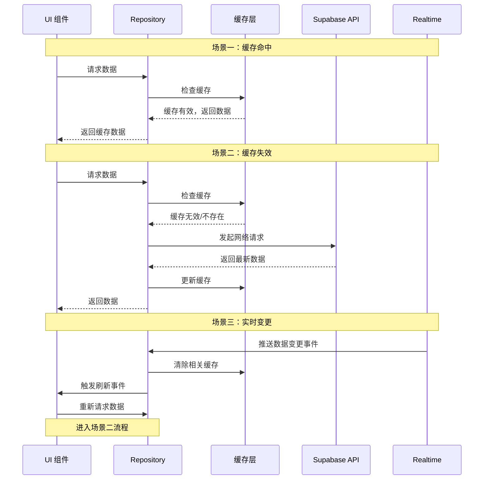
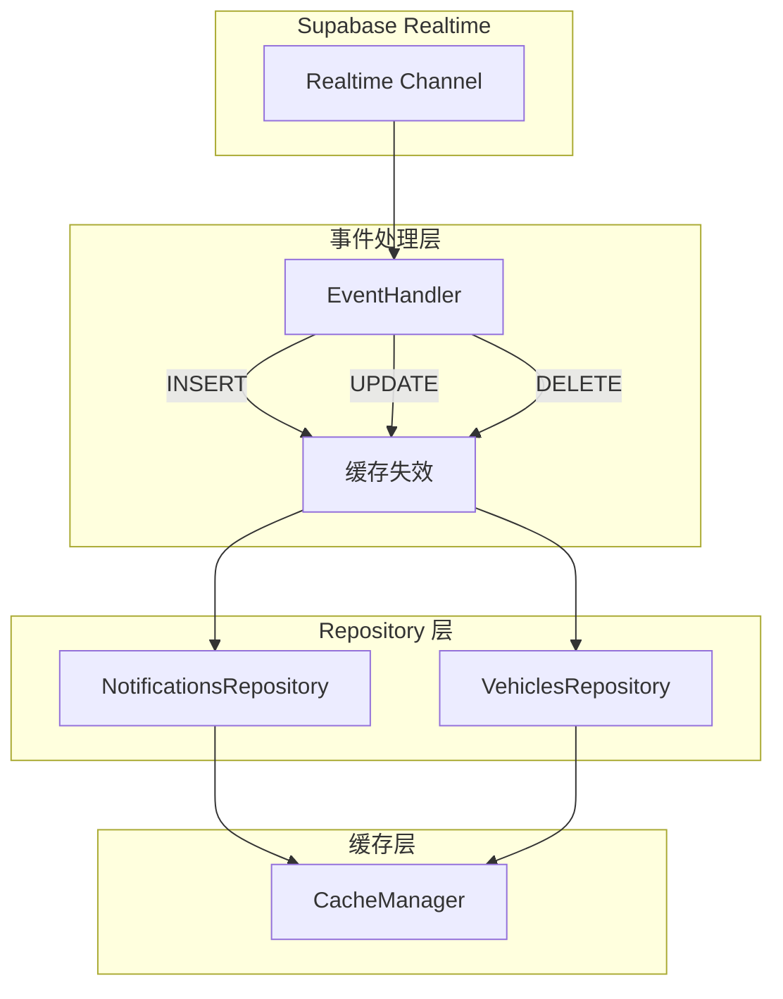

# Design Document - Repository 模式全局实现

## Overview

本设计文档描述如何将 Repository 模式全局应用到整个数据访问层，通过统一的缓存管理减少 API 重复调用，提升应用性能。

### 目标
- 登录页面 API 调用从 33 次减少到 15 次以内
- 代码质量评分从 37/100 提升到 80/100 以上
- 重复请求从 38 处减少到 10 处以内

### 现状分析

当前项目中：
- 已有 Repository：`CategoriesRepository`、`LeaveRepository`、`VehiclesRepository`、`UsersRepository`、`DashboardRepository`、`StatsRepository`
- 未使用 Repository 的高频 API：`attendance`、`piece_work_records`、`warehouses`、`warehouse_assignments`、`notifications`
- 问题：页面组件直接调用 API 函数，API 函数直接使用 `supabase.from()`，没有共享缓存

## Architecture



## Components and Interfaces

### 1. 新增 Repository 类

#### AttendanceRepository
```typescript
/**
 * 考勤 Repository
 * 缓存 TTL: 2 分钟
 */
export class AttendanceRepository extends BaseRepository<AttendanceEntity> {
  constructor() {
    super({
      tableName: 'attendance',
      cachePrefix: 'attendance',
      defaultTTL: 2 * 60 * 1000 // 2 分钟
    })
  }
  
  // 获取用户今日考勤
  async getTodayAttendance(userId: string): Promise<Attendance | null>
  
  // 获取用户月度考勤
  async getMonthlyAttendance(userId: string, year: number, month: number): Promise<Attendance[]>
  
  // 获取用户考勤统计
  async getAttendanceStats(userId: string, startDate: string, endDate: string): Promise<AttendanceStats>
}
```

#### PieceWorkRepository
```typescript
/**
 * 计件记录 Repository
 * 缓存 TTL: 2 分钟
 */
export class PieceWorkRepository extends BaseRepository<PieceWorkRecordEntity> {
  constructor() {
    super({
      tableName: 'piece_work_records',
      cachePrefix: 'piece_work',
      defaultTTL: 2 * 60 * 1000 // 2 分钟
    })
  }
  
  // 获取用户计件记录
  async getByUser(userId: string, startDate?: string, endDate?: string): Promise<PieceWorkRecord[]>
  
  // 获取仓库计件记录
  async getByWarehouse(warehouseId: string, startDate?: string, endDate?: string): Promise<PieceWorkRecord[]>
}
```

#### WarehousesRepository
```typescript
/**
 * 仓库 Repository
 * 缓存 TTL: 10 分钟
 */
export class WarehousesRepository extends BaseRepository<WarehouseEntity> {
  constructor() {
    super({
      tableName: 'warehouses',
      cachePrefix: 'warehouses',
      defaultTTL: 10 * 60 * 1000 // 10 分钟
    })
  }
  
  // 获取所有仓库
  async getAllWarehouses(): Promise<Warehouse[]>
  
  // 获取司机的仓库列表
  async getDriverWarehouses(driverId: string): Promise<Warehouse[]>
  
  // 获取管理员的仓库列表
  async getManagerWarehouses(managerId: string): Promise<Warehouse[]>
}
```

#### WarehouseAssignmentsRepository
```typescript
/**
 * 仓库分配 Repository
 * 缓存 TTL: 5 分钟
 */
export class WarehouseAssignmentsRepository extends BaseRepository<WarehouseAssignmentEntity> {
  constructor() {
    super({
      tableName: 'warehouse_assignments',
      cachePrefix: 'warehouse_assignments',
      defaultTTL: 5 * 60 * 1000 // 5 分钟
    })
  }
  
  // 获取用户的仓库分配
  async getByUser(userId: string): Promise<WarehouseAssignment[]>
  
  // 获取仓库的用户分配
  async getByWarehouse(warehouseId: string): Promise<WarehouseAssignment[]>
}
```

#### NotificationsRepository
```typescript
/**
 * 通知 Repository
 * 缓存 TTL: 1 分钟
 */
export class NotificationsRepository extends BaseRepository<NotificationEntity> {
  constructor() {
    super({
      tableName: 'notifications',
      cachePrefix: 'notifications',
      defaultTTL: 1 * 60 * 1000 // 1 分钟
    })
  }
  
  // 获取用户通知
  async getByUser(userId: string, limit?: number): Promise<Notification[]>
  
  // 获取未读通知数量
  async getUnreadCount(userId: string): Promise<number>
}
```

### 2. 缓存配置表

| Repository | 表名 | 缓存前缀 | TTL | 说明 |
|------------|------|----------|-----|------|
| UsersRepository | users | users | 5 分钟 | 用户信息变化不频繁 |
| AttendanceRepository | attendance | attendance | 2 分钟 | 考勤数据需要较新 |
| PieceWorkRepository | piece_work_records | piece_work | 2 分钟 | 计件数据需要较新 |
| WarehousesRepository | warehouses | warehouses | 10 分钟 | 仓库信息很少变化 |
| WarehouseAssignmentsRepository | warehouse_assignments | warehouse_assignments | 5 分钟 | 分配关系变化不频繁 |
| NotificationsRepository | notifications | notifications | 1 分钟 | 通知需要实时性 |
| CategoriesRepository | piece_work_categories | categories | 10 分钟 | 品类信息很少变化 |
| LeaveRepository | leave_applications | leave | 2 分钟 | 请假数据需要较新 |
| VehiclesRepository | vehicles | vehicles | 5 分钟 | 车辆信息变化不频繁 |

### 3. API 层迁移接口

迁移后的 API 函数保持原有签名，内部调用 Repository：

```typescript
// attendance.ts
export async function getTodayAttendance(userId: string): Promise<Attendance | null> {
  return attendanceRepository.getTodayAttendance(userId)
}

// warehouses.ts
export async function getDriverWarehouses(driverId: string): Promise<Warehouse[]> {
  return warehousesRepository.getDriverWarehouses(driverId)
}
```

## Data Models

### 实体类型定义

```typescript
// 考勤实体
interface AttendanceEntity extends BaseEntity {
  user_id: string
  date: string
  clock_in_time?: string
  clock_out_time?: string
  status: 'present' | 'absent' | 'late' | 'leave'
}

// 计件记录实体
interface PieceWorkRecordEntity extends BaseEntity {
  user_id: string
  warehouse_id: string
  category_id: string
  work_date: string
  quantity: number
  unit_price: number
  total_amount: number
}

// 仓库分配实体
interface WarehouseAssignmentEntity extends BaseEntity {
  user_id: string
  warehouse_id: string
}

// 通知实体
interface NotificationEntity extends BaseEntity {
  user_id: string
  type: string
  title: string
  content: string
  is_read: boolean
}
```

## Correctness Properties

*A property is a characteristic or behavior that should hold true across all valid executions of a system-essentially, a formal statement about what the system should do. Properties serve as the bridge between human-readable specifications and machine-verifiable correctness guarantees.*

### Property 1: Repository 配置正确性
*For any* Repository 实例，其 tableName、cachePrefix 和 defaultTTL 配置应该与设计文档中的配置表一致。
**Validates: Requirements 1.2, 4.1**

### Property 2: 缓存优先查询
*For any* Repository 查询操作，如果缓存中存在有效数据（未过期），应该返回缓存数据而不发起数据库查询。
**Validates: Requirements 1.3, 3.2, 3.3**

### Property 3: 写操作缓存失效
*For any* Repository 写操作（创建、更新、删除），执行成功后相关缓存应该被清除，下次查询应该从数据库获取最新数据。
**Validates: Requirements 1.4, 4.2**

### Property 4: 登录页面 API 调用次数
*For any* 登录成功后的页面加载，API 调用总次数应该不超过 15 次。
**Validates: Requirements 3.1**

### Property 5: 登出缓存清理
*For any* 用户登出操作，所有用户相关的缓存数据应该被清除。
**Validates: Requirements 4.3**

### Property 6: Realtime 事件触发缓存失效
*For any* Realtime 数据变更事件（INSERT/UPDATE/DELETE），相关的缓存数据应该被立即清除，下次查询应该从数据库获取最新数据。
**Validates: Requirements 1.4, 4.2**

### Property 7: 写操作立即失效
*For any* Repository 写操作，缓存失效应该在写操作成功后立即执行，不依赖 Realtime 事件。
**Validates: Requirements 1.4**

## Realtime 订阅与缓存失效机制

### 设计原则

Realtime 订阅和缓存机制需要协同工作，确保：
1. **数据一致性**：实时更新不会与缓存数据冲突
2. **性能优化**：在保证实时性的同时，充分利用缓存减少 API 调用
3. **资源效率**：避免不必要的数据库查询和网络请求

### 三种数据流场景

系统中存在三种不同的数据流场景，每种场景有不同的处理逻辑：

#### 场景一：缓存命中（本地路径 - 性能最优）

**流程逻辑**：当用户进入页面或调用接口时，系统首先检查本地（Repository层）是否有有效缓存。



**数据流向**：
```
[UI 请求数据] → [Repository 检查缓存] → [缓存存在且有效] → [直接返回缓存数据给 UI]
```

**特点**：
- ✅ 不涉及网络请求
- ✅ 响应速度最快（毫秒级）
- ✅ 性能最优的情况
- ⚠️ 数据可能不是最新的（在 TTL 范围内）

#### 场景二：缓存失效/首次加载（网络路径）

**流程逻辑**：如果本地没有缓存（或缓存过期），Repository 必须从远程获取数据。



**数据流向**：
```
[Repository] → [发起 Supabase API 请求] → [网络层获取数据] → [Repository 更新本地缓存] → [返回数据给 UI]
```

**特点**：
- ✅ 获取最新数据
- ✅ 数据初始化的源头
- ⚠️ 需要网络请求，有延迟
- ⚠️ 消耗网络资源和 API 配额

#### 场景三：实时变更事件（监听路径 - 被动数据流）

**流程逻辑**：这是 Supabase 的核心能力。当数据库发生变化时，Realtime 服务会主动推送消息。



**数据流向**：
```
[Supabase Server] → [推送变更消息 (Insert/Update/Delete)] → [Realtime Listener 监听到] → [通知 Repository] → [Repository 清除/更新本地缓存] → [触发 UI 重新拉取/刷新视图]
```

**特点**：
- ✅ 实时性高，数据变更立即感知
- ✅ "监听"是独立于"请求"的被动数据流
- ✅ 无需轮询，节省资源
- ⚠️ 需要维护 WebSocket 连接
- ⚠️ 只适用于需要高实时性的数据

### 三种场景的协同工作



### 不同数据类型的实时性要求

| 数据类型 | 实时性要求 | 缓存策略 | Realtime 订阅 |
|----------|-----------|----------|---------------|
| 通知 (notifications) | 高 | TTL: 1 分钟 | ✅ 订阅 INSERT/UPDATE |
| 考勤 (attendance) | 中 | TTL: 2 分钟 | ❌ 不订阅，依赖缓存 |
| 计件记录 (piece_work_records) | 中 | TTL: 2 分钟 | ❌ 不订阅，依赖缓存 |
| 车辆状态 (vehicles) | 中 | TTL: 5 分钟 | ✅ 订阅 UPDATE（状态变更） |
| 仓库分配 (warehouse_assignments) | 低 | TTL: 5 分钟 | ❌ 不订阅，依赖缓存 |
| 仓库信息 (warehouses) | 低 | TTL: 10 分钟 | ❌ 不订阅，依赖缓存 |
| 品类价格 (category_prices) | 低 | TTL: 10 分钟 | ❌ 不订阅，依赖缓存 |

### 事件驱动缓存失效机制



### 实现方案

#### 1. Realtime 事件监听器

```typescript
/**
 * Realtime 事件处理器
 * 监听数据库变更事件，触发缓存失效
 */
class RealtimeCacheInvalidator {
  private channel: RealtimeChannel | null = null
  
  /**
   * 初始化 Realtime 订阅
   * @param userId - 当前用户 ID
   */
  async initialize(userId: string): Promise<void> {
    this.channel = supabase
      .channel(`cache-invalidation-${userId}`)
      // 监听通知表变更
      .on('postgres_changes', {
        event: '*',
        schema: 'public',
        table: 'notifications',
        filter: `user_id=eq.${userId}`
      }, (payload) => {
        this.handleNotificationChange(payload)
      })
      // 监听车辆状态变更
      .on('postgres_changes', {
        event: 'UPDATE',
        schema: 'public',
        table: 'vehicles'
      }, (payload) => {
        this.handleVehicleChange(payload)
      })
      .subscribe()
  }
  
  /**
   * 处理通知变更
   * 清除通知相关缓存
   */
  private handleNotificationChange(payload: RealtimePostgresChangesPayload<any>): void {
    // 清除通知缓存（使用 public 方法）
    notificationsRepository.clearAllCache()
    // 触发 UI 更新事件
    eventBus.emit('notifications:updated')
  }
  
  /**
   * 处理车辆变更
   * 清除车辆相关缓存
   */
  private handleVehicleChange(payload: RealtimePostgresChangesPayload<any>): void {
    const vehicleId = payload.new?.id || payload.old?.id
    if (vehicleId) {
      vehiclesRepository.clearCacheByKey(`id_${vehicleId}`)
    }
    // 触发 UI 更新事件
    eventBus.emit('vehicles:updated', { vehicleId })
  }
  
  /**
   * 清理订阅
   */
  async cleanup(): Promise<void> {
    if (this.channel) {
      await supabase.removeChannel(this.channel)
      this.channel = null
    }
  }
}
```

#### 2. Repository 缓存失效接口

```typescript
/**
 * BaseRepository 扩展缓存失效方法
 * 注意：现有 BaseRepository 的 invalidateCache() 是 protected 方法
 * 需要添加 public 方法供外部调用（如 RealtimeCacheInvalidator）
 */
abstract class BaseRepository<T> {
  // 现有的 protected 方法（内部使用）
  protected invalidateCache(): void {
    clearCacheByPrefix(this.cachePrefix)
  }
  
  /**
   * 公开的缓存失效方法（供外部调用）
   * 使整个 Repository 的缓存失效
   */
  public clearAllCache(): void {
    this.invalidateCache()
  }
  
  /**
   * 使特定 key 的缓存失效
   * @param key - 缓存 key
   */
  public clearCacheByKey(key: string): void {
    clearCache(`${this.cachePrefix}_${key}`)
  }
  
  /**
   * 使特定用户的缓存失效
   * @param userId - 用户 ID
   */
  public clearCacheByUser(userId: string): void {
    clearCacheByPrefix(`${this.cachePrefix}_user_${userId}`)
  }
}
```

**注意**：现有 `BaseRepository` 中的 `invalidateCache()` 是 `protected` 方法，需要添加 `public` 包装方法：
- `clearAllCache()` - 清除该 Repository 的所有缓存
- `clearCacheByKey(key)` - 清除特定 key 的缓存
- `clearCacheByUser(userId)` - 清除特定用户的缓存

#### 3. 缓存与 Realtime 协同策略

```typescript
/**
 * 数据获取策略
 * 优先使用缓存，Realtime 事件触发缓存失效
 */
async function getNotifications(userId: string): Promise<Notification[]> {
  // 1. 尝试从缓存获取
  const cached = await notificationsRepository.getByUser(userId)
  
  // 2. 如果缓存命中，直接返回
  // Realtime 事件会在数据变更时自动清除缓存
  return cached
}

/**
 * 写操作策略
 * 写入后立即清除缓存，不等待 Realtime 事件
 */
async function markNotificationAsRead(notificationId: string): Promise<boolean> {
  // 1. 执行写操作
  const success = await notificationsRepository.update(notificationId, { is_read: true })
  
  // 2. 写操作成功后立即清除缓存（不等待 Realtime）
  if (success) {
    notificationsRepository.invalidateCacheByKey(notificationId)
  }
  
  return success
}
```

### 最佳实践

#### 1. 避免缓存与 Realtime 冲突

```typescript
// ❌ 错误：Realtime 更新直接修改缓存
channel.on('postgres_changes', { ... }, (payload) => {
  // 直接修改缓存可能导致数据不一致
  cache.set(key, payload.new)
})

// ✅ 正确：Realtime 事件触发缓存失效
channel.on('postgres_changes', { ... }, (payload) => {
  // 清除缓存，下次查询时从数据库获取最新数据
  repository.invalidateCache()
})
```

#### 2. 合理选择订阅范围

```typescript
// ❌ 错误：订阅所有表的所有变更
channel.on('postgres_changes', { event: '*', schema: 'public' }, ...)

// ✅ 正确：只订阅需要实时性的表和事件
channel
  .on('postgres_changes', { 
    event: 'INSERT', 
    schema: 'public', 
    table: 'notifications',
    filter: `user_id=eq.${userId}` 
  }, ...)
```

#### 3. 登出时清理订阅

```typescript
// 登出时必须清理 Realtime 订阅和缓存
async function logout(): Promise<void> {
  // 1. 清理 Realtime 订阅
  await realtimeCacheInvalidator.cleanup()
  
  // 2. 清除所有用户缓存
  cacheManager.clearAll()
  
  // 3. 执行登出
  await supabase.auth.signOut()
}
```

## Error Handling

### 缓存错误处理
- 缓存读取失败：降级到数据库查询，记录警告日志
- 缓存写入失败：不影响主流程，记录警告日志
- 缓存清除失败：记录错误日志，不影响写操作结果

### 数据库错误处理
- 查询失败：返回空数组或 null，记录错误日志
- 写入失败：返回 false 或 null，记录错误日志，不清除缓存

## Testing Strategy

### 单元测试
- 使用 Vitest 作为测试框架
- 每个 Repository 需要测试：
  - 缓存命中场景
  - 缓存未命中场景
  - 写操作后缓存失效
  - 错误处理

### Property-Based Testing
- 使用 fast-check 库进行属性测试
- 测试缓存行为的一致性
- 测试配置的正确性

### E2E 测试
- 使用 Playwright 进行端到端测试
- 验证登录页面 API 调用次数
- 验证代码质量评分

### 测试覆盖率目标
- Repository 层：> 80%
- API 层：> 70%
