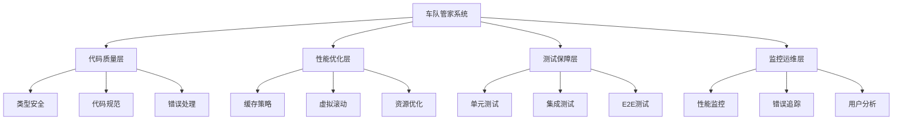
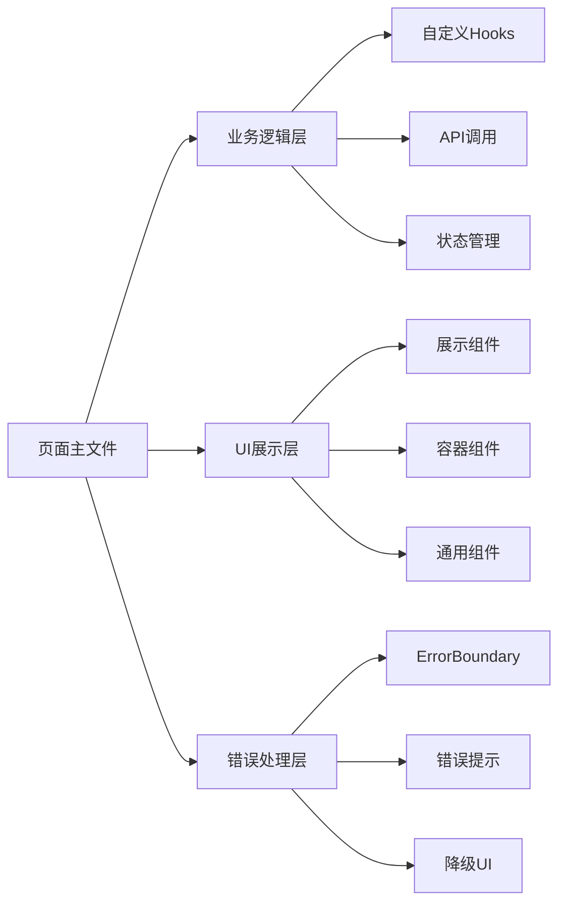
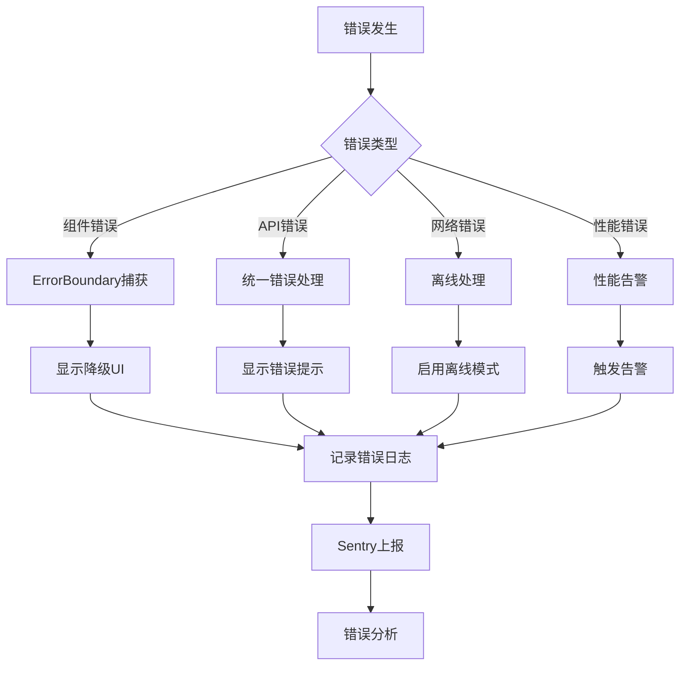
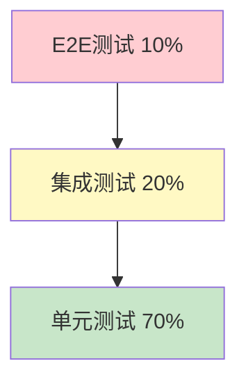

# 车队管家系统优化 - 设计文档

> 📅 创建时间：2025-12-13  
> 🎯 目标：系统化实施优化方案  
> 📊 基于：需求文档 + 用户管理重构经验

---

## 概述

本设计文档描述了车队管家系统优化的技术实现方案，包括架构设计、组件设计、性能优化策略、测试策略等。

---

## 架构设计

### 整体架构



### 模块化重构架构

基于用户管理页面重构的成功经验，定义标准的模块化架构：



---

## 组件和接口

### 1. ErrorBoundary组件

**设计目标：** 捕获子组件错误，防止应用崩溃

**接口定义：**

```typescript
interface ErrorBoundaryProps {
  children: React.ReactNode
  fallback?: React.ReactNode
  onError?: (error: Error, errorInfo: React.ErrorInfo) => void
}

interface ErrorBoundaryState {
  hasError: boolean
  error: Error | null
}
```

**实现要点：**
- 使用React.Component的componentDidCatch生命周期
- 提供自定义fallback UI
- 支持错误回调函数
- 提供重试功能

### 2. CacheManager缓存管理器

**设计目标：** 智能缓存数据，减少API调用

**接口定义：**

```typescript
interface CacheManager {
  set(key: string, value: any, ttl?: number): void
  get(key: string): any | null
  delete(key: string): void
  clear(): void
  isExpired(key: string): boolean
}

interface CacheOptions {
  ttl: number // 缓存过期时间（毫秒）
  maxSize: number // 最大缓存数量
  strategy: 'LRU' | 'LFU' // 缓存淘汰策略
}
```

**实现要点：**
- 使用Map存储缓存数据
- 支持TTL（Time To Live）
- 支持LRU（Least Recently Used）淘汰策略
- 支持缓存大小限制

### 3. VirtualList虚拟滚动组件

**设计目标：** 优化长列表渲染性能

**接口定义：**

```typescript
interface VirtualListProps<T> {
  items: T[]
  itemHeight: number
  containerHeight: number
  renderItem: (item: T, index: number) => React.ReactNode
  overscan?: number // 预渲染项数
}
```

**实现要点：**
- 只渲染可见区域的列表项
- 支持动态计算可见范围
- 支持overscan预渲染
- 优化滚动性能

### 4. PerformanceMonitor性能监控

**设计目标：** 监控系统性能指标

**接口定义：**

```typescript
interface PerformanceMetrics {
  pageLoadTime: number
  apiResponseTime: number
  errorRate: number
  crashRate: number
}

interface PerformanceMonitor {
  trackPageLoad(pageName: string, loadTime: number): void
  trackApiCall(apiName: string, responseTime: number): void
  trackError(error: Error, context: any): void
  getMetrics(): PerformanceMetrics
}
```

**实现要点：**
- 使用Performance API记录性能数据
- 集成Sentry进行错误追踪
- 提供性能指标查询接口
- 支持告警阈值配置

---

## 数据模型

### 缓存数据模型

```typescript
interface CacheEntry {
  key: string
  value: any
  expiry: number // 过期时间戳
  accessCount: number // 访问次数
  lastAccess: number // 最后访问时间
}
```

### 性能指标数据模型

```typescript
interface PerformanceRecord {
  id: string
  type: 'page_load' | 'api_call' | 'error'
  name: string
  value: number
  timestamp: number
  metadata?: Record<string, any>
}
```

### 测试数据模型

```typescript
interface TestCase {
  id: string
  name: string
  type: 'unit' | 'integration' | 'e2e'
  status: 'passed' | 'failed' | 'skipped'
  duration: number
  error?: Error
}
```

---

## 正确性属性

*属性是一个特征或行为，应该在系统的所有有效执行中保持为真——本质上是关于系统应该做什么的正式陈述。属性作为人类可读规范和机器可验证正确性保证之间的桥梁。*

### 属性 1: 错误边界隔离性

*对于任何* 使用ErrorBoundary包装的组件，当子组件抛出错误时，错误应该被捕获且不影响其他组件的正常运行。

**验证：需求 2.1, 2.2**

### 属性 2: 缓存一致性

*对于任何* 缓存的数据，在TTL期限内，多次获取应该返回相同的值；超过TTL后，应该返回null或重新获取。

**验证：需求 4.3, 4.4**

### 属性 3: 虚拟滚动渲染正确性

*对于任何* 长列表，虚拟滚动应该只渲染可见区域的项，且滚动时应该正确更新渲染项。

**验证：需求 4.6, 4.7**

### 属性 4: 测试覆盖完整性

*对于任何* 核心功能模块，应该存在对应的单元测试，且测试应该覆盖正常流程和异常流程。

**验证：需求 3.3, 3.4, 3.5**

### 属性 5: 性能指标可观测性

*对于任何* 页面加载或API调用，性能监控系统应该记录其耗时，且当耗时超过阈值时应该触发告警。

**验证：需求 6.2, 6.3, 6.6, 6.7**

### 属性 6: 重构代码等价性

*对于任何* 被重构的页面，重构前后的功能行为应该保持一致，且测试应该全部通过。

**验证：需求 5.5, 5.6, 5.7, 5.8, 5.9**

### 属性 7: 类型安全性

*对于任何* 代码文件，TypeScript编译应该通过且无类型错误，any类型的使用应该被具体类型替代。

**验证：需求 1.2, 1.4**

### 属性 8: 离线数据同步一致性

*对于任何* 离线修改的数据，当网络恢复时应该正确同步到服务器，且冲突应该被正确处理。

**验证：需求 7.3, 7.4**

---

## 错误处理

### 错误分类

1. **组件错误**
   - 使用ErrorBoundary捕获
   - 显示降级UI
   - 记录错误日志

2. **API错误**
   - 统一错误处理
   - 友好错误提示
   - 支持重试机制

3. **网络错误**
   - 离线检测
   - 自动重连
   - 数据同步

4. **性能错误**
   - 超时检测
   - 性能告警
   - 自动降级

### 错误处理流程



---

## 测试策略

### 测试金字塔



### 单元测试策略

**测试框架：** Vitest 1.6.0 + @testing-library/react

**测试范围：**
1. 所有自定义Hooks
2. 所有展示组件
3. 所有工具函数
4. 所有API调用

**测试模式：**
```typescript
// Hook测试
describe('useUserManagement', () => {
  test('应该正确加载用户列表', async () => {
    const { result } = renderHook(() => useUserManagement())
    await waitFor(() => {
      expect(result.current.users.length).toBeGreaterThan(0)
    })
  })
})

// 组件测试
describe('UserCard', () => {
  test('应该正确渲染用户信息', () => {
    render(<UserCard user={mockUser} />)
    expect(screen.getByText(mockUser.name)).toBeInTheDocument()
  })
})

// API测试
describe('getUserList', () => {
  test('应该返回用户数组', async () => {
    const users = await getUserList()
    expect(users).toBeInstanceOf(Array)
  })
})
```

### 集成测试策略

**测试范围：**
1. 司机打卡完整流程
2. 请假审批完整流程
3. 车辆管理完整流程
4. 通知发送完整流程

**测试模式：**
```typescript
describe('司机打卡流程', () => {
  test('应该完成完整的打卡流程', async () => {
    // 1. 登录
    await login('driver', 'password')
    
    // 2. 上班打卡
    await clockIn()
    expect(await getAttendanceStatus()).toBe('clocked_in')
    
    // 3. 下班打卡
    await clockOut()
    expect(await getAttendanceStatus()).toBe('completed')
  })
})
```

### E2E测试策略

**测试框架：** Playwright

**测试范围：**
1. 用户登录流程
2. 司机打卡流程
3. 请假申请和审批流程

**测试模式：**
```typescript
test('司机完整打卡流程', async ({ page }) => {
  // 1. 登录
  await page.goto('/login')
  await page.fill('[name="phone"]', '13800138000')
  await page.click('button[type="submit"]')
  
  // 2. 打卡
  await page.click('text=打卡')
  await page.click('text=上班打卡')
  await expect(page.locator('text=打卡成功')).toBeVisible()
})
```

### 测试覆盖率目标

| 阶段 | 覆盖率目标 | 时间 |
|------|-----------|------|
| 第一阶段 | 30% | 2周 |
| 第二阶段 | 60% | 1个月 |
| 第三阶段 | 80% | 3个月 |

---

## 性能优化策略

### 1. 缓存策略

**实现方案：**
```typescript
class CacheManager {
  private cache = new Map<string, CacheEntry>()
  private maxSize = 100
  
  set(key: string, value: any, ttl: number = 5 * 60 * 1000) {
    // LRU淘汰策略
    if (this.cache.size >= this.maxSize) {
      const oldestKey = this.findOldestKey()
      this.cache.delete(oldestKey)
    }
    
    this.cache.set(key, {
      value,
      expiry: Date.now() + ttl,
      accessCount: 0,
      lastAccess: Date.now()
    })
  }
  
  get(key: string) {
    const entry = this.cache.get(key)
    if (!entry || this.isExpired(entry)) {
      this.cache.delete(key)
      return null
    }
    
    entry.accessCount++
    entry.lastAccess = Date.now()
    return entry.value
  }
}
```

**应用场景：**
- 用户列表数据
- 仓库列表数据
- 字典数据
- 配置数据

### 2. 虚拟滚动

**实现方案：**
```typescript
const VirtualList = <T,>({ items, itemHeight, containerHeight, renderItem }: VirtualListProps<T>) => {
  const [scrollTop, setScrollTop] = useState(0)
  
  // 计算可见范围
  const startIndex = Math.floor(scrollTop / itemHeight)
  const endIndex = Math.ceil((scrollTop + containerHeight) / itemHeight)
  
  // 只渲染可见项
  const visibleItems = items.slice(startIndex, endIndex)
  
  return (
    <div style={{ height: containerHeight, overflow: 'auto' }} onScroll={handleScroll}>
      <div style={{ height: items.length * itemHeight }}>
        <div style={{ transform: `translateY(${startIndex * itemHeight}px)` }}>
          {visibleItems.map((item, index) => renderItem(item, startIndex + index))}
        </div>
      </div>
    </div>
  )
}
```

**应用场景：**
- 用户列表（>100项）
- 车辆列表（>100项）
- 计件记录列表（>100项）

### 3. 图片优化

**实现方案：**
- 使用WebP格式
- 实施懒加载
- 压缩图片资源
- 使用CDN加速

**代码示例：**
```typescript
const LazyImage = ({ src, alt }: { src: string, alt: string }) => {
  const [isLoaded, setIsLoaded] = useState(false)
  const imgRef = useRef<HTMLImageElement>(null)
  
  useEffect(() => {
    const observer = new IntersectionObserver(([entry]) => {
      if (entry.isIntersecting) {
        setIsLoaded(true)
        observer.disconnect()
      }
    })
    
    if (imgRef.current) {
      observer.observe(imgRef.current)
    }
    
    return () => observer.disconnect()
  }, [])
  
  return (
    
  )
}
```

---

## 监控和运维

### 性能监控

**监控指标：**
- 首屏加载时间
- API响应时间
- 错误率
- 崩溃率
- 用户活跃度

**告警规则：**
- 首屏加载时间 > 3s
- API响应时间 > 2s
- 错误率 > 0.5%
- 崩溃率 > 0.05%

### 错误追踪

**集成Sentry：**
```typescript
import * as Sentry from '@sentry/react'

Sentry.init({
  dsn: process.env.SENTRY_DSN,
  environment: process.env.NODE_ENV,
  tracesSampleRate: 1.0,
})
```

**错误上报：**
```typescript
try {
  // 业务逻辑
} catch (error) {
  Sentry.captureException(error, {
    tags: {
      component: 'UserManagement',
      action: 'loadUsers'
    }
  })
}
```

---

## 实施计划

### 第一阶段（1-2周）

**Week 1：代码质量**
- Day 1-2: 清理console语句，优化any类型
- Day 3-4: 推广ErrorBoundary到5个页面
- Day 5: 优化loading和错误提示

**Week 2：基础测试**
- Day 1-3: 编写核心API单元测试
- Day 4-5: 编写权限系统单元测试

### 第二阶段（1个月）

**Week 3-4：测试体系**
- 编写业务逻辑测试
- 编写组件测试
- 达到60%测试覆盖率

**Week 5-6：性能优化**
- 实施缓存策略
- 实施虚拟滚动
- 优化图片资源

**Week 7-8：代码重构**
- 重构车辆添加页面
- 重构计件报表页面

### 第三阶段（2-3个月）

**Month 3：完善测试**
- 编写集成测试
- 编写E2E测试
- 达到80%测试覆盖率

**Month 4：监控体系**
- 集成性能监控
- 集成错误追踪
- 建立告警机制

**Month 5：离线支持**
- 实施离线数据存储
- 实施数据同步
- 实施PWA功能

---

## 风险和缓解措施

### 技术风险

1. **测试编写困难**
   - 风险：团队缺乏测试经验
   - 缓解：提供培训，参考用户管理测试案例

2. **性能优化效果不明显**
   - 风险：优化后性能提升不达预期
   - 缓解：分步验证，及时调整策略

3. **重构引入新bug**
   - 风险：重构过程中引入回归bug
   - 缓解：完善测试覆盖，灰度发布

### 业务风险

1. **影响现有功能**
   - 风险：优化过程影响现有功能
   - 缓解：充分测试，准备回滚方案

2. **资源不足**
   - 风险：人力或时间资源不足
   - 缓解：优先级管理，弹性计划

---

## 成功标准

### 量化指标

- 测试覆盖率达到80%
- 页面加载时间减少30%
- API响应时间减少40%
- 代码重复率降低到3%以下
- 系统评分提升至92/100

### 质量指标

- TypeScript类型检查通过
- ESLint检查通过
- 所有测试通过
- 性能指标达标
- 用户满意度提升

---

**文档版本**: v1.0  
**创建日期**: 2025-12-13  
**创建团队**: Kiro AI  
**审核状态**: 待审核
