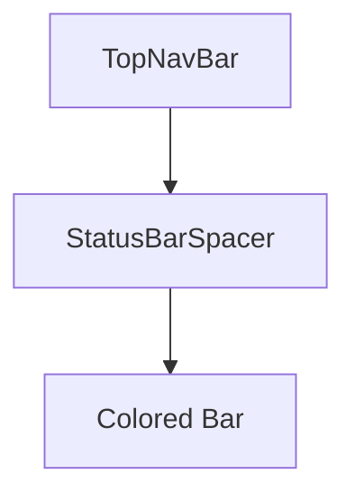

# Design Document: Top Navigation Bar

## Overview

TopNavBar 是一个简单的顶部导航栏组件，主要用于在页面顶部提供状态栏安全区域隔离，确保页面内容不会与设备状态栏重叠。

## Architecture



## Components and Interfaces

### TopNavBar Component

```typescript
interface TopNavBarProps {
  /** 背景颜色，默认 '#1E3A8A' (primary blue) */
  backgroundColor?: string
  /** 自定义类名 */
  className?: string
}
```

### Component Structure

```
TopNavBar/
├── index.tsx          # 主组件
└── index.scss         # 样式文件
```

## Data Models

组件不维护内部状态，仅通过 props 接收背景颜色配置。

## Correctness Properties

*A property is a characteristic or behavior that should hold true across all valid executions of a system-essentially, a formal statement about what the system should do. Properties serve as the bridge between human-readable specifications and machine-verifiable correctness guarantees.*

### Property 1: Component Renders
*For any* TopNavBar component, when rendered, the system SHALL output a View element with the specified height.
**Validates: Requirements 1.1, 1.2**

### Property 2: Background Color Application
*For any* valid CSS color string provided as backgroundColor prop, the navigation bar container SHALL have that color applied as its background-color style.
**Validates: Requirements 1.3**

## Error Handling

| Scenario | Handling |
|----------|----------|
| Invalid color value | Pass through to CSS, browser handles gracefully |
| No backgroundColor provided | Use default '#1E3A8A' |

## Testing Strategy

### Unit Tests

1. 测试组件正确渲染
2. 测试默认背景颜色应用
3. 测试自定义背景颜色应用
