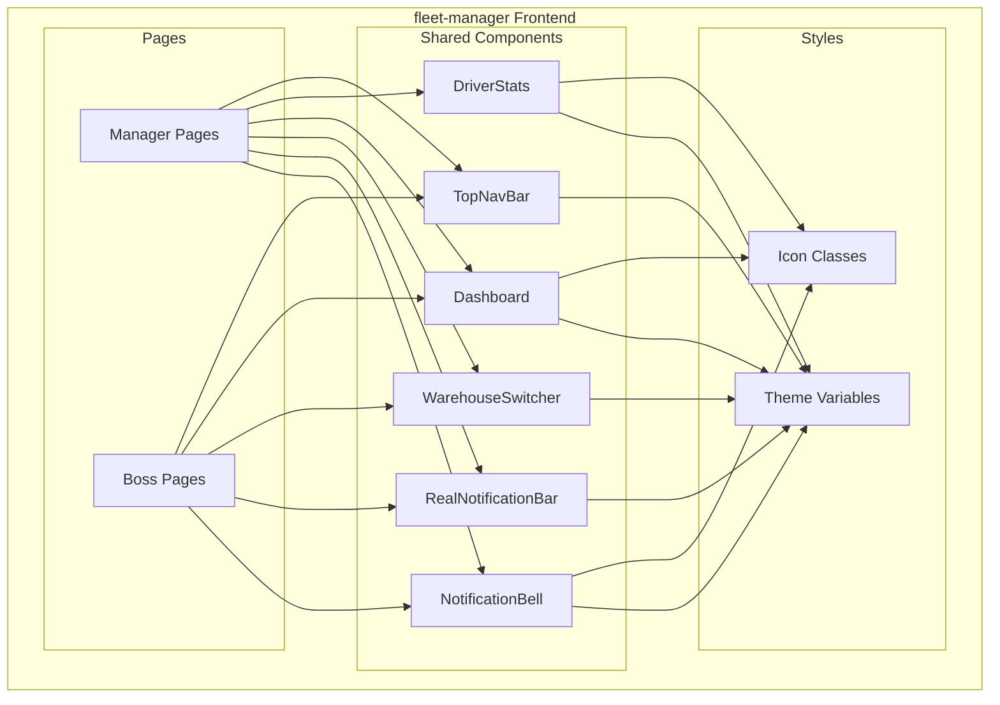
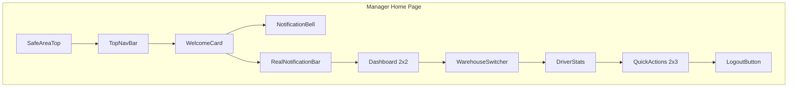

# Design Document: UI Consistency Alignment

## Overview

本设计文档描述了 fleet-manager 项目与主项目 UI 一致性对齐的技术实现方案。主要目标是将 fleet-manager（UniApp + Vue3）的车队长端和老板端页面调整为与主项目（Taro + React）保持一致的视觉风格和功能完整性。

### 设计目标

1. **颜色主题统一**: 将绿色/紫色主题改为蓝色主题
2. **组件补充**: 添加通知铃铛、实时通知栏、仓库切换器等缺失组件
3. **布局统一**: 统一数据仪表盘和快捷功能的网格布局
4. **图标风格统一**: 使用 UnoCSS 图标替代 Emoji
5. **页面补充**: 补充缺失的详情页面

## Architecture

### 整体架构



### 组件层次结构



## Components and Interfaces

### 1. NotificationBell 组件

```typescript
/**
 * 通知铃铛组件
 * 显示未读通知数量，点击跳转到通知列表
 */
interface NotificationBellProps {
  /** 用户ID，用于获取未读通知数量 */
  userId: string
}

interface NotificationBellEmits {
  /** 点击事件 */
  (e: 'click'): void
}
```

### 2. RealNotificationBar 组件

```typescript
/**
 * 实时通知栏组件
 * 滚动显示最新通知
 */
interface RealNotificationBarProps {
  /** 通知列表 */
  notifications: Notification[]
  /** 是否自动滚动 */
  autoScroll?: boolean
}

interface Notification {
  id: string
  type: 'system' | 'leave' | 'attendance' | 'piece_work'
  title: string
  content: string
  createdAt: string
  targetUrl?: string
}
```

### 3. WarehouseSwitcher 组件

```typescript
/**
 * 仓库切换器组件
 * 支持 Swiper 滑动切换多个仓库
 */
interface WarehouseSwitcherProps {
  /** 仓库列表 */
  warehouses: Warehouse[]
  /** 当前选中的仓库索引 */
  currentIndex: number
}

interface WarehouseSwitcherEmits {
  /** 仓库切换事件 */
  (e: 'change', index: number): void
}

interface Warehouse {
  id: string
  name: string
}
```

### 4. Dashboard 组件

```typescript
/**
 * 数据仪表盘组件
 * 2x2 网格布局显示统计数据
 */
interface DashboardProps {
  /** 统计数据 */
  stats: DashboardStats
  /** 加载状态 */
  loading: boolean
  /** 当前仓库名称 */
  warehouseName?: string
}

interface DashboardStats {
  /** 今天出勤人数 */
  todayAttendance: number
  /** 今天总件数 */
  todayPieceCount: number
  /** 待审批数量 */
  pendingCount: number
  /** 本月完成件数 */
  monthlyPieceCount: number
}

interface DashboardEmits {
  /** 卡片点击事件 */
  (e: 'cardClick', type: 'attendance' | 'todayPiece' | 'pending' | 'monthlyPiece'): void
}
```

### 5. DriverStats 组件

```typescript
/**
 * 司机实时状态统计组件
 * 显示司机总数、在线、已计件、未计件
 */
interface DriverStatsProps {
  /** 统计数据 */
  stats: DriverStatsData
  /** 加载状态 */
  loading: boolean
  /** 当前仓库名称 */
  warehouseName?: string
}

interface DriverStatsData {
  /** 总司机数 */
  totalDrivers: number
  /** 在线司机数 */
  onlineDrivers: number
  /** 已计件司机数 */
  busyDrivers: number
  /** 未计件司机数 */
  idleDrivers: number
}
```

### 6. TopNavBar 组件

```typescript
/**
 * 顶部导航栏组件
 */
interface TopNavBarProps {
  /** 页面标题 */
  title?: string
  /** 是否显示返回按钮 */
  showBack?: boolean
  /** 右侧操作按钮 */
  rightActions?: NavAction[]
}

interface NavAction {
  icon: string
  onClick: () => void
}
```

## Data Models

### 主题变量

```scss
// 蓝色主题变量（与主项目一致）
$theme-primary: #1E3A8A;        // 主色
$theme-primary-light: #1D4ED8;  // 主色浅
$theme-gradient-start: #1E3A8A; // 渐变起始色
$theme-gradient-end: #1D4ED8;   // 渐变结束色

// 统计卡片颜色
$stat-blue: #3B82F6;
$stat-green: #10B981;
$stat-orange: #F97316;
$stat-purple: #8B5CF6;

// 背景渐变
$bg-gradient: linear-gradient(to bottom, #F8FAFC, #E2E8F0);
$card-gradient-blue: linear-gradient(135deg, #EFF6FF 0%, #DBEAFE 100%);
$card-gradient-green: linear-gradient(135deg, #F0FDF4 0%, #DCFCE7 100%);
$card-gradient-orange: linear-gradient(135deg, #FFF7ED 0%, #FFEDD5 100%);
$card-gradient-purple: linear-gradient(135deg, #FAF5FF 0%, #F3E8FF 100%);
```

### 图标映射

```typescript
// Emoji 到 UnoCSS 图标的映射
const iconMapping = {
  '📊': 'i-mdi-view-dashboard',
  '👥': 'i-mdi-account-group',
  '📦': 'i-mdi-package-variant',
  '📋': 'i-mdi-clipboard-check',
  '📈': 'i-mdi-chart-line',
  '✅': 'i-mdi-check-circle',
  '📢': 'i-mdi-send',
  '🔔': 'i-mdi-bell-outline',
  '👤': 'i-mdi-account-circle',
  '🚪': 'i-mdi-logout',
  '📅': 'i-mdi-calendar',
  '💰': 'i-mdi-currency-usd',
  '⚡': 'i-mdi-lightning-bolt',
  '🏠': 'i-mdi-warehouse',
}
```

## Correctness Properties

*A property is a characteristic or behavior that should hold true across all valid executions of a system-essentially, a formal statement about what the system should do. Properties serve as the bridge between human-readable specifications and machine-verifiable correctness guarantees.*

### Property 1: 颜色主题一致性

*For any* 首页组件（车队长端或老板端），渲染后的欢迎卡片背景样式应包含蓝色渐变（#1E3A8A 到 #1D4ED8）

**Validates: Requirements 1.1, 1.2, 1.3**

### Property 2: 通知徽章显示规则

*For any* 未读通知数量 n，当 n > 0 时通知铃铛应显示徽章，当 n > 99 时应显示 "99+"，当 n = 0 时不显示徽章

**Validates: Requirements 2.2, 2.4**

### Property 3: 通知栏条件渲染

*For any* 通知列表，当列表为空时通知栏组件应隐藏，当列表非空时应显示

**Validates: Requirements 3.4**

### Property 4: 仓库切换器条件渲染

*For any* 仓库列表，当列表长度 > 1 时应显示 Swiper 切换器，当列表长度 = 1 时应显示单个仓库卡片，当列表长度 = 0 时应显示"暂无分配仓库"提示

**Validates: Requirements 4.1, 4.3, 4.4**

### Property 5: 仓库切换数据更新

*For any* 仓库切换操作，切换后数据仪表盘应显示对应仓库的统计数据

**Validates: Requirements 4.2**

### Property 6: 加载状态显示

*For any* 数据加载状态，当 loading = true 时应显示加载动画

**Validates: Requirements 5.4**

### Property 7: 图标类名格式

*For any* 功能图标元素，其类名应匹配 i-mdi-* 格式

**Validates: Requirements 7.1, 7.3**

### Property 8: 待处理徽章显示

*For any* 快捷功能项，当其待处理数量 > 0 时应显示数量徽章

**Validates: Requirements 10.4**

## Error Handling

### 数据加载失败

- 当 API 请求失败时，显示错误提示并提供重试按钮
- 使用缓存数据作为降级方案
- 记录错误日志用于调试

### 组件渲染异常

- 使用 Vue 的 errorCaptured 钩子捕获组件错误
- 显示友好的错误提示而非空白页面
- 提供刷新页面的选项

### 网络异常

- 检测网络状态，离线时显示离线提示
- 使用本地缓存数据
- 网络恢复后自动刷新数据

## Testing Strategy

### 单元测试

使用 Vitest 进行单元测试：

1. **组件渲染测试**: 验证组件在不同 props 下的渲染结果
2. **事件处理测试**: 验证点击等事件的处理逻辑
3. **条件渲染测试**: 验证不同条件下的组件显示/隐藏

### 属性测试

使用 fast-check 进行属性测试：

1. **颜色主题测试**: 验证所有首页组件使用正确的颜色主题
2. **徽章显示测试**: 验证不同数量下徽章的显示规则
3. **条件渲染测试**: 验证仓库切换器在不同仓库数量下的渲染

### 测试框架配置

```typescript
// vitest.config.ts
import { defineConfig } from 'vitest/config'

export default defineConfig({
  test: {
    environment: 'jsdom',
    globals: true,
    coverage: {
      provider: 'v8',
      reporter: ['text', 'json', 'html'],
    },
  },
})
```

### 属性测试示例

```typescript
import { fc } from '@fast-check/vitest'
import { test, expect } from 'vitest'

/**
 * Feature: ui-consistency-alignment, Property 2: 通知徽章显示规则
 * Validates: Requirements 2.2, 2.4
 */
test.prop([fc.nat()])('通知徽章显示规则', (count) => {
  const displayText = formatBadgeCount(count)
  
  if (count === 0) {
    expect(displayText).toBe('')
  } else if (count > 99) {
    expect(displayText).toBe('99+')
  } else {
    expect(displayText).toBe(String(count))
  }
})
```
