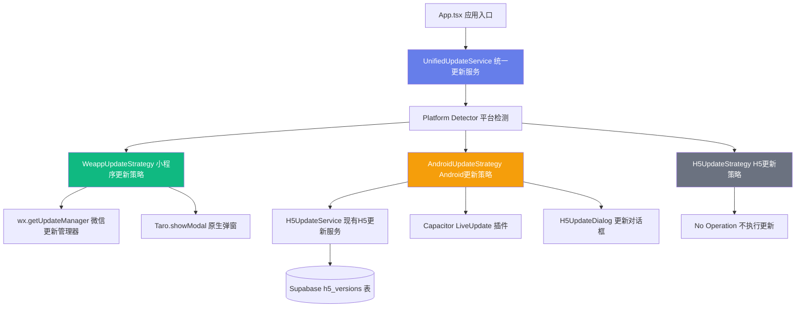
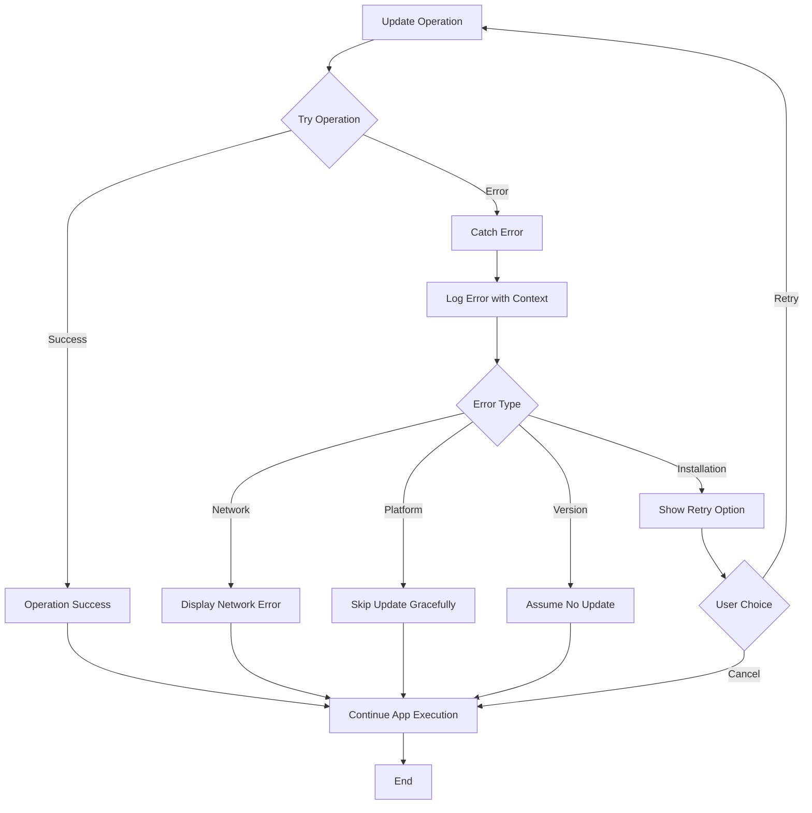

# 统一热更新系统设计文档

## Overview

本设计文档描述了统一热更新系统的架构和实现方案。该系统将移除无效的旧热更新代码，并创建一个平台自适应的统一热更新服务，支持微信小程序和 Android APP 两个平台。

**核心设计理念：**
- **平台自适应**：根据运行环境自动选择合适的更新策略
- **统一接口**：业务代码只需调用一个服务，无需关心平台差异
- **最小侵入**：复用现有的 H5 热更新实现和 UI 组件
- **渐进增强**：小程序使用微信官方机制，Android APP 使用 Capacitor LiveUpdate

## Architecture

### 系统架构图



### 分层设计

**1. 应用层 (Application Layer)**
- `App.tsx`：应用入口，调用统一更新服务

**2. 服务层 (Service Layer)**
- `UnifiedUpdateService`：统一更新服务，提供统一的 API
- 平台检测逻辑，根据环境选择策略

**3. 策略层 (Strategy Layer)**
- `WeappUpdateStrategy`：小程序更新策略
- `AndroidUpdateStrategy`：Android APP 更新策略
- `H5UpdateStrategy`：H5 更新策略（空实现）

**4. 实现层 (Implementation Layer)**
- 微信小程序：`wx.getUpdateManager()`
- Android APP：`H5UpdateService` + `Capacitor LiveUpdate`
- H5：无操作

## Components and Interfaces

### 1. UnifiedUpdateService (统一更新服务)

**职责：**
- 提供统一的更新检查和应用接口
- 检测当前运行平台
- 根据平台选择合适的更新策略
- 处理更新流程的生命周期

**接口定义：**

```typescript
/**
 * 统一更新服务
 * 根据平台自动选择合适的更新策略
 */
export interface IUnifiedUpdateService {
  /**
   * 初始化更新服务
   * 在应用启动时调用
   */
  initialize(): Promise<void>
  
  /**
   * 检查并应用更新
   * 自动检测平台并执行相应的更新流程
   * @param silent - 是否静默检查（不显示"已是最新版本"提示）
   */
  checkAndApplyUpdate(silent?: boolean): Promise<void>
  
  /**
   * 获取当前平台
   */
  getCurrentPlatform(): PlatformType
}
```

### 2. UpdateStrategy (更新策略接口)

**职责：**
- 定义更新策略的统一接口
- 各平台实现自己的更新逻辑

**接口定义：**

```typescript
/**
 * 更新策略接口
 * 各平台实现自己的更新逻辑
 */
export interface IUpdateStrategy {
  /**
   * 初始化更新策略
   */
  initialize(): Promise<void>
  
  /**
   * 检查并应用更新
   * @param silent - 是否静默检查
   */
  checkAndApplyUpdate(silent?: boolean): Promise<void>
  
  /**
   * 获取策略名称
   */
  getName(): string
}
```

### 3. WeappUpdateStrategy (小程序更新策略)

**职责：**
- 使用微信官方的 `wx.getUpdateManager()` API
- 监听更新事件并提示用户
- 应用更新并重启小程序

**实现要点：**

```typescript
/**
 * 小程序更新策略
 * 使用微信官方的更新管理器
 */
export class WeappUpdateStrategy implements IUpdateStrategy {
  private updateManager: any
  
  async initialize(): Promise<void> {
    // 获取微信更新管理器
    this.updateManager = Taro.getUpdateManager()
    
    // 监听更新事件
    this.setupUpdateListeners()
  }
  
  private setupUpdateListeners(): void {
    // 监听检查更新结果
    this.updateManager.onCheckForUpdate((res) => {
      console.log('是否有新版本:', res.hasUpdate)
    })
    
    // 监听更新下载完成
    this.updateManager.onUpdateReady(() => {
      // 提示用户重启应用
      Taro.showModal({
        title: '更新提示',
        content: '新版本已经准备好，是否重启应用？',
        success: (res) => {
          if (res.confirm) {
            this.updateManager.applyUpdate()
          }
        }
      })
    })
    
    // 监听更新失败
    this.updateManager.onUpdateFailed(() => {
      console.error('小程序更新失败')
    })
  }
  
  async checkAndApplyUpdate(silent: boolean = true): Promise<void> {
    // 微信会自动检查更新，这里不需要手动触发
    // 只在非静默模式下提示用户
    if (!silent) {
      Taro.showToast({
        title: '正在检查更新...',
        icon: 'loading'
      })
    }
  }
  
  getName(): string {
    return 'WeappUpdateStrategy'
  }
}
```

### 4. AndroidUpdateStrategy (Android 更新策略)

**职责：**
- 复用现有的 `H5UpdateService`
- 从 Supabase 数据库获取版本信息
- 使用 Capacitor LiveUpdate 下载和安装更新
- 显示 `H5UpdateDialog` 组件

**实现要点：**

```typescript
/**
 * Android APP 更新策略
 * 使用 Capacitor LiveUpdate 实现 H5 代码热更新
 */
export class AndroidUpdateStrategy implements IUpdateStrategy {
  async initialize(): Promise<void> {
    // 初始化 LiveUpdate
    await initLiveUpdate()
  }
  
  async checkAndApplyUpdate(silent: boolean = true): Promise<void> {
    try {
      // 检查更新
      const result = await checkForH5Update()
      
      if (result.needsUpdate && result.versionInfo) {
        // 显示更新对话框
        await this.showUpdateDialog(result.versionInfo)
      } else if (!silent) {
        // 非静默模式下提示已是最新版本
        Taro.showToast({
          title: '已是最新版本',
          icon: 'success'
        })
      }
    } catch (error) {
      console.error('检查更新失败:', error)
      if (!silent) {
        Taro.showToast({
          title: '检查更新失败',
          icon: 'none'
        })
      }
    }
  }
  
  private async showUpdateDialog(versionInfo: H5VersionInfo): Promise<void> {
    // 使用原生 confirm/alert 或 H5UpdateDialog 组件
    // 具体实现见任务列表
  }
  
  getName(): string {
    return 'AndroidUpdateStrategy'
  }
}
```

### 5. H5UpdateStrategy (H5 更新策略)

**职责：**
- H5 环境不支持热更新
- 提供空实现，不执行任何操作

**实现要点：**

```typescript
/**
 * H5 更新策略
 * H5 环境不支持热更新，提供空实现
 */
export class H5UpdateStrategy implements IUpdateStrategy {
  async initialize(): Promise<void> {
    // H5 不需要初始化
  }
  
  async checkAndApplyUpdate(silent: boolean = true): Promise<void> {
    // H5 不支持热更新，不执行任何操作
    console.log('H5 环境不支持热更新')
  }
  
  getName(): string {
    return 'H5UpdateStrategy'
  }
}
```

## Data Models

### UpdateInfo (更新信息)

```typescript
/**
 * 通用更新信息接口
 */
export interface UpdateInfo {
  version: string
  releaseNotes?: string
  isForceUpdate: boolean
}
```

### H5VersionInfo (H5 版本信息)

```typescript
/**
 * H5 版本信息（从 Supabase 数据库获取）
 */
export interface H5VersionInfo {
  version: string
  h5_url: string
  release_notes?: string
  is_force_update: boolean
  created_at: string
}
```

### UpdateProgress (更新进度)

```typescript
/**
 * 更新进度信息
 */
export interface UpdateProgress {
  percent: number
  status: 'downloading' | 'installing' | 'complete' | 'error'
  message?: string
}
```

## Correctness Properties


*A property is a characteristic or behavior that should hold true across all valid executions of a system-essentially, a formal statement about what the system should do. Properties serve as the bridge between human-readable specifications and machine-verifiable correctness guarantees.*

### Property 1: Platform Detection Consistency
*For any* call to the unified update service, the system should correctly detect the current platform (mini program, Android APP, or H5) and select the appropriate update strategy.
**Validates: Requirements 4.1, 4.2, 4.3, 4.4**

### Property 2: Mini Program Update Manager Initialization
*For any* mini program environment, when the app starts, the system should call `Taro.getUpdateManager()` and set up update event listeners.
**Validates: Requirements 2.1**

### Property 3: Update Ready Prompt
*For any* platform where an update is available and downloaded, the system should prompt the user to restart or apply the update.
**Validates: Requirements 2.2, 3.5**

### Property 4: Force Update Enforcement
*For any* update marked as force update on Android APP, the system should prevent the user from canceling the update dialog.
**Validates: Requirements 3.3**

### Property 5: Platform-Specific Logic Isolation
*For any* platform, the system should only execute update logic specific to that platform and skip logic for other platforms.
**Validates: Requirements 2.4, 3.6**

### Property 6: Silent Update Check Behavior
*For any* silent update check, when no update is available, the system should not display any UI feedback to the user.
**Validates: Requirements 5.2**

### Property 7: Update Dialog Content Completeness
*For any* update dialog displayed, it should contain the version number and release notes (or default message).
**Validates: Requirements 6.3**

### Property 8: Download Progress Feedback
*For any* update download in progress, the system should provide progress feedback to the user (percentage or status message).
**Validates: Requirements 6.4**

### Property 9: Error Handling Without Crash
*For any* error during update check, download, or installation, the system should log the error and continue app execution without crashing.
**Validates: Requirements 7.1, 7.4**

### Property 10: Error Message Display
*For any* update download or installation failure, the system should display an error message to the user.
**Validates: Requirements 7.2**

### Property 11: Error Recovery Options
*For any* update installation failure, the system should provide retry or cancel options to the user.
**Validates: Requirements 7.3**

### Property 12: Logging Integration
*For any* update operation (check, download, install, error), the system should log events using the existing logger utility.
**Validates: Requirements 8.1, 8.3**

### Property 13: Error Handler Integration
*For any* error during update operations, the system should use the enhancedErrorHandler for consistent error handling.
**Validates: Requirements 8.2**

### Property 14: Development Mode Skip
*For any* app running in development mode, the system should skip automatic update checks.
**Validates: Requirements 5.4**

## Error Handling

### Error Categories

**1. Network Errors**
- Update check request fails
- Update download fails due to network issues
- Timeout during download

**Handling Strategy:**
- Log error with context
- Display user-friendly error message
- Allow retry
- Continue app execution

**2. Platform Errors**
- LiveUpdate plugin not available
- UpdateManager not available
- Platform detection fails

**Handling Strategy:**
- Log error with platform information
- Gracefully degrade (skip update)
- Continue app execution

**3. Version Errors**
- Invalid version format
- Version comparison fails
- Database query fails

**Handling Strategy:**
- Log error with version details
- Assume no update available
- Continue app execution

**4. Installation Errors**
- Bundle download fails
- Bundle installation fails
- Bundle verification fails

**Handling Strategy:**
- Log error with bundle information
- Display error message to user
- Provide retry option
- Allow user to cancel

### Error Handling Flow



### Error Logging Format

All errors should be logged with the following context:

```typescript
{
  component: 'UnifiedUpdateService' | 'WeappUpdateStrategy' | 'AndroidUpdateStrategy',
  action: 'initialize' | 'checkUpdate' | 'downloadUpdate' | 'installUpdate',
  platform: 'weapp' | 'android' | 'h5',
  error: Error,
  metadata: {
    version?: string,
    url?: string,
    // ... other relevant data
  }
}
```

## Testing Strategy

### Unit Testing

**Test Coverage:**
- Platform detection logic
- Strategy selection logic
- Version comparison logic
- Error handling logic
- Logging integration

**Test Framework:** Vitest

**Test Files:**
- `src/services/unifiedUpdateService.test.ts`
- `src/services/updateStrategies/weappUpdateStrategy.test.ts`
- `src/services/updateStrategies/androidUpdateStrategy.test.ts`
- `src/services/updateStrategies/h5UpdateStrategy.test.ts`

**Example Test:**

```typescript
describe('UnifiedUpdateService', () => {
  describe('Platform Detection', () => {
    it('should detect mini program environment', () => {
      // Mock Taro.getEnv() to return WEAPP
      // Call getCurrentPlatform()
      // Assert platform is PlatformType.WEAPP
    })
    
    it('should detect Android APP environment', () => {
      // Mock Taro.getEnv() to return WEB
      // Mock window.Capacitor to exist
      // Call getCurrentPlatform()
      // Assert platform is PlatformType.ANDROID
    })
  })
  
  describe('Strategy Selection', () => {
    it('should use WeappUpdateStrategy for mini program', () => {
      // Mock platform as WEAPP
      // Call checkAndApplyUpdate()
      // Assert WeappUpdateStrategy is used
    })
  })
})
```

### Integration Testing

**Test Coverage:**
- End-to-end update flow for each platform
- UI component integration
- Database integration (Supabase)
- LiveUpdate plugin integration

**Test Scenarios:**
1. Mini program update flow
2. Android APP update flow with available update
3. Android APP update flow with no update
4. Force update flow
5. Update error handling

### Property-Based Testing

**Property Testing Library:** fast-check (for TypeScript)

**Properties to Test:**

**Property 1: Platform Detection Consistency**
```typescript
// For any environment configuration, platform detection should be consistent
fc.assert(
  fc.property(
    fc.record({
      taroEnv: fc.constantFrom('WEAPP', 'WEB'),
      hasCapacitor: fc.boolean()
    }),
    (env) => {
      // Mock environment
      // Call getCurrentPlatform() multiple times
      // Assert all calls return the same platform
    }
  )
)
```

**Property 2: Version Comparison Transitivity**
```typescript
// For any three versions v1, v2, v3:
// If v1 > v2 and v2 > v3, then v1 > v3
fc.assert(
  fc.property(
    fc.tuple(versionGenerator(), versionGenerator(), versionGenerator()),
    ([v1, v2, v3]) => {
      const cmp12 = compareVersions(v1, v2)
      const cmp23 = compareVersions(v2, v3)
      const cmp13 = compareVersions(v1, v3)
      
      if (cmp12 > 0 && cmp23 > 0) {
        return cmp13 > 0
      }
      return true
    }
  )
)
```

**Property 3: Error Handling Stability**
```typescript
// For any error during update operations, the app should not crash
fc.assert(
  fc.property(
    fc.constantFrom('network', 'platform', 'version', 'installation'),
    async (errorType) => {
      // Simulate error
      // Call update operation
      // Assert no exception is thrown
      // Assert error is logged
    }
  )
)
```

### Manual Testing Checklist

**Mini Program:**
- [ ] Update check on app startup
- [ ] Update prompt when new version available
- [ ] Apply update and restart
- [ ] No update prompt when already latest version

**Android APP:**
- [ ] Update check on app startup
- [ ] Update dialog with version and release notes
- [ ] Download progress display
- [ ] Force update prevents cancel
- [ ] Optional update allows cancel
- [ ] Update success prompt
- [ ] Update error handling and retry

**H5:**
- [ ] No update check performed
- [ ] App runs normally without update logic

## Implementation Notes

### File Structure

```
src/
├── services/
│   ├── unifiedUpdateService.ts          # 统一更新服务
│   ├── updateStrategies/
│   │   ├── IUpdateStrategy.ts           # 更新策略接口
│   │   ├── weappUpdateStrategy.ts       # 小程序更新策略
│   │   ├── androidUpdateStrategy.ts     # Android 更新策略
│   │   └── h5UpdateStrategy.ts          # H5 更新策略
│   └── h5UpdateService.ts               # 现有 H5 更新服务（保留）
├── components/
│   └── H5UpdateDialog/                  # 现有更新对话框（保留）
└── app.tsx                              # 应用入口（修改）
```

### Dependencies

**Existing:**
- `@tarojs/taro` - Taro 框架
- `@capawesome/capacitor-live-update` - Capacitor 热更新插件
- `@/db/supabase` - Supabase 客户端
- `@/utils/platform` - 平台工具
- `@/utils/logger` - 日志工具
- `@/utils/errorHandler` - 错误处理工具

**No New Dependencies Required**

### Migration Strategy

**Phase 1: Remove Old Code**
1. Delete `src/utils/hotUpdate.ts`
2. Remove imports and usage in `src/app.tsx`
3. Search and remove any other references

**Phase 2: Implement New Service**
1. Create `IUpdateStrategy` interface
2. Implement `WeappUpdateStrategy`
3. Implement `AndroidUpdateStrategy`
4. Implement `H5UpdateStrategy`
5. Create `UnifiedUpdateService`

**Phase 3: Integration**
1. Update `src/app.tsx` to use `UnifiedUpdateService`
2. Test on each platform
3. Verify error handling

**Phase 4: Cleanup**
1. Remove unused code
2. Update documentation
3. Final testing

### Performance Considerations

**1. Startup Performance**
- Update check should not block app startup
- Use async initialization
- Delay update check by 500ms (already implemented)

**2. Network Usage**
- Only check for updates once per session
- Use HEAD request for version check (Android)
- Respect network conditions

**3. Storage Usage**
- Clean up old bundles after successful update
- Limit number of stored bundles to 2

### Security Considerations

**1. Version Verification**
- Verify bundle integrity after download
- Use HTTPS for all update URLs
- Validate version format

**2. Database Security**
- Use Supabase RLS policies
- Only fetch active versions
- Validate version data structure

**3. Error Information**
- Don't expose sensitive information in error messages
- Log detailed errors server-side only
- Show user-friendly messages to users

## Future Enhancements

**1. Incremental Updates**
- Download only changed files
- Reduce download size
- Faster update process

**2. Background Updates**
- Download updates in background
- Apply on next app start
- Reduce user wait time

**3. Rollback Mechanism**
- Keep previous version
- Allow rollback on error
- Automatic rollback on crash

**4. Update Analytics**
- Track update success rate
- Monitor download times
- Identify common errors

**5. A/B Testing**
- Gradual rollout
- Test updates with subset of users
- Reduce risk of breaking changes
