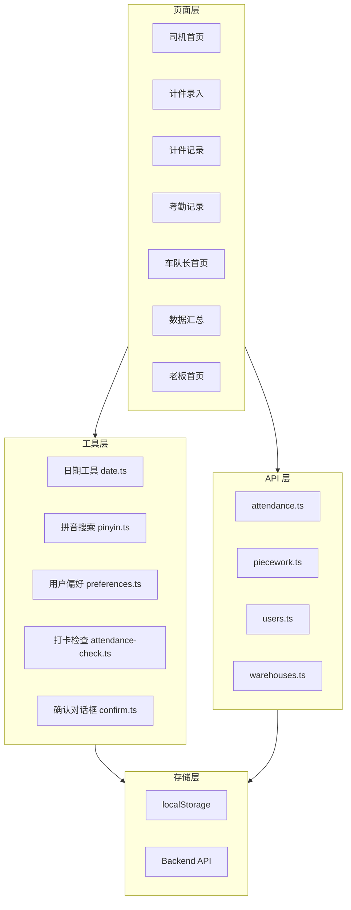

# Design Document: Vue 深度转换

## Overview

本设计文档描述了将原有 Taro/React 项目的所有页面深度转换为 Vue 3 版本的技术方案。转换需要保持完全一致的 UI 布局和所有功能，包括统计、搜索、快捷选择、筛选、排序等所有交互功能。

## Architecture

### 技术栈

- **前端框架**: UniApp + Vue 3 + TypeScript
- **状态管理**: Vue 3 Composition API (ref, reactive, computed)
- **样式方案**: SCSS + Tailwind-like 工具类
- **API 调用**: 封装的 API 模块 (@/api)
- **存储**: uni.setStorageSync / uni.getStorageSync

### 架构图



## Components and Interfaces

### 1. 工具函数接口

#### 1.1 日期工具 (utils/date.ts)

```typescript
/**
 * 获取今天的日期字符串 (YYYY-MM-DD)
 */
export function getLocalDateString(): string

/**
 * 获取昨天的日期字符串
 */
export function getYesterdayDateString(): string

/**
 * 获取本周一的日期字符串
 */
export function getMondayDateString(): string

/**
 * 获取本月第一天的日期字符串
 */
export function getFirstDayOfMonthString(): string

/**
 * 获取指定日期的前一天
 */
export function getPreviousDay(dateStr: string): string

/**
 * 获取指定日期的后一天
 */
export function getNextDay(dateStr: string): string
```

#### 1.2 日期格式化 (utils/dateFormat.ts)

```typescript
/**
 * 格式化为中文日期 (YYYY年M月D日)
 */
export function formatDateChineseYMD(dateStr: string): string

/**
 * 格式化为短日期 (M/D)
 */
export function formatDateShort(dateStr: string): string

/**
 * 格式化时间 (HH:mm)
 */
export function formatTime(dateTimeStr: string): string

/**
 * 格式化为中文日期时间
 */
export function formatDateTimeChineseYMD(dateTimeStr: string): string
```

#### 1.3 拼音搜索 (utils/pinyin.ts)

```typescript
/**
 * 拼音首字母匹配
 * @param text - 要匹配的文本
 * @param keyword - 搜索关键词
 * @returns 是否匹配
 */
export function matchWithPinyin(text: string, keyword: string): boolean
```

#### 1.4 用户偏好 (utils/preferences.ts)

```typescript
/**
 * 保存上次选择的仓库
 */
export function saveLastWarehouse(id: number, name: string): void

/**
 * 获取上次选择的仓库
 */
export function getLastWarehouse(): { id: number; name: string } | null

/**
 * 保存上次选择的品类
 */
export function saveLastCategory(id: number, name: string): void

/**
 * 获取上次选择的品类
 */
export function getLastCategory(): { id: number; name: string } | null

/**
 * 保存上次的工作日期
 */
export function saveLastWorkDate(date: string): void

/**
 * 获取上次的工作日期
 */
export function getLastWorkDate(): string | null

/**
 * 保存计件表单默认值
 */
export function savePieceWorkFormDefaults(defaults: PieceWorkFormDefaults): void

/**
 * 获取计件表单默认值
 */
export function getPieceWorkFormDefaults(): PieceWorkFormDefaults | null
```

#### 1.5 打卡检查 (utils/attendance-check.ts)

```typescript
interface AttendanceCheckResult {
  canStart: boolean
  reason: string
  checkResult: {
    needClockIn: boolean
    onLeave: boolean
  }
}

/**
 * 检查是否可以进行计件操作
 * @param userId - 用户 ID
 * @returns 检查结果
 */
export async function canStartPieceWork(userId: number): Promise<AttendanceCheckResult>
```

#### 1.6 确认对话框 (utils/confirm.ts)

```typescript
/**
 * 显示删除确认对话框
 * @param title - 标题
 * @param content - 内容
 * @returns 用户是否确认
 */
export function confirmDelete(title: string, content: string): Promise<boolean>
```

### 2. API 接口扩展

#### 2.1 考勤 API 扩展

```typescript
/**
 * 获取今日考勤记录
 */
export async function getTodayAttendance(userId: number): Promise<Attendance | null>
```

#### 2.2 计件 API 扩展

```typescript
/**
 * 获取司机对应的单价配置
 * @param warehouseId - 仓库 ID
 * @param categoryId - 品类 ID
 * @param driverType - 司机类型 (with_vehicle | driver_only)
 */
export async function getCategoryPriceForDriver(
  warehouseId: number,
  categoryId: number,
  driverType: string
): Promise<{ unitPrice: number } | null>

/**
 * 检查是否存在重复记录
 */
export async function checkDuplicateRecord(
  userId: number,
  warehouseId: number,
  categoryId: number,
  workDate: string
): Promise<PieceWorkRecord | null>
```

### 3. 页面组件结构

#### 3.1 计件录入页面 (entry.vue)

```
entry.vue
├── 标题卡片 (含司机类型标签)
├── 基本信息卡片
│   ├── 仓库选择器 (自动选择打卡仓库)
│   ├── 品类选择器 (自动加载单价)
│   └── 工作日期选择器
├── 计件项列表
│   ├── 件数输入
│   ├── 单价输入 (可锁定)
│   ├── 上楼开关和单价
│   ├── 分拣开关、件数和单价
│   └── 金额明细
├── 添加计件项按钮
├── 总金额卡片
└── 提交按钮
```

#### 3.2 计件记录页面 (list.vue)

```
list.vue
├── 标题卡片
├── 快捷筛选按钮组
│   ├── 今天
│   ├── 本周
│   ├── 本月
│   └── 后一天
├── 统计卡片 (总件数、总收入)
├── 记录列表
│   ├── 日期标签卡片 (蓝色渐变)
│   ├── 仓库和品类信息
│   ├── 数据明细
│   ├── 总金额
│   └── 操作按钮 (编辑、删除)
└── 编辑模式界面
```

#### 3.3 数据汇总页面 (stats.vue)

```
stats.vue
├── 标题卡片
├── 筛选条件卡片
│   ├── 仓库选择器
│   ├── 司机搜索框 (支持拼音)
│   ├── 司机选择器
│   ├── 日期范围选择器
│   └── 快捷筛选按钮 (前一天、本周、本月)
├── 统计卡片 (总件数、总金额)
├── 品类统计卡片
└── 记录列表
```

## Data Models

### 1. 计件项接口

```typescript
interface PieceWorkItem {
  id: string
  quantity: string
  unitPrice: string
  unitPriceLocked: boolean
  needUpstairs: boolean
  upstairsPrice: string
  needSorting: boolean
  sortingQuantity: string
  sortingUnitPrice: string
}
```

### 2. 用户偏好接口

```typescript
interface PieceWorkFormDefaults {
  warehouseId: number
  categoryId: number
  needUpstairs: boolean
}
```

### 3. 快捷筛选类型

```typescript
type QuickFilterType = 'today' | 'yesterday' | 'week' | 'month' | 'nextday' | 'custom'
```

### 4. 品类统计接口

```typescript
interface CategoryStat {
  name: string
  quantity: number
  amount: number
}
```

## Correctness Properties

*A property is a characteristic or behavior that should hold true across all valid executions of a system-essentially, a formal statement about what the system should do. Properties serve as the bridge between human-readable specifications and machine-verifiable correctness guarantees.*

### Property 1: 打卡仓库自动选择

*For any* 司机用户，如果今日已打卡，则打开计件录入页面时，仓库选择器的默认值应该等于打卡的仓库 ID
**Validates: Requirements 1.2**

### Property 2: 司机类型单价加载

*For any* 仓库和品类组合，如果存在价格配置，则带车司机应获取 driver_with_vehicle_price，纯司机应获取 driver_only_price
**Validates: Requirements 1.3**

### Property 3: 用户偏好保存恢复

*For any* 用户偏好数据，保存后再获取应该返回相同的数据
**Validates: Requirements 1.5**

### Property 4: 重复记录检测

*For any* 计件记录，如果存在相同用户、仓库、品类、日期的记录，则 checkDuplicateRecord 应返回该记录
**Validates: Requirements 1.6**

### Property 5: 打卡检查逻辑

*For any* 用户，如果今日未打卡且不在请假中，则 canStartPieceWork 应返回 needClockIn: true
**Validates: Requirements 1.7, 1.8**

### Property 6: 日期范围计算

*For any* 日期字符串，getNextDay 返回的日期应该比输入日期大 1 天
**Validates: Requirements 2.3**

### Property 7: 仓库筛选过滤

*For any* 计件记录列表和仓库 ID，过滤后的列表中所有记录的 warehouse_id 都应该等于筛选的仓库 ID
**Validates: Requirements 2.4**

### Property 8: 日期排序

*For any* 计件记录列表，按日期降序排序后，每条记录的日期应该大于等于下一条记录的日期
**Validates: Requirements 2.5**

### Property 9: 拼音搜索匹配

*For any* 中文姓名和拼音首字母，matchWithPinyin 应该正确匹配（如 "张三" 匹配 "zs"）
**Validates: Requirements 3.2**

### Property 10: 品类统计计算

*For any* 计件记录列表，按品类分组统计后，每个品类的 quantity 总和应该等于该品类所有记录的 quantity 之和
**Validates: Requirements 3.7**

### Property 11: 角色权限过滤

*For any* 车队长用户，加载仓库列表时应该只返回该用户管辖的仓库
**Validates: Requirements 3.10**

#### 3.4 考勤打卡页面 (clock/index.vue)

```
clock/index.vue
├── 顶部时间卡片 (日期、实时时间)
├── 今天已打卡状态卡片 (绿色渐变)
│   ├── 打卡时间
│   ├── 仓库信息
│   └── 工作时长
├── 仓库选择卡片
│   ├── 仓库列表 (Radio 选择)
│   └── 考勤规则显示
├── 智能打卡按钮 (上班/下班/已完成)
├── 今天打卡记录卡片
│   ├── 上班打卡记录
│   └── 下班打卡记录
└── 温馨提示卡片
```

#### 3.5 请假记录页面 (leave/list.vue)

```
leave/list.vue
├── 欢迎卡片 (用户名)
├── 数据仪表盘
│   ├── 本月出勤天数
│   ├── 本月请假天数
│   └── 剩余额度
├── 快捷操作按钮
│   ├── 申请请假 (可禁用)
│   └── 申请离职 (可禁用)
├── 标签切换 (请假申请/离职申请/草稿箱)
├── 请假申请列表
│   ├── 类型标签
│   ├── 状态标签
│   ├── 日期范围
│   ├── 请假事由
│   └── 审批意见
├── 离职申请列表
└── 草稿箱列表
```

#### 3.6 请假申请页面 (leave/apply.vue)

```
leave/apply.vue
├── 模式切换 (快捷请假/补请假)
├── 月度请假统计卡片
│   ├── 已批准天数
│   ├── 待审批天数
│   ├── 本次申请天数
│   └── 累计/上限
├── 日期调整提示 (如有)
├── 表单内容
│   ├── 仓库选择器 (多仓库时)
│   ├── 请假类型选择器
│   ├── 快捷日期选择 (明天/后天)
│   ├── 请假天数选择器
│   ├── 起始日期选择器
│   ├── 结束日期选择器
│   ├── 请假天数显示
│   └── 请假事由输入
└── 按钮组 (保存草稿/提交申请)
```

#### 3.7 车辆列表页面 (vehicle/list.vue)

```
vehicle/list.vue
├── 标题卡片
├── 车辆列表
│   ├── 车辆卡片
│   │   ├── 车牌号
│   │   ├── 车辆类型
│   │   ├── 状态标签
│   │   └── 到期提醒
│   └── 空状态提示
└── 添加车辆按钮
```

#### 3.8 车辆详情页面 (vehicle/detail.vue)

```
vehicle/detail.vue
├── 车辆基本信息卡片
│   ├── 车牌号
│   ├── 车辆类型
│   └── 品牌型号
├── 证件信息卡片
│   ├── 行驶证到期日期
│   ├── 保险到期日期
│   ├── 年检到期日期
│   └── 状态标签 (正常/即将到期/已过期)
├── 操作按钮
│   ├── 编辑车辆
│   └── 补充照片
└── 车辆照片展示
```

## Data Models (Extended)

### 5. 请假申请接口

```typescript
interface LeaveApplication {
  id: string
  user_id: string
  warehouse_id: string
  leave_type: 'personal' | 'sick' | 'annual' | 'other'
  start_date: string
  end_date: string
  reason: string
  status: 'pending' | 'approved' | 'rejected'
  review_notes?: string
  created_at: string
}
```

### 6. 离职申请接口

```typescript
interface ResignationApplication {
  id: string
  user_id: string
  resignation_date: string
  reason: string
  status: 'pending' | 'approved' | 'rejected'
  review_notes?: string
  created_at: string
}
```

### 7. 车辆信息接口

```typescript
interface Vehicle {
  id: string
  user_id: string
  plate_number: string
  vehicle_type: string
  brand_model?: string
  license_expire_date?: string
  insurance_expire_date?: string
  inspection_expire_date?: string
  status: 'active' | 'inactive'
  created_at: string
}
```

### 8. 考勤规则接口

```typescript
interface AttendanceRule {
  id: string
  warehouse_id: string
  work_start_time: string
  work_end_time: string
  late_threshold: number
  early_threshold: number
  require_clock_out: boolean
}
```

## Correctness Properties (Extended)

### Property 12: 打卡状态判断

*For any* 用户，如果今日已有打卡记录且有 clock_in_time，则打卡页面应显示"今天已打卡"状态
**Validates: Requirements 9.2**

### Property 13: 请假额度计算

*For any* 用户的月度请假统计，累计天数 = 已批准天数 + 待审批天数 + 本次申请天数
**Validates: Requirements 11.6**

### Property 14: 请假日期验证

*For any* 快捷请假申请，开始日期必须大于等于明天的日期
**Validates: Requirements 11.2**

### Property 15: 车辆证件状态判断

*For any* 车辆证件，如果到期日期在今天之前则状态为"已过期"，在30天内则为"即将到期"，否则为"正常"
**Validates: Requirements 13.3, 13.4**

## Error Handling

### 1. API 错误处理

- 所有 API 调用使用 try-catch 包装
- 失败时显示 uni.showToast 提示用户
- 记录错误日志到 console.error

### 2. 表单验证错误

- 件数必须是正整数
- 单价必须是非负数，最多两位小数
- 必填字段不能为空
- 验证失败时显示具体的错误提示

### 3. 业务规则错误

- 未打卡时显示打卡提醒弹窗
- 请假中时显示休假提示
- 重复记录时显示累计/新增选择对话框

## Testing Strategy

### 单元测试

使用 Vitest 进行单元测试，覆盖以下模块：

1. **日期工具函数** - 测试各种日期计算和格式化
2. **拼音搜索函数** - 测试中文和拼音匹配
3. **用户偏好存储** - 测试保存和读取逻辑
4. **统计计算函数** - 测试金额和数量计算

### Property-Based Testing

使用 fast-check 进行属性测试：

1. **日期计算属性** - 验证日期加减的正确性
2. **排序属性** - 验证排序后的顺序正确性
3. **过滤属性** - 验证过滤后的数据一致性
4. **统计属性** - 验证统计计算的正确性

### 集成测试

1. **页面渲染测试** - 验证页面正确渲染
2. **交互流程测试** - 验证用户操作流程
3. **API 集成测试** - 验证 API 调用正确性
