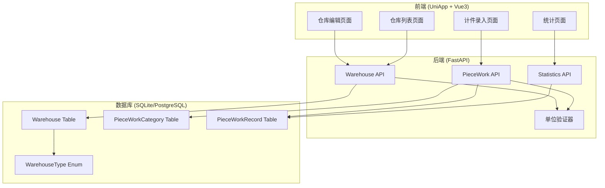
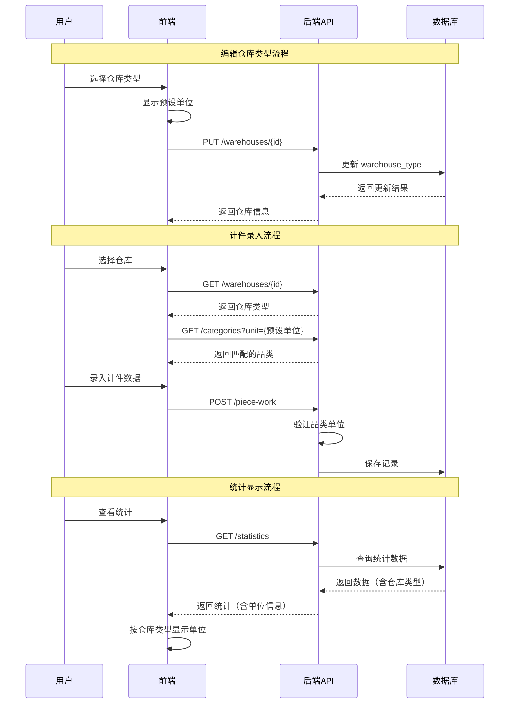

# Design Document

## Overview

本设计文档描述仓库分类功能的技术实现方案。该功能为仓库添加类型分类（计件/点位/整车/距离），每种类型对应预设的品类单位，并在所有数据统计页面自动显示对应单位。

## Architecture

### 系统架构图



### 数据流向图



## Components

### 1. 数据库模型变更

#### 1.1 WarehouseType 枚举

```python
# 文件: fleet-manager/backend/models.py

class WarehouseType(str, Enum):
    """
    仓库类型枚举
    定义仓库的业务分类，每种类型对应预设的计量单位
    
    - PIECE: 计件类型，预设单位为"件"
    - POINT: 点位类型，预设单位为"点"
    - WHOLE: 整车类型，预设单位为"车"
    - DISTANCE: 距离类型，预设单位为"公里"
    """
    PIECE = "piece"      # 计件 → 件
    POINT = "point"      # 点位 → 点
    WHOLE = "whole"      # 整车 → 车
    DISTANCE = "distance"  # 距离 → 公里
```

#### 1.2 仓库类型与单位映射

```python
# 文件: fleet-manager/backend/models.py 或 helpers.py

# 仓库类型到预设单位的映射
WAREHOUSE_TYPE_UNIT_MAP: dict[WarehouseType, str] = {
    WarehouseType.PIECE: "件",
    WarehouseType.POINT: "点",
    WarehouseType.WHOLE: "车",
    WarehouseType.DISTANCE: "公里",
}

# 仓库类型显示名称映射
WAREHOUSE_TYPE_DISPLAY_MAP: dict[WarehouseType, str] = {
    WarehouseType.PIECE: "计件",
    WarehouseType.POINT: "点位",
    WarehouseType.WHOLE: "整车",
    WarehouseType.DISTANCE: "距离",
}

def get_warehouse_preset_unit(warehouse_type: WarehouseType) -> str:
    """
    获取仓库类型对应的预设单位
    
    Args:
        warehouse_type: 仓库类型枚举值
        
    Returns:
        预设单位字符串
    """
    return WAREHOUSE_TYPE_UNIT_MAP.get(warehouse_type, "件")
```

#### 1.3 Warehouse 模型变更

```python
# 文件: fleet-manager/backend/models.py

class Warehouse(SQLModel, table=True):
    """
    仓库表
    存储仓库/工作地点信息
    
    新增字段:
        warehouse_type: 仓库类型（计件/点位/整车/距离），默认为计件
    """
    __tablename__ = "warehouses"

    id: Optional[int] = Field(default=None, primary_key=True)
    name: str = Field(max_length=100, index=True)
    address: Optional[str] = Field(default=None, max_length=255)
    is_active: bool = Field(default=True)
    # 新增：仓库类型字段，默认为计件类型
    warehouse_type: WarehouseType = Field(
        default=WarehouseType.PIECE,
        description="仓库类型：piece=计件, point=点位, whole=整车, distance=距离"
    )
    created_at: datetime = Field(default_factory=datetime.now)
    
    # ... 其他关联关系保持不变
```

### 2. Schema 变更

#### 2.1 仓库相关 Schema

```python
# 文件: fleet-manager/backend/schemas.py

from models import WarehouseType

class WarehouseBase(BaseModel):
    """
    仓库基础模式
    """
    name: str = Field(..., min_length=1, max_length=100, description="仓库名称")
    address: Optional[str] = Field(default=None, max_length=255, description="仓库地址")
    is_active: bool = Field(default=True, description="是否启用")
    # 新增：仓库类型
    warehouse_type: WarehouseType = Field(
        default=WarehouseType.PIECE,
        description="仓库类型：piece=计件, point=点位, whole=整车, distance=距离"
    )


class WarehouseCreate(WarehouseBase):
    """创建仓库请求模式"""
    pass


class WarehouseUpdate(BaseModel):
    """
    更新仓库请求模式
    所有字段可选
    """
    name: Optional[str] = Field(default=None, max_length=100, description="仓库名称")
    address: Optional[str] = Field(default=None, max_length=255, description="仓库地址")
    is_active: Optional[bool] = Field(default=None, description="是否启用")
    # 新增：仓库类型
    warehouse_type: Optional[WarehouseType] = Field(default=None, description="仓库类型")


class WarehouseResponse(WarehouseBase):
    """
    仓库响应模式
    """
    id: int = Field(..., description="仓库ID")
    created_at: datetime = Field(..., description="创建时间")
    # 新增：预设单位（计算字段）
    preset_unit: str = Field(default="件", description="预设单位")

    class Config:
        from_attributes = True
```

#### 2.2 统计相关 Schema 增强

```python
# 文件: fleet-manager/backend/schemas.py

class PieceWorkStatsResponse(BaseModel):
    """
    计件统计响应模式
    增强：包含单位信息
    """
    total_quantity: int = Field(..., description="总数量")
    total_amount: float = Field(..., description="总金额")
    record_count: int = Field(..., description="记录数")
    # 新增：单位信息
    unit: str = Field(default="件", description="计量单位")
    warehouse_type: Optional[str] = Field(default=None, description="仓库类型")


class WarehouseStatsResponse(BaseModel):
    """
    按仓库分组的统计响应模式
    """
    warehouse_id: int = Field(..., description="仓库ID")
    warehouse_name: str = Field(..., description="仓库名称")
    warehouse_type: str = Field(..., description="仓库类型")
    unit: str = Field(..., description="计量单位")
    total_quantity: int = Field(..., description="总数量")
    total_amount: float = Field(..., description="总金额")
    record_count: int = Field(..., description="记录数")
```

### 3. API 接口设计

#### 3.1 仓库 API 增强

| 接口 | 方法 | 路径 | 变更说明 |
|------|------|------|----------|
| 获取仓库列表 | GET | /warehouses | 返回包含 warehouse_type 和 preset_unit |
| 获取单个仓库 | GET | /warehouses/{id} | 返回包含 warehouse_type 和 preset_unit |
| 创建仓库 | POST | /warehouses | 支持设置 warehouse_type |
| 更新仓库 | PUT | /warehouses/{id} | 支持更新 warehouse_type |
| 按类型筛选仓库 | GET | /warehouses?type={type} | 新增：支持按类型筛选 |

#### 3.2 品类 API 增强

| 接口 | 方法 | 路径 | 变更说明 |
|------|------|------|----------|
| 按单位筛选品类 | GET | /categories?unit={unit} | 新增：支持按单位筛选 |
| 获取仓库可用品类 | GET | /warehouses/{id}/categories | 新增：返回匹配仓库类型的品类 |

#### 3.3 计件 API 增强

| 接口 | 方法 | 路径 | 变更说明 |
|------|------|------|----------|
| 创建计件记录 | POST | /piece-work | 增加单位验证逻辑 |

#### 3.4 统计 API 增强

| 接口 | 方法 | 路径 | 变更说明 |
|------|------|------|----------|
| 获取统计数据 | GET | /statistics | 返回包含单位信息 |
| 按仓库分组统计 | GET | /statistics/by-warehouse | 返回各仓库的统计（含单位） |

### 4. 前端组件设计

#### 4.1 TypeScript 类型定义

```typescript
// 文件: fleet-manager/frontend/src/api/types.ts

/** 仓库类型枚举 */
export enum WarehouseType {
  /** 计件 */
  PIECE = 'piece',
  /** 点位 */
  POINT = 'point',
  /** 整车 */
  WHOLE = 'whole',
  /** 距离 */
  DISTANCE = 'distance',
}

/** 仓库类型显示名称映射 */
export const WAREHOUSE_TYPE_DISPLAY_NAMES: Record<WarehouseType, string> = {
  [WarehouseType.PIECE]: '计件',
  [WarehouseType.POINT]: '点位',
  [WarehouseType.WHOLE]: '整车',
  [WarehouseType.DISTANCE]: '距离',
}

/** 仓库类型预设单位映射 */
export const WAREHOUSE_TYPE_UNITS: Record<WarehouseType, string> = {
  [WarehouseType.PIECE]: '件',
  [WarehouseType.POINT]: '点',
  [WarehouseType.WHOLE]: '车',
  [WarehouseType.DISTANCE]: '公里',
}

/**
 * 获取仓库类型显示名称
 * @param type 仓库类型
 * @returns 显示名称
 */
export function getWarehouseTypeDisplayName(type: WarehouseType): string {
  return WAREHOUSE_TYPE_DISPLAY_NAMES[type] || '未知'
}

/**
 * 获取仓库类型预设单位
 * @param type 仓库类型
 * @returns 预设单位
 */
export function getWarehousePresetUnit(type: WarehouseType): string {
  return WAREHOUSE_TYPE_UNITS[type] || '件'
}

/** 仓库信息（更新） */
export interface Warehouse {
  id: number;
  name: string;
  address: string | null;
  is_active: boolean;
  /** 仓库类型 */
  warehouse_type: WarehouseType;
  /** 预设单位 */
  preset_unit: string;
  created_at: string;
}

/** 创建仓库请求（更新） */
export interface WarehouseCreate {
  name: string;
  address?: string;
  /** 仓库类型 */
  warehouse_type?: WarehouseType;
}

/** 更新仓库请求（更新） */
export interface WarehouseUpdate {
  name?: string;
  address?: string;
  is_active?: boolean;
  /** 仓库类型 */
  warehouse_type?: WarehouseType;
}
```

#### 4.2 仓库编辑页面组件设计

```vue
<!-- 仓库类型选择器组件设计 -->
<template>
  <view class="warehouse-type-selector">
    <view class="selector-label">仓库类型</view>
    <view class="type-options">
      <view 
        v-for="option in typeOptions" 
        :key="option.value"
        :class="['type-option', { active: modelValue === option.value }]"
        @click="selectType(option.value)"
      >
        <text class="option-name">{{ option.label }}</text>
        <text class="option-unit">单位: {{ option.unit }}</text>
      </view>
    </view>
  </view>
</template>
```

#### 4.3 统计页面单位显示设计

统计页面需要根据仓库类型自动显示对应单位：

1. **单仓库统计**：直接使用该仓库的预设单位
2. **多仓库汇总**：按仓库类型分组显示，每组使用对应单位
3. **导出数据**：包含单位列

### 5. 数据迁移设计

#### 5.1 迁移脚本

```python
# 文件: fleet-manager/backend/migrations/add_warehouse_type.py

"""
数据库迁移脚本：添加仓库类型字段
将现有仓库默认设置为"计件"类型
"""

from sqlalchemy import text

def upgrade(connection):
    """
    升级数据库：添加 warehouse_type 字段
    """
    # 添加字段（SQLite 语法）
    connection.execute(text("""
        ALTER TABLE warehouses 
        ADD COLUMN warehouse_type VARCHAR(20) DEFAULT 'piece' NOT NULL
    """))
    
def downgrade(connection):
    """
    降级数据库：移除 warehouse_type 字段
    注意：SQLite 不支持 DROP COLUMN，需要重建表
    """
    pass
```

### 6. 单位验证逻辑

#### 6.1 验证器设计

```python
# 文件: fleet-manager/backend/helpers.py

from fastapi import HTTPException
from models import WarehouseType, Warehouse, PieceWorkCategory

def validate_category_unit_for_warehouse(
    warehouse: Warehouse, 
    category: PieceWorkCategory
) -> bool:
    """
    验证品类单位是否匹配仓库类型
    
    Args:
        warehouse: 仓库对象
        category: 品类对象
        
    Returns:
        是否匹配
        
    Raises:
        HTTPException: 单位不匹配时抛出 400 错误
    """
    expected_unit = get_warehouse_preset_unit(warehouse.warehouse_type)
    
    if category.unit != expected_unit:
        raise HTTPException(
            status_code=400,
            detail=f"品类单位'{category.unit}'与仓库类型'{warehouse.warehouse_type}'不匹配，"
                   f"该仓库只能使用单位为'{expected_unit}'的品类"
        )
    
    return True
```

## Correctness Properties

### Property 1: 仓库类型与单位映射一致性

```
FORALL warehouse IN warehouses:
  warehouse.preset_unit == WAREHOUSE_TYPE_UNIT_MAP[warehouse.warehouse_type]
```

**验证方法**：单元测试验证所有仓库类型的预设单位映射正确。

### Property 2: 计件记录单位验证

```
FORALL record IN piece_work_records:
  IF record.warehouse_id IS NOT NULL THEN
    record.category.unit == get_warehouse_preset_unit(record.warehouse.warehouse_type)
```

**验证方法**：集成测试验证创建计件记录时的单位验证逻辑。

### Property 3: 统计数据单位正确性

```
FORALL stats IN statistics_by_warehouse:
  stats.unit == get_warehouse_preset_unit(stats.warehouse.warehouse_type)
```

**验证方法**：API 测试验证统计接口返回的单位信息正确。

### Property 4: 数据迁移完整性

```
FORALL warehouse IN existing_warehouses:
  AFTER migration:
    warehouse.warehouse_type == WarehouseType.PIECE
```

**验证方法**：迁移测试验证现有仓库默认类型设置正确。

### Property 5: 前端类型选择器状态一致性

```
FORALL warehouse_edit_form:
  displayed_unit == WAREHOUSE_TYPE_UNITS[selected_warehouse_type]
```

**验证方法**：前端组件测试验证类型选择与单位显示同步。

## Dependencies

### 后端依赖

| 依赖 | 版本 | 用途 |
|------|------|------|
| FastAPI | 现有 | Web 框架 |
| SQLModel | 现有 | ORM |
| Pydantic | 现有 | 数据验证 |

### 前端依赖

| 依赖 | 版本 | 用途 |
|------|------|------|
| Vue 3 | 现有 | UI 框架 |
| UniApp | 现有 | 跨平台框架 |
| TypeScript | 现有 | 类型安全 |

### 数据库依赖

- SQLite（开发环境）
- PostgreSQL（生产环境）

## Error Handling

### 后端错误处理

| 错误场景 | HTTP 状态码 | 错误消息 |
|----------|-------------|----------|
| 无效的仓库类型 | 422 | "无效的仓库类型" |
| 品类单位不匹配 | 400 | "品类单位与仓库类型不匹配" |
| 仓库不存在 | 404 | "仓库不存在" |

### 前端错误处理

| 错误场景 | 处理方式 |
|----------|----------|
| 类型选择失败 | Toast 提示 + 保持原值 |
| 品类加载失败 | Toast 提示 + 重试按钮 |
| 保存失败 | Toast 提示 + 显示错误详情 |

## Testing Strategy

### 单元测试

1. **仓库类型枚举测试**
   - 验证所有枚举值正确
   - 验证类型到单位映射正确

2. **验证器测试**
   - 验证单位匹配逻辑
   - 验证错误抛出

### 集成测试

1. **API 测试**
   - 创建/更新仓库（含类型）
   - 按类型筛选仓库
   - 按单位筛选品类
   - 计件记录单位验证

2. **数据迁移测试**
   - 验证迁移脚本执行
   - 验证默认值设置

### 前端测试

1. **组件测试**
   - 类型选择器交互
   - 单位显示同步

2. **页面测试**
   - 仓库编辑流程
   - 统计页面单位显示

## Milestones

### 里程碑 1：后端基础实现
- [ ] 添加 WarehouseType 枚举
- [ ] 更新 Warehouse 模型
- [ ] 更新 Schema
- [ ] 数据迁移脚本

### 里程碑 2：API 实现
- [ ] 仓库 API 增强
- [ ] 品类筛选 API
- [ ] 单位验证逻辑
- [ ] 统计 API 增强

### 里程碑 3：前端实现
- [ ] TypeScript 类型定义
- [ ] 仓库编辑页面增强
- [ ] 统计页面单位显示

### 里程碑 4：测试与文档
- [ ] 单元测试
- [ ] 集成测试
- [ ] 更新 API 文档
