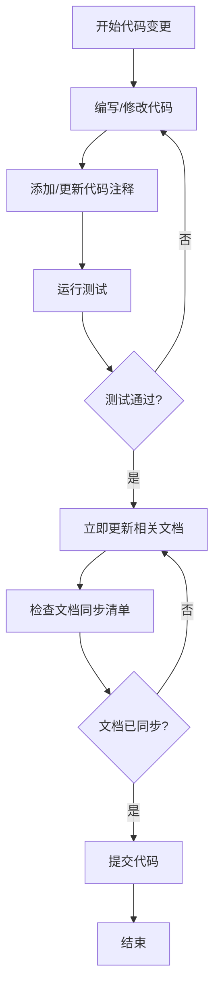
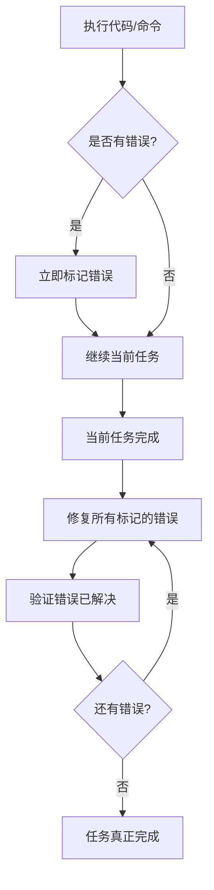

# 强制规则（必须遵守）

> **警告**：这些是硬性规则，必须 100% 遵守，无任何例外！

## 🚨 规则 1：所有代码必须有完整注释

### 适用范围
- 所有 TypeScript/JavaScript 文件
- 所有 React/Taro 组件
- 所有工具函数和脚本
- 所有配置文件（如需要）

### 具体要求

#### 1.1 文件注释（必须）
每个代码文件开头必须添加文件说明：
```typescript
/**
 * 用户管理服务
 * 提供用户信息的增删改查功能
 * @module services/user
 */
```

#### 1.2 函数注释（必须）
所有函数都必须添加 JSDoc 注释：
```typescript
/**
 * 获取用户信息
 * @param userId - 用户ID
 * @returns 用户信息对象，如果用户不存在则返回 null
 * @throws {Error} 当数据库连接失败时抛出错误
 */
export async function getUserInfo(userId: string): Promise<User | null> {
  // 实现代码
}
```

**即使是简单函数也必须注释：**
```typescript
/**
 * 格式化用户名称
 * @param firstName - 名
 * @param lastName - 姓
 * @returns 格式化后的完整姓名
 */
function formatUserName(firstName: string, lastName: string): string {
  return `${lastName}${firstName}`;
}
```

#### 1.3 行内注释（必须）
复杂逻辑、关键步骤、算法必须添加行内注释：
```typescript
export async function processOrder(orderId: string): Promise<void> {
  // 1. 验证订单是否存在
  const order = await getOrder(orderId);
  if (!order) {
    throw new Error('订单不存在');
  }

  // 2. 检查库存是否充足
  const hasStock = await checkStock(order.items);
  if (!hasStock) {
    throw new Error('库存不足');
  }

  // 3. 扣减库存（使用事务确保原子性）
  await db.transaction(async (trx) => {
    await deductStock(order.items, trx);
    await updateOrderStatus(orderId, 'processing', trx);
  });

  // 4. 发送订单确认通知
  await sendOrderConfirmation(order.userId, orderId);
}
```

#### 1.4 魔法数字注释（必须）
所有魔法数字必须注释说明含义：
```typescript
// 最大重试次数：3次
const MAX_RETRY_COUNT = 3;

// 超时时间：30秒
const TIMEOUT_MS = 30 * 1000;

// 分页大小：每页20条
const PAGE_SIZE = 20;
```

#### 1.5 组件注释（必须）
React/Taro 组件必须添加注释：
```typescript
/**
 * 用户资料卡片组件
 * 显示用户的基本信息和操作按钮
 * @param props - 组件属性
 * @param props.user - 用户信息对象
 * @param props.onEdit - 编辑按钮点击回调
 */
export function UserProfileCard({ user, onEdit }: UserProfileCardProps) {
  // 组件实现
}
```

### 注释质量要求
- ✅ 注释必须清晰、准确、有意义
- ✅ 使用中文注释（项目团队语言）
- ✅ 注释必须与代码同步更新
- ❌ 避免无用注释（如 `// 定义变量 x`）
- ❌ 避免过时的注释

### 违规后果
- 未添加注释的代码视为不完整
- 必须立即补充注释后才能继续
- 不允许提交未注释的代码

---

## 🚨 规则 2：文档必须实时同步更新

### 适用范围
- 所有代码变更
- 所有功能开发
- 所有 Bug 修复
- 所有重构工作

### 具体要求

#### 2.1 同步时机（强制）
- **代码变更时必须立即更新文档**
- **不允许先改代码后补文档**
- **不允许延后更新文档**
- **每次提交前必须确认文档已更新**

#### 2.2 必须同步的文档类型

##### 1. 代码注释（强制）
- 逻辑变更时立即更新注释
- 函数签名变更时立即更新 JSDoc
- 删除代码时删除对应注释

##### 2. API 文档（强制）
- 接口变更时立即更新 API 文档
- 参数变更时立即更新参数说明
- 返回值变更时立即更新返回值说明

##### 3. README（强制）
- 功能变更时立即更新 README
- 新增功能时立即添加到 README
- 删除功能时立即从 README 移除

##### 4. 设计文档（强制）
- 架构变更时立即更新设计文档
- 数据模型变更时立即更新设计文档
- 接口契约变更时立即更新设计文档

##### 5. Spec 文档（强制）
- 需求变更时立即更新 requirements.md
- 设计变更时立即更新 design.md
- 任务变更时立即更新 tasks.md

##### 6. 变更日志（强制）
- 重要变更必须记录到 CHANGELOG
- 破坏性变更必须特别标注
- 版本发布时必须更新版本号

#### 2.3 文档同步检查清单

每次代码提交前必须确认：
- [ ] 所有代码注释已添加/更新
- [ ] API 文档已更新（如有接口变更）
- [ ] README 已更新（如有功能变更）
- [ ] 设计文档已更新（如有架构变更）
- [ ] Spec 文档已更新（如有需求/设计变更）
- [ ] 任务文档已更新（如有进度变更）
- [ ] 变更日志已记录（如有重要变更）

#### 2.4 文档同步流程



### 文档同步示例

#### 示例 1：修改函数签名
```typescript
// ❌ 错误：只改代码，不更新注释
/**
 * 获取用户信息
 * @param userId - 用户ID
 * @returns 用户信息对象
 */
export async function getUserInfo(userId: string, includeProfile: boolean): Promise<User | null> {
  // 实现代码
}

// ✅ 正确：同步更新注释
/**
 * 获取用户信息
 * @param userId - 用户ID
 * @param includeProfile - 是否包含详细资料
 * @returns 用户信息对象，如果用户不存在则返回 null
 */
export async function getUserInfo(userId: string, includeProfile: boolean): Promise<User | null> {
  // 实现代码
}
```

#### 示例 2：新增功能
当新增功能时，必须同步更新：
1. 代码注释（函数、文件注释）
2. README（功能说明）
3. API 文档（如有接口）
4. Spec 文档（如在 Spec 中）

#### 示例 3：重构代码
当重构代码时，必须同步更新：
1. 代码注释（反映新的实现逻辑）
2. 设计文档（如架构有变化）
3. API 文档（如接口有变化）

### 违规后果
- 未同步更新文档的代码变更视为不完整
- 必须立即补充文档后才能继续下一步
- 不允许提交未完成文档的代码
- 不允许以"后续补充文档"为理由延后

---

## 执行机制

### 自我检查
每次编写代码时，必须自问：
1. ✅ 我是否为所有函数添加了注释？
2. ✅ 我是否为复杂逻辑添加了行内注释？
3. ✅ 我是否更新了相关文档？
4. ✅ 文档与代码是否 100% 同步？

### 代码审查
代码审查时，必须检查：
1. ✅ 所有代码是否有完整注释
2. ✅ 所有文档是否已同步更新
3. ✅ 注释质量是否符合要求
4. ✅ 文档内容是否准确

### 提交前检查
每次提交前，必须确认：
```bash
# 1. 检查代码注释
# 确保所有函数都有 JSDoc 注释

# 2. 检查文档同步
# 确保 README、API 文档、Spec 文档已更新

# 3. 运行测试
npm run test

# 4. 运行 lint
npm run lint

# 5. 提交代码
git commit -m "feat: 添加用户管理功能（已更新文档和注释）"
```

---

## 🚨 规则 3：所有对话输出必须使用中文

### 适用范围
- 所有与用户的对话交互
- 所有代码注释
- 所有文档内容
- 所有错误提示和说明

### 具体要求

#### 3.1 对话输出（强制）
- **所有回复必须使用中文**
- **技术术语可以保留英文原文，但需要中文解释**
- **代码示例中的注释必须使用中文**

#### 3.2 上下文继承（强制）
- **新对话必须继承上一个对话的上下文**
- **必须查看任务文档了解当前进度**
- **必须延续之前的工作状态**

#### 3.3 示例
```
✅ 正确：任务 10.2.1 已完成，所有 8 个单元测试用例全部通过。
❌ 错误：Task 10.2.1 completed, all 8 unit tests passed.
```

### 违规后果
- 非中文输出视为不符合规范
- 必须立即使用中文重新回复

---

## 🚨 规则 4：编码错误必须标记并修复

### 适用范围
- 所有代码文件的编译错误
- 所有脚本的执行错误
- 所有终端命令的错误输出
- 所有工具的错误报告

### 具体要求

#### 4.1 错误发现时（强制）
当发现任何编码错误时，**必须立即标记**：
- **在对话中明确指出错误**
- **记录错误的文件路径和行号**
- **记录错误的具体内容**
- **标记为待修复项**

#### 4.2 错误标记格式（强制）
```
⚠️ 发现编码错误：
- 文件：src/xxx/xxx.ts
- 行号：第 XX 行
- 错误：[具体错误信息]
- 状态：待修复（当前任务完成后处理）
```

#### 4.3 错误修复时机（强制）
- **当前任务完成后必须立即修复所有标记的错误**
- **不允许遗留未修复的编码错误**
- **不允许忽略任何错误**
- **修复后必须验证错误已解决**

#### 4.4 错误来源（必须处理）
以下来源的错误都必须标记和修复：

##### 1. TypeScript 编译错误
```bash
# 检查命令
npx tsc --noEmit
pnpm taro build --type h5
```

##### 2. ESLint/Biome 错误
```bash
# 检查命令
npm run lint
npx biome check .
```

##### 3. 脚本执行错误
```bash
# 任何脚本执行失败都必须处理
node scripts/xxx.js
powershell scripts/xxx.ps1
```

##### 4. 终端命令错误
```bash
# 任何命令执行失败都必须处理
npm run xxx
pnpm xxx
```

#### 4.5 错误处理流程



#### 4.6 错误修复检查清单

任务完成前必须确认：
- [ ] 所有 TypeScript 编译错误已修复
- [ ] 所有 Lint 错误已修复
- [ ] 所有脚本执行错误已修复
- [ ] 所有终端命令错误已修复
- [ ] 运行 `npx tsc --noEmit` 无错误
- [ ] 运行 `npm run lint` 无错误

### 违规后果
- 未标记的错误视为工作疏忽
- 未修复的错误视为任务未完成
- 不允许带着错误结束任务
- 必须修复所有错误后才能继续下一个任务

### 示例

#### 示例 1：发现编译错误
```
⚠️ 发现编码错误：
- 文件：src/hooks/useRealtimeSubscription.ts
- 行号：第 45 行
- 错误：Property 'channel' does not exist on type 'RealtimeChannel'
- 状态：待修复（当前任务完成后处理）

继续执行当前任务...

---
当前任务已完成，现在修复标记的错误：
[修复代码...]
验证：运行 `npx tsc --noEmit` 无错误 ✅
```

#### 示例 2：发现脚本错误
```
⚠️ 发现脚本错误：
- 脚本：scripts/deploy.ps1
- 错误：Cannot find module 'xxx'
- 状态：待修复（当前任务完成后处理）

继续执行当前任务...

---
当前任务已完成，现在修复标记的错误：
[修复脚本...]
验证：重新执行脚本成功 ✅
```

---

## 🚨 规则 5：发现问题时必须全局检查

### 适用范围
- 修复任何 Bug 或问题时
- 发现代码模式问题时
- 发现导入/依赖问题时
- 发现兼容性问题时

### 具体要求

#### 5.1 全局检查原则（强制）
当发现一个问题时，**必须检查其他地方是否有相同问题**：
- **不要只修复当前文件，要检查整个项目**
- **使用 grep 搜索相同的代码模式**
- **检查所有相关文件是否有类似问题**
- **一次性修复所有相同问题**

#### 5.2 检查流程（强制）
```
发现问题
    │
    ▼
┌─────────────────────────────────────┐
│ 1. 分析问题的根本原因               │
│ 2. 确定问题的代码模式               │
│ 3. 使用 grep 搜索整个项目           │
│ 4. 列出所有存在相同问题的文件       │
│ 5. 一次性修复所有问题               │
│ 6. 验证所有修复都生效               │
└─────────────────────────────────────┘
```

#### 5.3 示例

##### 示例 1：发现导入问题
```
发现问题：某页面使用了 Taro.hideLoading() 而不是兼容层的 hideLoading()

必须执行：
1. grep 搜索 "Taro.hideLoading" 和 "Taro.showLoading"
2. 列出所有使用原生 Taro API 的文件
3. 一次性修复所有文件
4. 验证所有文件都已修复
```

##### 示例 2：发现代码模式问题
```
发现问题：某组件缺少错误处理

必须执行：
1. 检查所有类似组件是否有相同问题
2. 列出所有需要修复的组件
3. 一次性添加错误处理
4. 验证所有组件都已修复
```

### 违规后果
- 只修复单个文件而忽略其他文件视为工作不完整
- 必须全局检查并修复所有相同问题
- 不允许遗留已知的相同问题

---

## 🚨 规则 6：进程管理必须规范

### 适用范围
- 所有后台进程（开发服务器、构建进程等）
- 所有长时间运行的命令
- 所有可能超时的操作

### 具体要求

#### 6.1 构建失败或超时时（强制）
- **构建失败时必须立即终止进程**
- **命令超时时必须立即终止进程**
- **不允许遗留僵尸进程**
- **启动新进程前必须检查并清理旧进程**

#### 6.2 进程管理流程（强制）
```
启动新进程前
    │
    ▼
┌─────────────────────────────────────┐
│ 1. 使用 listProcesses 检查现有进程  │
│ 2. 终止所有相关的旧进程             │
│ 3. 启动新进程                       │
│ 4. 验证进程正常运行                 │
└─────────────────────────────────────┘

构建失败/超时时
    │
    ▼
┌─────────────────────────────────────┐
│ 1. 立即终止失败的进程               │
│ 2. 清理相关资源                     │
│ 3. 分析失败原因                     │
│ 4. 修复问题后重新启动               │
└─────────────────────────────────────┘
```

#### 6.3 本地服务器管理（强制）
```bash
# 启动前检查
listProcesses

# 如果有旧进程，先终止
controlPwshProcess action=stop processId=xxx

# 启动新进程
controlPwshProcess action=start command="npx serve dist -l 8080 -s"

# 验证进程状态
getProcessOutput processId=xxx
```

#### 6.4 构建命令规范（强制）
- **构建命令必须设置合理的超时时间**
- **超时后必须终止进程并报告**
- **不要让构建命令无限期运行**

### 违规后果
- 遗留僵尸进程会导致端口占用和资源浪费
- 必须在启动新进程前清理旧进程
- 构建失败后必须终止进程并报告原因

---

## 🚨 规则 7：删除优化必须全面扫描和深度测试

### 适用范围
- 删除任何函数、类型、变量、组件
- 优化重构涉及删除代码
- 合并或替换现有功能
- 清理未使用的代码

### 具体要求

#### 7.1 删除前必须执行的检查（强制）

##### 全局关联性扫描
- **使用 grep 搜索整个代码库中的所有引用**
- **检查函数/类型/变量的直接调用**
- **检查间接依赖（如通过导出的模块）**
- **检查配置文件中的引用**
- **检查测试文件中的引用**

##### 影响范围分析
- **列出所有受影响的文件**
- **分析每个调用点的上下文**
- **评估删除后的功能影响**
- **确认是否影响用户可见功能**

##### 类型依赖检查
- **检查类型接口是否被其他类型继承或引用**
- **检查泛型参数中的使用**
- **检查类型断言中的使用**

#### 7.2 删除后必须执行的验证（强制）

##### 编译检查
```bash
# 必须运行
npx tsc --noEmit
```

##### 功能测试
- **运行相关的单元测试**
- **如果涉及页面功能，必须进行本地 H5 测试**
- **验证相关功能正常工作**

##### 回归测试
- **确认删除不影响其他功能**
- **检查相关页面的正常运行**

#### 7.3 删除优化检查清单

删除代码前必须确认：
- [ ] 已使用 grep 搜索所有引用
- [ ] 已分析所有调用点的上下文
- [ ] 已评估删除后的功能影响
- [ ] 已确认不影响用户可见功能
- [ ] 已更新所有调用点（如需要）

删除代码后必须确认：
- [ ] TypeScript 编译通过
- [ ] 相关单元测试通过
- [ ] 本地功能测试通过（如涉及页面）
- [ ] 无遗留的死代码引用

#### 7.4 删除优化标准流程

```bash
# 1. 搜索所有引用
grep -r "functionName" --include="*.ts" --include="*.tsx"

# 2. 分析每个调用点
# - 确认调用点的功能用途
# - 确认删除后的替代方案

# 3. 删除函数定义和所有调用

# 4. 验证编译
npx tsc --noEmit

# 5. 运行测试
npx vitest run

# 6. 本地功能测试（如涉及页面）
pnpm taro build --type h5
npx serve dist -l 8080 -s
```

### 违规后果
- 未进行关联性扫描的删除视为不完整
- 删除后未验证的代码变更不允许提交
- 导致功能回归的删除必须立即回滚

---

## 🚨 规则 8：数据库迁移必须自主完成

### 适用范围
- 所有涉及数据库表结构变更的任务
- 添加新字段、新表、新索引
- 修改字段类型、约束
- 数据迁移和转换

### 具体要求

#### 8.1 迁移执行原则（强制）
- **所有数据库迁移必须自主完成，不要求用户手动执行**
- **创建迁移文件后必须立即执行迁移**
- **使用 scripts/db-migrate-direct.js 或直接调用 Supabase API 执行迁移**
- **迁移完成后必须验证字段/表已正确创建**

#### 8.2 迁移执行流程（强制）
```
创建迁移文件
    │
    ▼
┌─────────────────────────────────────┐
│ 1. 创建 SQL 迁移文件                │
│ 2. 立即执行迁移脚本                 │
│ 3. 验证迁移结果                     │
│ 4. 如失败，分析原因并重试           │
└─────────────────────────────────────┘
```

#### 8.3 迁移执行方式（强制）

##### 方式 1：使用迁移脚本
```bash
# 执行迁移
node scripts/db-migrate-direct.js

# 或创建专用迁移脚本
node scripts/execute-migration.js
```

##### 方式 2：使用 Supabase REST API
```javascript
// 使用 service_role key 执行 SQL
const { createClient } = require('@supabase/supabase-js')
const supabase = createClient(url, serviceRoleKey)

// 执行 ALTER TABLE 等 DDL 语句
await supabase.rpc('exec_sql', { sql: 'ALTER TABLE ...' })
```

##### 方式 3：直接使用 Supabase CLI
```bash
# 如果配置了 Supabase CLI
supabase db push
```

#### 8.4 迁移验证（强制）
迁移执行后必须验证：
- [ ] 新字段/表已存在
- [ ] 字段类型正确
- [ ] 默认值正确
- [ ] 约束正确
- [ ] 相关功能正常工作

#### 8.5 示例

```javascript
// 创建迁移执行脚本
const { createClient } = require('@supabase/supabase-js')
require('dotenv').config()

const supabase = createClient(
  process.env.VITE_SUPABASE_URL,
  process.env.VITE_SUPABASE_SERVICE_ROLE_KEY
)

async function executeMigration() {
  // 执行迁移 SQL
  const { error } = await supabase.rpc('exec_sql', {
    sql: `
      ALTER TABLE vehicle_documents
      ADD COLUMN IF NOT EXISTS supplemented_photos JSONB DEFAULT '{}'::jsonb;
    `
  })
  
  if (error) {
    console.error('迁移失败:', error)
    return false
  }
  
  console.log('迁移成功')
  return true
}

executeMigration()
```

### 违规后果
- 创建迁移文件但不执行视为任务未完成
- 要求用户手动执行迁移视为违规
- 必须自主完成所有数据库变更

---

## 🚨 规则 9：方法不行就立即换方法

### 适用范围
- 所有命令执行
- 所有测试运行
- 所有调试过程
- 所有问题解决

### 具体要求

#### 9.1 快速失败原则（强制）
- **如果一个方法超时或失败，立即换另一种方法**
- **不要重复尝试同一个失败的方法**
- **不要让用户等待超过 30 秒的无效操作**
- **终端有问题就换命令方式，命令有问题就换脚本方式**

#### 9.2 替代方案优先级
1. 简化命令/参数
2. 换用不同的执行方式（如 cmd 代替 powershell）
3. 创建批处理脚本执行
4. 跳过当前步骤，基于已有结果继续

#### 9.3 示例
```
❌ 错误：同一个超时命令重复执行 3 次
✅ 正确：第一次超时后立即换方法或跳过

❌ 错误：hypothesis 测试超时，继续等待
✅ 正确：换成简单的单元测试，或基于已有测试结果继续
```

### 违规后果
- 浪费用户时间是不可接受的
- 必须快速响应，快速切换方案

---

## 🚨 规则 10：单个测试超时必须立即处理

### 适用范围
- 所有单元测试
- 所有属性测试（PBT）
- 所有集成测试
- 所有 E2E 测试

### 具体要求

#### 10.1 超时阈值（强制）
- **单个测试超过 1 分钟没有进一步响应，必须立即处理**
- **不允许无限期等待测试完成**
- **超时后必须立即采取行动**

#### 10.2 超时处理流程（强制）
```
测试开始
    │
    ▼
┌─────────────────────────────────────┐
│ 等待测试响应（最多 1 分钟）          │
└─────────────────────────────────────┘
    │
    ├── 有响应 ──▶ 继续等待
    │
    ▼ 超过 1 分钟无响应
┌─────────────────────────────────────┐
│ 第 1 次超时：换方法                  │
│ - 简化测试参数                       │
│ - 减少测试迭代次数                   │
│ - 换用更快的测试方式                 │
└─────────────────────────────────────┘
    │
    ▼ 第 2 次超时
┌─────────────────────────────────────┐
│ 第 2 次超时：结束并继续              │
│ - 终止当前测试                       │
│ - 基于已有结果继续                   │
│ - 标记为需要后续处理                 │
└─────────────────────────────────────┘
```

#### 10.3 具体处理方式

##### 第 1 次超时（换方法）
- 减少 hypothesis 测试的迭代次数（如 max_examples=10）
- 使用更简单的测试数据
- 跳过复杂的属性测试，改用简单的单元测试
- 使用 pytest 的 -x 参数快速失败

##### 第 2 次超时（结束重新开始）
- 立即终止测试进程
- 记录当前状态
- 基于已有的测试结果继续工作
- 不再尝试同一个测试

#### 10.4 示例
```
❌ 错误：hypothesis 测试运行 5 分钟还在等待
✅ 正确：1 分钟后换方法，2 分钟后终止并继续

❌ 错误：同一个超时测试重复运行 3 次
✅ 正确：超过 2 次后直接跳过，基于已有结果继续
```

### 违规后果
- **严格执行，不要浪费用户时间**
- 超时后必须立即行动
- 不允许无限期等待

---

## 总结

### 十一大强制规则
1. **所有代码必须有完整注释** - 无例外
2. **文档必须实时同步更新** - 无例外
3. **所有对话输出必须使用中文** - 无例外
4. **编码错误必须标记并修复** - 无例外
5. **发现问题时必须全局检查** - 无例外
6. **进程管理必须规范** - 无例外
7. **删除优化必须全面扫描和深度测试** - 无例外
8. **数据库迁移必须自主完成** - 无例外
9. **方法不行就立即换方法** - 无例外
10. **单个测试超时必须立即处理** - 无例外（1分钟换方法，2次后结束）
11. **命令必须自主执行，禁止要求用户确认** - 无例外

### 记住
- 注释不是可选的，是必须的
- 文档同步不是可以延后的，是必须立即的
- 中文输出是项目团队的语言规范
- 新对话必须继承上一个对话的上下文
- 编码错误必须标记，任务完成后必须修复
- 发现问题时必须全局检查，不要只修复单个文件
- 进程管理必须规范，避免僵尸进程
- 删除优化必须全面扫描，深度测试后才能提交
- **方法不行就换方法，不要浪费用户时间**
- **测试超时 1 分钟换方法，超过 2 次直接结束**
- 这些规则没有例外情况
- 质量优先，完整性优先

### 口号
**"代码未注释 = 代码未完成"**
**"文档未同步 = 工作未完成"**
**"中文输出 = 团队规范"**
**"错误未修复 = 任务未完成"**
**"问题未全局检查 = 修复不完整"**
**"进程未清理 = 资源浪费"**
**"删除未验证 = 功能回归风险"**
**"迁移未执行 = 功能不可用"**
**"方法不行就换 = 效率优先"**
**"测试超时就换 = 时间宝贵"**

---

## 🚨 规则 11：命令必须自主执行，禁止要求用户确认

### 适用范围
- 所有测试命令
- 所有构建命令
- 所有验证命令
- 所有脚本执行

### 具体要求

#### 11.1 自主执行原则（强制）
- **所有命令必须直接执行，不要弹出确认框让用户点击**
- **用户没有时间一直盯着电脑确认每个操作**
- **如果某个命令需要用户确认才能执行，换用其他方式**
- **Autopilot 模式下应该完全自主运行**

#### 11.2 禁止行为
- ❌ 弹出确认框等待用户点击
- ❌ 询问用户是否要执行某个命令
- ❌ 等待用户输入才能继续
- ❌ 任何需要用户交互才能完成的操作

#### 11.3 替代方案
如果某个操作无法自主执行：
1. **换用可以自主执行的命令**
2. **使用脚本方式执行**
3. **跳过该步骤，基于已有结果继续**
4. **在最后汇总告知用户需要手动执行的操作**

#### 11.4 示例
```
❌ 错误：执行命令前弹出确认框
✅ 正确：直接执行命令，获取结果

❌ 错误：询问用户"是否要运行测试？"
✅ 正确：直接运行测试，报告结果

❌ 错误：等待用户确认后才继续
✅ 正确：自主完成所有操作，最后汇报结果
```

### 违规后果
- **浪费用户时间是不可接受的**
- **用户选择 Autopilot 模式就是希望自主运行**
- **必须尊重用户的时间**
