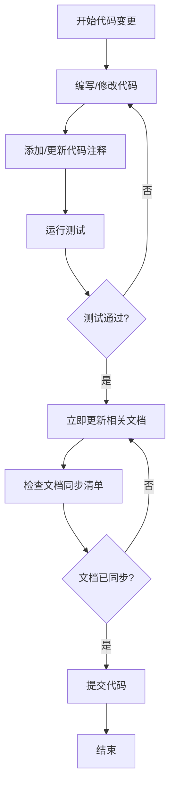

# 强制规则（必须遵守）

> **警告**：这些是硬性规则，必须 100% 遵守，无任何例外！

## 🚨 规则 1：所有代码必须有完整注释

### 适用范围
- 所有 TypeScript/JavaScript 文件
- 所有 React/Taro 组件
- 所有工具函数和脚本
- 所有配置文件（如需要）

### 具体要求

#### 1.1 文件注释（必须）
每个代码文件开头必须添加文件说明：
```typescript
/**
 * 用户管理服务
 * 提供用户信息的增删改查功能
 * @module services/user
 */
```

#### 1.2 函数注释（必须）
所有函数都必须添加 JSDoc 注释：
```typescript
/**
 * 获取用户信息
 * @param userId - 用户ID
 * @returns 用户信息对象，如果用户不存在则返回 null
 * @throws {Error} 当数据库连接失败时抛出错误
 */
export async function getUserInfo(userId: string): Promise<User | null> {
  // 实现代码
}
```

**即使是简单函数也必须注释：**
```typescript
/**
 * 格式化用户名称
 * @param firstName - 名
 * @param lastName - 姓
 * @returns 格式化后的完整姓名
 */
function formatUserName(firstName: string, lastName: string): string {
  return `${lastName}${firstName}`;
}
```

#### 1.3 行内注释（必须）
复杂逻辑、关键步骤、算法必须添加行内注释：
```typescript
export async function processOrder(orderId: string): Promise<void> {
  // 1. 验证订单是否存在
  const order = await getOrder(orderId);
  if (!order) {
    throw new Error('订单不存在');
  }

  // 2. 检查库存是否充足
  const hasStock = await checkStock(order.items);
  if (!hasStock) {
    throw new Error('库存不足');
  }

  // 3. 扣减库存（使用事务确保原子性）
  await db.transaction(async (trx) => {
    await deductStock(order.items, trx);
    await updateOrderStatus(orderId, 'processing', trx);
  });

  // 4. 发送订单确认通知
  await sendOrderConfirmation(order.userId, orderId);
}
```

#### 1.4 魔法数字注释（必须）
所有魔法数字必须注释说明含义：
```typescript
// 最大重试次数：3次
const MAX_RETRY_COUNT = 3;

// 超时时间：30秒
const TIMEOUT_MS = 30 * 1000;

// 分页大小：每页20条
const PAGE_SIZE = 20;
```

#### 1.5 组件注释（必须）
React/Taro 组件必须添加注释：
```typescript
/**
 * 用户资料卡片组件
 * 显示用户的基本信息和操作按钮
 * @param props - 组件属性
 * @param props.user - 用户信息对象
 * @param props.onEdit - 编辑按钮点击回调
 */
export function UserProfileCard({ user, onEdit }: UserProfileCardProps) {
  // 组件实现
}
```

### 注释质量要求
- ✅ 注释必须清晰、准确、有意义
- ✅ 使用中文注释（项目团队语言）
- ✅ 注释必须与代码同步更新
- ❌ 避免无用注释（如 `// 定义变量 x`）
- ❌ 避免过时的注释

### 违规后果
- 未添加注释的代码视为不完整
- 必须立即补充注释后才能继续
- 不允许提交未注释的代码

---

## 🚨 规则 2：文档必须实时同步更新

### 适用范围
- 所有代码变更
- 所有功能开发
- 所有 Bug 修复
- 所有重构工作

### 具体要求

#### 2.1 同步时机（强制）
- **代码变更时必须立即更新文档**
- **不允许先改代码后补文档**
- **不允许延后更新文档**
- **每次提交前必须确认文档已更新**

#### 2.2 必须同步的文档类型

##### 1. 代码注释（强制）
- 逻辑变更时立即更新注释
- 函数签名变更时立即更新 JSDoc
- 删除代码时删除对应注释

##### 2. API 文档（强制）
- 接口变更时立即更新 API 文档
- 参数变更时立即更新参数说明
- 返回值变更时立即更新返回值说明

##### 3. README（强制）
- 功能变更时立即更新 README
- 新增功能时立即添加到 README
- 删除功能时立即从 README 移除

##### 4. 设计文档（强制）
- 架构变更时立即更新设计文档
- 数据模型变更时立即更新设计文档
- 接口契约变更时立即更新设计文档

##### 5. Spec 文档（强制）
- 需求变更时立即更新 requirements.md
- 设计变更时立即更新 design.md
- 任务变更时立即更新 tasks.md

##### 6. 变更日志（强制）
- 重要变更必须记录到 CHANGELOG
- 破坏性变更必须特别标注
- 版本发布时必须更新版本号

#### 2.3 文档同步检查清单

每次代码提交前必须确认：
- [ ] 所有代码注释已添加/更新
- [ ] API 文档已更新（如有接口变更）
- [ ] README 已更新（如有功能变更）
- [ ] 设计文档已更新（如有架构变更）
- [ ] Spec 文档已更新（如有需求/设计变更）
- [ ] 任务文档已更新（如有进度变更）
- [ ] 变更日志已记录（如有重要变更）

#### 2.4 文档同步流程



### 文档同步示例

#### 示例 1：修改函数签名
```typescript
// ❌ 错误：只改代码，不更新注释
/**
 * 获取用户信息
 * @param userId - 用户ID
 * @returns 用户信息对象
 */
export async function getUserInfo(userId: string, includeProfile: boolean): Promise<User | null> {
  // 实现代码
}

// ✅ 正确：同步更新注释
/**
 * 获取用户信息
 * @param userId - 用户ID
 * @param includeProfile - 是否包含详细资料
 * @returns 用户信息对象，如果用户不存在则返回 null
 */
export async function getUserInfo(userId: string, includeProfile: boolean): Promise<User | null> {
  // 实现代码
}
```

#### 示例 2：新增功能
当新增功能时，必须同步更新：
1. 代码注释（函数、文件注释）
2. README（功能说明）
3. API 文档（如有接口）
4. Spec 文档（如在 Spec 中）

#### 示例 3：重构代码
当重构代码时，必须同步更新：
1. 代码注释（反映新的实现逻辑）
2. 设计文档（如架构有变化）
3. API 文档（如接口有变化）

### 违规后果
- 未同步更新文档的代码变更视为不完整
- 必须立即补充文档后才能继续下一步
- 不允许提交未完成文档的代码
- 不允许以"后续补充文档"为理由延后

---

## 执行机制

### 自我检查
每次编写代码时，必须自问：
1. ✅ 我是否为所有函数添加了注释？
2. ✅ 我是否为复杂逻辑添加了行内注释？
3. ✅ 我是否更新了相关文档？
4. ✅ 文档与代码是否 100% 同步？

### 代码审查
代码审查时，必须检查：
1. ✅ 所有代码是否有完整注释
2. ✅ 所有文档是否已同步更新
3. ✅ 注释质量是否符合要求
4. ✅ 文档内容是否准确

### 提交前检查
每次提交前，必须确认：
```bash
# 1. 检查代码注释
# 确保所有函数都有 JSDoc 注释

# 2. 检查文档同步
# 确保 README、API 文档、Spec 文档已更新

# 3. 运行测试
npm run test

# 4. 运行 lint
npm run lint

# 5. 提交代码
git commit -m "feat: 添加用户管理功能（已更新文档和注释）"
```

---

## 总结

### 两大强制规则
1. **所有代码必须有完整注释** - 无例外
2. **文档必须实时同步更新** - 无例外

### 记住
- 注释不是可选的，是必须的
- 文档同步不是可以延后的，是必须立即的
- 这些规则没有例外情况
- 质量优先，完整性优先

### 口号
**"代码未注释 = 代码未完成"**
**"文档未同步 = 工作未完成"**
