# 车队管家系统 - 完整 Wiki

> 车队管理小程序完整技术文档与开发指南

---

## 📚 目录

- [系统概览](#系统概览)
- [快速开始](#快速开始)
- [核心功能](#核心功能)
- [技术架构](#技术架构)
- [数据库设计](#数据库设计)
- [权限系统](#权限系统)
- [API文档](#api文档)
- [开发指南](#开发指南)
- [部署运维](#部署运维)
- [常见问题](#常见问题)

---

## 系统概览

### 项目介绍

车队管家是一款专为物流车队打造的微信小程序管理系统，提供完整的车队运营管理解决方案。

**核心特点**：
- 🎯 多角色权限管理（老板/调度/车队长/司机）
- 📱 微信小程序原生体验
- 🔐 基于 RLS 的数据安全隔离
- ⚡ 实时数据同步
- 📊 完整的统计分析功能

**技术选型**：
- **前端**: Taro 3.x + React + TypeScript + Tailwind CSS
- **后端**: Supabase (PostgreSQL + Auth + RLS)
- **状态管理**: Zustand
- **构建工具**: Webpack 5

---

## 快速开始

### 环境要求

```bash
Node.js >= 16.0.0
pnpm >= 8.0.0
微信开发者工具
```

### 安装步骤

```bash
# 1. 克隆项目
git clone <repository-url>

# 2. 安装依赖
pnpm install

# 3. 配置环境变量
cp .env.template .env
# 编辑 .env 填入 Supabase 配置

# 4. 启动开发服务器
pnpm run dev:h5      # H5 开发模式
pnpm run dev:weapp   # 小程序开发模式
```

### 测试账号

统一密码：`123456`

| 角色 | 账号 | 手机号 | 说明 |
|------|------|--------|------|
| 老板 | boss | 13800000001 | 系统最高权限 |
| 调度 | dispatcher | 13800000002 | 调度管理权限 |
| 车队长 | manager | 13800000003 | 车队管理权限 |
| 司机 | driver | 13800000004 | 司机端功能 |

---

## 核心功能

### 司机端功能

#### 🕐 考勤打卡
- 上班打卡（支持地理位置验证）
- 下班打卡（自动计算工时）
- 打卡历史查询
- 考勤统计报表

#### 📦 计件工作
- 工作量录入（支持多品类）
- 每日/每月统计
- 计件收入计算
- 历史记录查询

#### 📅 请假管理
- 请假申请提交
- 请假天数计算
- 审批进度跟踪
- 请假历史记录

#### 🚪 离职申请
- 离职申请提交
- 离职原因填写
- 审批流程跟踪
- 离职文档管理

#### 🚗 车辆管理
- 车辆信息维护
- 车辆照片上传
- 车辆审核状态
- 车辆文档管理

### 车队长端功能

#### 👥 司机管理
- 司机信息查看
- 仓库分配管理
- 司机类型切换
- 实名认证通知

#### ✅ 审批管理
- 请假申请审批
- 离职申请审批
- 审批历史记录
- 批量审批操作

#### 📊 数据统计
- 考勤数据统计
- 计件数据分析
- 司机绩效报表
- 仓库运营数据

#### 🏭 仓库管理
- 仓库信息维护
- 品类价格配置
- 考勤规则设置
- 管理员分配

### 老板端功能

#### 🎯 全局管理
- 用户管理（司机/车队长/调度）
- 仓库管理（创建/编辑/停用）
- 车辆管理（审核/管理）
- 权限配置（角色/权限等级）

#### 📈 数据中心
- 全局运营数据
- 多维度统计分析
- 数据导出功能
- 实时数据监控

#### ⚙️ 系统配置
- 品类管理（创建/定价）
- 考勤规则配置
- 通知模板设置
- 系统参数配置

---

## 技术架构

### 整体架构图

```
┌─────────────────────────────────────────────┐
│           微信小程序 / H5 前端               │
│  ┌──────────┬──────────┬──────────┐        │
│  │ 司机端   │ 车队长端 │ 老板端   │        │
│  └──────────┴──────────┴──────────┘        │
│              ▲                               │
│              │ Taro Framework                │
│              ▼                               │
│  ┌─────────────────────────────────┐        │
│  │   React Components Layer         │        │
│  │   - Pages / Components           │        │
│  │   - Hooks / Contexts             │        │
│  └─────────────────────────────────┘        │
│              ▲                               │
│              │ State Management              │
│              ▼                               │
│  ┌─────────────────────────────────┐        │
│  │       Zustand Store              │        │
│  └─────────────────────────────────┘        │
└─────────────────────────────────────────────┘
                    │
                    │ API Calls
                    ▼
┌─────────────────────────────────────────────┐
│            Supabase Backend                  │
│  ┌─────────────────────────────────┐        │
│  │     Auth Service (认证)          │        │
│  └─────────────────────────────────┘        │
│  ┌─────────────────────────────────┐        │
│  │     PostgreSQL Database          │        │
│  │     + Row Level Security         │        │
│  └─────────────────────────────────┘        │
│  ┌─────────────────────────────────┐        │
│  │     Storage (文件存储)           │        │
│  └─────────────────────────────────┘        │
│  ┌─────────────────────────────────┐        │
│  │     Realtime (实时订阅)          │        │
│  └─────────────────────────────────┘        │
└─────────────────────────────────────────────┘
```

### 技术栈详解

#### 前端技术

**Taro 3.x**
- 跨平台小程序开发框架
- 支持 H5 / 微信小程序
- React 语法编写

**TypeScript**
- 类型安全
- 更好的开发体验
- 减少运行时错误

**Tailwind CSS**
- 原子化 CSS
- 快速样式开发
- 响应式设计

**Zustand**
- 轻量级状态管理
- 简单易用的 API
- TypeScript 友好

#### 后端技术

**Supabase**
- 开源 Firebase 替代方案
- PostgreSQL 数据库
- 内置认证系统
- Row Level Security
- 实时数据订阅

---

## 数据库设计

### ER 图

```mermaid
erDiagram
    users ||--o{ warehouse_assignments : "分配"
    users ||--o{ vehicles : "拥有"
    users ||--o{ attendance : "打卡"
    users ||--o{ piece_work_records : "计件"
    users ||--o{ leave_applications : "请假"
    users ||--o{ resignation_applications : "离职"
    users ||--o{ notifications : "接收"
    
    warehouses ||--o{ warehouse_assignments : "包含"
    warehouses ||--o{ attendance : "关联"
    warehouses ||--o{ piece_work_records : "关联"
    warehouses ||--o{ manager_warehouses : "管理"
    
    users {
        uuid id PK
        string phone UK
        string email UK
        string name
        string real_name
        enum role "BOSS/PEER_ADMIN/MANAGER/DRIVER"
        enum driver_type "pure/with_vehicle"
        timestamp created_at
        timestamp updated_at
    }
    
    warehouses {
        uuid id PK
        string name UK
        uuid manager_id FK
        boolean is_active
        integer max_leave_days
        integer resignation_notice_days
        integer daily_target
        timestamp created_at
        timestamp updated_at
    }
    
    warehouse_assignments {
        uuid id PK
        uuid warehouse_id FK
        uuid user_id FK
        uuid assigned_by FK
        timestamp created_at
    }
    
    vehicles {
        uuid id PK
        string plate_number UK
        uuid driver_id FK
        string brand
        string model
        enum review_status "pending/approved/rejected/supplementing"
        json pickup_photos
        json return_photos
        timestamp created_at
        timestamp updated_at
    }
    
    attendance {
        uuid id PK
        uuid user_id FK
        uuid warehouse_id FK
        date work_date
        time clock_in_time
        time clock_out_time
        decimal work_hours
        enum status "normal/late/early/absent"
        timestamp created_at
    }
    
    piece_work_records {
        uuid id PK
        uuid user_id FK
        uuid warehouse_id FK
        uuid category_id FK
        date work_date
        integer quantity
        decimal unit_price
        decimal total_amount
        timestamp created_at
    }
    
    leave_applications {
        uuid id PK
        uuid driver_id FK
        uuid warehouse_id FK
        date start_date
        date end_date
        integer days
        string reason
        enum status "pending/approved/rejected"
        uuid reviewer_id FK
        timestamp reviewed_at
        timestamp created_at
    }
    
    resignation_applications {
        uuid id PK
        uuid driver_id FK
        uuid warehouse_id FK
        date resignation_date
        string reason
        enum status "pending/approved/rejected"
        uuid reviewer_id FK
        timestamp reviewed_at
        timestamp created_at
    }
    
    notifications {
        uuid id PK
        uuid user_id FK
        uuid sender_id FK
        string type
        string title
        string content
        boolean is_read
        timestamp created_at
    }
```



### 核心表结构

#### users - 用户表

| 字段 | 类型 | 说明 |
|------|------|------|
| id | UUID | 主键 |
| phone | TEXT | 手机号（唯一） |
| email | TEXT | 邮箱（唯一） |
| name | TEXT | 用户名 |
| real_name | TEXT | 真实姓名 |
| role | TEXT | 角色（BOSS/PEER_ADMIN/MANAGER/DRIVER） |
| driver_type | TEXT | 司机类型（pure/with_vehicle） |
| created_at | TIMESTAMPTZ | 创建时间 |
| updated_at | TIMESTAMPTZ | 更新时间 |

#### warehouses - 仓库表

| 字段 | 类型 | 说明 |
|------|------|------|
| id | UUID | 主键 |
| name | TEXT | 仓库名称（唯一） |
| manager_id | UUID | 管理员ID（外键） |
| is_active | BOOLEAN | 是否启用 |
| max_leave_days | INTEGER | 最大请假天数 |
| resignation_notice_days | INTEGER | 离职提前通知天数 |
| daily_target | INTEGER | 每日目标件数 |
| created_at | TIMESTAMPTZ | 创建时间 |
| updated_at | TIMESTAMPTZ | 更新时间 |

#### attendance - 考勤表

| 字段 | 类型 | 说明 |
|------|------|------|
| id | UUID | 主键 |
| user_id | UUID | 用户ID（外键） |
| warehouse_id | UUID | 仓库ID（外键） |
| work_date | DATE | 工作日期 |
| clock_in_time | TIMESTAMPTZ | 上班打卡时间 |
| clock_out_time | TIMESTAMPTZ | 下班打卡时间 |
| work_hours | DECIMAL | 工作小时数 |
| status | TEXT | 状态（normal/late/early/absent） |
| created_at | TIMESTAMPTZ | 创建时间 |

#### piece_work_records - 计件记录表

| 字段 | 类型 | 说明 |
|------|------|------|
| id | UUID | 主键 |
| user_id | UUID | 用户ID（外键） |
| warehouse_id | UUID | 仓库ID（外键） |
| category_id | UUID | 品类ID（外键） |
| work_date | DATE | 工作日期 |
| quantity | INTEGER | 数量 |
| unit_price | DECIMAL | 单价 |
| total_amount | DECIMAL | 总金额 |
| created_at | TIMESTAMPTZ | 创建时间 |

---

## 权限系统

### 角色定义

#### 1. 老板 (BOSS)

**权限范围**：系统最高权限

**核心功能**：
- ✅ 管理所有用户（创建/编辑/删除）
- ✅ 管理所有仓库（创建/编辑/停用）
- ✅ 查看所有数据和统计
- ✅ 配置系统参数
- ✅ 分配管理员权限
- ✅ 审批所有申请

#### 2. 调度 (PEER_ADMIN)

**权限等级**：由老板设置
- `full_control`: 完整控制权限
- `view_only`: 仅查看权限

**完整控制权限**：
- ✅ 与老板相同的操作权限
- ✅ 管理用户、仓库、车辆
- ✅ 审批申请
- ✅ 配置系统参数

**仅查看权限**：
- 👁️ 查看所有数据
- ❌ 无修改权限

#### 3. 车队长 (MANAGER)

**权限范围**：被分配的仓库

**权限等级**：每个仓库可独立设置
- `full_control`: 完整控制权限
- `view_only`: 仅查看权限

**完整控制权限**：
- ✅ 管理仓库内的司机
- ✅ 审批仓库内的申请
- ✅ 查看和分析仓库数据
- ✅ 配置仓库参数

**仅查看权限**：
- 👁️ 查看仓库数据
- ❌ 无修改权限

#### 4. 司机 (DRIVER)

**权限范围**：仅自己的数据

**核心功能**：
- ✅ 打卡上下班
- ✅ 录入计件工作
- ✅ 提交请假申请
- ✅ 提交离职申请
- ✅ 管理车辆信息
- 👁️ 查看个人统计

### RLS 策略

#### 数据访问规则

```sql
-- 司机只能访问自己的数据
CREATE POLICY "drivers_own_data" ON table_name
  FOR SELECT USING (user_id = auth.uid());

-- 车队长可访问所属仓库的数据
CREATE POLICY "managers_warehouse_data" ON table_name
  FOR SELECT USING (
    EXISTS (
      SELECT 1 FROM manager_warehouses
      WHERE manager_id = auth.uid()
      AND warehouse_id = table_name.warehouse_id
    )
  );

-- 老板可访问所有数据
CREATE POLICY "boss_all_data" ON table_name
  FOR ALL USING (
    EXISTS (
      SELECT 1 FROM users
      WHERE id = auth.uid()
      AND role = 'BOSS'
    )
  );
```

---

## API文档

### 认证 API

#### 登录

```typescript
// 手机号登录
const { data, error } = await supabase.auth.signInWithPassword({
  email: `${phone}@fleet.com`,
  password: password
});

// 获取当前用户
const { data: { user } } = await supabase.auth.getUser();
```

#### 登出

```typescript
const { error } = await supabase.auth.signOut();
```

### 用户 API

#### 创建司机

```typescript
import * as UsersAPI from '@/db/api/users';

const driver = await UsersAPI.createDriver(
  phone: string,
  name: string,
  driverType: 'pure' | 'with_vehicle'
);
```

#### 更新用户信息

```typescript
const success = await UsersAPI.updateProfile(
  userId: string,
  updates: Partial<UserProfile>
);
```

#### 获取用户信息

```typescript
const user = await UsersAPI.getUserById(userId: string);
```

### 仓库 API

#### 获取仓库列表

```typescript
import * as WarehousesAPI from '@/db/api/warehouses';

// 获取激活的仓库
const warehouses = await WarehousesAPI.getActiveWarehouses();

// 获取所有仓库
const allWarehouses = await WarehousesAPI.getAllWarehouses();
```

#### 创建仓库

```typescript
const warehouse = await WarehousesAPI.createWarehouse({
  name: string,
  manager_id?: string,
  max_leave_days?: number,
  resignation_notice_days?: number,
  daily_target?: number
});
```

#### 分配司机到仓库

```typescript
const success = await WarehousesAPI.assignWarehouseToDriver(
  driverId: string,
  warehouseId: string
);
```

### 考勤 API

#### 上班打卡

```typescript
import * as AttendanceAPI from '@/db/api/attendance';

const record = await AttendanceAPI.createClockIn({
  userId: string,
  warehouseId: string,
  location?: any,
  work_date?: string,
  clock_in_time?: string
});
```

#### 下班打卡

```typescript
const success = await AttendanceAPI.updateClockOut(
  attendanceId: string,
  {
    clock_out_time?: string,
    work_hours?: number,
    location?: any
  }
);
```

#### 获取考勤记录

```typescript
const records = await AttendanceAPI.getAttendanceRecordsByUser(
  userId: string,
  startDate: string,
  endDate: string
);
```

### 计件 API

#### 创建计件记录

```typescript
import * as PieceworkAPI from '@/db/api/piecework';

const record = await PieceworkAPI.createPieceWorkRecord({
  user_id: string,
  warehouse_id: string,
  category_id: string,
  work_date: string,
  quantity: number,
  unit_price: number,
  total_amount: number
});
```

#### 获取计件统计

```typescript
const stats = await PieceworkAPI.calculatePieceWorkStats(
  userId: string,
  year: number,
  month: number
);
```

### 请假 API

#### 提交请假申请

```typescript
import * as LeaveAPI from '@/db/api/leave';

const application = await LeaveAPI.createLeaveApplication({
  driver_id: string,
  warehouse_id: string,
  start_date: string,
  end_date: string,
  days: number,
  reason: string
});
```

#### 审批请假申请

```typescript
const success = await LeaveAPI.approveLeaveApplication(
  applicationId: string,
  reviewerId: string,
  approved: boolean,
  notes?: string
);
```

### 通知 API

#### 创建通知

```typescript
import * as NotificationsAPI from '@/db/api/notifications';

const notification = await NotificationsAPI.createNotification({
  user_id: string,
  title: string,
  content: string,
  type?: string,
  related_id?: string
});
```

#### 标记通知为已读

```typescript
const success = await NotificationsAPI.markNotificationAsRead(
  notificationId: string
);
```

---

## 开发指南

### 项目结构

```
src/
├── app.config.ts          # Taro 应用配置
├── app.ts                 # 应用入口
├── client/                # 客户端配置
│   └── supabase.ts       # Supabase 客户端
├── components/            # 通用组件
│   ├── application/      # 申请相关组件
│   ├── approval/         # 审批相关组件
│   └── ...
├── contexts/              # React 上下文
│   ├── AuthContext.tsx   # 认证上下文
│   └── UserContext.tsx   # 用户上下文
├── db/                    # 数据库 API
│   ├── api/              # 业务 API 模块
│   │   ├── attendance.ts    # 考勤 API
│   │   ├── leave.ts         # 请假 API
│   │   ├── notifications.ts # 通知 API
│   │   ├── piecework.ts     # 计件 API
│   │   ├── users.ts         # 用户 API
│   │   ├── vehicles.ts      # 车辆 API
│   │   └── warehouses.ts    # 仓库 API
│   ├── types.ts          # TypeScript 类型定义
│   └── helpers.ts        # 辅助函数
├── hooks/                 # 自定义 Hooks
│   ├── useApproval.ts
│   ├── useCache.ts
│   └── ...
├── pages/                 # 页面组件
│   ├── driver/           # 司机端页面
│   │   ├── attendance/   # 考勤打卡
│   │   ├── piecework/    # 计件工作
│   │   ├── leave/        # 请假申请
│   │   └── ...
│   ├── manager/          # 车队长端页面
│   │   ├── driver-management/  # 司机管理
│   │   ├── approval/           # 审批管理
│   │   └── ...
│   ├── super-admin/      # 老板端页面
│   │   ├── user-management/    # 用户管理
│   │   ├── warehouse-edit/     # 仓库编辑
│   │   └── ...
│   └── common/           # 通用页面
│       ├── login/        # 登录页面
│       └── profile/      # 个人中心
├── services/              # 业务服务
│   └── notificationService.ts
├── store/                 # Zustand 状态管理
│   ├── authStore.ts
│   └── cacheStore.ts
└── utils/                 # 工具函数
    ├── date.ts           # 日期处理
    ├── storage.ts        # 存储工具
    └── ...
```

### 代码规范

#### 命名规范

```typescript
// 组件命名：PascalCase
const UserProfile: React.FC = () => { ... }

// 函数命名：camelCase
function getUserById(id: string) { ... }

// 常量命名：UPPER_SNAKE_CASE
const MAX_RETRY_COUNT = 3;

// 文件命名：kebab-case
// user-management.tsx
// leave-application.tsx
```

#### TypeScript 规范

```typescript
// 使用 interface 定义对象类型
interface User {
  id: string;
  name: string;
  role: UserRole;
}

// 使用 type 定义联合类型
type UserRole = 'BOSS' | 'MANAGER' | 'DRIVER';

// 避免使用 any，使用 unknown 或具体类型
function processData(data: unknown) { ... }
```

#### API 调用规范

```typescript
// 统一使用 API 模块，不直接调用 supabase
// ❌ 错误
const { data } = await supabase.from('users').select('*');

// ✅ 正确
import * as UsersAPI from '@/db/api/users';
const users = await UsersAPI.getAllUsers();
```

### 开发流程

#### 1. 功能开发

```bash
# 1. 创建功能分支
git checkout -b feature/xxx

# 2. 开发功能
# 编写代码...

# 3. 类型检查
pnpm run type-check

# 4. 代码检查
pnpm run lint

# 5. 本地测试
pnpm run dev:h5

# 6. 提交代码
git add .
git commit -m "feat: xxx"
git push origin feature/xxx
```

#### 2. Bug 修复

```bash
# 1. 创建修复分支
git checkout -b fix/xxx

# 2. 修复 Bug
# 编写代码...

# 3. 测试验证
pnpm run dev:h5

# 4. 提交代码
git add .
git commit -m "fix: xxx"
git push origin fix/xxx
```

#### 3. 代码审查

- 提交 Pull Request
- Code Review
- 通过测试
- 合并到主分支

### 调试技巧

#### 1. 使用 Taro DevTools

```typescript
import Taro from '@tarojs/taro';

// 控制台日志
Taro.showToast({ title: '调试信息' });

// 网络请求监控
// 在 Taro DevTools 中查看网络请求
```

#### 2. React DevTools

在 H5 模式下使用 React DevTools 浏览器插件调试组件

#### 3. Supabase Dashboard

在 Supabase Dashboard 中：
- 查看实时数据
- 执行 SQL 查询
- 监控 API 调用

---

## 部署运维

### 构建部署

#### H5 部署

```bash
# 1. 构建生产包
pnpm run build:h5

# 2. 部署到服务器
# dist/h5/ 目录上传到 Web 服务器
```

#### 小程序部署

```bash
# 1. 构建小程序包
pnpm run build:weapp

# 2. 上传审核
# 使用微信开发者工具上传 dist/weapp/ 目录
```

### 环境配置

#### 开发环境 (.env.development)

```bash
TARO_APP_SUPABASE_URL=https://xxx.supabase.co
TARO_APP_SUPABASE_KEY=xxx
TARO_APP_ENV=development
```

#### 生产环境 (.env.production)

```bash
TARO_APP_SUPABASE_URL=https://xxx.supabase.co
TARO_APP_SUPABASE_KEY=xxx
TARO_APP_ENV=production
```

### 数据库迁移

```bash
# 1. 创建迁移文件
cd supabase/migrations
touch 00XXX_migration_name.sql

# 2. 编写迁移 SQL
# ...

# 3. 应用迁移
supabase db push

# 4. 验证迁移
supabase db diff
```

### 监控告警

#### 错误监控

```typescript
// 使用 Sentry 或其他错误监控服务
import * as Sentry from '@sentry/browser';

Sentry.captureException(error);
```

#### 性能监控

```typescript
// 监控关键性能指标
const start = Date.now();
await someAsyncOperation();
const duration = Date.now() - start;

if (duration > 1000) {
  console.warn('慢查询:', duration);
}
```

---

## 常见问题

### Q1: 如何切换开发环境？

A: 修改 `.env.development` 文件中的 Supabase 配置。

### Q2: 如何添加新角色？

A: 
1. 在 `src/db/types.ts` 中添加角色定义
2. 更新数据库 RLS 策略
3. 在前端添加对应的路由和页面

### Q3: 如何优化性能？

A:
- 使用分页加载大数据集
- 实现数据缓存策略
- 优化数据库查询索引
- 使用 React.memo 优化组件渲染

### Q4: 如何处理并发问题？

A:
- 使用数据库事务
- 实现乐观锁机制
- 添加版本号字段

### Q5: 如何备份数据？

A:
```bash
# 使用 Supabase CLI 备份
supabase db dump > backup.sql

# 恢复数据
supabase db reset
psql -h xxx -U postgres -d postgres < backup.sql
```

---

## 相关资源

### 官方文档

- [Taro 文档](https://taro-docs.jd.com/)
- [React 文档](https://react.dev/)
- [Supabase 文档](https://supabase.com/docs)
- [Tailwind CSS 文档](https://tailwindcss.com/docs)

### 项目文档

- [功能使用指南](./docs/)
- [API 参考文档](./docs/API_REFERENCE.md)
- [开发者指南](./docs/DEVELOPER_GUIDE.md)
- [权限系统说明](./docs/PERMISSION_SYSTEM.md)

### 技术支持

- 项目 Issues: [GitHub Issues](#)
- 技术交流: [微信群](#)
- 邮箱支持: support@example.com

---

**最后更新**: 2025-12-06  
**维护团队**: 车队管家开发团队  
**文档版本**: v1.0
