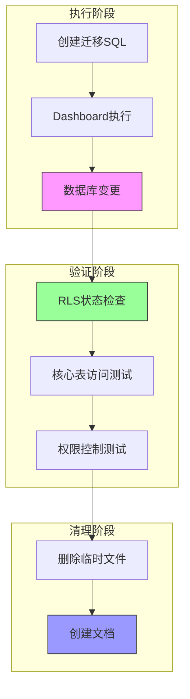
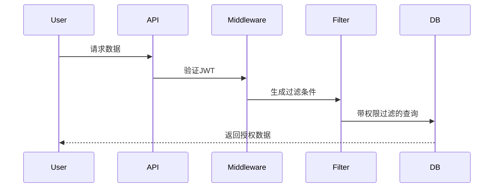
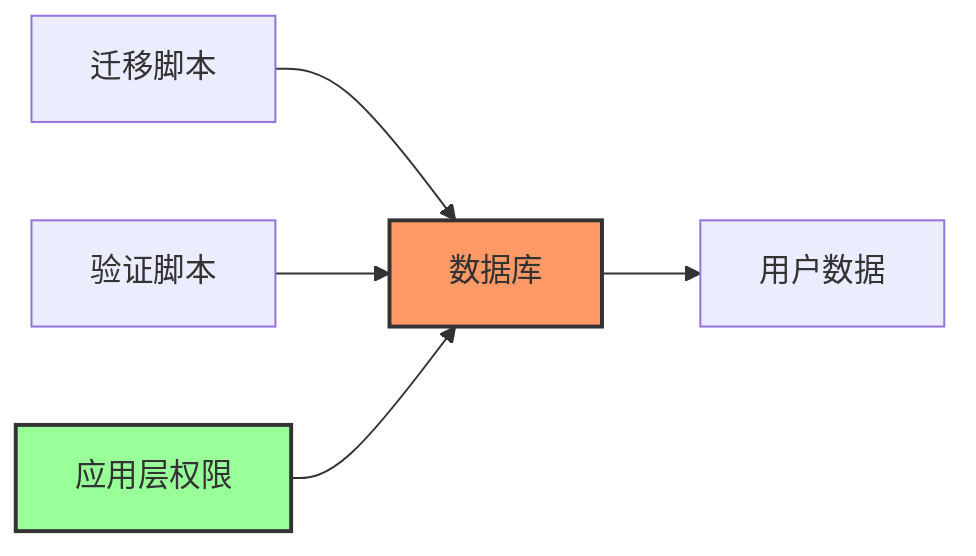
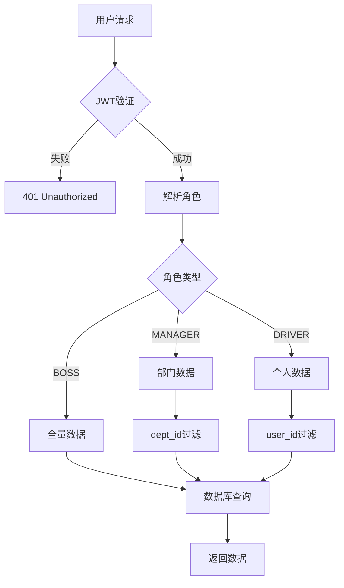

# RLS 完全禁用迁移 - 设计文档

## 整体架构图



## 核心组件

### 1. 迁移脚本执行器
**职责**：禁用所有表的 RLS 并删除所有策略

**输入**：
- PostgreSQL 连接（Dashboard）
- 迁移 SQL 脚本

**输出**：
- 所有表 RLS 状态 = disabled
- 所有策略已删除

**实现细节**：
```sql
-- 步骤1: 禁用 RLS
DO $$ 
DECLARE r RECORD;
BEGIN
  FOR r IN SELECT tablename FROM pg_tables 
    WHERE schemaname = 'public' AND rowsecurity = true
  LOOP
    EXECUTE 'ALTER TABLE ' || quote_ident(r.tablename) || 
            ' DISABLE ROW LEVEL SECURITY';
    RAISE NOTICE '✅ 禁用: %', r.tablename;
  END LOOP;
END $$;

-- 步骤2: 删除策略
DO $$ 
DECLARE r RECORD;
BEGIN
  FOR r IN SELECT tablename, policyname FROM pg_policies 
    WHERE schemaname = 'public'
  LOOP
    EXECUTE 'DROP POLICY ' || quote_ident(r.policyname) || 
            ' ON ' || quote_ident(r.tablename);
    RAISE NOTICE '🗑️  删除: % on %', r.policyname, r.tablename;
  END LOOP;
END $$;
```

### 2. 验证模块
**职责**：验证 RLS 禁用状态和应用层权限控制

**验证点**：
1. RLS 状态检查（pg_tables.rowsecurity）
2. 策略检查（pg_policies 计数）
3. 核心表访问测试
4. 匿名访问拒绝测试

**实现**：
```javascript
// RLS 状态验证
const { data: tables } = await supabase
  .from('pg_tables')
  .select('tablename, rowsecurity')
  .eq('schemaname', 'public')
  .eq('rowsecurity', true);

// 策略计数验证
const { data: policies } = await supabase
  .from('pg_policies')
  .select('*')
  .eq('schemaname', 'public');

// 核心表访问测试
const tables = ['users', 'notifications', 'attendance', 'piece_work_records'];
for (const table of tables) {
  const { count } = await supabase
    .from(table)
    .select('*', { count: 'exact', head: true });
  console.log(`${table}: ${count} 条记录`);
}
```

### 3. 应用层权限控制
**职责**：确保 RLS 禁用后数据安全

**组件**：
- `permissionMiddleware.ts`：拦截所有数据库操作
- `permissionFilter.ts`：生成角色过滤条件
- `permission-service.ts`：权限验证服务

**数据流**：


## 模块依赖关系图



## 接口契约定义

### 1. 迁移脚本接口
**输入**：
- SQL 脚本文件路径

**输出**：
- 执行日志（NOTICE 消息）
- 成功/失败状态

**异常**：
- 表不存在
- 策略不存在（忽略，使用 IF EXISTS）

### 2. 验证接口
**函数签名**：
```javascript
async function verifyRLSDisabled(): Promise<{
  rlsEnabled: number;
  policyCount: number;
  tablesAccess: Record<string, number>;
}>
```

**返回值**：
```typescript
{
  rlsEnabled: 0,        // 启用 RLS 的表数量
  policyCount: 0,       // 剩余策略数量
  tablesAccess: {
    users: 9,
    notifications: 57,
    attendance: 6,
    piece_work_records: 2
  }
}
```

## 数据流向图



## 异常处理策略

### 1. 迁移执行异常
**场景**：表不存在、权限不足

**处理**：
```sql
-- 使用动态 SQL 和异常捕获
DO $$ 
DECLARE 
    r RECORD;
    error_msg TEXT;
BEGIN
    FOR r IN SELECT tablename FROM pg_tables 
        WHERE schemaname = 'public'
    LOOP
        BEGIN
            EXECUTE 'ALTER TABLE ' || quote_ident(r.tablename) || 
                    ' DISABLE ROW LEVEL SECURITY';
        EXCEPTION 
            WHEN OTHERS THEN
                GET STACKED DIAGNOSTICS error_msg = MESSAGE_TEXT;
                RAISE WARNING '跳过 %: %', r.tablename, error_msg;
        END;
    END LOOP;
END $$;
```

### 2. 验证失败
**场景**：RLS 未完全禁用、策略残留

**处理**：
- 输出警告日志
- 返回详细的失败信息
- 提示重新执行迁移脚本

### 3. 应用层权限失败
**场景**：中间件异常、Token 失效

**处理**：
- 返回 401/403 错误
- 记录错误日志
- 提示用户重新登录

## 设计原则

1. **严格按照任务范围**
   - 仅禁用 RLS，不修改应用层代码
   - 不引入新功能

2. **确保与现有系统架构一致**
   - 保持应用层权限控制不变
   - 不破坏现有业务逻辑

3. **复用现有组件和模式**
   - 使用现有的验证脚本模式
   - 沿用项目的迁移脚本规范

## 设计可行性验证

✅ **技术可行性**
- PostgreSQL 支持动态禁用 RLS
- Supabase Dashboard 可执行 DDL

✅ **性能可行性**
- 无 RLS 检查，查询性能提升
- 应用层过滤逻辑简单高效

✅ **安全可行性**
- 应用层权限控制完整
- JWT 验证保证认证安全
- 角色过滤保证授权安全

