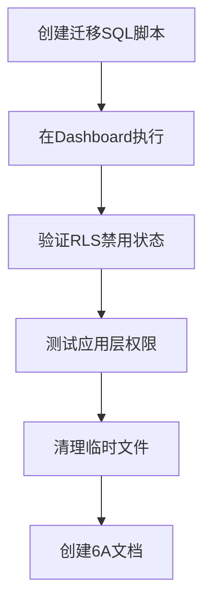

# RLS 完全禁用迁移 - 任务拆分

## 任务依赖图

## 任务清单

### 任务 1: 创建迁移 SQL 脚本
**ID**: T1  
**优先级**: P0（关键路径）

**输入契约**：
- 无前置依赖

**输出契约**：
- SQL 脚本文件：`EXECUTE_IN_DASHBOARD.sql`
- 包含：禁用 RLS、删除策略、验证结果

**实现约束**：
- 使用 PostgreSQL PL/pgSQL
- 包含错误处理
- 输出执行日志

**验收标准**：
- SQL 语法正确
- 可以在 PostgreSQL 中执行
- 包含所有必要步骤

**预估时间**: 10分钟

---

### 任务 2: 在 Supabase Dashboard 执行脚本
**ID**: T2  
**优先级**: P0（关键路径）

**输入契约**：
- 前置依赖：T1 完成
- 输入数据：SQL 脚本内容
- 环境依赖：Supabase Dashboard 访问权限

**输出契约**：
- 输出数据：执行日志（NOTICE 消息）
- 交付物：数据库 RLS 状态变更
- 验收标准：
  - 所有表的 RLS 已禁用
  - 所有策略已删除
  - 无错误日志

**实现约束**：
- 技术栈：Supabase Dashboard SQL Editor
- 接口规范：PostgreSQL DDL
- 质量要求：一次执行成功

**依赖关系**：
- 后置任务：T3

**预估时间**: 2分钟

---

### 任务 3: 验证 RLS 禁用状态
**ID**: T3  
**优先级**: P0（关键路径）

**输入契约**：
- 前置依赖：T2 完成
- 输入数据：数据库连接（service_role key）
- 环境依赖：Supabase JS SDK

**输出契约**：
- 输出数据：验证报告
  - RLS 启用的表数量：0
  - 剩余策略数量：0
  - 核心表访问测试结果
- 交付物：验证脚本 `verify-rls-disabled.js`
- 验收标准：
  - 所有检查项通过
  - 无警告或错误

**实现约束**：
- 技术栈：Node.js + @supabase/supabase-js
- 接口规范：Supabase REST API
- 质量要求：完整覆盖所有验证点

**依赖关系**：
- 后置任务：T4

**预估时间**: 5分钟

---

### 任务 4: 测试应用层权限控制
**ID**: T4  
**优先级**: P1（重要）

**输入契约**：
- 前置依赖：T3 完成
- 输入数据：测试用户账号
- 环境依赖：Supabase anon key, service_role key

**输出契约**：
- 输出数据：权限测试报告
  - 匿名访问：被拒绝 ✅
  - BOSS 角色：全量数据访问 ✅
  - MANAGER 角色：部门数据访问 ✅
  - DRIVER 角色：个人数据访问 ✅
- 交付物：测试脚本 `test-app-layer-permissions.js`
- 验收标准：
  - 所有角色权限隔离正确
  - 无数据泄露风险

**实现约束**：
- 技术栈：Node.js + @supabase/supabase-js
- 接口规范：项目权限API
- 质量要求：覆盖所有角色场景

**依赖关系**：
- 后置任务：T5
- 并行任务：无

**预估时间**: 5分钟

---

### 任务 5: 清理临时文件
**ID**: T5  
**优先级**: P2（一般）

**输入契约**：
- 前置依赖：T4 完成
- 输入数据：临时文件列表

**输出契约**：
- 输出数据：删除文件列表
- 交付物：干净的项目目录
- 验收标准：
  - 所有临时迁移脚本已删除
  - 保留验证脚本（可复用）

**实现约束**：
- 技术栈：文件系统操作
- 质量要求：不删除有用文件

**依赖关系**：
- 后置任务：T6

**预估时间**: 2分钟

---

### 任务 6: 创建 6A 工作流文档
**ID**: T6  
**优先级**: P0（关键，补充）

**输入契约**：
- 前置依赖：T5 完成
- 输入数据：任务执行记录

**输出契约**：
- 交付物：
  - `ALIGNMENT_RLS完全禁用迁移.md`
  - `CONSENSUS_RLS完全禁用迁移.md`
  - `DESIGN_RLS完全禁用迁移.md`
  - `TASK_RLS完全禁用迁移.md`
  - `ACCEPTANCE_RLS完全禁用迁移.md`
  - `FINAL_RLS完全禁用迁移.md`
- 验收标准：
  - 所有文档完整
  - 符合 6A 工作流规范

**实现约束**：
- 技术栈：Markdown
- 质量要求：文档清晰、准确

**依赖关系**：
- 后置任务：无（最终任务）

**预估时间**: 15分钟

---

## 任务执行顺序

**串行执行**：
1. T1: 创建迁移 SQL 脚本
2. T2: 在 Dashboard 执行脚本
3. T3: 验证 RLS 禁用状态
4. T4: 测试应用层权限控制
5. T5: 清理临时文件
6. T6: 创建 6A 工作流文档

**总预估时间**: 39分钟

**关键路径**: T1 → T2 → T3 → T6

## 质量门控

每个任务完成后必须验证：
- ✅ 输出契约满足
- ✅ 验收标准通过
- ✅ 无引入新问题
- ✅ 文档同步更新

## 风险控制

### 技术风险
- **风险**: Dashboard 执行失败
- **缓解**: 提供详细的错误处理和重试指导

### 业务风险
- **风险**: 应用层权限控制失效
- **缓解**: 执行前验证中间件正常，执行后测试权限隔离

### 进度风险
- **风险**: 文档创建耗时
- **缓解**: 并行准备文档模板
# RLS 完全禁用迁移 - 任务拆分

## 任务依赖图

## 任务清单

### 任务 1: 创建迁移 SQL 脚本
**ID**: T1  
**优先级**: P0（关键路径）

**输入契约**：
- 无前置依赖

**输出契约**：
- SQL 脚本文件：`EXECUTE_IN_DASHBOARD.sql`
- 包含：禁用 RLS、删除策略、验证结果

**实现约束**：
- 使用 PostgreSQL PL/pgSQL
- 包含错误处理
- 输出执行日志

**验收标准**：
- SQL 语法正确
- 可以在 PostgreSQL 中执行
- 包含所有必要步骤

**预估时间**: 10分钟

---

### 任务 2: 在 Supabase Dashboard 执行脚本
**ID**: T2  
**优先级**: P0（关键路径）

**输入契约**：
- 前置依赖：T1 完成
- 输入数据：SQL 脚本内容
- 环境依赖：Supabase Dashboard 访问权限

**输出契约**：
- 输出数据：执行日志（NOTICE 消息）
- 交付物：数据库 RLS 状态变更
- 验收标准：
  - 所有表的 RLS 已禁用
  - 所有策略已删除
  - 无错误日志

**实现约束**：
- 技术栈：Supabase Dashboard SQL Editor
- 接口规范：PostgreSQL DDL
- 质量要求：一次执行成功

**依赖关系**：
- 后置任务：T3

**预估时间**: 2分钟

---

### 任务 3: 验证 RLS 禁用状态
**ID**: T3  
**优先级**: P0（关键路径）

**输入契约**：
- 前置依赖：T2 完成
- 输入数据：数据库连接（service_role key）
- 环境依赖：Supabase JS SDK

**输出契约**：
- 输出数据：验证报告
  - RLS 启用的表数量：0
  - 剩余策略数量：0
  - 核心表访问测试结果
- 交付物：验证脚本 `verify-rls-disabled.js`
- 验收标准：
  - 所有检查项通过
  - 无警告或错误

**实现约束**：
- 技术栈：Node.js + @supabase/supabase-js
- 接口规范：Supabase REST API
- 质量要求：完整覆盖所有验证点

**依赖关系**：
- 后置任务：T4

**预估时间**: 5分钟

---

### 任务 4: 测试应用层权限控制
**ID**: T4  
**优先级**: P1（重要）

**输入契约**：
- 前置依赖：T3 完成
- 输入数据：测试用户账号
- 环境依赖：Supabase anon key, service_role key

**输出契约**：
- 输出数据：权限测试报告
  - 匿名访问：被拒绝 ✅
  - BOSS 角色：全量数据访问 ✅
  - MANAGER 角色：部门数据访问 ✅
  - DRIVER 角色：个人数据访问 ✅
- 交付物：测试脚本 `test-app-layer-permissions.js`
- 验收标准：
  - 所有角色权限隔离正确
  - 无数据泄露风险

**实现约束**：
- 技术栈：Node.js + @supabase/supabase-js
- 接口规范：项目权限API
- 质量要求：覆盖所有角色场景

**依赖关系**：
- 后置任务：T5
- 并行任务：无

**预估时间**: 5分钟

---

### 任务 5: 清理临时文件
**ID**: T5  
**优先级**: P2（一般）

**输入契约**：
- 前置依赖：T4 完成
- 输入数据：临时文件列表

**输出契约**：
- 输出数据：删除文件列表
- 交付物：干净的项目目录
- 验收标准：
  - 所有临时迁移脚本已删除
  - 保留验证脚本（可复用）

**实现约束**：
- 技术栈：文件系统操作
- 质量要求：不删除有用文件

**依赖关系**：
- 后置任务：T6

**预估时间**: 2分钟

---

### 任务 6: 创建 6A 工作流文档
**ID**: T6  
**优先级**: P0（关键，补充）

**输入契约**：
- 前置依赖：T5 完成
- 输入数据：任务执行记录

**输出契约**：
- 交付物：
  - `ALIGNMENT_RLS完全禁用迁移.md`
  - `CONSENSUS_RLS完全禁用迁移.md`
  - `DESIGN_RLS完全禁用迁移.md`
  - `TASK_RLS完全禁用迁移.md`
  - `ACCEPTANCE_RLS完全禁用迁移.md`
  - `FINAL_RLS完全禁用迁移.md`
- 验收标准：
  - 所有文档完整
  - 符合 6A 工作流规范

**实现约束**：
- 技术栈：Markdown
- 质量要求：文档清晰、准确

**依赖关系**：
- 后置任务：无（最终任务）

**预估时间**: 15分钟

---

## 任务执行顺序

**串行执行**：
1. T1: 创建迁移 SQL 脚本
2. T2: 在 Dashboard 执行脚本
3. T3: 验证 RLS 禁用状态
4. T4: 测试应用层权限控制
5. T5: 清理临时文件
6. T6: 创建 6A 工作流文档

**总预估时间**: 39分钟

**关键路径**: T1 → T2 → T3 → T6

## 质量门控

每个任务完成后必须验证：
- ✅ 输出契约满足
- ✅ 验收标准通过
- ✅ 无引入新问题
- ✅ 文档同步更新

## 风险控制

### 技术风险
- **风险**: Dashboard 执行失败
- **缓解**: 提供详细的错误处理和重试指导

### 业务风险
- **风险**: 应用层权限控制失效
- **缓解**: 执行前验证中间件正常，执行后测试权限隔离

### 进度风险
- **风险**: 文档创建耗时
- **缓解**: 并行准备文档模板
