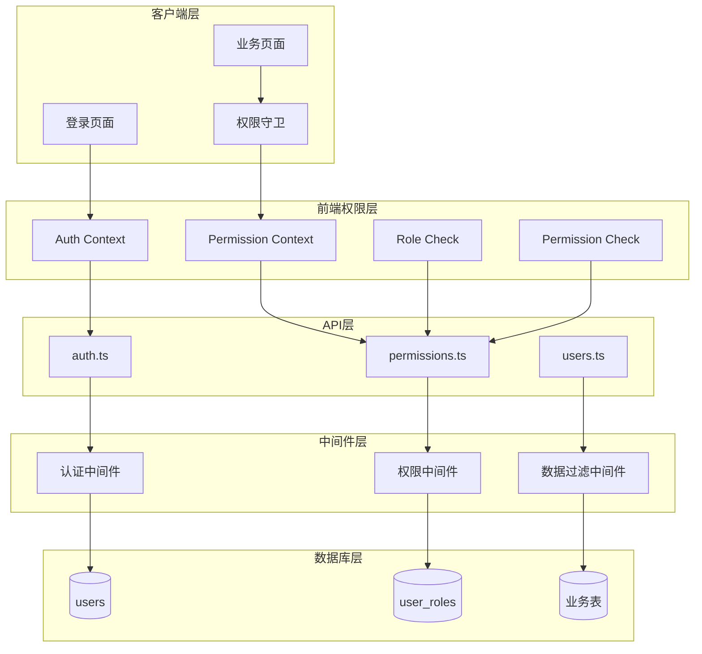
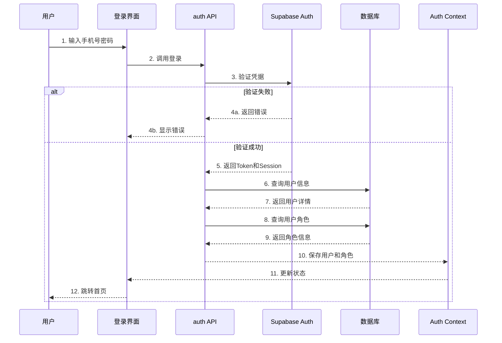
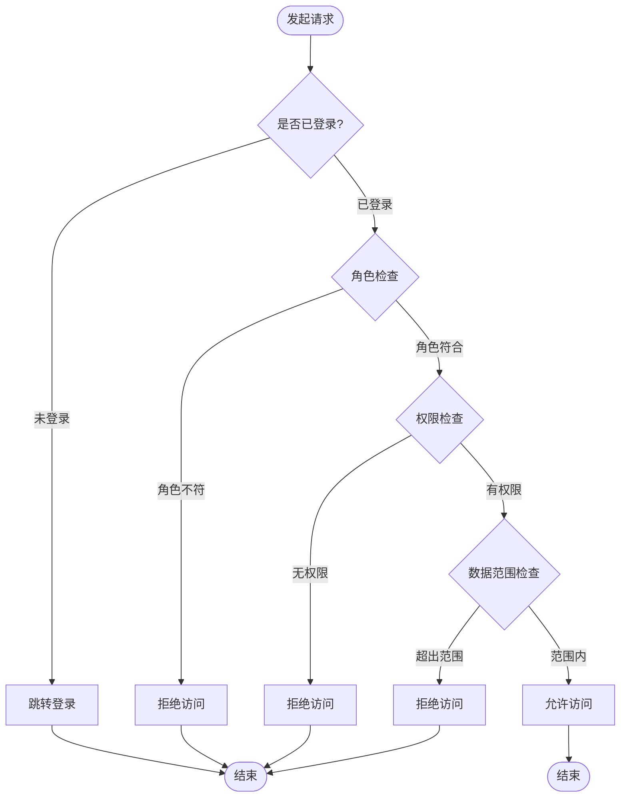

# 权限系统技术文档

## 一、功能概述

### 1.1 功能定位

权限系统是车队管家的安全核心，负责用户身份认证、角色管理、权限控制、数据访问控制，确保系统的安全性和数据隔离，实现基于角色的访问控制（RBAC）。

### 1.2 核心价值

- **安全保障**: 严格的身份认证和权限验证
- **角色分离**: 明确的角色定义和权限划分
- **数据隔离**: 基于角色的数据访问控制
- **集中管理**: 统一的权限配置和管理
- **细粒度控制**: 表级、行级、字段级权限控制

### 1.3 角色定义

```
角色层级（从高到低）：
1. BOSS（老板）
   - 拥有系统最高权限
   - 可以访问所有数据
   - 可以管理所有用户和配置

2. PEER_ADMIN（调度/管理员）
   - 拥有全局管理权限
   - 可以访问所有业务数据
   - 可以审批请假、车辆等

3. MANAGER（车队长）
   - 管理指定仓库/部门
   - 只能访问管辖范围的数据
   - 可以审批本部门的请假等

4. DRIVER（司机）
   - 普通用户权限
   - 只能访问自己的数据
   - 可以提交申请和查看自己的记录
```

---

## 二、系统架构

### 2.1 整体架构图



### 2.2 认证流程



### 2.3 权限验证流程



---

## 三、数据模型设计

### 3.1 数据库表结构

#### 3.1.1 用户表 (users)

```sql
CREATE TABLE users (
  id UUID PRIMARY KEY DEFAULT gen_random_uuid(),
  phone TEXT NOT NULL UNIQUE,
  name TEXT NOT NULL,
  email TEXT,
  avatar_url TEXT,
  
  -- 角色信息
  role TEXT NOT NULL DEFAULT 'DRIVER' CHECK(role IN ('BOSS', 'PEER_ADMIN', 'MANAGER', 'DRIVER')),
  
  -- 部门/仓库关联
  warehouse_id UUID REFERENCES warehouses(id) ON DELETE SET NULL,
  department_id UUID REFERENCES departments(id) ON DELETE SET NULL,
  
  -- 司机特有信息
  driver_type TEXT CHECK(driver_type IN ('pure', 'with_vehicle')),
  is_active BOOLEAN DEFAULT true,
  
  created_at TIMESTAMPTZ DEFAULT NOW(),
  updated_at TIMESTAMPTZ DEFAULT NOW(),
  
  INDEX idx_users_role (role),
  INDEX idx_users_warehouse (warehouse_id),
  INDEX idx_users_department (department_id)
);

COMMENT ON TABLE users IS '用户表';
COMMENT ON COLUMN users.role IS '用户角色：BOSS=老板, PEER_ADMIN=调度, MANAGER=车队长, DRIVER=司机';
COMMENT ON COLUMN users.driver_type IS '司机类型：pure=纯司机, with_vehicle=带车司机';
```

#### 3.1.2 仓库分配表 (warehouse_assignments)

```sql
CREATE TABLE warehouse_assignments (
  id UUID PRIMARY KEY DEFAULT gen_random_uuid(),
  user_id UUID NOT NULL REFERENCES users(id) ON DELETE CASCADE,
  warehouse_id UUID NOT NULL REFERENCES warehouses(id) ON DELETE CASCADE,
  is_primary BOOLEAN DEFAULT false,  -- 是否为主要仓库
  created_at TIMESTAMPTZ DEFAULT NOW(),
  
  -- 唯一约束
  CONSTRAINT uq_user_warehouse UNIQUE (user_id, warehouse_id)
);

COMMENT ON TABLE warehouse_assignments IS '用户仓库分配表（用于车队长管辖多个仓库的场景）';
```

### 3.2 TypeScript 类型定义

```typescript
/**
 * 用户角色枚举
 */
export enum UserRole {
  BOSS = 'BOSS',              // 老板
  PEER_ADMIN = 'PEER_ADMIN',  // 调度/管理员
  MANAGER = 'MANAGER',        // 车队长
  DRIVER = 'DRIVER'           // 司机
}

/**
 * 权限动作枚举
 */
export enum PermissionAction {
  SELECT = 'SELECT',  // 查询
  INSERT = 'INSERT',  // 创建
  UPDATE = 'UPDATE',  // 更新
  DELETE = 'DELETE'   // 删除
}

/**
 * 用户接口
 */
export interface User {
  id: string
  phone: string
  name: string
  email: string | null
  avatar_url: string | null
  role: UserRole
  warehouse_id: string | null
  department_id: string | null
  driver_type: 'pure' | 'with_vehicle' | null
  is_active: boolean
  created_at: string
  updated_at: string
}

/**
 * 权限规则接口
 */
export interface PermissionRule {
  table: string                    // 表名
  action: PermissionAction         // 操作类型
  roles: UserRole[]                // 允许的角色
  allowAll?: boolean               // 是否允许访问所有数据
  filter?: (userId: string) => Record<string, any>  // 数据过滤函数
}

/**
 * 认证上下文接口
 */
export interface AuthContextValue {
  user: User | null
  role: UserRole | null
  isAuthenticated: boolean
  loading: boolean
  login: (phone: string, password: string) => Promise<void>
  logout: () => Promise<void>
  refresh: () => Promise<void>
}

/**
 * 权限上下文接口
 */
export interface PermissionContextValue {
  hasRole: (role: UserRole | UserRole[]) => boolean
  hasPermission: (table: string, action: PermissionAction) => boolean
  canAccessData: (table: string, dataOwnerId: string) => boolean
}
```

---

## 四、核心功能实现

### 4.1 用户认证

#### 4.1.1 登录实现

**API层实现** (`src/db/api/auth.ts`):

```typescript
import { supabase } from '../supabase'
import type { User, UserRole } from '../types'

/**
 * 用户登录
 * 
 * @param phone 手机号
 * @param password 密码
 * @returns 用户信息和Session
 */
export async function login(
  phone: string,
  password: string
): Promise<{ user: User, session: any }> {
  // 1. Supabase认证
  const { data: authData, error: authError } = await supabase.auth.signInWithPassword({
    phone,
    password
  })
  
  if (authError) {
    console.error('[login] 认证失败:', authError)
    throw new Error('手机号或密码错误')
  }
  
  // 2. 查询用户详细信息
  const { data: user, error: userError } = await supabase
    .from('users')
    .select('*')
    .eq('id', authData.user.id)
    .single()
  
  if (userError || !user) {
    console.error('[login] 查询用户信息失败:', userError)
    throw new Error('用户信息查询失败')
  }
  
  // 3. 检查用户是否激活
  if (!user.is_active) {
    throw new Error('账号已被停用，请联系管理员')
  }
  
  return {
    user,
    session: authData.session
  }
}

/**
 * 用户登出
 */
export async function logout(): Promise<void> {
  const { error } = await supabase.auth.signOut()
  
  if (error) {
    console.error('[logout] 登出失败:', error)
    throw error
  }
}

/**
 * 获取当前登录用户
 */
export async function getCurrentUser(): Promise<User | null> {
  const { data: { user: authUser } } = await supabase.auth.getUser()
  
  if (!authUser) {
    return null
  }
  
  const { data: user } = await supabase
    .from('users')
    .select('*')
    .eq('id', authUser.id)
    .single()
  
  return user
}

/**
 * 刷新会话
 */
export async function refreshSession(): Promise<void> {
  const { error } = await supabase.auth.refreshSession()
  
  if (error) {
    console.error('[refreshSession] 刷新失败:', error)
    throw error
  }
}
```

#### 4.1.2 Auth Context实现

**前端Context** (`src/contexts/AuthContext.tsx`):

```typescript
import React, { createContext, useContext, useState, useEffect } from 'react'
import type { AuthContextValue, User, UserRole } from '@/types'
import { login as apiLogin, logout as apiLogout, getCurrentUser } from '@/db/api/auth'
import Taro from '@tarojs/taro'

const AuthContext = createContext<AuthContextValue | undefined>(undefined)

export function AuthProvider({ children }: { children: React.ReactNode }) {
  const [user, setUser] = useState<User | null>(null)
  const [loading, setLoading] = useState(true)
  
  // 初始化：检查是否已登录
  useEffect(() => {
    checkAuth()
  }, [])
  
  async function checkAuth() {
    try {
      const currentUser = await getCurrentUser()
      setUser(currentUser)
    } catch (error) {
      console.error('[AuthProvider] 检查登录状态失败:', error)
      setUser(null)
    } finally {
      setLoading(false)
    }
  }
  
  const login = async (phone: string, password: string) => {
    const { user } = await apiLogin(phone, password)
    setUser(user)
    
    // 保存到本地存储
    Taro.setStorageSync('user', user)
  }
  
  const logout = async () => {
    await apiLogout()
    setUser(null)
    
    // 清除本地存储
    Taro.removeStorageSync('user')
    
    // 跳转到登录页
    Taro.redirectTo({ url: '/pages/login/index' })
  }
  
  const refresh = async () => {
    await checkAuth()
  }
  
  const value: AuthContextValue = {
    user,
    role: user?.role || null,
    isAuthenticated: !!user,
    loading,
    login,
    logout,
    refresh
  }
  
  return (
    <AuthContext.Provider value={value}>
      {children}
    </AuthContext.Provider>
  )
}

/**
 * useAuth Hook
 * 必须在AuthProvider内部使用
 */
export function useAuth(): AuthContextValue {
  const context = useContext(AuthContext)
  
  if (!context) {
    throw new Error('useAuth must be used within AuthProvider')
  }
  
  return context
}
```

### 4.2 权限控制

#### 4.2.1 权限配置

**权限配置** (`src/config/permission-config.ts`):

```typescript
import { UserRole, PermissionAction } from '@/types'
import type { PermissionRule } from '@/types'

/**
 * 权限配置表
 * 定义每个表的权限规则
 */
export const permissionConfig: Record<string, PermissionRule[]> = {
  // 用户表权限
  users: [
    {
      table: 'users',
      action: PermissionAction.SELECT,
      roles: [UserRole.BOSS, UserRole.PEER_ADMIN],
      allowAll: true  // 可以查看所有用户
    },
    {
      table: 'users',
      action: PermissionAction.SELECT,
      roles: [UserRole.MANAGER],
      filter: (userId) => ({ warehouse_id: getUserWarehouseId(userId) })
    },
    {
      table: 'users',
      action: PermissionAction.SELECT,
      roles: [UserRole.DRIVER],
      filter: (userId) => ({ id: userId })  // 只能查看自己
    }
  ],
  
  // 请假申请权限
  leave_applications: [
    {
      table: 'leave_applications',
      action: PermissionAction.SELECT,
      roles: [UserRole.BOSS, UserRole.PEER_ADMIN],
      allowAll: true
    },
    {
      table: 'leave_applications',
      action: PermissionAction.SELECT,
      roles: [UserRole.MANAGER],
      filter: (userId) => ({ warehouse_id: getUserWarehouseId(userId) })
    },
    {
      table: 'leave_applications',
      action: PermissionAction.SELECT,
      roles: [UserRole.DRIVER],
      filter: (userId) => ({ driver_id: userId })
    },
    {
      table: 'leave_applications',
      action: PermissionAction.INSERT,
      roles: [UserRole.BOSS, UserRole.PEER_ADMIN, UserRole.MANAGER, UserRole.DRIVER],
      filter: (userId) => ({ driver_id: userId })
    },
    {
      table: 'leave_applications',
      action: PermissionAction.UPDATE,
      roles: [UserRole.BOSS, UserRole.PEER_ADMIN, UserRole.MANAGER],
      allowAll: true  // 审批权限
    }
  ],
  
  // 车辆表权限
  vehicles: [
    {
      table: 'vehicles',
      action: PermissionAction.SELECT,
      roles: [UserRole.BOSS, UserRole.PEER_ADMIN],
      allowAll: true
    },
    {
      table: 'vehicles',
      action: PermissionAction.SELECT,
      roles: [UserRole.MANAGER],
      filter: (userId) => ({ warehouse_id: getUserWarehouseId(userId) })
    },
    {
      table: 'vehicles',
      action: PermissionAction.SELECT,
      roles: [UserRole.DRIVER],
      filter: (userId) => ({ user_id: userId })
    }
  ],
  
  // 计件记录权限
  piece_work_records: [
    {
      table: 'piece_work_records',
      action: PermissionAction.SELECT,
      roles: [UserRole.BOSS, UserRole.PEER_ADMIN],
      allowAll: true
    },
    {
      table: 'piece_work_records',
      action: PermissionAction.SELECT,
      roles: [UserRole.MANAGER],
      filter: (userId) => ({ warehouse_id: getUserWarehouseId(userId) })
    },
    {
      table: 'piece_work_records',
      action: PermissionAction.SELECT,
      roles: [UserRole.DRIVER],
      filter: (userId) => ({ user_id: userId })
    },
    {
      table: 'piece_work_records',
      action: PermissionAction.INSERT,
      roles: [UserRole.BOSS, UserRole.PEER_ADMIN, UserRole.MANAGER, UserRole.DRIVER],
      filter: (userId) => ({ user_id: userId })
    }
  ]
}

/**
 * 获取用户的仓库ID
 * 辅助函数，用于数据过滤
 */
function getUserWarehouseId(userId: string): string {
  // 实际实现需要从用户信息中获取
  return '' // 占位符
}
```

#### 4.2.2 Permission Context实现

```typescript
import React, { createContext, useContext } from 'react'
import type { PermissionContextValue } from '@/types'
import { useAuth } from './AuthContext'
import { permissionConfig } from '@/config/permission-config'
import { UserRole, PermissionAction } from '@/types'

const PermissionContext = createContext<PermissionContextValue | undefined>(undefined)

export function PermissionProvider({ children }: { children: React.ReactNode }) {
  const { user, role } = useAuth()
  
  /**
   * 检查是否拥有指定角色
   */
  const hasRole = (requiredRole: UserRole | UserRole[]): boolean => {
    if (!role) return false
    
    const roles = Array.isArray(requiredRole) ? requiredRole : [requiredRole]
    return roles.includes(role)
  }
  
  /**
   * 检查是否拥有指定表的操作权限
   */
  const hasPermission = (table: string, action: PermissionAction): boolean => {
    if (!role) return false
    
    const rules = permissionConfig[table] || []
    const matchedRule = rules.find(
      rule => rule.action === action && rule.roles.includes(role)
    )
    
    return !!matchedRule
  }
  
  /**
   * 检查是否可以访问指定数据
   */
  const canAccessData = (table: string, dataOwnerId: string): boolean => {
    if (!user || !role) return false
    
    // BOSS和PEER_ADMIN可以访问所有数据
    if (role === UserRole.BOSS || role === UserRole.PEER_ADMIN) {
      return true
    }
    
    const rules = permissionConfig[table] || []
    const matchedRule = rules.find(rule => rule.roles.includes(role))
    
    if (!matchedRule) return false
    
    // 如果允许访问所有数据
    if (matchedRule.allowAll) return true
    
    // 如果有过滤函数，检查是否满足条件
    if (matchedRule.filter) {
      const filter = matchedRule.filter(user.id)
      // 简化判断：如果过滤器包含当前数据的owner
      return Object.values(filter).includes(dataOwnerId) || 
             Object.values(filter).includes(user.id)
    }
    
    return false
  }
  
  const value: PermissionContextValue = {
    hasRole,
    hasPermission,
    canAccessData
  }
  
  return (
    <PermissionContext.Provider value={value}>
      {children}
    </PermissionContext.Provider>
  )
}

/**
 * usePermission Hook
 */
export function usePermission(): PermissionContextValue {
  const context = useContext(PermissionContext)
  
  if (!context) {
    throw new Error('usePermission must be used within PermissionProvider')
  }
  
  return context
}
```

#### 4.2.3 权限守卫组件

```typescript
import React from 'react'
import { View, Text } from '@tarojs/components'
import { usePermission } from '@/contexts/PermissionContext'
import { UserRole } from '@/types'

interface PermissionGuardProps {
  roles?: UserRole | UserRole[]
  fallback?: React.ReactNode
  children: React.ReactNode
}

/**
 * 权限守卫组件
 * 根据角色控制子组件的渲染
 */
export function PermissionGuard({
  roles,
  fallback,
  children
}: PermissionGuardProps) {
  const { hasRole } = usePermission()
  
  if (roles && !hasRole(roles)) {
    return fallback ? (
      <>{fallback}</>
    ) : (
      <View className="permission-denied">
        <Text>您没有权限访问此内容</Text>
      </View>
    )
  }
  
  return <>{children}</>
}

/**
 * 使用示例：
 * 
 * <PermissionGuard roles={[UserRole.BOSS, UserRole.PEER_ADMIN]}>
 *   <Button>审批</Button>
 * </PermissionGuard>
 */
```

### 4.3 数据过滤中间件

```typescript
import { supabase } from '../supabase'
import type { UserRole } from '../types'
import { permissionConfig } from '@/config/permission-config'

/**
 * 应用权限过滤
 * 根据用户角色和权限配置，自动添加数据过滤条件
 * 
 * @param userId 用户ID
 * @param role 用户角色
 * @param table 表名
 * @param action 操作类型
 * @returns 带权限过滤的查询构造器
 */
export function applyPermissionFilter(
  userId: string,
  role: UserRole,
  table: string,
  action: PermissionAction
) {
  let query = supabase.from(table).select('*')
  
  // 获取权限规则
  const rules = permissionConfig[table] || []
  const matchedRule = rules.find(
    rule => rule.action === action && rule.roles.includes(role)
  )
  
  if (!matchedRule) {
    // 无权限，返回空结果
    query = query.eq('id', 'impossible-id')
    return query
  }
  
  // 如果不是允许访问所有数据，应用过滤
  if (!matchedRule.allowAll && matchedRule.filter) {
    const filter = matchedRule.filter(userId)
    
    // 应用过滤条件
    Object.entries(filter).forEach(([key, value]) => {
      query = query.eq(key, value)
    })
  }
  
  return query
}

/**
 * 使用示例：
 * 
 * const query = applyPermissionFilter(
 *   userId,
 *   userRole,
 *   'leave_applications',
 *   PermissionAction.SELECT
 * )
 * 
 * const { data } = await query
 */
```

---

## 五、权限验证流程

### 5.1 API请求权限验证

```typescript
/**
 * 权限验证装饰器
 * 用于API函数的权限检查
 */
export function requirePermission(
  table: string,
  action: PermissionAction,
  roles?: UserRole[]
) {
  return function (
    target: any,
    propertyKey: string,
    descriptor: PropertyDescriptor
  ) {
    const originalMethod = descriptor.value
    
    descriptor.value = async function (...args: any[]) {
      // 获取当前用户
      const { data: { user } } = await supabase.auth.getUser()
      
      if (!user) {
        throw new Error('未登录')
      }
      
      // 获取用户角色
      const { data: userInfo } = await supabase
        .from('users')
        .select('role')
        .eq('id', user.id)
        .single()
      
      if (!userInfo) {
        throw new Error('用户信息不存在')
      }
      
      // 角色检查
      if (roles && !roles.includes(userInfo.role)) {
        throw new Error('权限不足')
      }
      
      // 权限检查
      const rules = permissionConfig[table] || []
      const hasPermission = rules.some(
        rule => rule.action === action && rule.roles.includes(userInfo.role)
      )
      
      if (!hasPermission) {
        throw new Error('无操作权限')
      }
      
      // 执行原方法
      return originalMethod.apply(this, args)
    }
    
    return descriptor
  }
}

/**
 * 使用示例：
 * 
 * @requirePermission('leave_applications', PermissionAction.UPDATE, [UserRole.BOSS, UserRole.MANAGER])
 * async function approveLeave(applicationId: string) {
 *   // 审批逻辑
 * }
 */
```

### 5.2 页面级权限控制

```typescript
import { useEffect } from 'react'
import Taro from '@tarojs/taro'
import { useAuth } from '@/contexts/AuthContext'
import { usePermission } from '@/contexts/PermissionContext'
import { UserRole } from '@/types'

/**
 * 页面权限检查 Hook
 * 
 * @param requiredRoles 需要的角色
 * @param redirectUrl 无权限时跳转的页面
 */
export function usePagePermission(
  requiredRoles: UserRole[],
  redirectUrl: string = '/pages/no-permission/index'
) {
  const { isAuthenticated, role, loading } = useAuth()
  const { hasRole } = usePermission()
  
  useEffect(() => {
    if (loading) return
    
    // 未登录
    if (!isAuthenticated) {
      Taro.redirectTo({ url: '/pages/login/index' })
      return
    }
    
    // 角色不符
    if (!hasRole(requiredRoles)) {
      Taro.redirectTo({ url: redirectUrl })
      return
    }
  }, [isAuthenticated, role, loading, requiredRoles, redirectUrl, hasRole])
}

/**
 * 使用示例（在页面组件中）：
 * 
 * function AdminPage() {
 *   usePagePermission([UserRole.BOSS, UserRole.PEER_ADMIN])
 *   
 *   return <View>管理页面内容</View>
 * }
 */
```

---

## 六、安全措施

### 6.1 密码安全

```typescript
/**
 * 密码强度验证
 */
export function validatePasswordStrength(password: string): {
  isValid: boolean
  message?: string
} {
  if (password.length < 8) {
    return { isValid: false, message: '密码长度至少8位' }
  }
  
  if (!/[a-z]/.test(password)) {
    return { isValid: false, message: '密码必须包含小写字母' }
  }
  
  if (!/[A-Z]/.test(password)) {
    return { isValid: false, message: '密码必须包含大写字母' }
  }
  
  if (!/[0-9]/.test(password)) {
    return { isValid: false, message: '密码必须包含数字' }
  }
  
  return { isValid: true }
}

/**
 * 修改密码
 */
export async function changePassword(
  userId: string,
  oldPassword: string,
  newPassword: string
): Promise<void> {
  // 验证新密码强度
  const validation = validatePasswordStrength(newPassword)
  if (!validation.isValid) {
    throw new Error(validation.message)
  }
  
  // 验证旧密码（通过重新登录）
  const { data: user } = await supabase
    .from('users')
    .select('phone')
    .eq('id', userId)
    .single()
  
  if (!user) {
    throw new Error('用户不存在')
  }
  
  const { error: loginError } = await supabase.auth.signInWithPassword({
    phone: user.phone,
    password: oldPassword
  })
  
  if (loginError) {
    throw new Error('原密码错误')
  }
  
  // 更新密码
  const { error } = await supabase.auth.updateUser({
    password: newPassword
  })
  
  if (error) {
    throw new Error('密码修改失败')
  }
}
```

### 6.2 会话管理

```typescript
/**
 * 会话超时配置
 */
const SESSION_TIMEOUT = 2 * 60 * 60 * 1000  // 2小时

/**
 * 检查会话是否过期
 */
export async function checkSessionExpiry(): Promise<boolean> {
  const { data: { session } } = await supabase.auth.getSession()
  
  if (!session) return true
  
  const expiresAt = new Date(session.expires_at || 0).getTime()
  const now = Date.now()
  
  return now >= expiresAt
}

/**
 * 自动刷新会话
 */
export function setupAutoRefresh() {
  setInterval(async () => {
    const isExpired = await checkSessionExpiry()
    
    if (isExpired) {
      // 会话过期，跳转登录
      Taro.redirectTo({ url: '/pages/login/index' })
    } else {
      // 刷新会话
      await supabase.auth.refreshSession()
    }
  }, 15 * 60 * 1000)  // 每15分钟检查一次
}
```

---

## 七、测试用例

### 7.1 权限验证测试

```typescript
describe('权限系统', () => {
  describe('角色检查', () => {
    it('BOSS应该拥有所有权限', () => {
      const { hasPermission } = usePermission()
      
      expect(hasPermission('users', PermissionAction.SELECT)).toBe(true)
      expect(hasPermission('users', PermissionAction.UPDATE)).toBe(true)
      expect(hasPermission('users', PermissionAction.DELETE)).toBe(true)
    })
    
    it('DRIVER只能查看自己的数据', () => {
      const { canAccessData } = usePermission()
      
      expect(canAccessData('leave_applications', 'own-id')).toBe(true)
      expect(canAccessData('leave_applications', 'other-id')).toBe(false)
    })
  })
  
  describe('数据过滤', () => {
    it('应该正确应用MANAGER的数据过滤', async () => {
      const query = applyPermissionFilter(
        'manager-id',
        UserRole.MANAGER,
        'leave_applications',
        PermissionAction.SELECT
      )
      
      // 查询应该包含warehouse_id过滤
      expect(query.url.searchParams.get('warehouse_id')).toBeDefined()
    })
  })
})
```

---

## 八、常见问题

| 问题 | 原因 | 解决方案 |
|------|------|---------|
| 无法登录 | 密码错误或账号被停用 | 检查密码，联系管理员 |
| 权限不足 | 角色权限不够 | 联系管理员分配权限 |
| 会话过期 | 长时间未操作 | 重新登录 |
| 数据访问被拒 | 超出数据访问范围 | 检查数据归属 |

---

## 九、最佳实践

### 9.1 权限设计原则

1. **最小权限原则**: 用户只拥有完成任务所需的最小权限
2. **职责分离**: 不同角色的职责明确分离
3. **默认拒绝**: 未明确授权的操作默认拒绝
4. **审计日志**: 记录敏感操作的审计日志

### 9.2 安全建议

1. **密码策略**: 强制密码复杂度要求
2. **会话管理**: 合理的会话超时时间
3. **数据加密**: 敏感数据加密存储和传输
4. **定期审查**: 定期审查用户权限和角色分配

---

## 十、总结

权限系统是车队管家的安全核心，具有以下特点：

### 优势

- ✅ **RBAC模型**: 基于角色的访问控制
- ✅ **细粒度控制**: 表级、行级、字段级权限
- ✅ **集中管理**: 统一的权限配置和验证
- ✅ **前后端一致**: 前端守卫+后端验证双重保障
- ✅ **易于扩展**: 配置化的权限规则

### 技术亮点

1. React Context实现前端权限管理
2. 权限配置表实现灵活的权限控制
3. 数据过滤中间件确保数据安全
4. 权限守卫组件简化权限控制

---

**文档版本**: 1.0.0  
**创建时间**: 2025-12-11  
**维护人员**: 系统开发团队  
**状态**: 已发布
