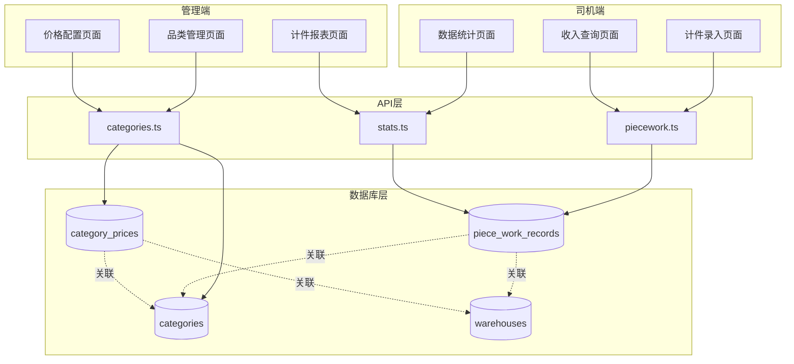
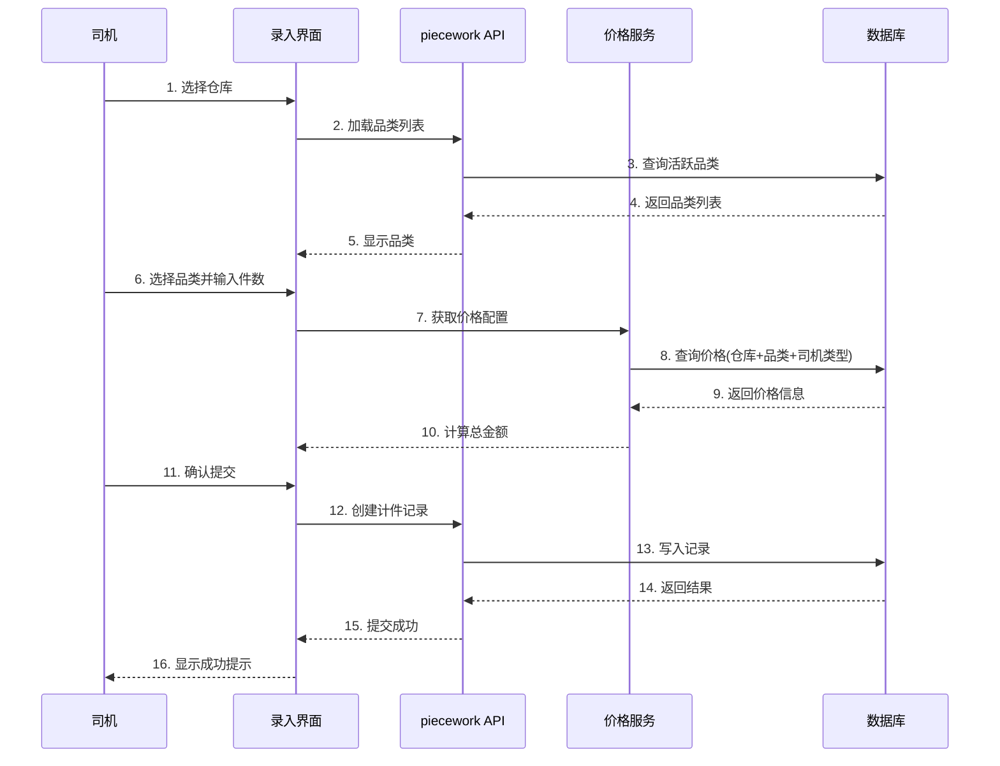
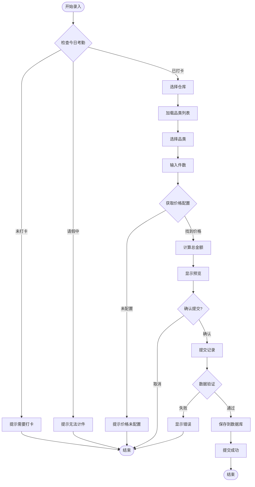
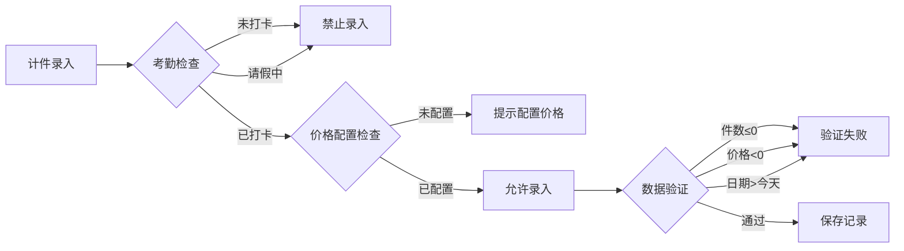

# 计件工资管理系统技术文档

## 一、功能概述

### 1.1 功能定位

计件工资管理系统是车队管家的核心收入管理模块，用于记录司机的计件工作量并计算相应工资。系统支持多品类、差异化定价、多仓库管理，确保工资计算的准确性和透明度。

### 1.2 核心价值

- **精准计费**: 基于品类、司机类型的差异化定价
- **实时统计**: 每日/每月工作量和收入实时汇总
- **数据透明**: 司机可随时查看自己的计件记录和收入
- **灵活配置**: 支持品类价格的灵活配置和调整

### 1.3 业务场景

```
司机端场景：
1. 每日完成配送任务后录入计件记录
2. 选择仓库、品类、输入件数
3. 系统自动计算费用（基础费+上楼费+分拣费）
4. 查看每日/每月收入统计

管理端场景：
1. 配置不同仓库的品类价格
2. 区分纯司机和带车司机的价格
3. 查看所有司机的计件统计
4. 导出工资报表
```

---

## 二、系统架构

### 2.1 整体架构图



### 2.2 数据流转图



---

## 三、数据模型设计

### 3.1 数据库表结构

#### 3.1.1 计件记录表 (piece_work_records)

```sql
CREATE TABLE piece_work_records (
  id UUID PRIMARY KEY DEFAULT gen_random_uuid(),
  user_id UUID NOT NULL REFERENCES users(id) ON DELETE CASCADE,
  warehouse_id UUID NOT NULL REFERENCES warehouses(id) ON DELETE CASCADE,
  category_id UUID NOT NULL REFERENCES categories(id) ON DELETE RESTRICT,
  work_date DATE NOT NULL,
  quantity INTEGER NOT NULL CHECK (quantity > 0),
  unit_price DECIMAL(10, 2) NOT NULL CHECK (unit_price >= 0),
  total_amount DECIMAL(10, 2) NOT NULL CHECK (total_amount >= 0),
  notes TEXT,
  created_at TIMESTAMPTZ DEFAULT NOW(),
  updated_at TIMESTAMPTZ DEFAULT NOW(),
  
  -- 索引优化
  INDEX idx_piecework_user_date (user_id, work_date),
  INDEX idx_piecework_warehouse (warehouse_id),
  INDEX idx_piecework_category (category_id)
);

COMMENT ON TABLE piece_work_records IS '计件工作记录表';
COMMENT ON COLUMN piece_work_records.unit_price IS '单价（基础价+上楼费+分拣费）';
COMMENT ON COLUMN piece_work_records.total_amount IS '总金额 = unit_price × quantity';
```

#### 3.1.2 品类表 (categories)

```sql
CREATE TABLE categories (
  id UUID PRIMARY KEY DEFAULT gen_random_uuid(),
  name TEXT NOT NULL UNIQUE,
  description TEXT,
  is_active BOOLEAN DEFAULT true,
  sort_order INTEGER DEFAULT 0,
  created_at TIMESTAMPTZ DEFAULT NOW(),
  updated_at TIMESTAMPTZ DEFAULT NOW()
);

COMMENT ON TABLE categories IS '计件品类表';
COMMENT ON COLUMN categories.sort_order IS '排序权重，数字越小越靠前';
```

#### 3.1.3 品类价格表 (category_prices)

```sql
CREATE TABLE category_prices (
  id UUID PRIMARY KEY DEFAULT gen_random_uuid(),
  warehouse_id UUID NOT NULL REFERENCES warehouses(id) ON DELETE CASCADE,
  category_id UUID NOT NULL REFERENCES categories(id) ON DELETE CASCADE,
  driver_type TEXT NOT NULL CHECK(driver_type IN ('pure', 'with_vehicle')),
  base_price DECIMAL(10, 2) NOT NULL DEFAULT 0 CHECK (base_price >= 0),
  floor_fee DECIMAL(10, 2) DEFAULT 0 CHECK (floor_fee >= 0),
  sort_fee DECIMAL(10, 2) DEFAULT 0 CHECK (sort_fee >= 0),
  is_active BOOLEAN DEFAULT true,
  created_at TIMESTAMPTZ DEFAULT NOW(),
  updated_at TIMESTAMPTZ DEFAULT NOW(),
  
  -- 唯一约束：每个仓库+品类+司机类型只能有一条价格配置
  CONSTRAINT uq_warehouse_category_driver UNIQUE (warehouse_id, category_id, driver_type)
);

COMMENT ON TABLE category_prices IS '品类价格配置表';
COMMENT ON COLUMN category_prices.driver_type IS '司机类型：pure=纯司机, with_vehicle=带车司机';
COMMENT ON COLUMN category_prices.base_price IS '基础价格（每件）';
COMMENT ON COLUMN category_prices.floor_fee IS '上楼费（每件）';
COMMENT ON COLUMN category_prices.sort_fee IS '分拣费（每件）';
```

### 3.2 TypeScript 类型定义

```typescript
/**
 * 司机类型枚举
 */
export type DriverType = 'pure' | 'with_vehicle'

/**
 * 计件记录接口
 */
export interface PieceWorkRecord {
  id: string
  user_id: string
  warehouse_id: string
  category_id: string
  work_date: string          // YYYY-MM-DD格式
  quantity: number           // 件数
  unit_price: number         // 单价
  total_amount: number       // 总金额
  notes: string | null
  created_at: string
  updated_at: string
}

/**
 * 品类接口
 */
export interface Category {
  id: string
  name: string
  description: string | null
  is_active: boolean
  sort_order: number
  created_at: string
  updated_at: string
}

/**
 * 品类价格配置接口
 */
export interface CategoryPrice {
  id: string
  warehouse_id: string
  category_id: string
  driver_type: DriverType
  base_price: number         // 基础价格
  floor_fee: number          // 上楼费
  sort_fee: number           // 分拣费
  is_active: boolean
  created_at: string
  updated_at: string
}

/**
 * 计件统计结果
 */
export interface PieceWorkStats {
  totalQuantity: number      // 总件数
  totalAmount: number        // 总金额
  workDays: number           // 工作天数
  averagePerDay: number      // 日均件数
  records: PieceWorkRecord[] // 详细记录
}
```

---

## 四、核心功能实现

### 4.1 计件记录录入

#### 4.1.1 业务流程



#### 4.1.2 核心代码实现

**API层实现** (`src/db/api/piecework.ts`):

```typescript
import { supabase } from '../supabase'
import type { PieceWorkRecord, PieceWorkStats } from '../types'
import { canStartPieceWork } from '@/utils/attendance-check'

/**
 * 创建计件记录
 * 
 * @param data 计件记录数据
 * @returns 创建的计件记录
 * @throws 如果考勤检查失败或数据验证失败
 */
export async function createPieceWorkRecord(data: {
  user_id: string
  warehouse_id: string
  category_id: string
  work_date: string
  quantity: number
  unit_price: number
  total_amount: number
  notes?: string
}): Promise<PieceWorkRecord> {
  // 1. 考勤前置检查
  const checkResult = await canStartPieceWork(data.user_id)
  if (!checkResult.canStart) {
    throw new Error(checkResult.reason || '无法进行计件操作')
  }
  
  // 2. 数据验证
  if (data.quantity <= 0) {
    throw new Error('件数必须大于0')
  }
  
  if (data.unit_price < 0 || data.total_amount < 0) {
    throw new Error('价格不能为负数')
  }
  
  // 3. 创建记录
  const { data: record, error } = await supabase
    .from('piece_work_records')
    .insert({
      user_id: data.user_id,
      warehouse_id: data.warehouse_id,
      category_id: data.category_id,
      work_date: data.work_date,
      quantity: data.quantity,
      unit_price: data.unit_price,
      total_amount: data.total_amount,
      notes: data.notes || null
    })
    .select()
    .single()
  
  if (error) {
    console.error('[createPieceWorkRecord] 创建失败:', error)
    throw new Error(`创建计件记录失败: ${error.message}`)
  }
  
  return record
}

/**
 * 获取用户的计件记录
 * 
 * @param userId 用户ID
 * @param startDate 开始日期（可选）
 * @param endDate 结束日期（可选）
 * @returns 计件记录列表
 */
export async function getPieceWorkRecordsByUser(
  userId: string,
  startDate?: string,
  endDate?: string
): Promise<PieceWorkRecord[]> {
  let query = supabase
    .from('piece_work_records')
    .select('*')
    .eq('user_id', userId)
    .order('work_date', { ascending: false })
  
  if (startDate) {
    query = query.gte('work_date', startDate)
  }
  
  if (endDate) {
    query = query.lte('work_date', endDate)
  }
  
  const { data, error } = await query
  
  if (error) {
    console.error('[getPieceWorkRecordsByUser] 查询失败:', error)
    throw error
  }
  
  return data || []
}
```

### 4.2 品类价格配置

#### 4.2.1 价格计算逻辑

```typescript
/**
 * 获取司机的品类价格配置
 * 根据仓库、品类、司机类型查询价格
 * 
 * @param warehouseId 仓库ID
 * @param categoryId 品类ID
 * @param driverType 司机类型
 * @returns 价格配置，未找到返回null
 */
export async function getCategoryPriceForDriver(
  warehouseId: string,
  categoryId: string,
  driverType: DriverType
): Promise<CategoryPrice | null> {
  const { data, error } = await supabase
    .from('category_prices')
    .select('*')
    .eq('warehouse_id', warehouseId)
    .eq('category_id', categoryId)
    .eq('driver_type', driverType)
    .eq('is_active', true)
    .maybeSingle()
  
  if (error) {
    console.error('[getCategoryPriceForDriver] 查询失败:', error)
    return null
  }
  
  return data
}

/**
 * 计算总价格
 * 总价 = (基础价 + 上楼费 + 分拣费) × 件数
 * 
 * @param price 价格配置
 * @param quantity 件数
 * @returns 总金额
 */
export function calculateTotalAmount(
  price: CategoryPrice,
  quantity: number
): number {
  const unitPrice = Number(price.base_price) + 
                    Number(price.floor_fee) + 
                    Number(price.sort_fee)
  
  return Number((unitPrice * quantity).toFixed(2))
}
```

#### 4.2.2 价格配置管理

```typescript
/**
 * 批量更新品类价格
 * 使用UPSERT策略：存在则更新，不存在则创建
 * 
 * @param prices 价格配置列表
 * @returns 操作是否成功
 */
export async function batchUpsertCategoryPrices(
  prices: Array<{
    warehouse_id: string
    category_id: string
    driver_type: DriverType
    base_price: number
    floor_fee: number
    sort_fee: number
  }>
): Promise<boolean> {
  const { error } = await supabase
    .from('category_prices')
    .upsert(prices, {
      onConflict: 'warehouse_id,category_id,driver_type'
    })
  
  if (error) {
    console.error('[batchUpsertCategoryPrices] 批量更新失败:', error)
    throw error
  }
  
  return true
}
```

### 4.3 计件统计与报表

#### 4.3.1 统计计算

```typescript
/**
 * 计算用户的计件统计
 * 
 * @param userId 用户ID
 * @param year 年份
 * @param month 月份（1-12）
 * @returns 统计结果
 */
export async function calculatePieceWorkStats(
  userId: string,
  year: number,
  month: number
): Promise<PieceWorkStats> {
  // 计算月份的起止日期
  const startDate = `${year}-${month.toString().padStart(2, '0')}-01`
  const nextMonth = month === 12 ? 1 : month + 1
  const nextYear = month === 12 ? year + 1 : year
  const endDate = `${nextYear}-${nextMonth.toString().padStart(2, '0')}-01`
  
  // 查询该月的所有计件记录
  const { data: records, error } = await supabase
    .from('piece_work_records')
    .select('*')
    .eq('user_id', userId)
    .gte('work_date', startDate)
    .lt('work_date', endDate)
    .order('work_date', { ascending: true })
  
  if (error) {
    console.error('[calculatePieceWorkStats] 查询失败:', error)
    throw error
  }
  
  // 计算统计数据
  const totalQuantity = records.reduce((sum, r) => sum + r.quantity, 0)
  const totalAmount = records.reduce((sum, r) => sum + Number(r.total_amount), 0)
  const workDays = new Set(records.map(r => r.work_date)).size
  const averagePerDay = workDays > 0 ? totalQuantity / workDays : 0
  
  return {
    totalQuantity,
    totalAmount: Number(totalAmount.toFixed(2)),
    workDays,
    averagePerDay: Number(averagePerDay.toFixed(2)),
    records
  }
}
```

---

## 五、权限控制

### 5.1 权限矩阵

| 操作 | BOSS | PEER_ADMIN | MANAGER | DRIVER |
|------|------|------------|---------|--------|
| 查看所有计件记录 | ✅ | ✅ | ❌ | ❌ |
| 查看管辖范围计件 | ✅ | ✅ | ✅ | ❌ |
| 查看自己计件记录 | ✅ | ✅ | ✅ | ✅ |
| 创建计件记录 | ✅ | ✅ | ✅ | ✅ |
| 修改计件记录 | ✅ | ✅ | ✅ | ❌ |
| 删除计件记录 | ✅ | ✅ | ✅ | ❌ |
| 配置品类价格 | ✅ | ✅ | ✅ | ❌ |
| 管理品类 | ✅ | ✅ | ❌ | ❌ |

### 5.2 权限配置

**应用层权限配置** (`src/config/permission-config.ts`):

```typescript
export const permissionConfig = {
  // 计件记录权限
  piece_work_records: [
    {
      action: PermissionAction.SELECT,
      roles: ['BOSS', 'PEER_ADMIN'],
      allowAll: true  // 可以查看所有数据
    },
    {
      action: PermissionAction.SELECT,
      roles: ['MANAGER'],
      filter: (userId: string) => ({ manager_id: userId })  // 只能查看管辖范围
    },
    {
      action: PermissionAction.SELECT,
      roles: ['DRIVER'],
      filter: (userId: string) => ({ user_id: userId })  // 只能查看自己
    },
    {
      action: PermissionAction.INSERT,
      roles: ['BOSS', 'PEER_ADMIN', 'MANAGER', 'DRIVER'],
      filter: (userId: string) => ({ user_id: userId })  // 可以创建自己的记录
    }
  ],
  
  // 品类价格权限
  category_prices: [
    {
      action: PermissionAction.SELECT,
      roles: ['BOSS', 'PEER_ADMIN', 'MANAGER', 'DRIVER'],
      allowAll: true  // 所有人都可以查看价格
    },
    {
      action: PermissionAction.INSERT,
      roles: ['BOSS', 'PEER_ADMIN', 'MANAGER'],
      allowAll: true  // 管理员可以配置价格
    },
    {
      action: PermissionAction.UPDATE,
      roles: ['BOSS', 'PEER_ADMIN', 'MANAGER'],
      allowAll: true
    }
  ]
}
```

---

## 六、业务规则

### 6.1 核心规则

1. **考勤前置规则**
   - 必须先完成当日考勤打卡才能录入计件
   - 请假期间不能录入计件记录

2. **价格计算规则**
   - 单价 = 基础价 + 上楼费 + 分拣费
   - 总金额 = 单价 × 件数
   - 所有金额保留2位小数

3. **价格配置规则**
   - 每个仓库+品类+司机类型只能有一条价格配置
   - 纯司机和带车司机的价格可以不同
   - 价格修改立即生效

4. **数据约束规则**
   - 件数必须大于0
   - 价格不能为负数
   - 工作日期不能超过当前日期

### 6.2 业务约束图



---

## 七、界面设计

### 7.1 司机端界面

#### 7.1.1 计件录入页面

```
┌─────────────────────────────────┐
│  ← 计件录入                      │
├─────────────────────────────────┤
│                                 │
│  仓库选择                        │
│  ┌───────────────────────────┐  │
│  │ 北京仓 ▼                  │  │
│  └───────────────────────────┘  │
│                                 │
│  品类选择                        │
│  ┌───────────────────────────┐  │
│  │ 水果 ▼                    │  │
│  └───────────────────────────┘  │
│                                 │
│  件数                           │
│  ┌───────────────────────────┐  │
│  │ 100                       │  │
│  └───────────────────────────┘  │
│                                 │
│  价格明细                        │
│  ┌───────────────────────────┐  │
│  │ 基础价: ¥2.50             │  │
│  │ 上楼费: ¥0.50             │  │
│  │ 分拣费: ¥0.30             │  │
│  │ ─────────────────         │  │
│  │ 单价: ¥3.30               │  │
│  │ 总金额: ¥330.00           │  │
│  └───────────────────────────┘  │
│                                 │
│  备注（选填）                    │
│  ┌───────────────────────────┐  │
│  │                           │  │
│  └───────────────────────────┘  │
│                                 │
│  ┌───────────────────────────┐  │
│  │       提交记录            │  │
│  └───────────────────────────┘  │
│                                 │
└─────────────────────────────────┘
```

#### 7.1.2 收入统计页面

```
┌─────────────────────────────────┐
│  ← 收入统计                      │
├─────────────────────────────────┤
│  月份选择: 2025年12月 ▼         │
├─────────────────────────────────┤
│                                 │
│  本月汇总                        │
│  ┌───────────────────────────┐  │
│  │ 总件数    工作天数         │  │
│  │  1,250      22            │  │
│  │                           │  │
│  │ 日均件数   总收入          │  │
│  │   56.8    ¥4,125.00      │  │
│  └───────────────────────────┘  │
│                                 │
│  每日明细                        │
│  ┌───────────────────────────┐  │
│  │ 12-11  水果  100件        │  │
│  │        ¥330.00            │  │
│  ├───────────────────────────┤  │
│  │ 12-10  饮料  80件         │  │
│  │        ¥240.00            │  │
│  ├───────────────────────────┤  │
│  │ 12-09  水果  120件        │  │
│  │        ¥396.00            │  │
│  └───────────────────────────┘  │
│                                 │
└─────────────────────────────────┘
```

### 7.2 管理端界面

#### 7.2.1 价格配置页面

```
┌─────────────────────────────────┐
│  品类价格配置                    │
├─────────────────────────────────┤
│  仓库: 北京仓 ▼                 │
│  品类: 水果 ▼                   │
├─────────────────────────────────┤
│                                 │
│  纯司机价格                      │
│  ┌─────────────────┬─────────┐  │
│  │ 基础价          │ ¥2.50   │  │
│  ├─────────────────┼─────────┤  │
│  │ 上楼费          │ ¥0.50   │  │
│  ├─────────────────┼─────────┤  │
│  │ 分拣费          │ ¥0.30   │  │
│  ├─────────────────┼─────────┤  │
│  │ 小计            │ ¥3.30   │  │
│  └─────────────────┴─────────┘  │
│                                 │
│  带车司机价格                    │
│  ┌─────────────────┬─────────┐  │
│  │ 基础价          │ ¥3.00   │  │
│  ├─────────────────┼─────────┤  │
│  │ 上楼费          │ ¥0.60   │  │
│  ├─────────────────┼─────────┤  │
│  │ 分拣费          │ ¥0.40   │  │
│  ├─────────────────┼─────────┤  │
│  │ 小计            │ ¥4.00   │  │
│  └─────────────────┴─────────┘  │
│                                 │
│  ┌───────────────────────────┐  │
│  │       保存配置            │  │
│  └───────────────────────────┘  │
│                                 │
└─────────────────────────────────┘
```

---

## 八、性能优化

### 8.1 数据库优化

#### 8.1.1 索引策略

```sql
-- 用户+日期复合索引（查询个人记录）
CREATE INDEX idx_piecework_user_date 
ON piece_work_records(user_id, work_date DESC);

-- 仓库索引（查询仓库统计）
CREATE INDEX idx_piecework_warehouse 
ON piece_work_records(warehouse_id);

-- 品类索引（查询品类统计）
CREATE INDEX idx_piecework_category 
ON piece_work_records(category_id);

-- 价格配置复合唯一索引
CREATE UNIQUE INDEX uq_category_price 
ON category_prices(warehouse_id, category_id, driver_type);
```

#### 8.1.2 查询优化

```typescript
// 使用批量查询减少请求次数
async function getBatchStats(
  userIds: string[],
  year: number,
  month: number
): Promise<Map<string, PieceWorkStats>> {
  // 一次查询所有用户的数据
  const { data } = await supabase
    .from('piece_work_records')
    .select('*')
    .in('user_id', userIds)
    .gte('work_date', `${year}-${month.toString().padStart(2, '0')}-01`)
  
  // 在应用层进行分组统计
  const statsMap = new Map<string, PieceWorkStats>()
  
  userIds.forEach(userId => {
    const userRecords = data.filter(r => r.user_id === userId)
    statsMap.set(userId, calculateStats(userRecords))
  })
  
  return statsMap
}
```

### 8.2 前端优化

#### 8.2.1 数据缓存

```typescript
// 使用Taro Storage缓存品类列表
async function getCategoriesWithCache(
  warehouseId: string
): Promise<Category[]> {
  const cacheKey = `categories_${warehouseId}`
  const cached = Taro.getStorageSync(cacheKey)
  
  // 缓存有效期30分钟
  if (cached && Date.now() - cached.timestamp < 30 * 60 * 1000) {
    return cached.data
  }
  
  // 重新获取
  const categories = await getActiveCategories(warehouseId)
  
  Taro.setStorageSync(cacheKey, {
    data: categories,
    timestamp: Date.now()
  })
  
  return categories
}
```

#### 8.2.2 防抖处理

```typescript
// 价格计算防抖
import { debounce } from 'lodash'

const debouncedCalculate = debounce(
  async (quantity: number, price: CategoryPrice) => {
    const total = calculateTotalAmount(price, quantity)
    setTotalAmount(total)
  },
  300
)
```

---

## 九、测试用例

### 9.1 单元测试

```typescript
describe('计件工资系统', () => {
  describe('价格计算', () => {
    it('应该正确计算总金额', () => {
      const price: CategoryPrice = {
        base_price: 2.50,
        floor_fee: 0.50,
        sort_fee: 0.30
      }
      
      const total = calculateTotalAmount(price, 100)
      expect(total).toBe(330.00)
    })
    
    it('应该保留2位小数', () => {
      const price: CategoryPrice = {
        base_price: 2.33,
        floor_fee: 0.47,
        sort_fee: 0.29
      }
      
      const total = calculateTotalAmount(price, 100)
      expect(total).toBe(309.00)
    })
  })
  
  describe('数据验证', () => {
    it('件数必须大于0', async () => {
      await expect(
        createPieceWorkRecord({
          quantity: 0,
          // ... 其他参数
        })
      ).rejects.toThrow('件数必须大于0')
    })
    
    it('价格不能为负数', async () => {
      await expect(
        createPieceWorkRecord({
          unit_price: -1,
          // ... 其他参数
        })
      ).rejects.toThrow('价格不能为负数')
    })
  })
})
```

### 9.2 集成测试

```typescript
describe('计件录入流程', () => {
  it('完整的录入流程', async () => {
    // 1. 检查考勤
    const canWork = await canStartPieceWork(userId)
    expect(canWork.canStart).toBe(true)
    
    // 2. 获取价格
    const price = await getCategoryPriceForDriver(
      warehouseId,
      categoryId,
      'pure'
    )
    expect(price).toBeDefined()
    
    // 3. 计算金额
    const total = calculateTotalAmount(price!, 100)
    expect(total).toBeGreaterThan(0)
    
    // 4. 创建记录
    const record = await createPieceWorkRecord({
      user_id: userId,
      warehouse_id: warehouseId,
      category_id: categoryId,
      work_date: '2025-12-11',
      quantity: 100,
      unit_price: (price!.base_price + price!.floor_fee + price!.sort_fee),
      total_amount: total
    })
    
    expect(record.id).toBeDefined()
    expect(record.quantity).toBe(100)
  })
})
```

---

## 十、常见问题与解决方案

### 10.1 问题排查

| 问题 | 原因 | 解决方案 |
|------|------|---------|
| 无法录入计件 | 未打卡或请假中 | 检查考勤状态，先完成打卡 |
| 价格显示为0 | 价格未配置 | 管理员配置品类价格 |
| 总金额计算错误 | 司机类型不匹配 | 检查用户的driver_type设置 |
| 提交失败 | 数据验证错误 | 检查件数、价格、日期是否合法 |

### 10.2 数据一致性检查

```sql
-- 检查是否有价格为0的记录
SELECT * FROM piece_work_records 
WHERE unit_price = 0 OR total_amount = 0;

-- 检查金额计算是否准确
SELECT id, quantity, unit_price, total_amount,
       (quantity * unit_price) as calculated_amount
FROM piece_work_records
WHERE ABS(total_amount - (quantity * unit_price)) > 0.01;

-- 检查是否有未配置价格的品类
SELECT DISTINCT w.name as warehouse, c.name as category
FROM warehouses w
CROSS JOIN categories c
LEFT JOIN category_prices cp 
  ON cp.warehouse_id = w.id AND cp.category_id = c.id
WHERE cp.id IS NULL AND c.is_active = true;
```

---

## 十一、未来扩展

### 11.1 功能扩展计划

1. **奖励机制**
   - 月度完成量奖励
   - 质量奖励系数
   - 连续出勤奖励

2. **统计分析**
   - 品类占比分析
   - 收入趋势图表
   - 同比环比分析

3. **智能提醒**
   - 每日录入提醒
   - 异常数据预警
   - 价格变动通知

### 11.2 技术优化方向

1. **性能优化**
   - 引入Redis缓存价格配置
   - 使用materialized view加速统计查询
   - 实现数据分页懒加载

2. **体验优化**
   - OCR识别计件单据
   - 语音输入件数
   - 批量录入支持

---

## 十二、总结

计件工资管理系统是车队管家的核心收入模块，具有以下特点：

### 优势

- ✅ **灵活定价**: 支持多品类、多司机类型的差异化定价
- ✅ **实时统计**: 每日/每月收入实时可查
- ✅ **数据准确**: 严格的数据验证和计算规则
- ✅ **权限完善**: 基于角色的细粒度权限控制
- ✅ **性能优化**: 索引、缓存、批量查询多重优化

### 技术亮点

1. 考勤前置检查保证数据准确性
2. 差异化定价支持灵活的业务场景
3. 完善的权限控制确保数据安全
4. 多层次的性能优化保证用户体验

---

**文档版本**: 1.0.0  
**创建时间**: 2025-12-11  
**维护人员**: 系统开发团队  
**状态**: 已发布
