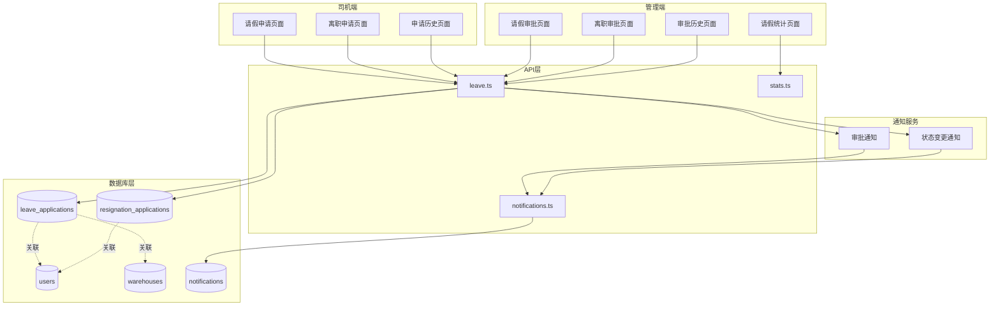
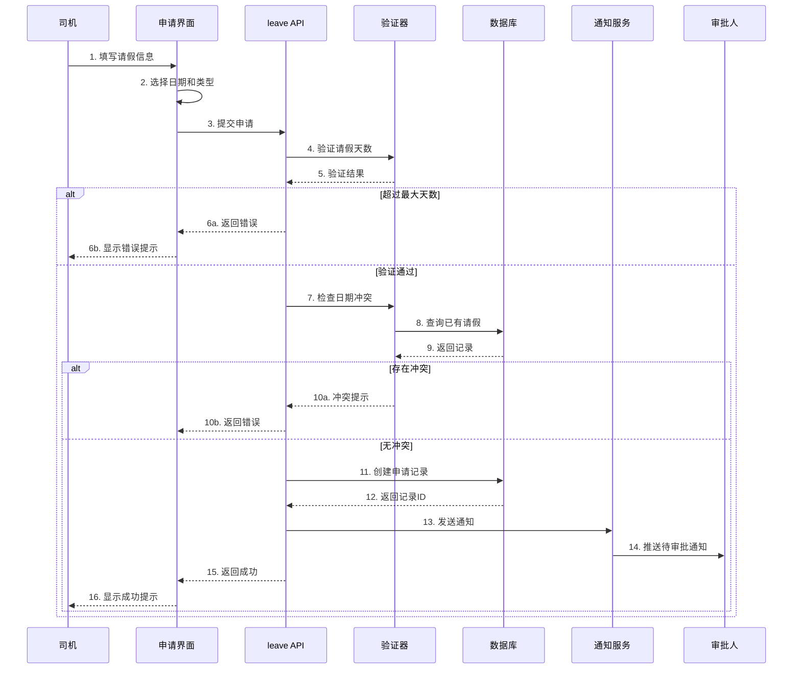
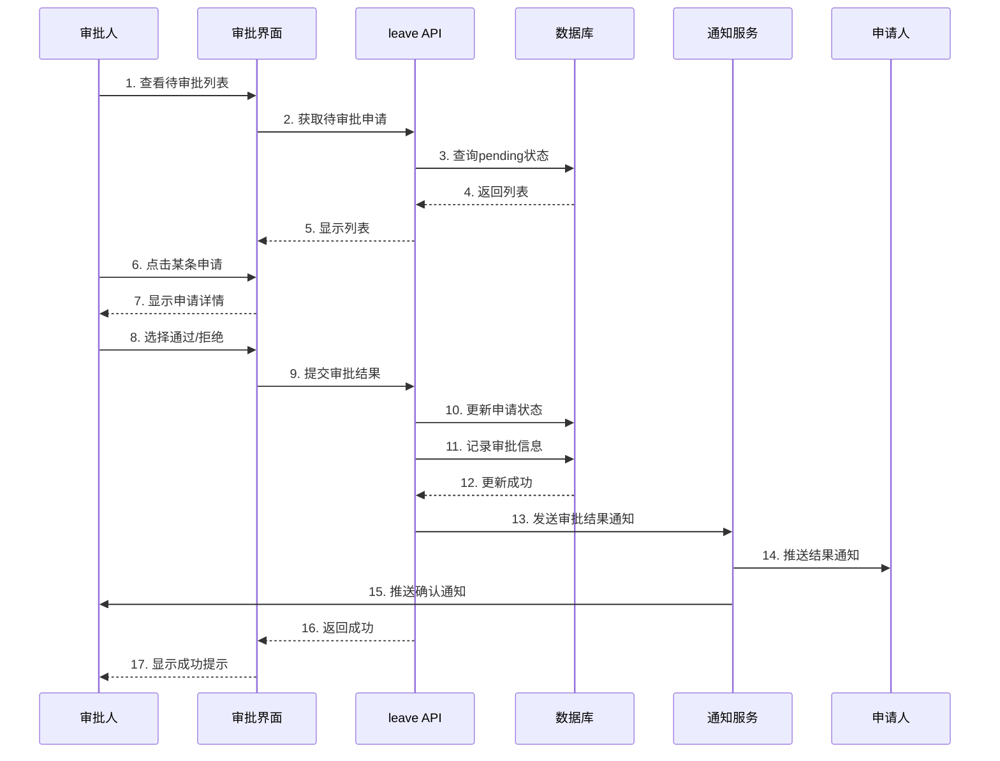
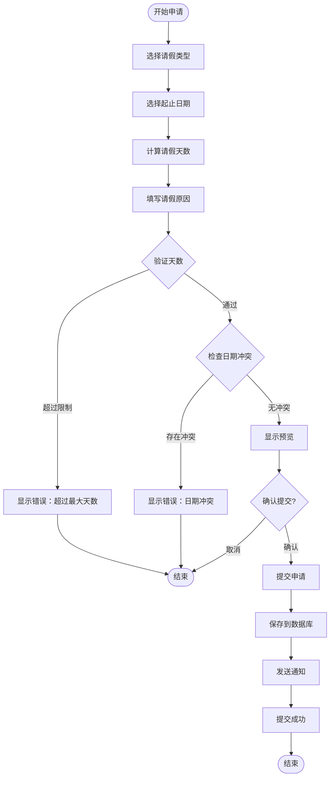
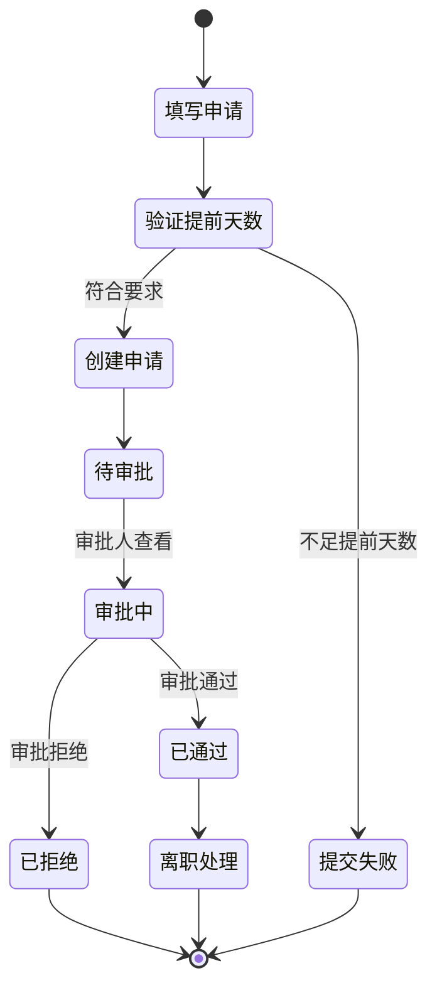
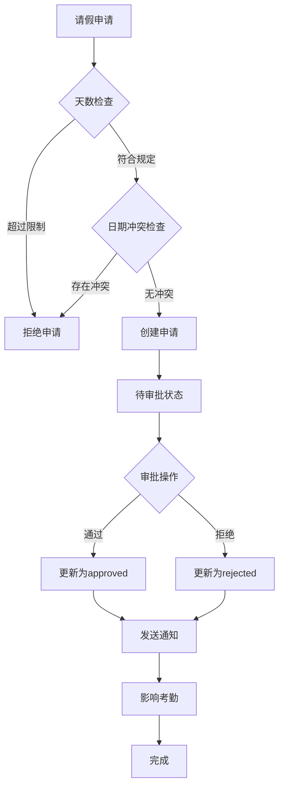

# 请假离职管理系统技术文档

## 一、功能概述

### 1.1 功能定位

请假离职管理系统是车队管家的人员管理核心模块，负责司机请假申请、离职申请的全流程管理，包括申请提交、审批流程、状态通知等，确保人员变动的规范化和可追溯性。

### 1.2 核心价值

- **流程规范**: 标准化的请假/离职申请和审批流程
- **权限分明**: 基于角色的多级审批机制
- **实时通知**: 申请状态变更即时通知相关人员
- **数据可追溯**: 完整记录审批历史和状态变更

### 1.3 业务场景

```
司机端场景：
1. 提交请假申请（病假、事假、年假等）
2. 查看审批进度和历史记录
3. 提交离职申请
4. 接收审批结果通知

管理端场景：
1. 查看待审批的请假/离职申请
2. 审批请假申请（通过/拒绝）
3. 审批离职申请
4. 查看审批历史记录
5. 统计请假数据
```

---

## 二、系统架构

### 2.1 整体架构图



### 2.2 请假申请流程



### 2.3 审批流程



---

## 三、数据模型设计

### 3.1 数据库表结构

#### 3.1.1 请假申请表 (leave_applications)

```sql
CREATE TABLE leave_applications (
  id UUID PRIMARY KEY DEFAULT gen_random_uuid(),
  driver_id UUID NOT NULL REFERENCES users(id) ON DELETE CASCADE,
  warehouse_id UUID REFERENCES warehouses(id) ON DELETE SET NULL,
  leave_type TEXT NOT NULL CHECK(leave_type IN ('sick', 'personal', 'annual', 'other')),
  start_date DATE NOT NULL,
  end_date DATE NOT NULL,
  days INTEGER NOT NULL CHECK(days > 0),
  reason TEXT NOT NULL,
  status TEXT NOT NULL DEFAULT 'pending' CHECK(status IN ('pending', 'approved', 'rejected')),
  reviewer_id UUID REFERENCES users(id) ON DELETE SET NULL,
  reviewed_at TIMESTAMPTZ,
  review_notes TEXT,
  created_at TIMESTAMPTZ DEFAULT NOW(),
  updated_at TIMESTAMPTZ DEFAULT NOW(),
  
  -- 约束：结束日期不能早于开始日期
  CONSTRAINT check_date_range CHECK (end_date >= start_date),
  
  -- 索引优化
  INDEX idx_leave_driver (driver_id),
  INDEX idx_leave_status (status),
  INDEX idx_leave_warehouse (warehouse_id),
  INDEX idx_leave_dates (start_date, end_date)
);

COMMENT ON TABLE leave_applications IS '请假申请表';
COMMENT ON COLUMN leave_applications.leave_type IS '请假类型：sick=病假, personal=事假, annual=年假, other=其他';
COMMENT ON COLUMN leave_applications.days IS '请假天数（含起止日期）';
COMMENT ON COLUMN leave_applications.status IS '审批状态：pending=待审批, approved=已通过, rejected=已拒绝';
```

#### 3.1.2 离职申请表 (resignation_applications)

```sql
CREATE TABLE resignation_applications (
  id UUID PRIMARY KEY DEFAULT gen_random_uuid(),
  driver_id UUID NOT NULL REFERENCES users(id) ON DELETE CASCADE,
  resignation_date DATE NOT NULL,
  reason TEXT NOT NULL,
  notice_days INTEGER NOT NULL DEFAULT 30,
  status TEXT NOT NULL DEFAULT 'pending' CHECK(status IN ('pending', 'approved', 'rejected')),
  reviewer_id UUID REFERENCES users(id) ON DELETE SET NULL,
  reviewed_at TIMESTAMPTZ,
  review_notes TEXT,
  created_at TIMESTAMPTZ DEFAULT NOW(),
  updated_at TIMESTAMPTZ DEFAULT NOW(),
  
  -- 约束：离职日期不能早于申请日期
  CONSTRAINT check_resignation_date CHECK (resignation_date >= CURRENT_DATE),
  
  -- 索引优化
  INDEX idx_resignation_driver (driver_id),
  INDEX idx_resignation_status (status),
  INDEX idx_resignation_date (resignation_date)
);

COMMENT ON TABLE resignation_applications IS '离职申请表';
COMMENT ON COLUMN resignation_applications.resignation_date IS '预计离职日期';
COMMENT ON COLUMN resignation_applications.notice_days IS '提前通知天数';
```

### 3.2 TypeScript 类型定义

```typescript
/**
 * 请假类型枚举
 */
export type LeaveType = 'sick' | 'personal' | 'annual' | 'other'

/**
 * 申请状态枚举
 */
export type ApplicationStatus = 'pending' | 'approved' | 'rejected'

/**
 * 请假申请接口
 */
export interface LeaveApplication {
  id: string
  driver_id: string
  warehouse_id: string | null
  leave_type: LeaveType
  start_date: string           // YYYY-MM-DD格式
  end_date: string             // YYYY-MM-DD格式
  days: number                 // 请假天数
  reason: string               // 请假原因
  status: ApplicationStatus    // 审批状态
  reviewer_id: string | null   // 审批人ID
  reviewed_at: string | null   // 审批时间
  review_notes: string | null  // 审批备注
  created_at: string
  updated_at: string
}

/**
 * 离职申请接口
 */
export interface ResignationApplication {
  id: string
  driver_id: string
  resignation_date: string     // 预计离职日期
  reason: string               // 离职原因
  notice_days: number          // 提前通知天数
  status: ApplicationStatus
  reviewer_id: string | null
  reviewed_at: string | null
  review_notes: string | null
  created_at: string
  updated_at: string
}

/**
 * 创建请假申请的输入
 */
export interface CreateLeaveInput {
  driver_id: string
  warehouse_id?: string
  leave_type: LeaveType
  start_date: string
  end_date: string
  days: number
  reason: string
}

/**
 * 审批请假申请的输入
 */
export interface ReviewLeaveInput {
  application_id: string
  reviewer_id: string
  approved: boolean           // true=通过, false=拒绝
  review_notes?: string       // 审批备注
}
```

---

## 四、核心功能实现

### 4.1 请假申请提交

#### 4.1.1 业务流程图



#### 4.1.2 核心代码实现

**API层实现** (`src/db/api/leave.ts`):

```typescript
import { supabase } from '../supabase'
import type { LeaveApplication, CreateLeaveInput, ReviewLeaveInput } from '../types'
import { sendLeaveNotification, sendReviewNotification } from '@/services/notificationService'

/**
 * 创建请假申请
 * 
 * @param data 请假申请数据
 * @returns 创建的请假申请记录
 * @throws 如果验证失败或创建失败
 */
export async function createLeaveApplication(
  data: CreateLeaveInput
): Promise<LeaveApplication> {
  // 1. 验证请假天数
  const maxDays = await getWarehouseMaxLeaveDays(data.warehouse_id)
  if (data.days > maxDays) {
    throw new Error(`请假天数不能超过${maxDays}天`)
  }
  
  // 2. 检查日期冲突
  const hasConflict = await checkLeaveDateConflict(
    data.driver_id,
    data.start_date,
    data.end_date
  )
  
  if (hasConflict) {
    throw new Error('请假日期与已有请假记录冲突，请重新选择日期')
  }
  
  // 3. 创建申请记录
  const { data: application, error } = await supabase
    .from('leave_applications')
    .insert({
      driver_id: data.driver_id,
      warehouse_id: data.warehouse_id,
      leave_type: data.leave_type,
      start_date: data.start_date,
      end_date: data.end_date,
      days: data.days,
      reason: data.reason,
      status: 'pending'
    })
    .select()
    .single()
  
  if (error) {
    console.error('[createLeaveApplication] 创建失败:', error)
    throw new Error(`创建请假申请失败: ${error.message}`)
  }
  
  // 4. 发送通知给审批人
  try {
    await sendLeaveNotification(application)
  } catch (notifyError) {
    console.error('[createLeaveApplication] 通知发送失败:', notifyError)
    // 通知失败不影响申请创建，仅记录日志
  }
  
  return application
}

/**
 * 检查请假日期是否冲突
 * 
 * @param driverId 司机ID
 * @param startDate 开始日期
 * @param endDate 结束日期
 * @returns 是否存在冲突
 */
async function checkLeaveDateConflict(
  driverId: string,
  startDate: string,
  endDate: string
): Promise<boolean> {
  const { data, error } = await supabase
    .from('leave_applications')
    .select('id')
    .eq('driver_id', driverId)
    .eq('status', 'approved')  // 只检查已通过的请假
    .or(`start_date.lte.${endDate},end_date.gte.${startDate}`)
    .limit(1)
  
  if (error) {
    console.error('[checkLeaveDateConflict] 查询失败:', error)
    return false
  }
  
  return data.length > 0
}

/**
 * 获取仓库的最大请假天数配置
 * 
 * @param warehouseId 仓库ID
 * @returns 最大请假天数，默认7天
 */
async function getWarehouseMaxLeaveDays(
  warehouseId?: string
): Promise<number> {
  if (!warehouseId) return 7  // 默认7天
  
  const { data } = await supabase
    .from('warehouses')
    .select('max_leave_days')
    .eq('id', warehouseId)
    .single()
  
  return data?.max_leave_days || 7
}
```

### 4.2 请假申请审批

#### 4.2.1 审批逻辑

```typescript
/**
 * 审批请假申请
 * 
 * @param input 审批输入数据
 * @returns 是否审批成功
 * @throws 如果审批失败
 */
export async function reviewLeaveApplication(
  input: ReviewLeaveInput
): Promise<boolean> {
  const { application_id, reviewer_id, approved, review_notes } = input
  
  // 1. 获取申请详情
  const { data: application, error: fetchError } = await supabase
    .from('leave_applications')
    .select('*')
    .eq('id', application_id)
    .single()
  
  if (fetchError || !application) {
    throw new Error('未找到该请假申请')
  }
  
  // 2. 检查申请状态
  if (application.status !== 'pending') {
    throw new Error('该申请已被审批，无法重复操作')
  }
  
  // 3. 更新审批状态
  const status = approved ? 'approved' : 'rejected'
  const { error: updateError } = await supabase
    .from('leave_applications')
    .update({
      status,
      reviewer_id,
      reviewed_at: new Date().toISOString(),
      review_notes: review_notes || null,
      updated_at: new Date().toISOString()
    })
    .eq('id', application_id)
  
  if (updateError) {
    console.error('[reviewLeaveApplication] 更新失败:', updateError)
    throw new Error(`审批失败: ${updateError.message}`)
  }
  
  // 4. 发送审批结果通知
  try {
    await sendReviewNotification({
      applicationId: application_id,
      driverId: application.driver_id,
      reviewerId: reviewer_id,
      approved,
      applicationType: 'leave'
    })
  } catch (notifyError) {
    console.error('[reviewLeaveApplication] 通知发送失败:', notifyError)
  }
  
  return true
}

/**
 * 获取待审批的请假申请列表
 * 
 * @param reviewerId 审批人ID
 * @param role 审批人角色
 * @returns 待审批列表
 */
export async function getPendingLeaveApplications(
  reviewerId: string,
  role: UserRole
): Promise<LeaveApplication[]> {
  let query = supabase
    .from('leave_applications')
    .select(`
      *,
      driver:users!driver_id(id, name, phone),
      warehouse:warehouses(id, name)
    `)
    .eq('status', 'pending')
    .order('created_at', { ascending: false })
  
  // 根据角色过滤数据
  if (role === 'MANAGER') {
    // 车队长只能看到自己管辖仓库的申请
    const { data: warehouses } = await supabase
      .from('warehouse_assignments')
      .select('warehouse_id')
      .eq('user_id', reviewerId)
    
    const warehouseIds = warehouses?.map(w => w.warehouse_id) || []
    query = query.in('warehouse_id', warehouseIds)
  }
  // BOSS和PEER_ADMIN可以看到所有申请
  
  const { data, error } = await query
  
  if (error) {
    console.error('[getPendingLeaveApplications] 查询失败:', error)
    throw error
  }
  
  return data || []
}
```

### 4.3 离职申请管理

#### 4.3.1 离职申请流程



#### 4.3.2 核心实现

```typescript
/**
 * 创建离职申请
 * 
 * @param data 离职申请数据
 * @returns 创建的离职申请记录
 */
export async function createResignationApplication(data: {
  driver_id: string
  resignation_date: string
  reason: string
  notice_days: number
}): Promise<ResignationApplication> {
  // 1. 验证提前天数
  const requiredNoticeDays = await getRequiredNoticeDays(data.driver_id)
  if (data.notice_days < requiredNoticeDays) {
    throw new Error(`离职需要提前${requiredNoticeDays}天申请`)
  }
  
  // 2. 检查是否已有待审批的离职申请
  const { data: existing } = await supabase
    .from('resignation_applications')
    .select('id')
    .eq('driver_id', data.driver_id)
    .eq('status', 'pending')
    .maybeSingle()
  
  if (existing) {
    throw new Error('您已有待审批的离职申请，请勿重复提交')
  }
  
  // 3. 创建离职申请
  const { data: application, error } = await supabase
    .from('resignation_applications')
    .insert({
      driver_id: data.driver_id,
      resignation_date: data.resignation_date,
      reason: data.reason,
      notice_days: data.notice_days,
      status: 'pending'
    })
    .select()
    .single()
  
  if (error) {
    console.error('[createResignationApplication] 创建失败:', error)
    throw new Error(`创建离职申请失败: ${error.message}`)
  }
  
  // 4. 发送通知
  await sendResignationNotification(application)
  
  return application
}

/**
 * 获取离职所需的提前通知天数
 * 
 * @param driverId 司机ID
 * @returns 提前天数，默认30天
 */
async function getRequiredNoticeDays(driverId: string): Promise<number> {
  // 从仓库配置或用户合同中获取，这里简化为固定30天
  return 30
}
```

---

## 五、权限控制

### 5.1 权限矩阵

| 操作 | BOSS | PEER_ADMIN | MANAGER | DRIVER |
|------|------|------------|---------|--------|
| 提交请假申请 | ✅ | ✅ | ✅ | ✅ |
| 查看所有请假申请 | ✅ | ✅ | ❌ | ❌ |
| 查看管辖范围请假 | ✅ | ✅ | ✅ | ❌ |
| 查看自己的请假 | ✅ | ✅ | ✅ | ✅ |
| 审批请假申请 | ✅ | ✅ | ✅ | ❌ |
| 提交离职申请 | ✅ | ✅ | ✅ | ✅ |
| 审批离职申请 | ✅ | ✅ | ❌ | ❌ |
| 撤销申请 | ✅ | ✅ | ✅ | ✅ |

### 5.2 权限配置

**应用层权限配置** (`src/config/permission-config.ts`):

```typescript
export const permissionConfig = {
  // 请假申请权限
  leave_applications: [
    {
      action: PermissionAction.SELECT,
      roles: ['BOSS', 'PEER_ADMIN'],
      allowAll: true  // 可以查看所有申请
    },
    {
      action: PermissionAction.SELECT,
      roles: ['MANAGER'],
      filter: (userId: string) => ({ manager_id: userId })  // 查看管辖范围
    },
    {
      action: PermissionAction.SELECT,
      roles: ['DRIVER'],
      filter: (userId: string) => ({ driver_id: userId })  // 只能查看自己
    },
    {
      action: PermissionAction.INSERT,
      roles: ['BOSS', 'PEER_ADMIN', 'MANAGER', 'DRIVER'],
      filter: (userId: string) => ({ driver_id: userId })
    },
    {
      action: PermissionAction.UPDATE,
      roles: ['BOSS', 'PEER_ADMIN', 'MANAGER'],
      allowAll: true  // 审批权限
    }
  ],
  
  // 离职申请权限
  resignation_applications: [
    {
      action: PermissionAction.SELECT,
      roles: ['BOSS', 'PEER_ADMIN'],
      allowAll: true
    },
    {
      action: PermissionAction.SELECT,
      roles: ['DRIVER', 'MANAGER'],
      filter: (userId: string) => ({ driver_id: userId })
    },
    {
      action: PermissionAction.INSERT,
      roles: ['BOSS', 'PEER_ADMIN', 'MANAGER', 'DRIVER'],
      filter: (userId: string) => ({ driver_id: userId })
    },
    {
      action: PermissionAction.UPDATE,
      roles: ['BOSS', 'PEER_ADMIN'],
      allowAll: true  // 只有BOSS和调度可以审批离职
    }
  ]
}
```

---

## 六、业务规则

### 6.1 请假规则

1. **天数限制**
   - 单次请假不能超过仓库配置的最大天数
   - 默认最大请假天数为7天
   - 特殊情况需要审批人批准

2. **日期规则**
   - 结束日期不能早于开始日期
   - 不能与已批准的请假日期冲突
   - 请假日期计算含起止两天

3. **审批规则**
   - 待审批状态才能进行审批操作
   - 已审批的申请不能重复审批
   - 审批后自动发送通知

4. **考勤关联**
   - 请假期间自动免除打卡要求
   - 请假期间不能录入计件记录

### 6.2 离职规则

1. **提前通知**
   - 正式员工需提前30天申请
   - 试用期员工需提前7天申请
   - 特殊情况可协商处理

2. **离职日期**
   - 离职日期不能早于申请日期
   - 离职日期必须符合提前通知天数

3. **审批权限**
   - 只有BOSS和PEER_ADMIN可以审批离职
   - 离职审批需要记录审批意见

4. **后续处理**
   - 离职通过后进行账号处理
   - 清算工资和结算事项
   - 回收相关资产和权限

### 6.3 业务约束图



---

## 七、通知机制

### 7.1 通知时机

1. **申请提交时**
   - 通知审批人（BOSS、PEER_ADMIN、管辖MANAGER）
   - 通知内容：新申请待审批

2. **审批完成时**
   - 通知申请人（DRIVER）
   - 通知内容：审批结果（通过/拒绝）

3. **状态变更时**
   - 撤销申请时通知相关人员
   - 超时未审批时提醒审批人

### 7.2 通知实现

```typescript
/**
 * 发送请假申请通知
 * 通知审批人有新的请假申请
 */
async function sendLeaveNotification(
  application: LeaveApplication
): Promise<void> {
  // 获取通知接收人
  const recipients = await getLeaveReviewers(application)
  
  // 批量创建通知
  const notifications = recipients.map(reviewer => ({
    recipient_id: reviewer.id,
    sender_id: application.driver_id,
    title: '新的请假申请',
    content: `${application.driver_name}申请请假${application.days}天，请及时审批`,
    type: 'leave_approval',
    related_id: application.id
  }))
  
  await supabase
    .from('notifications')
    .insert(notifications)
}

/**
 * 发送审批结果通知
 */
async function sendReviewNotification(data: {
  applicationId: string
  driverId: string
  reviewerId: string
  approved: boolean
  applicationType: 'leave' | 'resignation'
}): Promise<void> {
  const status = data.approved ? '已通过' : '已拒绝'
  const typeText = data.applicationType === 'leave' ? '请假申请' : '离职申请'
  
  await supabase
    .from('notifications')
    .insert({
      recipient_id: data.driverId,
      sender_id: data.reviewerId,
      title: `${typeText}审批结果`,
      content: `您的${typeText}${status}`,
      type: `${data.applicationType}_approval`,
      related_id: data.applicationId
    })
}
```

---

## 八、界面设计

### 8.1 司机端 - 请假申请页面

```
┌─────────────────────────────────┐
│  ← 请假申请                      │
├─────────────────────────────────┤
│                                 │
│  请假类型                        │
│  ○ 病假  ○ 事假                │
│  ○ 年假  ○ 其他                │
│                                 │
│  开始日期                        │
│  ┌───────────────────────────┐  │
│  │ 2025-12-15 ▼             │  │
│  └───────────────────────────┘  │
│                                 │
│  结束日期                        │
│  ┌───────────────────────────┐  │
│  │ 2025-12-17 ▼             │  │
│  └───────────────────────────┘  │
│                                 │
│  请假天数: 3天                  │
│                                 │
│  请假原因                        │
│  ┌───────────────────────────┐  │
│  │ 家中有事需要处理          │  │
│  │                           │  │
│  └───────────────────────────┘  │
│                                 │
│  💡 提示：                      │
│  • 单次请假最多7天              │
│  • 请假期间无需打卡             │
│  • 请假期间不可录入计件         │
│                                 │
│  ┌───────────────────────────┐  │
│  │       提交申请            │  │
│  └───────────────────────────┘  │
│                                 │
└─────────────────────────────────┘
```

### 8.2 管理端 - 审批页面

```
┌─────────────────────────────────┐
│  ← 请假审批                      │
├─────────────────────────────────┤
│  筛选: ● 待审批  ○ 已审批       │
├─────────────────────────────────┤
│                                 │
│  ┌───────────────────────────┐  │
│  │ 张三 - 事假               │  │
│  │ 2025-12-15 至 12-17       │  │
│  │ 请假3天                   │  │
│  │ 原因：家中有事            │  │
│  │                           │  │
│  │ [通过] [拒绝]             │  │
│  └───────────────────────────┘  │
│                                 │
│  ┌───────────────────────────┐  │
│  │ 李四 - 病假               │  │
│  │ 2025-12-20 至 12-22       │  │
│  │ 请假3天                   │  │
│  │ 原因：身体不适需要休息    │  │
│  │                           │  │
│  │ [通过] [拒绝]             │  │
│  └───────────────────────────┘  │
│                                 │
└─────────────────────────────────┘

审批详情弹窗：
┌─────────────────────────────────┐
│  审批请假申请                    │
├─────────────────────────────────┤
│  申请人: 张三                   │
│  请假类型: 事假                 │
│  请假时间: 2025-12-15 至 12-17  │
│  请假天数: 3天                  │
│  请假原因: 家中有事需要处理     │
│  申请时间: 2025-12-11 10:30     │
├─────────────────────────────────┤
│  审批意见（选填）               │
│  ┌───────────────────────────┐  │
│  │                           │  │
│  └───────────────────────────┘  │
│                                 │
│  ┌─────────┐  ┌─────────┐      │
│  │ 通 过 │  │ 拒 绝 │      │
│  └─────────┘  └─────────┘      │
│                                 │
└─────────────────────────────────┘
```

---

## 九、性能优化

### 9.1 数据库优化

#### 9.1.1 索引策略

```sql
-- 司机ID索引（查询个人申请）
CREATE INDEX idx_leave_driver ON leave_applications(driver_id);

-- 状态索引（查询待审批列表）
CREATE INDEX idx_leave_status ON leave_applications(status);

-- 日期范围索引（检查冲突）
CREATE INDEX idx_leave_dates ON leave_applications(start_date, end_date);

-- 仓库ID索引（车队长查询管辖范围）
CREATE INDEX idx_leave_warehouse ON leave_applications(warehouse_id);

-- 复合索引（优化常用查询）
CREATE INDEX idx_leave_driver_status 
ON leave_applications(driver_id, status);
```

#### 9.1.2 查询优化

```typescript
// 使用EXISTS子查询优化冲突检查
async function checkConflictOptimized(
  driverId: string,
  startDate: string,
  endDate: string
): Promise<boolean> {
  const { data } = await supabase
    .rpc('check_leave_conflict', {
      p_driver_id: driverId,
      p_start_date: startDate,
      p_end_date: endDate
    })
  
  return data || false
}

// 对应的数据库函数
/*
CREATE OR REPLACE FUNCTION check_leave_conflict(
  p_driver_id UUID,
  p_start_date DATE,
  p_end_date DATE
) RETURNS BOOLEAN AS $$
BEGIN
  RETURN EXISTS (
    SELECT 1 FROM leave_applications
    WHERE driver_id = p_driver_id
      AND status = 'approved'
      AND (start_date <= p_end_date AND end_date >= p_start_date)
  );
END;
$$ LANGUAGE plpgsql;
*/
```

### 9.2 前端优化

#### 9.2.1 列表分页

```typescript
// 分页加载审批列表
async function getPendingLeavesPaginated(
  page: number = 1,
  pageSize: number = 20
): Promise<{ data: LeaveApplication[], total: number }> {
  const from = (page - 1) * pageSize
  const to = from + pageSize - 1
  
  const { data, error, count } = await supabase
    .from('leave_applications')
    .select('*', { count: 'exact' })
    .eq('status', 'pending')
    .range(from, to)
    .order('created_at', { ascending: false })
  
  return {
    data: data || [],
    total: count || 0
  }
}
```

#### 9.2.2 实时订阅

```typescript
// 订阅审批状态变更
function subscribeToLeaveStatus(
  applicationId: string,
  onUpdate: (application: LeaveApplication) => void
) {
  return supabase
    .channel(`leave:${applicationId}`)
    .on('postgres_changes', {
      event: 'UPDATE',
      schema: 'public',
      table: 'leave_applications',
      filter: `id=eq.${applicationId}`
    }, (payload) => {
      onUpdate(payload.new as LeaveApplication)
    })
    .subscribe()
}
```

---

## 十、测试用例

### 10.1 单元测试

```typescript
describe('请假离职管理系统', () => {
  describe('日期冲突检查', () => {
    it('应该检测到重叠的请假日期', async () => {
      // 已有请假：12-15 到 12-20
      const hasConflict = await checkLeaveDateConflict(
        'driver-id',
        '2025-12-18',  // 新请假开始
        '2025-12-22'   // 新请假结束
      )
      expect(hasConflict).toBe(true)
    })
    
    it('不重叠的日期应该通过检查', async () => {
      const hasConflict = await checkLeaveDateConflict(
        'driver-id',
        '2025-12-25',
        '2025-12-27'
      )
      expect(hasConflict).toBe(false)
    })
  })
  
  describe('天数验证', () => {
    it('超过最大天数应该抛出错误', async () => {
      await expect(
        createLeaveApplication({
          days: 10,  // 超过默认的7天
          // ... 其他参数
        })
      ).rejects.toThrow('请假天数不能超过7天')
    })
  })
  
  describe('审批流程', () => {
    it('已审批的申请不能重复审批', async () => {
      await expect(
        reviewLeaveApplication({
          application_id: 'approved-app-id',
          reviewer_id: 'reviewer-id',
          approved: true
        })
      ).rejects.toThrow('该申请已被审批')
    })
  })
})
```

### 10.2 集成测试

```typescript
describe('完整的请假流程', () => {
  it('从申请到审批的完整流程', async () => {
    // 1. 创建请假申请
    const application = await createLeaveApplication({
      driver_id: 'driver-id',
      warehouse_id: 'warehouse-id',
      leave_type: 'personal',
      start_date: '2025-12-15',
      end_date: '2025-12-17',
      days: 3,
      reason: '家中有事'
    })
    
    expect(application.status).toBe('pending')
    
    // 2. 审批人审批
    await reviewLeaveApplication({
      application_id: application.id,
      reviewer_id: 'reviewer-id',
      approved: true,
      review_notes: '同意请假'
    })
    
    // 3. 验证状态更新
    const { data: updated } = await supabase
      .from('leave_applications')
      .select('*')
      .eq('id', application.id)
      .single()
    
    expect(updated.status).toBe('approved')
    expect(updated.reviewer_id).toBe('reviewer-id')
  })
})
```

---

## 十一、常见问题

### 11.1 问题排查

| 问题 | 原因 | 解决方案 |
|------|------|---------|
| 无法提交请假 | 日期冲突或超过天数限制 | 检查已有请假记录，调整日期 |
| 审批失败 | 申请已被审批 | 刷新页面查看最新状态 |
| 收不到通知 | 通知服务异常 | 检查通知权限和网络连接 |
| 离职申请被拒 | 提前天数不足 | 调整离职日期，满足提前通知要求 |

### 11.2 数据修复脚本

```sql
-- 清理异常状态的申请
UPDATE leave_applications 
SET status = 'rejected'
WHERE status = 'pending' 
  AND created_at < NOW() - INTERVAL '30 days';

-- 修复日期范围错误
UPDATE leave_applications
SET end_date = start_date
WHERE end_date < start_date;

-- 重新计算请假天数
UPDATE leave_applications
SET days = (end_date - start_date) + 1
WHERE days != (end_date - start_date) + 1;
```

---

## 十二、未来扩展

### 12.1 功能扩展

1. **请假额度管理**
   - 年假额度跟踪
   - 请假余额查询
   - 额度自动扣减

2. **批量审批**
   - 一键批量通过
   - 批量拒绝功能
   - 审批规则自动化

3. **请假统计**
   - 部门请假率分析
   - 请假类型分布
   - 请假趋势预测

### 12.2 技术优化

1. **工作流引擎**
   - 多级审批流程
   - 审批规则配置
   - 自动流转机制

2. **智能提醒**
   - 超时未审批提醒
   - 请假到期提醒
   - 异常请假预警

---

## 十三、总结

请假离职管理系统是车队管家的人员管理核心，具有以下特点：

### 优势

- ✅ **流程规范**: 标准化的申请和审批流程
- ✅ **权限完善**: 多级审批和细粒度权限控制
- ✅ **实时通知**: 状态变更即时通知相关人员
- ✅ **数据完整**: 完整的审批历史和状态记录
- ✅ **性能优化**: 索引优化、分页加载、实时订阅

### 技术亮点

1. 日期冲突检查避免请假重叠
2. 天数限制保证规则合规
3. 多角色审批支持灵活的审批流程
4. 通知机制确保信息及时传达

---

**文档版本**: 1.0.0  
**创建时间**: 2025-12-11  
**维护人员**: 系统开发团队  
**状态**: 已发布
