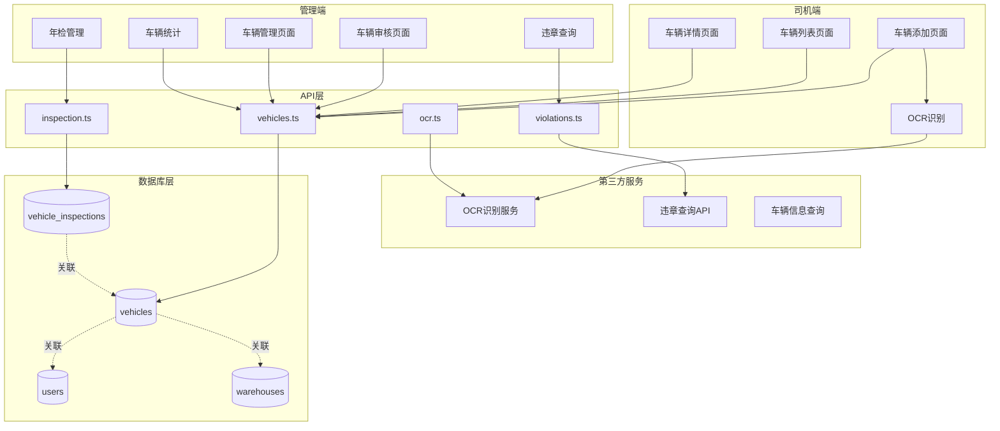
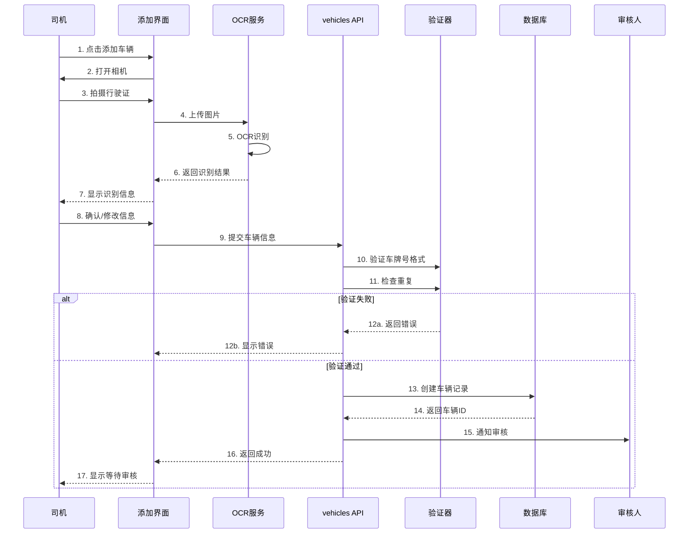
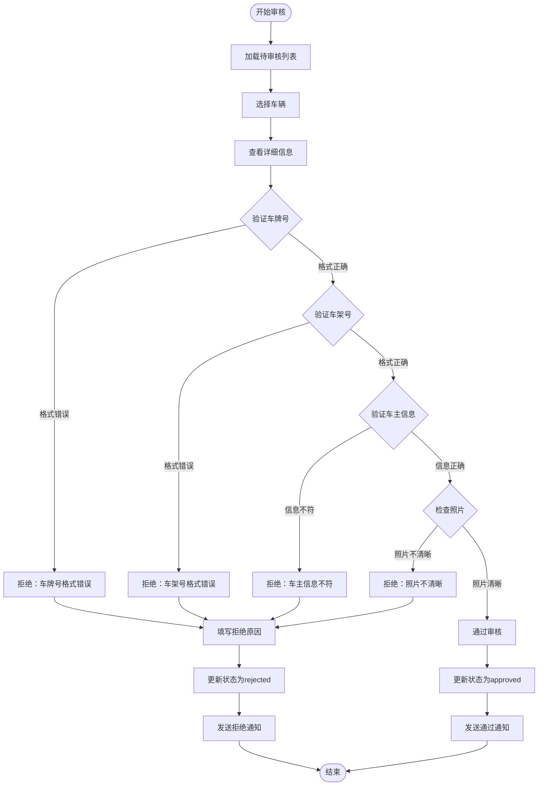
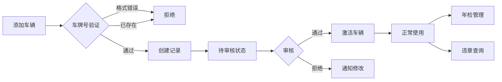

# 车辆管理系统技术文档

## 一、功能概述

### 1.1 功能定位

车辆管理系统是车队管家的核心资产管理模块，负责车辆信息的全生命周期管理，包括车辆登记、审核、OCR识别、违章查询、年检管理等，确保车队车辆信息的准确性和合规性。

### 1.2 核心价值

- **资产管理**: 完整的车辆档案和信息管理
- **智能识别**: OCR自动识别行驶证信息
- **审核机制**: 严格的车辆信息审核流程
- **合规管理**: 年检提醒、违章查询、保险管理
- **数据准确**: 多重验证确保车辆信息准确

### 1.3 业务场景

```
司机端场景：
1. 添加车辆信息（拍照上传行驶证）
2. OCR自动识别车辆信息
3. 补充和完善车辆信息
4. 查看审核状态
5. 管理自己的车辆列表

管理端场景：
1. 审核待审核车辆
2. 查看所有车辆列表
3. 车辆信息修改和更新
4. 车辆违章查询
5. 年检到期提醒
6. 车辆统计分析
```

---

## 二、系统架构

### 2.1 整体架构图



### 2.2 车辆添加流程



### 2.3 车辆审核流程



---

## 三、数据模型设计

### 3.1 数据库表结构

#### 3.1.1 车辆表 (vehicles)

```sql
CREATE TABLE vehicles (
  id UUID PRIMARY KEY DEFAULT gen_random_uuid(),
  user_id UUID NOT NULL REFERENCES users(id) ON DELETE CASCADE,
  warehouse_id UUID REFERENCES warehouses(id) ON DELETE SET NULL,
  
  -- 基本信息
  plate_number TEXT NOT NULL,
  vin TEXT,  -- 车架号
  vehicle_type TEXT,  -- 车型
  brand TEXT,  -- 品牌
  model TEXT,  -- 型号
  color TEXT,  -- 颜色
  
  -- 证件信息
  license_image_url TEXT,  -- 行驶证照片
  registration_date DATE,  -- 注册日期
  issue_date DATE,  -- 发证日期
  
  -- 车主信息
  owner_name TEXT NOT NULL,
  owner_id_number TEXT,  -- 车主身份证号
  
  -- 审核信息
  status TEXT NOT NULL DEFAULT 'pending' CHECK(status IN ('pending', 'approved', 'rejected')),
  reviewer_id UUID REFERENCES users(id) ON DELETE SET NULL,
  reviewed_at TIMESTAMPTZ,
  review_notes TEXT,
  
  -- 其他信息
  is_active BOOLEAN DEFAULT true,
  notes TEXT,
  created_at TIMESTAMPTZ DEFAULT NOW(),
  updated_at TIMESTAMPTZ DEFAULT NOW(),
  
  -- 唯一约束：车牌号唯一
  CONSTRAINT uq_plate_number UNIQUE (plate_number),
  
  -- 索引
  INDEX idx_vehicles_user (user_id),
  INDEX idx_vehicles_status (status),
  INDEX idx_vehicles_warehouse (warehouse_id),
  INDEX idx_vehicles_plate (plate_number)
);

COMMENT ON TABLE vehicles IS '车辆信息表';
COMMENT ON COLUMN vehicles.status IS '审核状态：pending=待审核, approved=已通过, rejected=已拒绝';
COMMENT ON COLUMN vehicles.is_active IS '是否激活（用于软删除）';
```

#### 3.1.2 车辆年检记录表 (vehicle_inspections)

```sql
CREATE TABLE vehicle_inspections (
  id UUID PRIMARY KEY DEFAULT gen_random_uuid(),
  vehicle_id UUID NOT NULL REFERENCES vehicles(id) ON DELETE CASCADE,
  inspection_date DATE NOT NULL,  -- 年检日期
  next_inspection_date DATE NOT NULL,  -- 下次年检日期
  inspection_result TEXT CHECK(inspection_result IN ('pass', 'fail')),
  inspection_location TEXT,  -- 年检地点
  certificate_image_url TEXT,  -- 年检证书照片
  notes TEXT,
  created_at TIMESTAMPTZ DEFAULT NOW(),
  updated_at TIMESTAMPTZ DEFAULT NOW(),
  
  INDEX idx_inspections_vehicle (vehicle_id),
  INDEX idx_inspections_next_date (next_inspection_date)
);

COMMENT ON TABLE vehicle_inspections IS '车辆年检记录表';
```

#### 3.1.3 车辆违章记录表 (vehicle_violations)

```sql
CREATE TABLE vehicle_violations (
  id UUID PRIMARY KEY DEFAULT gen_random_uuid(),
  vehicle_id UUID NOT NULL REFERENCES vehicles(id) ON DELETE CASCADE,
  violation_date DATE NOT NULL,  -- 违章日期
  violation_type TEXT NOT NULL,  -- 违章类型
  violation_location TEXT,  -- 违章地点
  penalty_points INTEGER DEFAULT 0,  -- 扣分
  fine_amount DECIMAL(10, 2) DEFAULT 0,  -- 罚款金额
  is_processed BOOLEAN DEFAULT false,  -- 是否已处理
  processed_at TIMESTAMPTZ,
  notes TEXT,
  created_at TIMESTAMPTZ DEFAULT NOW(),
  updated_at TIMESTAMPTZ DEFAULT NOW(),
  
  INDEX idx_violations_vehicle (vehicle_id),
  INDEX idx_violations_processed (is_processed),
  INDEX idx_violations_date (violation_date)
);

COMMENT ON TABLE vehicle_violations IS '车辆违章记录表';
```

### 3.2 TypeScript 类型定义

```typescript
/**
 * 车辆审核状态枚举
 */
export type VehicleStatus = 'pending' | 'approved' | 'rejected'

/**
 * 年检结果枚举
 */
export type InspectionResult = 'pass' | 'fail'

/**
 * 车辆信息接口
 */
export interface Vehicle {
  id: string
  user_id: string
  warehouse_id: string | null
  
  // 基本信息
  plate_number: string        // 车牌号
  vin: string | null          // 车架号
  vehicle_type: string | null // 车型
  brand: string | null        // 品牌
  model: string | null        // 型号
  color: string | null        // 颜色
  
  // 证件信息
  license_image_url: string | null  // 行驶证照片
  registration_date: string | null  // 注册日期
  issue_date: string | null         // 发证日期
  
  // 车主信息
  owner_name: string
  owner_id_number: string | null
  
  // 审核信息
  status: VehicleStatus
  reviewer_id: string | null
  reviewed_at: string | null
  review_notes: string | null
  
  // 其他
  is_active: boolean
  notes: string | null
  created_at: string
  updated_at: string
}

/**
 * 年检记录接口
 */
export interface VehicleInspection {
  id: string
  vehicle_id: string
  inspection_date: string
  next_inspection_date: string
  inspection_result: InspectionResult
  inspection_location: string | null
  certificate_image_url: string | null
  notes: string | null
  created_at: string
  updated_at: string
}

/**
 * 违章记录接口
 */
export interface VehicleViolation {
  id: string
  vehicle_id: string
  violation_date: string
  violation_type: string
  violation_location: string | null
  penalty_points: number
  fine_amount: number
  is_processed: boolean
  processed_at: string | null
  notes: string | null
  created_at: string
  updated_at: string
}

/**
 * OCR识别结果接口
 */
export interface OCRResult {
  plate_number: string
  vin: string
  vehicle_type: string
  owner_name: string
  registration_date: string
  brand: string
  model: string
  confidence: number  // 识别置信度 0-1
}

/**
 * 创建车辆输入
 */
export interface CreateVehicleInput {
  user_id: string
  warehouse_id?: string
  plate_number: string
  vin?: string
  vehicle_type?: string
  brand?: string
  model?: string
  color?: string
  license_image_url?: string
  registration_date?: string
  issue_date?: string
  owner_name: string
  owner_id_number?: string
  notes?: string
}

/**
 * 审核车辆输入
 */
export interface ReviewVehicleInput {
  vehicle_id: string
  reviewer_id: string
  approved: boolean
  review_notes?: string
}
```

---

## 四、核心功能实现

### 4.1 车辆添加与OCR识别

#### 4.1.1 OCR识别实现

```typescript
import Taro from '@tarojs/taro'

/**
 * 行驶证OCR识别
 * 
 * @param imagePath 行驶证图片路径
 * @returns OCR识别结果
 */
export async function recognizeVehicleLicense(
  imagePath: string
): Promise<OCRResult> {
  try {
    // 1. 图片预处理（压缩、裁剪）
    const processedImage = await preprocessImage(imagePath)
    
    // 2. 调用OCR服务
    const response = await Taro.request({
      url: 'https://api.ocr-service.com/vehicle-license',
      method: 'POST',
      data: {
        image: processedImage,
        type: 'vehicle_license'
      }
    })
    
    // 3. 解析识别结果
    const result = parseOCRResponse(response.data)
    
    // 4. 验证识别结果
    validateOCRResult(result)
    
    return result
  } catch (error) {
    console.error('[recognizeVehicleLicense] OCR识别失败:', error)
    throw new Error('行驶证识别失败，请手动输入')
  }
}

/**
 * 图片预处理
 */
async function preprocessImage(imagePath: string): Promise<string> {
  // 压缩图片到合适大小
  const { path } = await Taro.compressImage({
    src: imagePath,
    quality: 80
  })
  
  // 转换为base64
  const base64 = await imageToBase64(path)
  return base64
}

/**
 * 解析OCR响应
 */
function parseOCRResponse(data: any): OCRResult {
  return {
    plate_number: data.plate_number || '',
    vin: data.vin || '',
    vehicle_type: data.vehicle_type || '',
    owner_name: data.owner_name || '',
    registration_date: data.registration_date || '',
    brand: data.brand || '',
    model: data.model || '',
    confidence: data.confidence || 0
  }
}

/**
 * 验证OCR结果
 */
function validateOCRResult(result: OCRResult): void {
  if (!result.plate_number) {
    throw new Error('未识别到车牌号')
  }
  
  if (result.confidence < 0.7) {
    console.warn('[validateOCRResult] 识别置信度较低:', result.confidence)
    // 可以提示用户确认
  }
}
```

#### 4.1.2 车辆创建实现

**API层实现** (`src/db/api/vehicles.ts`):

```typescript
import { supabase } from '../supabase'
import type { Vehicle, CreateVehicleInput, ReviewVehicleInput } from '../types'
import { sendVehicleReviewNotification } from '@/services/notificationService'

/**
 * 创建车辆记录
 * 
 * @param data 车辆信息
 * @returns 创建的车辆记录
 * @throws 如果验证失败或创建失败
 */
export async function createVehicle(
  data: CreateVehicleInput
): Promise<Vehicle> {
  // 1. 验证车牌号格式
  if (!isValidPlateNumber(data.plate_number)) {
    throw new Error('车牌号格式不正确')
  }
  
  // 2. 检查车牌号是否已存在
  const exists = await checkPlateNumberExists(data.plate_number)
  if (exists) {
    throw new Error('该车牌号已存在')
  }
  
  // 3. 验证车架号格式（如果提供）
  if (data.vin && !isValidVIN(data.vin)) {
    throw new Error('车架号格式不正确')
  }
  
  // 4. 创建车辆记录
  const { data: vehicle, error } = await supabase
    .from('vehicles')
    .insert({
      user_id: data.user_id,
      warehouse_id: data.warehouse_id || null,
      plate_number: data.plate_number.toUpperCase(),  // 统一大写
      vin: data.vin?.toUpperCase() || null,
      vehicle_type: data.vehicle_type || null,
      brand: data.brand || null,
      model: data.model || null,
      color: data.color || null,
      license_image_url: data.license_image_url || null,
      registration_date: data.registration_date || null,
      issue_date: data.issue_date || null,
      owner_name: data.owner_name,
      owner_id_number: data.owner_id_number || null,
      notes: data.notes || null,
      status: 'pending'
    })
    .select()
    .single()
  
  if (error) {
    console.error('[createVehicle] 创建失败:', error)
    throw new Error(`创建车辆失败: ${error.message}`)
  }
  
  // 5. 发送审核通知
  try {
    await sendVehicleReviewNotification(vehicle)
  } catch (notifyError) {
    console.error('[createVehicle] 通知发送失败:', notifyError)
  }
  
  return vehicle
}

/**
 * 验证车牌号格式
 * 支持：普通车牌、新能源车牌、军牌等
 */
function isValidPlateNumber(plateNumber: string): boolean {
  // 普通车牌：京A12345
  const normalPattern = /^[京津沪渝冀豫云辽黑湘皖鲁新苏浙赣鄂桂甘晋蒙陕吉闽贵粤青藏川宁琼使领][A-HJ-NP-Z][A-HJ-NP-Z0-9]{5}$/
  
  // 新能源车牌：京AD12345
  const newEnergyPattern = /^[京津沪渝冀豫云辽黑湘皖鲁新苏浙赣鄂桂甘晋蒙陕吉闽贵粤青藏川宁琼使领][A-HJ-NP-Z][A-HJ-NP-Z0-9]{5}[DF]$/
  
  return normalPattern.test(plateNumber) || newEnergyPattern.test(plateNumber)
}

/**
 * 验证车架号格式
 * VIN码为17位字符
 */
function isValidVIN(vin: string): boolean {
  return /^[A-HJ-NPR-Z0-9]{17}$/.test(vin)
}

/**
 * 检查车牌号是否已存在
 */
async function checkPlateNumberExists(plateNumber: string): Promise<boolean> {
  const { data, error } = await supabase
    .from('vehicles')
    .select('id')
    .eq('plate_number', plateNumber.toUpperCase())
    .eq('is_active', true)
    .maybeSingle()
  
  if (error) {
    console.error('[checkPlateNumberExists] 查询失败:', error)
    return false
  }
  
  return !!data
}
```

### 4.2 车辆审核

#### 4.2.1 审核实现

```typescript
/**
 * 审核车辆
 * 
 * @param input 审核输入
 * @returns 是否审核成功
 */
export async function reviewVehicle(
  input: ReviewVehicleInput
): Promise<boolean> {
  const { vehicle_id, reviewer_id, approved, review_notes } = input
  
  // 1. 获取车辆详情
  const { data: vehicle, error: fetchError } = await supabase
    .from('vehicles')
    .select('*')
    .eq('id', vehicle_id)
    .single()
  
  if (fetchError || !vehicle) {
    throw new Error('未找到该车辆')
  }
  
  // 2. 检查车辆状态
  if (vehicle.status !== 'pending') {
    throw new Error('该车辆已被审核，无法重复操作')
  }
  
  // 3. 更新审核状态
  const status = approved ? 'approved' : 'rejected'
  const { error: updateError } = await supabase
    .from('vehicles')
    .update({
      status,
      reviewer_id,
      reviewed_at: new Date().toISOString(),
      review_notes: review_notes || null,
      updated_at: new Date().toISOString()
    })
    .eq('id', vehicle_id)
  
  if (updateError) {
    console.error('[reviewVehicle] 更新失败:', updateError)
    throw new Error(`审核失败: ${updateError.message}`)
  }
  
  // 4. 发送审核结果通知
  try {
    await sendVehicleReviewResultNotification({
      vehicleId: vehicle_id,
      userId: vehicle.user_id,
      reviewerId: reviewer_id,
      approved
    })
  } catch (notifyError) {
    console.error('[reviewVehicle] 通知发送失败:', notifyError)
  }
  
  return true
}

/**
 * 获取待审核车辆列表
 * 
 * @param reviewerId 审批人ID
 * @param role 审批人角色
 * @returns 待审核车辆列表
 */
export async function getPendingVehicles(
  reviewerId: string,
  role: UserRole
): Promise<Vehicle[]> {
  let query = supabase
    .from('vehicles')
    .select(`
      *,
      user:users!user_id(id, name, phone),
      warehouse:warehouses(id, name)
    `)
    .eq('status', 'pending')
    .eq('is_active', true)
    .order('created_at', { ascending: false })
  
  // 根据角色过滤
  if (role === 'MANAGER') {
    const { data: warehouses } = await supabase
      .from('warehouse_assignments')
      .select('warehouse_id')
      .eq('user_id', reviewerId)
    
    const warehouseIds = warehouses?.map(w => w.warehouse_id) || []
    query = query.in('warehouse_id', warehouseIds)
  }
  
  const { data, error } = await query
  
  if (error) {
    console.error('[getPendingVehicles] 查询失败:', error)
    throw error
  }
  
  return data || []
}
```

### 4.3 车辆年检管理

#### 4.3.1 年检记录

```typescript
/**
 * 创建年检记录
 * 
 * @param data 年检数据
 * @returns 创建的年检记录
 */
export async function createInspectionRecord(data: {
  vehicle_id: string
  inspection_date: string
  next_inspection_date: string
  inspection_result: InspectionResult
  inspection_location?: string
  certificate_image_url?: string
  notes?: string
}): Promise<VehicleInspection> {
  const { data: record, error } = await supabase
    .from('vehicle_inspections')
    .insert(data)
    .select()
    .single()
  
  if (error) {
    console.error('[createInspectionRecord] 创建失败:', error)
    throw error
  }
  
  return record
}

/**
 * 获取即将到期的年检车辆
 * 
 * @param days 提前天数，默认30天
 * @returns 即将到期的车辆列表
 */
export async function getUpcomingInspections(
  days: number = 30
): Promise<Vehicle[]> {
  const futureDate = new Date()
  futureDate.setDate(futureDate.getDate() + days)
  
  const { data, error } = await supabase
    .from('vehicle_inspections')
    .select(`
      *,
      vehicle:vehicles(*)
    `)
    .lte('next_inspection_date', futureDate.toISOString().split('T')[0])
    .order('next_inspection_date', { ascending: true })
  
  if (error) {
    console.error('[getUpcomingInspections] 查询失败:', error)
    throw error
  }
  
  return data?.map(d => d.vehicle) || []
}
```

### 4.4 车辆违章查询

#### 4.4.1 违章查询实现

```typescript
/**
 * 查询车辆违章
 * 调用第三方违章查询API
 * 
 * @param plateNumber 车牌号
 * @param vin 车架号后6位
 * @returns 违章记录列表
 */
export async function queryViolations(
  plateNumber: string,
  vin: string
): Promise<VehicleViolation[]> {
  try {
    // 调用第三方违章查询API
    const response = await Taro.request({
      url: 'https://api.violation-service.com/query',
      method: 'POST',
      data: {
        plate_number: plateNumber,
        vin_last_6: vin.slice(-6)
      }
    })
    
    const violations = response.data.violations || []
    return violations.map(v => ({
      violation_date: v.date,
      violation_type: v.type,
      violation_location: v.location,
      penalty_points: v.points,
      fine_amount: v.fine,
      is_processed: false
    }))
  } catch (error) {
    console.error('[queryViolations] 查询失败:', error)
    throw new Error('违章查询失败')
  }
}

/**
 * 保存违章记录
 */
export async function saveViolationRecord(
  vehicleId: string,
  violation: Partial<VehicleViolation>
): Promise<VehicleViolation> {
  const { data, error } = await supabase
    .from('vehicle_violations')
    .insert({
      vehicle_id: vehicleId,
      ...violation
    })
    .select()
    .single()
  
  if (error) {
    console.error('[saveViolationRecord] 保存失败:', error)
    throw error
  }
  
  return data
}
```

---

## 五、权限控制

### 5.1 权限矩阵

| 操作 | BOSS | PEER_ADMIN | MANAGER | DRIVER |
|------|------|------------|---------|--------|
| 添加车辆 | ✅ | ✅ | ✅ | ✅ |
| 查看所有车辆 | ✅ | ✅ | ❌ | ❌ |
| 查看管辖车辆 | ✅ | ✅ | ✅ | ❌ |
| 查看自己车辆 | ✅ | ✅ | ✅ | ✅ |
| 审核车辆 | ✅ | ✅ | ✅ | ❌ |
| 修改车辆信息 | ✅ | ✅ | ✅ | ✅ |
| 删除车辆 | ✅ | ✅ | ✅ | ❌ |
| 违章查询 | ✅ | ✅ | ✅ | ✅ |
| 年检管理 | ✅ | ✅ | ✅ | ❌ |

### 5.2 权限配置

```typescript
export const permissionConfig = {
  vehicles: [
    {
      action: PermissionAction.SELECT,
      roles: ['BOSS', 'PEER_ADMIN'],
      allowAll: true
    },
    {
      action: PermissionAction.SELECT,
      roles: ['MANAGER'],
      filter: (userId: string) => ({ warehouse_manager_id: userId })
    },
    {
      action: PermissionAction.SELECT,
      roles: ['DRIVER'],
      filter: (userId: string) => ({ user_id: userId })
    },
    {
      action: PermissionAction.INSERT,
      roles: ['BOSS', 'PEER_ADMIN', 'MANAGER', 'DRIVER'],
      filter: (userId: string) => ({ user_id: userId })
    },
    {
      action: PermissionAction.UPDATE,
      roles: ['BOSS', 'PEER_ADMIN', 'MANAGER'],
      allowAll: true
    }
  ]
}
```

---

## 六、业务规则

### 6.1 核心规则

1. **车牌号规则**
   - 车牌号必须唯一
   - 支持普通车牌和新能源车牌
   - 自动转换为大写

2. **车架号规则**
   - VIN码必须为17位
   - 不包含字母I、O、Q
   - 可选字段，但建议填写

3. **审核规则**
   - 新添加的车辆默认为待审核状态
   - 只有待审核状态才能进行审核
   - 审核通过后才能正常使用

4. **年检规则**
   - 新车6年内免检（部分车型）
   - 6-15年每年检验一次
   - 15年以上每半年检验一次

5. **违章规则**
   - 违章记录需要手动确认
   - 处理后标记为已处理
   - 罚款和扣分统计

### 6.2 业务约束图



---

## 七、界面设计

### 7.1 司机端 - 添加车辆页面

```
┌─────────────────────────────────┐
│  ← 添加车辆                      │
├─────────────────────────────────┤
│                                 │
│  行驶证照片                      │
│  ┌───────────────────────────┐  │
│  │                           │  │
│  │     📷 点击拍摄           │  │
│  │     或从相册选择          │  │
│  │                           │  │
│  └───────────────────────────┘  │
│                                 │
│  车牌号 *                       │
│  ┌───────────────────────────┐  │
│  │ 京A12345                  │  │
│  └───────────────────────────┘  │
│                                 │
│  车架号                         │
│  ┌───────────────────────────┐  │
│  │ LSGPC52U8ES012345         │  │
│  └───────────────────────────┘  │
│                                 │
│  车主姓名 *                     │
│  ┌───────────────────────────┐  │
│  │ 张三                      │  │
│  └───────────────────────────┘  │
│                                 │
│  品牌车型                        │
│  ┌───────────────────────────┐  │
│  │ 大众 朗逸                 │  │
│  └───────────────────────────┘  │
│                                 │
│  车辆颜色                        │
│  ┌───────────────────────────┐  │
│  │ 白色                      │  │
│  └───────────────────────────┘  │
│                                 │
│  ┌───────────────────────────┐  │
│  │  🔍 OCR识别行驶证         │  │
│  └───────────────────────────┘  │
│                                 │
│  ┌───────────────────────────┐  │
│  │       提交审核            │  │
│  └───────────────────────────┘  │
│                                 │
└─────────────────────────────────┘
```

### 7.2 管理端 - 车辆审核页面

```
┌─────────────────────────────────┐
│  车辆审核                        │
├─────────────────────────────────┤
│  筛选: ● 待审核  ○ 已审核       │
├─────────────────────────────────┤
│                                 │
│  ┌───────────────────────────┐  │
│  │ 京A12345                  │  │
│  │ 车主：张三                │  │
│  │ 车型：大众朗逸            │  │
│  │ 提交时间：2025-12-11      │  │
│  │                           │  │
│  │ [查看详情]                │  │
│  └───────────────────────────┘  │
│                                 │
│  ┌───────────────────────────┐  │
│  │ 京B67890                  │  │
│  │ 车主：李四                │  │
│  │ 车型：本田雅阁            │  │
│  │ 提交时间：2025-12-10      │  │
│  │                           │  │
│  │ [查看详情]                │  │
│  └───────────────────────────┘  │
│                                 │
└─────────────────────────────────┘

审核详情弹窗：
┌─────────────────────────────────┐
│  车辆审核详情                    │
├─────────────────────────────────┤
│  行驶证照片                      │
│  ┌───────────────────────────┐  │
│  │                           │  │
│  │   [行驶证图片]            │  │
│  │                           │  │
│  └───────────────────────────┘  │
│                                 │
│  车辆信息                        │
│  车牌号：京A12345               │
│  车架号：LSGPC52U8ES012345      │
│  车主：张三                     │
│  车型：大众朗逸                 │
│  颜色：白色                     │
│  注册日期：2020-05-15           │
├─────────────────────────────────┤
│  审核意见（拒绝时必填）         │
│  ┌───────────────────────────┐  │
│  │                           │  │
│  └───────────────────────────┘  │
│                                 │
│  ┌─────────┐  ┌─────────┐      │
│  │ 通 过 │  │ 拒 绝 │      │
│  └─────────┘  └─────────┘      │
│                                 │
└─────────────────────────────────┘
```

---

## 八、性能优化

### 8.1 数据库优化

#### 8.1.1 索引策略

```sql
-- 车牌号唯一索引
CREATE UNIQUE INDEX uq_vehicles_plate 
ON vehicles(plate_number) 
WHERE is_active = true;

-- 用户ID索引
CREATE INDEX idx_vehicles_user 
ON vehicles(user_id);

-- 审核状态索引
CREATE INDEX idx_vehicles_status 
ON vehicles(status) 
WHERE is_active = true;

-- 年检日期索引
CREATE INDEX idx_inspections_next_date 
ON vehicle_inspections(next_inspection_date);

-- 违章处理状态索引
CREATE INDEX idx_violations_processed 
ON vehicle_violations(is_processed);
```

#### 8.1.2 查询优化

```typescript
// 使用物化视图优化车辆统计
CREATE MATERIALIZED VIEW vehicle_stats AS
SELECT 
  warehouse_id,
  COUNT(*) as total_vehicles,
  COUNT(*) FILTER (WHERE status = 'approved') as approved_vehicles,
  COUNT(*) FILTER (WHERE status = 'pending') as pending_vehicles
FROM vehicles
WHERE is_active = true
GROUP BY warehouse_id;

// 定期刷新物化视图
REFRESH MATERIALIZED VIEW vehicle_stats;
```

### 8.2 图片处理优化

#### 8.2.1 图片压缩

```typescript
/**
 * 压缩并上传行驶证照片
 */
async function uploadLicenseImage(
  imagePath: string
): Promise<string> {
  // 1. 压缩图片
  const { path: compressedPath } = await Taro.compressImage({
    src: imagePath,
    quality: 70,
    compressedWidth: 1200
  })
  
  // 2. 上传到云存储
  const uploadResult = await uploadToCloud(compressedPath)
  
  // 3. 返回URL
  return uploadResult.fileUrl
}
```

#### 8.2.2 OCR缓存

```typescript
// 缓存OCR识别结果，避免重复识别
const ocrCache = new Map<string, OCRResult>()

async function recognizeWithCache(
  imagePath: string
): Promise<OCRResult> {
  const cacheKey = await getImageHash(imagePath)
  
  if (ocrCache.has(cacheKey)) {
    return ocrCache.get(cacheKey)!
  }
  
  const result = await recognizeVehicleLicense(imagePath)
  ocrCache.set(cacheKey, result)
  
  return result
}
```

---

## 九、测试用例

### 9.1 单元测试

```typescript
describe('车辆管理系统', () => {
  describe('车牌号验证', () => {
    it('应该验证普通车牌格式', () => {
      expect(isValidPlateNumber('京A12345')).toBe(true)
      expect(isValidPlateNumber('沪B67890')).toBe(true)
    })
    
    it('应该验证新能源车牌格式', () => {
      expect(isValidPlateNumber('京AD12345')).toBe(true)
      expect(isValidPlateNumber('沪AF67890')).toBe(true)
    })
    
    it('应该拒绝错误的车牌号', () => {
      expect(isValidPlateNumber('京1234')).toBe(false)
      expect(isValidPlateNumber('ABCD1234')).toBe(false)
    })
  })
  
  describe('车架号验证', () => {
    it('应该验证17位VIN码', () => {
      expect(isValidVIN('LSGPC52U8ES012345')).toBe(true)
    })
    
    it('应该拒绝包含I、O、Q的VIN码', () => {
      expect(isValidVIN('LSGPC52U8ES01234I')).toBe(false)
    })
  })
  
  describe('车辆创建', () => {
    it('重复车牌号应该抛出错误', async () => {
      await expect(
        createVehicle({
          plate_number: '京A12345',  // 已存在
          owner_name: '张三',
          user_id: 'user-id'
        })
      ).rejects.toThrow('该车牌号已存在')
    })
  })
})
```

### 9.2 集成测试

```typescript
describe('车辆审核流程', () => {
  it('完整的审核流程', async () => {
    // 1. 创建车辆
    const vehicle = await createVehicle({
      plate_number: '京A99999',
      owner_name: '测试用户',
      user_id: 'test-user-id'
    })
    
    expect(vehicle.status).toBe('pending')
    
    // 2. 审核通过
    await reviewVehicle({
      vehicle_id: vehicle.id,
      reviewer_id: 'reviewer-id',
      approved: true,
      review_notes: '信息准确'
    })
    
    // 3. 验证状态
    const { data: updated } = await supabase
      .from('vehicles')
      .select('*')
      .eq('id', vehicle.id)
      .single()
    
    expect(updated.status).toBe('approved')
  })
})
```

---

## 十、常见问题

### 10.1 问题排查

| 问题 | 原因 | 解决方案 |
|------|------|---------|
| OCR识别失败 | 照片不清晰或格式不支持 | 重新拍照，确保光线充足 |
| 车牌号已存在 | 重复添加 | 检查已有车辆列表 |
| 审核被拒绝 | 信息不准确或照片模糊 | 根据拒绝原因修改后重新提交 |
| 违章查询失败 | 第三方API异常 | 稍后重试或联系管理员 |

### 10.2 数据修复

```sql
-- 修复车牌号格式（统一大写）
UPDATE vehicles
SET plate_number = UPPER(plate_number)
WHERE plate_number != UPPER(plate_number);

-- 清理重复的车辆记录
DELETE FROM vehicles
WHERE id NOT IN (
  SELECT MIN(id)
  FROM vehicles
  GROUP BY plate_number
);
```

---

## 十一、未来扩展

### 11.1 功能扩展

1. **智能提醒**
   - 年检到期提醒
   - 保险到期提醒
   - 违章未处理提醒

2. **批量操作**
   - 批量导入车辆
   - 批量审核
   - 批量查询违章

3. **数据分析**
   - 车辆统计报表
   - 违章趋势分析
   - 年检通过率统计

### 11.2 技术优化

1. **OCR优化**
   - 支持更多证件类型
   - 提高识别准确率
   - 离线识别支持

2. **性能优化**
   - 图片CDN加速
   - 数据分页优化
   - 缓存策略优化

---

## 十二、总结

车辆管理系统是车队管家的资产管理核心，具有以下特点：

### 优势

- ✅ **智能识别**: OCR自动识别行驶证信息
- ✅ **严格审核**: 多重验证确保信息准确
- ✅ **合规管理**: 年检、违章全流程管理
- ✅ **权限完善**: 基于角色的细粒度权限控制
- ✅ **性能优化**: 图片压缩、索引优化、缓存机制

### 技术亮点

1. OCR智能识别大幅提升录入效率
2. 车牌号和车架号格式验证确保数据准确
3. 审核机制保证车辆信息的真实性
4. 年检提醒和违章查询提升合规性

---

**文档版本**: 1.0.0  
**创建时间**: 2025-12-11  
**维护人员**: 系统开发团队  
**状态**: 已发布
