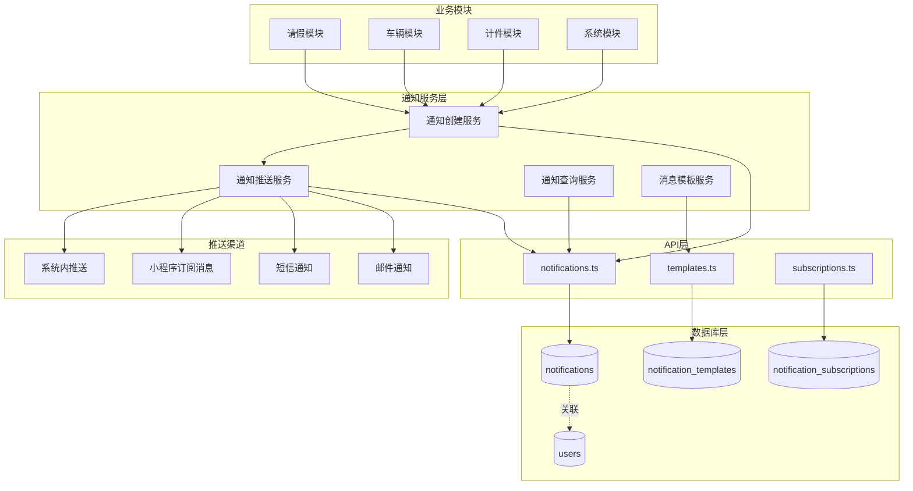
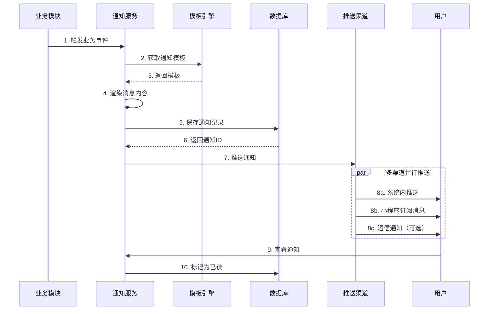
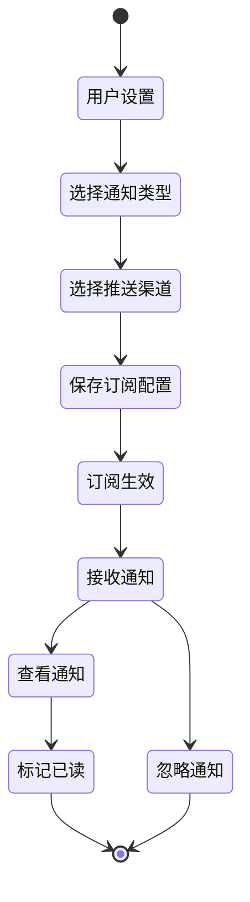

# 通知系统技术文档

## 一、功能概述

### 1.1 功能定位

通知系统是车队管家的消息中心，负责各类业务事件的通知推送、状态同步、消息管理，确保用户及时获取重要信息，提升系统的用户体验和业务效率。

### 1.2 核心价值

- **实时推送**: 业务事件发生时即时通知相关人员
- **分类管理**: 多种通知类型，方便用户分类查看
- **未读提醒**: 未读消息数量提示，避免遗漏
- **历史记录**: 完整的通知历史，可追溯查看
- **智能推送**: 基于角色和权限的精准推送

### 1.3 业务场景

```
通知类型：
1. 审批类通知
   - 请假申请待审批
   - 离职申请待审批
   - 车辆审核待审批
   
2. 结果类通知
   - 审批通过/拒绝通知
   - 操作成功/失败通知
   
3. 提醒类通知
   - 年检到期提醒
   - 工资发放通知
   - 系统公告通知
   
4. 异常类通知
   - 违章提醒
   - 数据异常预警
```

---

## 二、系统架构

### 2.1 整体架构图



### 2.2 通知推送流程



### 2.3 消息订阅流程



---

## 三、数据模型设计

### 3.1 数据库表结构

#### 3.1.1 通知表 (notifications)

```sql
CREATE TABLE notifications (
  id UUID PRIMARY KEY DEFAULT gen_random_uuid(),
  recipient_id UUID NOT NULL REFERENCES users(id) ON DELETE CASCADE,
  sender_id UUID REFERENCES users(id) ON DELETE SET NULL,
  
  -- 通知内容
  title TEXT NOT NULL,
  content TEXT NOT NULL,
  type TEXT NOT NULL,  -- 通知类型
  
  -- 关联信息
  related_id UUID,  -- 关联的业务记录ID
  related_type TEXT,  -- 关联的业务类型
  
  -- 状态信息
  is_read BOOLEAN DEFAULT false,
  read_at TIMESTAMPTZ,
  
  -- 推送信息
  push_channels TEXT[],  -- 推送渠道数组
  push_status JSONB,  -- 各渠道推送状态
  
  created_at TIMESTAMPTZ DEFAULT NOW(),
  updated_at TIMESTAMPTZ DEFAULT NOW(),
  
  -- 索引
  INDEX idx_notifications_recipient (recipient_id),
  INDEX idx_notifications_is_read (is_read),
  INDEX idx_notifications_type (type),
  INDEX idx_notifications_created (created_at DESC)
);

COMMENT ON TABLE notifications IS '通知消息表';
COMMENT ON COLUMN notifications.type IS '通知类型：leave_approval, vehicle_review, system_notice等';
COMMENT ON COLUMN notifications.related_id IS '关联的业务记录ID（如请假申请ID、车辆ID）';
COMMENT ON COLUMN notifications.push_channels IS '推送渠道：system, miniprogram, sms, email';
```

#### 3.1.2 通知模板表 (notification_templates)

```sql
CREATE TABLE notification_templates (
  id UUID PRIMARY KEY DEFAULT gen_random_uuid(),
  template_code TEXT NOT NULL UNIQUE,
  template_name TEXT NOT NULL,
  template_type TEXT NOT NULL,
  
  -- 模板内容
  title_template TEXT NOT NULL,  -- 标题模板
  content_template TEXT NOT NULL,  -- 内容模板
  
  -- 推送配置
  default_channels TEXT[],  -- 默认推送渠道
  priority INTEGER DEFAULT 1,  -- 优先级 1-5
  
  -- 变量定义
  variables JSONB,  -- 模板变量定义
  
  is_active BOOLEAN DEFAULT true,
  created_at TIMESTAMPTZ DEFAULT NOW(),
  updated_at TIMESTAMPTZ DEFAULT NOW()
);

COMMENT ON TABLE notification_templates IS '通知模板表';
COMMENT ON COLUMN notification_templates.template_code IS '模板代码，如：LEAVE_APPROVAL_PENDING';
COMMENT ON COLUMN notification_templates.variables IS '模板变量定义，如：["userName", "leaveDays"]';
```

#### 3.1.3 通知订阅表 (notification_subscriptions)

```sql
CREATE TABLE notification_subscriptions (
  id UUID PRIMARY KEY DEFAULT gen_random_uuid(),
  user_id UUID NOT NULL REFERENCES users(id) ON DELETE CASCADE,
  notification_type TEXT NOT NULL,
  
  -- 订阅设置
  is_subscribed BOOLEAN DEFAULT true,
  channels TEXT[],  -- 订阅的渠道
  
  created_at TIMESTAMPTZ DEFAULT NOW(),
  updated_at TIMESTAMPTZ DEFAULT NOW(),
  
  -- 唯一约束
  CONSTRAINT uq_user_notification_type UNIQUE (user_id, notification_type)
);

COMMENT ON TABLE notification_subscriptions IS '用户通知订阅配置表';
```

### 3.2 TypeScript 类型定义

```typescript
/**
 * 通知类型枚举
 */
export enum NotificationType {
  // 审批类
  LEAVE_APPROVAL_PENDING = 'leave_approval_pending',
  LEAVE_APPROVAL_RESULT = 'leave_approval_result',
  VEHICLE_REVIEW_PENDING = 'vehicle_review_pending',
  VEHICLE_REVIEW_RESULT = 'vehicle_review_result',
  
  // 提醒类
  INSPECTION_REMINDER = 'inspection_reminder',
  SALARY_NOTICE = 'salary_notice',
  SYSTEM_NOTICE = 'system_notice',
  
  // 异常类
  VIOLATION_ALERT = 'violation_alert',
  DATA_ANOMALY = 'data_anomaly'
}

/**
 * 推送渠道枚举
 */
export enum PushChannel {
  SYSTEM = 'system',          // 系统内推送
  MINIPROGRAM = 'miniprogram',  // 小程序订阅消息
  SMS = 'sms',                // 短信
  EMAIL = 'email'             // 邮件
}

/**
 * 通知接口
 */
export interface Notification {
  id: string
  recipient_id: string        // 接收人ID
  sender_id: string | null    // 发送人ID
  
  title: string               // 通知标题
  content: string             // 通知内容
  type: NotificationType      // 通知类型
  
  related_id: string | null   // 关联业务ID
  related_type: string | null // 关联业务类型
  
  is_read: boolean            // 是否已读
  read_at: string | null      // 阅读时间
  
  push_channels: PushChannel[]  // 推送渠道
  push_status: Record<PushChannel, PushStatus>  // 推送状态
  
  created_at: string
  updated_at: string
}

/**
 * 推送状态
 */
export interface PushStatus {
  status: 'pending' | 'success' | 'failed'
  message?: string
  pushed_at?: string
}

/**
 * 通知模板接口
 */
export interface NotificationTemplate {
  id: string
  template_code: string
  template_name: string
  template_type: string
  
  title_template: string      // 支持变量，如：{{userName}}的请假申请
  content_template: string
  
  default_channels: PushChannel[]
  priority: number            // 1-5，数字越大优先级越高
  
  variables: string[]         // 变量列表
  
  is_active: boolean
  created_at: string
  updated_at: string
}

/**
 * 创建通知输入
 */
export interface CreateNotificationInput {
  recipient_id: string
  sender_id?: string
  title: string
  content: string
  type: NotificationType
  related_id?: string
  related_type?: string
  channels?: PushChannel[]
}

/**
 * 通知统计
 */
export interface NotificationStats {
  total: number
  unread: number
  byType: Record<string, number>
}
```

---

## 四、核心功能实现

### 4.1 通知创建与推送

#### 4.1.1 核心实现

**API层实现** (`src/db/api/notifications.ts`):

```typescript
import { supabase } from '../supabase'
import type { 
  Notification, 
  CreateNotificationInput,
  NotificationTemplate,
  PushChannel
} from '../types'

/**
 * 创建通知
 * 
 * @param input 通知输入数据
 * @returns 创建的通知记录
 */
export async function createNotification(
  input: CreateNotificationInput
): Promise<Notification> {
  // 1. 检查用户订阅设置
  const channels = await getUserSubscribedChannels(
    input.recipient_id,
    input.type
  )
  
  if (channels.length === 0) {
    console.log('[createNotification] 用户未订阅该类型通知')
    // 仍然创建通知记录，但不推送
  }
  
  // 2. 创建通知记录
  const { data: notification, error } = await supabase
    .from('notifications')
    .insert({
      recipient_id: input.recipient_id,
      sender_id: input.sender_id || null,
      title: input.title,
      content: input.content,
      type: input.type,
      related_id: input.related_id || null,
      related_type: input.related_type || null,
      push_channels: channels,
      push_status: {},
      is_read: false
    })
    .select()
    .single()
  
  if (error) {
    console.error('[createNotification] 创建失败:', error)
    throw new Error(`创建通知失败: ${error.message}`)
  }
  
  // 3. 异步推送通知
  pushNotification(notification, channels).catch(err => {
    console.error('[createNotification] 推送失败:', err)
  })
  
  return notification
}

/**
 * 使用模板创建通知
 * 
 * @param templateCode 模板代码
 * @param recipientId 接收人ID
 * @param variables 模板变量
 * @param options 额外选项
 * @returns 创建的通知
 */
export async function createNotificationFromTemplate(
  templateCode: string,
  recipientId: string,
  variables: Record<string, any>,
  options?: {
    senderId?: string
    relatedId?: string
    relatedType?: string
  }
): Promise<Notification> {
  // 1. 获取模板
  const template = await getNotificationTemplate(templateCode)
  if (!template) {
    throw new Error(`通知模板不存在: ${templateCode}`)
  }
  
  // 2. 渲染模板
  const title = renderTemplate(template.title_template, variables)
  const content = renderTemplate(template.content_template, variables)
  
  // 3. 创建通知
  return createNotification({
    recipient_id: recipientId,
    sender_id: options?.senderId,
    title,
    content,
    type: template.template_type as NotificationType,
    related_id: options?.relatedId,
    related_type: options?.relatedType,
    channels: template.default_channels as PushChannel[]
  })
}

/**
 * 渲染模板
 * 支持 {{variableName}} 格式的变量替换
 */
function renderTemplate(
  template: string,
  variables: Record<string, any>
): string {
  return template.replace(/\{\{(\w+)\}\}/g, (match, key) => {
    return variables[key] !== undefined ? String(variables[key]) : match
  })
}

/**
 * 获取通知模板
 */
async function getNotificationTemplate(
  templateCode: string
): Promise<NotificationTemplate | null> {
  const { data, error } = await supabase
    .from('notification_templates')
    .select('*')
    .eq('template_code', templateCode)
    .eq('is_active', true)
    .maybeSingle()
  
  if (error) {
    console.error('[getNotificationTemplate] 查询失败:', error)
    return null
  }
  
  return data
}

/**
 * 获取用户订阅的渠道
 */
async function getUserSubscribedChannels(
  userId: string,
  notificationType: NotificationType
): Promise<PushChannel[]> {
  const { data } = await supabase
    .from('notification_subscriptions')
    .select('channels')
    .eq('user_id', userId)
    .eq('notification_type', notificationType)
    .eq('is_subscribed', true)
    .maybeSingle()
  
  // 默认只推送系统内通知
  return data?.channels || [PushChannel.SYSTEM]
}
```

#### 4.1.2 推送实现

```typescript
/**
 * 推送通知到各渠道
 */
async function pushNotification(
  notification: Notification,
  channels: PushChannel[]
): Promise<void> {
  const pushResults: Record<string, PushStatus> = {}
  
  // 并行推送到各渠道
  await Promise.all(
    channels.map(async (channel) => {
      try {
        switch (channel) {
          case PushChannel.SYSTEM:
            // 系统内推送已通过数据库完成
            pushResults[channel] = {
              status: 'success',
              pushed_at: new Date().toISOString()
            }
            break
            
          case PushChannel.MINIPROGRAM:
            await pushToMiniProgram(notification)
            pushResults[channel] = {
              status: 'success',
              pushed_at: new Date().toISOString()
            }
            break
            
          case PushChannel.SMS:
            await pushToSMS(notification)
            pushResults[channel] = {
              status: 'success',
              pushed_at: new Date().toISOString()
            }
            break
            
          case PushChannel.EMAIL:
            await pushToEmail(notification)
            pushResults[channel] = {
              status: 'success',
              pushed_at: new Date().toISOString()
            }
            break
        }
      } catch (error) {
        console.error(`[pushNotification] ${channel}推送失败:`, error)
        pushResults[channel] = {
          status: 'failed',
          message: error instanceof Error ? error.message : '推送失败'
        }
      }
    })
  )
  
  // 更新推送状态
  await supabase
    .from('notifications')
    .update({ push_status: pushResults })
    .eq('id', notification.id)
}

/**
 * 小程序订阅消息推送
 */
async function pushToMiniProgram(
  notification: Notification
): Promise<void> {
  // 调用小程序订阅消息API
  // 需要用户先订阅消息模板
  
  // 示例实现
  const response = await fetch('https://api.weixin.qq.com/cgi-bin/message/subscribe/send', {
    method: 'POST',
    body: JSON.stringify({
      touser: notification.recipient_id,
      template_id: 'TEMPLATE_ID',
      page: '/pages/notifications/detail',
      data: {
        thing1: { value: notification.title },
        thing2: { value: notification.content }
      }
    })
  })
  
  if (!response.ok) {
    throw new Error('小程序推送失败')
  }
}

/**
 * 短信推送
 */
async function pushToSMS(notification: Notification): Promise<void> {
  // 调用短信服务API
  // 需要获取用户手机号
  
  const { data: user } = await supabase
    .from('users')
    .select('phone')
    .eq('id', notification.recipient_id)
    .single()
  
  if (!user?.phone) {
    throw new Error('用户手机号不存在')
  }
  
  // 调用短信API（示例）
  // await smsService.send(user.phone, notification.content)
}

/**
 * 邮件推送
 */
async function pushToEmail(notification: Notification): Promise<void> {
  // 调用邮件服务API
  // 需要获取用户邮箱
  
  const { data: user } = await supabase
    .from('users')
    .select('email')
    .eq('id', notification.recipient_id)
    .single()
  
  if (!user?.email) {
    throw new Error('用户邮箱不存在')
  }
  
  // 调用邮件API（示例）
  // await emailService.send(user.email, notification.title, notification.content)
}
```

### 4.2 通知查询与管理

#### 4.2.1 查询实现

```typescript
/**
 * 获取用户的通知列表
 * 
 * @param userId 用户ID
 * @param options 查询选项
 * @returns 通知列表
 */
export async function getUserNotifications(
  userId: string,
  options?: {
    type?: NotificationType
    isRead?: boolean
    page?: number
    pageSize?: number
  }
): Promise<{ data: Notification[], total: number }> {
  const page = options?.page || 1
  const pageSize = options?.pageSize || 20
  const from = (page - 1) * pageSize
  const to = from + pageSize - 1
  
  let query = supabase
    .from('notifications')
    .select('*', { count: 'exact' })
    .eq('recipient_id', userId)
  
  // 类型过滤
  if (options?.type) {
    query = query.eq('type', options.type)
  }
  
  // 已读/未读过滤
  if (options?.isRead !== undefined) {
    query = query.eq('is_read', options.isRead)
  }
  
  // 分页和排序
  const { data, error, count } = await query
    .range(from, to)
    .order('created_at', { ascending: false })
  
  if (error) {
    console.error('[getUserNotifications] 查询失败:', error)
    throw error
  }
  
  return {
    data: data || [],
    total: count || 0
  }
}

/**
 * 标记通知为已读
 * 
 * @param notificationId 通知ID
 * @returns 是否成功
 */
export async function markNotificationAsRead(
  notificationId: string
): Promise<boolean> {
  const { error } = await supabase
    .from('notifications')
    .update({
      is_read: true,
      read_at: new Date().toISOString()
    })
    .eq('id', notificationId)
  
  if (error) {
    console.error('[markNotificationAsRead] 更新失败:', error)
    return false
  }
  
  return true
}

/**
 * 批量标记已读
 * 
 * @param notificationIds 通知ID数组
 * @returns 是否成功
 */
export async function markNotificationsAsRead(
  notificationIds: string[]
): Promise<boolean> {
  const { error } = await supabase
    .from('notifications')
    .update({
      is_read: true,
      read_at: new Date().toISOString()
    })
    .in('id', notificationIds)
  
  if (error) {
    console.error('[markNotificationsAsRead] 批量更新失败:', error)
    return false
  }
  
  return true
}

/**
 * 标记所有通知为已读
 * 
 * @param userId 用户ID
 * @returns 是否成功
 */
export async function markAllNotificationsAsRead(
  userId: string
): Promise<boolean> {
  const { error } = await supabase
    .from('notifications')
    .update({
      is_read: true,
      read_at: new Date().toISOString()
    })
    .eq('recipient_id', userId)
    .eq('is_read', false)
  
  if (error) {
    console.error('[markAllNotificationsAsRead] 更新失败:', error)
    return false
  }
  
  return true
}

/**
 * 获取未读通知数量
 * 
 * @param userId 用户ID
 * @returns 未读数量
 */
export async function getUnreadCount(userId: string): Promise<number> {
  const { count, error } = await supabase
    .from('notifications')
    .select('*', { count: 'exact', head: true })
    .eq('recipient_id', userId)
    .eq('is_read', false)
  
  if (error) {
    console.error('[getUnreadCount] 查询失败:', error)
    return 0
  }
  
  return count || 0
}

/**
 * 获取通知统计
 * 
 * @param userId 用户ID
 * @returns 统计数据
 */
export async function getNotificationStats(
  userId: string
): Promise<NotificationStats> {
  const { data, error } = await supabase
    .from('notifications')
    .select('type, is_read')
    .eq('recipient_id', userId)
  
  if (error) {
    console.error('[getNotificationStats] 查询失败:', error)
    return { total: 0, unread: 0, byType: {} }
  }
  
  const total = data.length
  const unread = data.filter(n => !n.is_read).length
  const byType: Record<string, number> = {}
  
  data.forEach(n => {
    byType[n.type] = (byType[n.type] || 0) + 1
  })
  
  return { total, unread, byType }
}
```

### 4.3 订阅管理

```typescript
/**
 * 更新用户订阅设置
 * 
 * @param userId 用户ID
 * @param notificationType 通知类型
 * @param settings 订阅设置
 * @returns 是否成功
 */
export async function updateNotificationSubscription(
  userId: string,
  notificationType: NotificationType,
  settings: {
    isSubscribed: boolean
    channels: PushChannel[]
  }
): Promise<boolean> {
  const { error } = await supabase
    .from('notification_subscriptions')
    .upsert({
      user_id: userId,
      notification_type: notificationType,
      is_subscribed: settings.isSubscribed,
      channels: settings.channels
    }, {
      onConflict: 'user_id,notification_type'
    })
  
  if (error) {
    console.error('[updateNotificationSubscription] 更新失败:', error)
    return false
  }
  
  return true
}

/**
 * 获取用户的订阅设置
 * 
 * @param userId 用户ID
 * @returns 订阅设置列表
 */
export async function getUserSubscriptions(
  userId: string
): Promise<Array<{
  notification_type: NotificationType
  is_subscribed: boolean
  channels: PushChannel[]
}>> {
  const { data, error } = await supabase
    .from('notification_subscriptions')
    .select('notification_type, is_subscribed, channels')
    .eq('user_id', userId)
  
  if (error) {
    console.error('[getUserSubscriptions] 查询失败:', error)
    return []
  }
  
  return data || []
}
```

---

## 五、业务集成示例

### 5.1 请假审批通知

```typescript
// 请假申请提交时
async function onLeaveApplicationCreated(
  application: LeaveApplication
): Promise<void> {
  // 获取审批人列表
  const reviewers = await getLeaveReviewers(application)
  
  // 给每个审批人发送通知
  for (const reviewer of reviewers) {
    await createNotificationFromTemplate(
      'LEAVE_APPROVAL_PENDING',
      reviewer.id,
      {
        userName: application.driver_name,
        leaveType: getLeaveTypeName(application.leave_type),
        leaveDays: application.days,
        startDate: application.start_date,
        endDate: application.end_date
      },
      {
        senderId: application.driver_id,
        relatedId: application.id,
        relatedType: 'leave_application'
      }
    )
  }
}

// 请假审批完成时
async function onLeaveApplicationReviewed(
  application: LeaveApplication,
  approved: boolean
): Promise<void> {
  const result = approved ? '已通过' : '已拒绝'
  
  await createNotificationFromTemplate(
    'LEAVE_APPROVAL_RESULT',
    application.driver_id,
    {
      result,
      reviewerName: application.reviewer_name,
      leaveType: getLeaveTypeName(application.leave_type),
      leaveDays: application.days,
      reviewNotes: application.review_notes || '无'
    },
    {
      senderId: application.reviewer_id!,
      relatedId: application.id,
      relatedType: 'leave_application'
    }
  )
}
```

### 5.2 车辆审核通知

```typescript
// 车辆提交审核时
async function onVehicleSubmitted(vehicle: Vehicle): Promise<void> {
  const reviewers = await getVehicleReviewers(vehicle)
  
  for (const reviewer of reviewers) {
    await createNotificationFromTemplate(
      'VEHICLE_REVIEW_PENDING',
      reviewer.id,
      {
        plateNumber: vehicle.plate_number,
        ownerName: vehicle.owner_name,
        vehicleType: vehicle.vehicle_type || '未知'
      },
      {
        senderId: vehicle.user_id,
        relatedId: vehicle.id,
        relatedType: 'vehicle'
      }
    )
  }
}

// 车辆审核完成时
async function onVehicleReviewed(
  vehicle: Vehicle,
  approved: boolean
): Promise<void> {
  const result = approved ? '已通过' : '已拒绝'
  
  await createNotificationFromTemplate(
    'VEHICLE_REVIEW_RESULT',
    vehicle.user_id,
    {
      plateNumber: vehicle.plate_number,
      result,
      reviewNotes: vehicle.review_notes || '无'
    },
    {
      senderId: vehicle.reviewer_id!,
      relatedId: vehicle.id,
      relatedType: 'vehicle'
    }
  )
}
```

---

## 六、界面设计

### 6.1 通知列表页面

```
┌─────────────────────────────────┐
│  通知消息                (5)    │
├─────────────────────────────────┤
│  筛选: ● 全部  ○ 未读  ○ 已读  │
├─────────────────────────────────┤
│                                 │
│  ┌───────────────────────────┐  │
│  │ 🔴 新的请假申请           │  │
│  │ 张三申请请假3天，请及时... │  │
│  │ 10:30                     │  │
│  └───────────────────────────┘  │
│                                 │
│  ┌───────────────────────────┐  │
│  │ 🔴 车辆审核待处理         │  │
│  │ 京A12345等待您的审核      │  │
│  │ 09:15                     │  │
│  └───────────────────────────┘  │
│                                 │
│  ┌───────────────────────────┐  │
│  │ ⚪ 您的请假申请已通过     │  │
│  │ 您的事假申请已通过审批    │  │
│  │ 昨天 16:45                │  │
│  └───────────────────────────┘  │
│                                 │
│  ┌───────────────────────────┐  │
│  │ ⚪ 工资发放通知           │  │
│  │ 您的12月工资已发放        │  │
│  │ 12-10 14:20               │  │
│  └───────────────────────────┘  │
│                                 │
│  ┌───────────────────────────┐  │
│  │       加载更多            │  │
│  └───────────────────────────┘  │
│                                 │
└─────────────────────────────────┘
```

### 6.2 通知详情页面

```
┌─────────────────────────────────┐
│  ← 通知详情                      │
├─────────────────────────────────┤
│                                 │
│  新的请假申请                    │
│  2025-12-11 10:30               │
├─────────────────────────────────┤
│                                 │
│  张三申请请假3天，请及时审批。  │
│                                 │
│  请假类型：事假                 │
│  请假时间：2025-12-15 至 12-17  │
│  请假天数：3天                  │
│  请假原因：家中有事需要处理     │
│                                 │
├─────────────────────────────────┤
│                                 │
│  ┌───────────────────────────┐  │
│  │       查看详情            │  │
│  └───────────────────────────┘  │
│                                 │
│  ┌───────────────────────────┐  │
│  │       去审批              │  │
│  └───────────────────────────┘  │
│                                 │
└─────────────────────────────────┘
```

### 6.3 订阅设置页面

```
┌─────────────────────────────────┐
│  ← 通知设置                      │
├─────────────────────────────────┤
│                                 │
│  审批类通知                      │
│  ┌───────────────────────────┐  │
│  │ 请假申请通知       ✓      │  │
│  │ 推送方式：系统内、小程序  │  │
│  └───────────────────────────┘  │
│                                 │
│  ┌───────────────────────────┐  │
│  │ 车辆审核通知       ✓      │  │
│  │ 推送方式：系统内、短信    │  │
│  └───────────────────────────┘  │
│                                 │
│  提醒类通知                      │
│  ┌───────────────────────────┐  │
│  │ 年检提醒           ✓      │  │
│  │ 推送方式：系统内          │  │
│  └───────────────────────────┘  │
│                                 │
│  ┌───────────────────────────┐  │
│  │ 工资通知           ✓      │  │
│  │ 推送方式：全部            │  │
│  └───────────────────────────┘  │
│                                 │
│  异常类通知                      │
│  ┌───────────────────────────┐  │
│  │ 违章提醒           ✓      │  │
│  │ 推送方式：系统内、短信    │  │
│  └───────────────────────────┘  │
│                                 │
└─────────────────────────────────┘
```

---

## 七、性能优化

### 7.1 数据库优化

```sql
-- 复合索引优化查询
CREATE INDEX idx_notifications_user_read 
ON notifications(recipient_id, is_read);

-- 部分索引（只索引未读通知）
CREATE INDEX idx_notifications_unread 
ON notifications(recipient_id, created_at DESC)
WHERE is_read = false;

-- 通知类型索引
CREATE INDEX idx_notifications_type_created 
ON notifications(type, created_at DESC);
```

### 7.2 批量推送优化

```typescript
/**
 * 批量创建通知
 * 用于群发场景，如系统公告
 */
export async function batchCreateNotifications(
  recipientIds: string[],
  notification: Omit<CreateNotificationInput, 'recipient_id'>
): Promise<number> {
  // 分批处理，避免单次插入过多
  const batchSize = 100
  let successCount = 0
  
  for (let i = 0; i < recipientIds.length; i += batchSize) {
    const batch = recipientIds.slice(i, i + batchSize)
    
    const notifications = batch.map(recipientId => ({
      recipient_id: recipientId,
      sender_id: notification.sender_id || null,
      title: notification.title,
      content: notification.content,
      type: notification.type,
      related_id: notification.related_id || null,
      related_type: notification.related_type || null,
      push_channels: notification.channels || [PushChannel.SYSTEM],
      push_status: {},
      is_read: false
    }))
    
    const { data, error } = await supabase
      .from('notifications')
      .insert(notifications)
      .select('id')
    
    if (!error && data) {
      successCount += data.length
    }
  }
  
  return successCount
}
```

### 7.3 实时订阅

```typescript
/**
 * 订阅实时通知
 * 用户进入应用时订阅，新通知实时推送
 */
export function subscribeToNotifications(
  userId: string,
  onNewNotification: (notification: Notification) => void
) {
  return supabase
    .channel(`notifications:${userId}`)
    .on('postgres_changes', {
      event: 'INSERT',
      schema: 'public',
      table: 'notifications',
      filter: `recipient_id=eq.${userId}`
    }, (payload) => {
      onNewNotification(payload.new as Notification)
    })
    .subscribe()
}
```

---

## 八、测试用例

### 8.1 单元测试

```typescript
describe('通知系统', () => {
  describe('模板渲染', () => {
    it('应该正确渲染模板变量', () => {
      const template = '{{userName}}的请假申请（{{leaveDays}}天）'
      const result = renderTemplate(template, {
        userName: '张三',
        leaveDays: 3
      })
      expect(result).toBe('张三的请假申请（3天）')
    })
  })
  
  describe('通知创建', () => {
    it('应该成功创建通知', async () => {
      const notification = await createNotification({
        recipient_id: 'user-id',
        title: '测试通知',
        content: '这是一条测试通知',
        type: NotificationType.SYSTEM_NOTICE
      })
      
      expect(notification.id).toBeDefined()
      expect(notification.is_read).toBe(false)
    })
  })
})
```

---

## 九、常见问题

| 问题 | 原因 | 解决方案 |
|------|------|---------|
| 收不到通知 | 未订阅或订阅设置错误 | 检查订阅设置 |
| 小程序推送失败 | 用户未授权订阅消息 | 引导用户授权 |
| 通知延迟 | 推送队列堵塞 | 优化批量推送逻辑 |
| 未读数不准 | 缓存未更新 | 强制刷新或清除缓存 |

---

## 十、总结

通知系统是车队管家的消息中心，具有以下特点：

### 优势

- ✅ **多渠道推送**: 系统内、小程序、短信、邮件
- ✅ **模板化管理**: 统一的消息模板
- ✅ **实时订阅**: 新通知实时推送
- ✅ **个性化配置**: 用户自定义订阅设置
- ✅ **性能优化**: 批量推送、索引优化

### 技术亮点

1. 模板引擎支持灵活的消息定制
2. 多渠道并行推送提升到达率
3. 实时订阅机制保证消息及时性
4. 订阅管理支持个性化配置

---

**文档版本**: 1.0.0  
**创建时间**: 2025-12-11  
**维护人员**: 系统开发团队  
**状态**: 已发布
