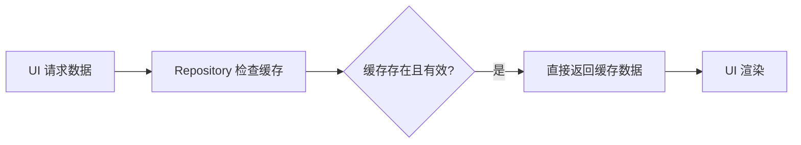
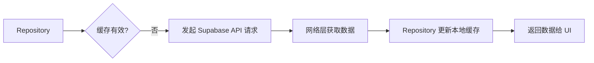
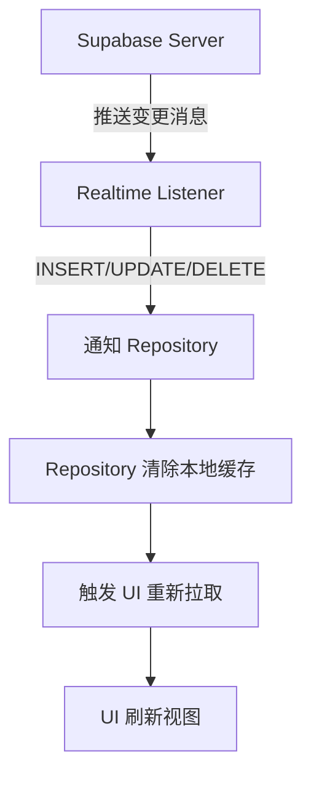
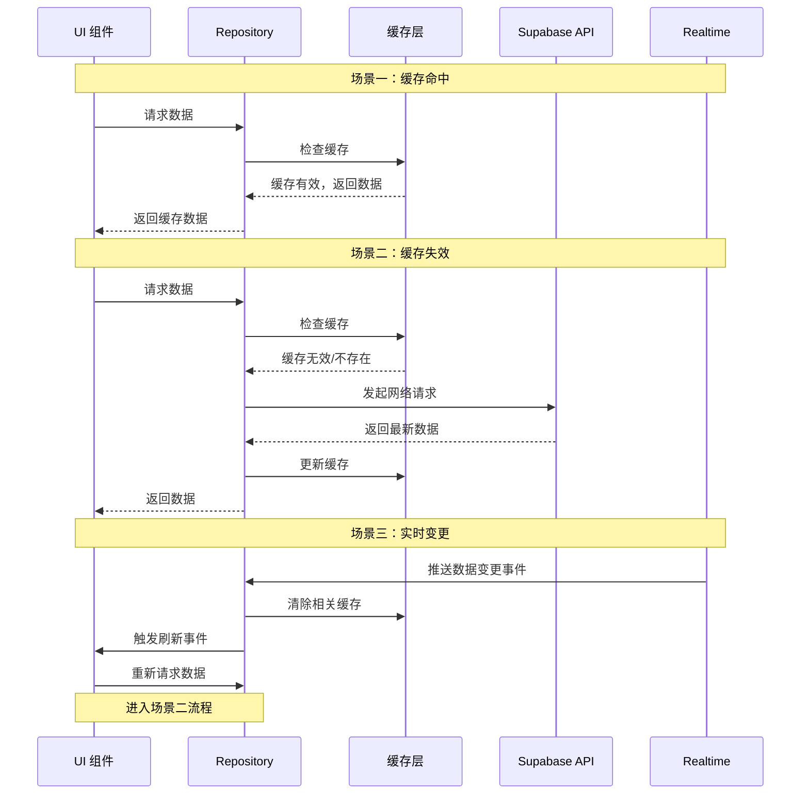

# Realtime 缓存失效文档

## 概述

本文档说明 Supabase Realtime 订阅与 Repository 缓存失效机制的协同工作方式。通过 Realtime 监听数据库变更事件，系统可以自动清除相关缓存，确保数据一致性。

## 三种数据流场景

系统中存在三种不同的数据流场景，每种场景有不同的处理逻辑：

### 场景一：缓存命中（本地路径 - 性能最优）

当用户进入页面或调用接口时，系统首先检查本地（Repository 层）是否有有效缓存。



**数据流向**：
```
[UI 请求数据] → [Repository 检查缓存] → [缓存存在且有效] → [直接返回缓存数据给 UI]
```

**特点**：
- ✅ 不涉及网络请求
- ✅ 响应速度最快（毫秒级）
- ✅ 性能最优的情况
- ⚠️ 数据可能不是最新的（在 TTL 范围内）

### 场景二：缓存失效/首次加载（网络路径）

如果本地没有缓存（或缓存过期），Repository 必须从远程获取数据。



**数据流向**：
```
[Repository] → [发起 Supabase API 请求] → [网络层获取数据] → [Repository 更新本地缓存] → [返回数据给 UI]
```

**特点**：
- ✅ 获取最新数据
- ✅ 数据初始化的源头
- ⚠️ 需要网络请求，有延迟
- ⚠️ 消耗网络资源和 API 配额

### 场景三：实时变更事件（监听路径 - 被动数据流）

这是 Supabase 的核心能力。当数据库发生变化时，Realtime 服务会主动推送消息。



**数据流向**：
```
[Supabase Server] → [推送变更消息 (Insert/Update/Delete)] → [Realtime Listener 监听到] → [通知 Repository] → [Repository 清除/更新本地缓存] → [触发 UI 重新拉取/刷新视图]
```

**特点**：
- ✅ 实时性高，数据变更立即感知
- ✅ "监听"是独立于"请求"的被动数据流
- ✅ 无需轮询，节省资源
- ⚠️ 需要维护 WebSocket 连接
- ⚠️ 只适用于需要高实时性的数据

## 三种场景的协同工作



## 哪些数据需要 Realtime 订阅

根据数据的实时性要求，选择是否启用 Realtime 订阅：

| 数据类型 | 实时性要求 | 缓存策略 | Realtime 订阅 | 说明 |
|----------|-----------|----------|---------------|------|
| 通知 (notifications) | 高 | TTL: 1 分钟 | ✅ 订阅 INSERT/UPDATE | 用户需要立即看到新通知 |
| 车辆状态 (vehicles) | 中 | TTL: 5 分钟 | ✅ 订阅 UPDATE | 审核状态变更需要及时通知 |
| 考勤 (attendance) | 中 | TTL: 2 分钟 | ❌ 不订阅 | 依赖缓存 TTL 和手动刷新 |
| 计件记录 (piece_work_records) | 中 | TTL: 2 分钟 | ❌ 不订阅 | 依赖缓存 TTL 和手动刷新 |
| 仓库分配 (warehouse_assignments) | 低 | TTL: 5 分钟 | ❌ 不订阅 | 变化不频繁 |
| 仓库信息 (warehouses) | 低 | TTL: 10 分钟 | ❌ 不订阅 | 变化不频繁 |
| 品类价格 (category_prices) | 低 | TTL: 10 分钟 | ❌ 不订阅 | 变化不频繁 |

## RealtimeCacheInvalidator 使用

### 初始化

在用户���录成功后初始化 Realtime 订阅：

```typescript
import { realtimeCacheInvalidator } from '@/db/realtime/RealtimeCacheInvalidator'

// 在 AuthProvider 中，用户登录成功后调用
const handleLoginSuccess = async (user: User) => {
  // 初始化 Realtime 缓存失效订阅
  await realtimeCacheInvalidator.initialize(user.id)
}
```

### 清理

在用户登出时清理订阅：

```typescript
// 在 smartLogout 函数中调用
const smartLogout = async () => {
  // 1. 清理 Realtime 订阅
  await realtimeCacheInvalidator.cleanup()
  
  // 2. 清除所有缓存
  clearAllRepositoryCache()
  
  // 3. 执行登出
  await supabase.auth.signOut()
}
```

### 检查状态

```typescript
// 检查是否已初始化
const isInitialized = realtimeCacheInvalidator.isInitialized()

// 获取当前订阅的用户 ID
const userId = realtimeCacheInvalidator.getCurrentUserId()
```

## 监听的事件类型

### Notifications 表

| 事件类型 | 触发条件 | 处理逻辑 |
|---------|---------|---------|
| INSERT | 新通知创建 | 清除通知缓存，发布 `notification:created` 事件 |
| UPDATE | 通知状态变更（如标记已读） | 清除通知缓存，发布 `notification:read` 事件 |

### Vehicles 表

| ���件类型 | 触发条件 | 处理逻辑 |
|---------|---------|---------|
| UPDATE | 车辆信息变更 | 清除车辆缓存，根据状态发布相应事件 |

车辆状态变更事件：
- `vehicle:approved` - 审核通过
- `vehicle:review_submitted` - 提交审核
- `vehicle:supplement_required` - 需要补充资料
- `vehicle:returned` - 车辆退还
- `vehicle:updated` - 其他更新

## 最佳实践

### 1. 避免缓存与 Realtime 冲突

```typescript
// ❌ 错误：Realtime 更新直接修改缓存
channel.on('postgres_changes', { ... }, (payload) => {
  // 直接修改缓存可能导致数据不一致
  cache.set(key, payload.new)
})

// ✅ 正确：Realtime 事件触发缓存失效
channel.on('postgres_changes', { ... }, (payload) => {
  // 清除缓存，下次查询时从数据库获取最新数据
  repository.clearAllCache()
})
```

### 2. 合理选择订阅范围

```typescript
// ❌ 错误：订阅所有表的所有变更（资源浪费）
channel.on('postgres_changes', { event: '*', schema: 'public' }, ...)

// ✅ 正确：只订阅需要实时性的表和事件
channel
  .on('postgres_changes', { 
    event: 'INSERT', 
    schema: 'public', 
    table: 'notifications',
    filter: `recipient_id=eq.${userId}` 
  }, ...)
```

### 3. 登出时清理订阅

```typescript
// ✅ 正确：登出时必须清理 Realtime 订阅和缓存
async function logout(): Promise<void> {
  // 1. 清理 Realtime 订阅
  await realtimeCacheInvalidator.cleanup()
  
  // 2. 清除所有用户缓存
  clearAllRepositoryCache()
  
  // 3. 执行登出
  await supabase.auth.signOut()
}
```

### 4. 写操作立即失效，不依赖 Realtime

```typescript
// ✅ 正确：写操作后立即清除缓存
async function markNotificationAsRead(id: string): Promise<boolean> {
  const success = await notificationsRepository.update(id, { is_read: true })
  
  // 写操作成功后立即清除缓存（不等待 Realtime）
  // Repository 的 update 方法已自动清除缓存
  
  return success
}
```

### 5. 使用 eventBus 通知 UI 更新

```typescript
// 在 Realtime 事件处理器中
private handleNotificationInsert(payload) {
  // 1. 清除缓存
  notificationsRepository.clearAllCache()
  
  // 2. 发布事件通知 UI
  eventBus.publish('notification:created', {
    notificationId: payload.new?.id
  })
}

// 在 UI 组件中订阅事件
useEffect(() => {
  const unsubscribe = eventBus.subscribe('notification:created', () => {
    // 刷新通知列表
    refetchNotifications()
  })
  
  return () => unsubscribe()
}, [])
```

## 事件驱动缓存失效

除了 Realtime 订阅，系统还支持通过 eventBus 进行事件驱动的缓存失效：

### 事件与缓存映射

```typescript
// CacheEventSubscriber.ts 中的映射配置
const EVENT_CACHE_MAPPING = {
  'attendance:updated': ['attendance'],
  'piece_work:updated': ['piece_work'],
  'warehouse:updated': ['warehouses', 'warehouse_assignments'],
  'warehouse_assignment:updated': ['warehouse_assignments', 'warehouses'],
  'notification:created': ['notifications'],
  'notification:read': ['notifications'],
  'vehicle:updated': ['vehicles'],
  'vehicle:approved': ['vehicles'],
  'vehicle:returned': ['vehicles'],
  'leave:updated': ['leave'],
  'resignation:updated': ['resignation'],
  'user:updated': ['users'],
  'category_price:updated': ['category_prices'],
}
```

### 初始化事件订阅

```typescript
import { initCacheEventSubscriber } from '@/db/repositories'

// 应用启动时初始化
initCacheEventSubscriber()
```

### 发布事件

```typescript
import { eventBus } from '@/utils/eventBus'

// 在数据变更后发布事件
await warehousesRepository.update(id, data)
eventBus.publish('warehouse:updated', { warehouseId: id })
```

## 调试

### 查看 Realtime 日志

在开发环境中，控制台会显示详细的 Realtime 日志：

```
[RealtimeCacheInvalidator] 初始化 Realtime 缓存失效订阅 { userId: 'user-123' }
[RealtimeCacheInvalidator] Realtime 订阅状态变更 { status: 'SUBSCRIBED' }
[RealtimeCacheInvalidator] 收到通知 INSERT 事件 { notificationId: 'notif-456' }
[RealtimeCacheInvalidator] 通知缓存已清除（INSERT 事件）
```

### 检查订阅状态

```typescript
// 检查是否已初始化
console.log('Realtime 已初始化:', realtimeCacheInvalidator.isInitialized())

// 获取当前用户
console.log('当前用户:', realtimeCacheInvalidator.getCurrentUserId())
```

## 相关文档

- [Repository 模式 API 文档](./Repository模式API文档.md)
- [Repository 使用指南](./Repository使用指南.md)
- [全局缓存系统使用指南](./全局缓存系统使用指南.md)
