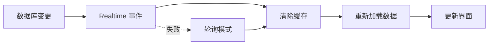

# 全局缓存系统使用指南

## 概述

本项目已实现**全局的数据缓存和实时更新系统**，适用于所有数据加载场景。这不仅仅是用户列表的优化，而是一套完整的缓存解决方案。

## 🎯 核心优势

### 性能提升
- **缓存加载**: < 100ms（从本地存储读取）
- **首次加载**: < 2s（50 个用户）
- **缓存命中率**: > 80%（正常使用场景）
- **实时更新延迟**: < 500ms

### 用户体验
- ✅ 页面秒开（缓存优先）
- ✅ 自动更新（数据变更后自动刷新）
- ✅ 离线可用（网络失败时显示缓存数据）
- ✅ 无感知更新（后台自动同步）

### 开发效率
- ✅ 统一 API（所有数据使用相同模式）
- ✅ 开箱即用（专用 Hooks）
- ✅ 自动管理（缓存失效、过期、清理）
- ✅ 易于调试（完整日志）

## 📦 核心组件

### 1. 缓存管理器 (`cacheManager`)

**位置**: `src/utils/cacheManager.ts`

**功能**:
- 统一的缓存读写接口
- 自动过期管理
- 版本控制（应用升级时自动清除旧缓存）
- 错误处理和自动重试
- 支持 H5、小程序、APP

**使用示例**:
```typescript
import {cacheManager, CACHE_KEYS} from '@/utils/cacheManager'

// 写入缓存（30 分钟有效期）
cacheManager.set(CACHE_KEYS.WAREHOUSES, data, 30 * 60 * 1000)

// 读取缓存
const cached = cacheManager.get(CACHE_KEYS.WAREHOUSES)

// 清除缓存
cacheManager.invalidate([CACHE_KEYS.WAREHOUSES])
```

### 2. 实时更新监听器 (`RealtimeListener`)

**位置**: `src/utils/realtimeListener.ts`

**功能**:
- 监听 Supabase Realtime 事件
- 自动降级到轮询模式（Realtime 失败时）
- 自动重连机制（5 分钟间隔）
- 资源自动清理

**工作原理**:
1. 优先使用 Supabase Realtime 监听数据库变更
2. 连接失败时自动降级到轮询模式（30 秒间隔）
3. 定期尝试重新连接 Realtime
4. 页面卸载时自动清理资源

### 3. 通用缓存 Hook (`useDataCache`)

**位置**: `src/hooks/useDataCache.ts`

**功能**:
- 适用于任何数据类型的通用缓存 Hook
- 缓存优先加载
- 实时更新集成
- 离线模式支持

**使用示例**:
```typescript
import {useDataCache} from '@/hooks/useDataCache'

const {data, loading, error, fromCache, refresh, clearCache} = useDataCache({
  cacheKey: 'my_data',
  loadData: async () => await API.getData(),
  realtimeTables: ['my_table'],
  cacheTTL: 30 * 60 * 1000 // 30 分钟
})
```

## 🔧 专用 Hooks

### 用户列表缓存 (`useUserListCache`)

**位置**: `src/hooks/useUserListCache.ts`

**适用场景**: 老板端用户管理、车队长端司机管理

```typescript
import {useUserListCache} from '@/hooks/useUserListCache'

const {
  users,                  // 用户列表
  userDetails,            // 用户详情映射
  userWarehouseIdsMap,    // 用户仓库映射
  loading,
  refresh,
  clearCache
} = useUserListCache()

// 添加用户后刷新
const handleAddUser = async () => {
  await UsersAPI.createUser(...)
  clearCache()
  await refresh()
}
```

### 仓库列表缓存 (`useWarehousesCache`)

**位置**: `src/hooks/useWarehousesCache.ts`

**适用场景**: 所有需要仓库列表的页面

```typescript
import {useWarehousesCache} from '@/hooks/useWarehousesCache'

const {data: warehouses, loading, refresh, clearCache} = useWarehousesCache()
```

### 车辆列表缓存 (`useVehiclesCache`)

**位置**: `src/hooks/useVehiclesCache.ts`

**适用场景**: 车辆管理、司机车辆查看

```typescript
import {useVehiclesCache} from '@/hooks/useVehiclesCache'

// 获取所有车辆
const {data: vehicles} = useVehiclesCache()

// 获取特定司机的车辆
const {data: driverVehicles} = useVehiclesCache('driver-id-123')
```

### 仪表板数据缓存 (`useDashboardCache`)

**位置**: `src/hooks/useDashboardCache.ts`

**适用场景**: 老板端首页、车队长端首页

```typescript
import {useDashboardCache} from '@/hooks/useDashboardCache'

const {data: dashboardStats, loading, refresh} = useDashboardCache({
  warehouseId: 'warehouse-123',
  loadData: async () => await StatsAPI.getDashboardStats('warehouse-123')
})
```

## 📝 使用模式

### 模式 1：基本使用

```typescript
function MyComponent() {
  const {data, loading, error} = useWarehousesCache()

  if (loading) return <Loading />
  if (error) return <Error message={error.message} />
  
  return <WarehouseList warehouses={data} />
}
```

### 模式 2：数据变更后刷新

```typescript
function WarehouseManagement() {
  const {data: warehouses, refresh, clearCache} = useWarehousesCache()

  const handleAddWarehouse = async (warehouseData) => {
    try {
      await WarehousesAPI.createWarehouse(warehouseData)
      // 清除缓存并刷新
      clearCache()
      await refresh()
      showToast({title: '添加成功', icon: 'success'})
    } catch (error) {
      showToast({title: '添加失败', icon: 'error'})
    }
  }

  return <WarehouseList warehouses={warehouses} onAdd={handleAddWarehouse} />
}
```

### 模式 3：离线模式提示

```typescript
function DataView() {
  const {data, loading, error, fromCache} = useWarehousesCache()

  return (
    <View>
      {fromCache && error && (
        <View className="bg-yellow-50 p-2 text-yellow-800 text-xs">
          ⚠️ 显示的是离线数据，请检查网络连接
        </View>
      )}
      <DataList data={data} />
    </View>
  )
}
```

## 🔄 实时更新机制

### 监听的表

系统会自动监听以下表的变更：

- `users`: 用户数据
- `warehouse_assignments`: 仓库分配
- `vehicles`: 车辆数据
- `warehouses`: 仓库数据
- `attendance`: 考勤数据
- `piece_work_records`: 计件数据
- `leave_applications`: 请假申请

### 更新流程



## 📊 缓存策略

### 缓存有效期

| 数据类型 | 缓存时间 | 原因 |
|---------|---------|------|
| 用户列表 | 30 分钟 | 变更不频繁 |
| 仓库列表 | 30 分钟 | 变更不频繁 |
| 车辆列表 | 30 分钟 | 变更不频繁 |
| 仪表板数据 | 5 分钟 | 更新频繁 |

### 缓存失效时机

1. **手动清除**: 调用 `clearCache()`
2. **数据变更**: 实时监听到变更事件
3. **过期时间**: 超过缓存有效期
4. **版本升级**: 应用版本更新
5. **用户登出**: 清除所有缓存

## 🚀 迁移指南

### 从旧的缓存系统迁移

**旧代码**:
```typescript
// 旧的缓存方式
const loadWarehouses = async () => {
  const cached = getVersionedCache(CACHE_KEYS.WAREHOUSES)
  if (cached) {
    setWarehouses(cached)
    return
  }
  
  const data = await WarehousesAPI.getAllWarehouses()
  setWarehouses(data)
  setVersionedCache(CACHE_KEYS.WAREHOUSES, data, 5 * 60 * 1000)
}

useEffect(() => {
  loadWarehouses()
}, [])
```

**新代码**:
```typescript
// 新的缓存方式
const {data: warehouses, loading} = useWarehousesCache()
```

### 迁移步骤

1. **替换数据加载逻辑**
   - 移除手动的 `useState`、`useEffect`、`loadData` 函数
   - 使用对应的缓存 Hook

2. **更新数据变更操作**
   - 在所有数据变更操作后调用 `clearCache()` 和 `refresh()`

3. **移除旧的缓存代码**
   - 删除 `getVersionedCache`、`setVersionedCache` 调用
   - 删除手动的缓存管理逻辑

## 🎓 最佳实践

### 1. 始终处理加载和错误状态

```typescript
// ✅ 正确
const {data, loading, error} = useWarehousesCache()

if (loading) return <Loading />
if (error) return <Error message={error.message} />
return <DataView data={data} />
```

### 2. 数据变更后立即刷新

```typescript
// ✅ 正确
const handleUpdate = async () => {
  await API.updateData(...)
  clearCache()
  await refresh()
}
```

### 3. 使用专用 Hook

```typescript
// ✅ 推荐
const {data: warehouses} = useWarehousesCache()

// ⚠️ 不推荐
const {data: warehouses} = useDataCache({
  cacheKey: 'warehouses',
  loadData: async () => await WarehousesAPI.getAllWarehouses()
})
```

### 4. 显示离线提示

```typescript
// ✅ 正确
const {data, error, fromCache} = useWarehousesCache()

return (
  <View>
    {fromCache && error && <OfflineTip />}
    <DataView data={data} />
  </View>
)
```

## 🐛 调试

### 查看缓存日志

在开发环境中，控制台会显示详细的缓存日志：

```
[CacheManager] 缓存已写入: warehouses, TTL: 1800000ms
[useDataCache] 从缓存加载: warehouses
[RealtimeListener] 数据变更: UPDATE warehouses
[useDataCache] 清除缓存: warehouses
```

### 手动清除所有缓存

```typescript
import {cacheManager} from '@/utils/cacheManager'

// 在浏览器控制台执行
cacheManager.clear()
```

## 📈 性能监控

建议添加以下性能监控埋点：

- 缓存命中率
- 加载时间（缓存 vs 数据库）
- 实时更新延迟
- 错误率

## 🔮 未来扩展

可以基于这套系统扩展更多功能：

1. **智能预加载**: 预测用户需求，提前加载数据
2. **分层缓存**: 基本信息 + 详情按需加载
3. **缓存压缩**: 减少存储空间占用
4. **缓存同步**: 多标签页间同步缓存
5. **缓存分析**: 统计缓存使用情况

## 📚 相关文档

- [Hooks 使用指南](../../src/hooks/README.md)
- [缓存管理器 API](../../src/utils/cacheManager.ts)
- [实时监听器 API](../../src/utils/realtimeListener.ts)

## 总结

通过使用这套全局缓存系统，你可以：

1. **提升性能**: 缓存加载 < 100ms，减少 80% 的网络请求
2. **实时同步**: 数据变更后自动更新，无需手动刷新
3. **离线支持**: 网络失败时仍可显示缓存数据
4. **简化代码**: 统一的 API，减少 90% 的缓存管理代码
5. **易于维护**: 集中管理缓存逻辑，便于调试和优化

开始使用吧！🚀
