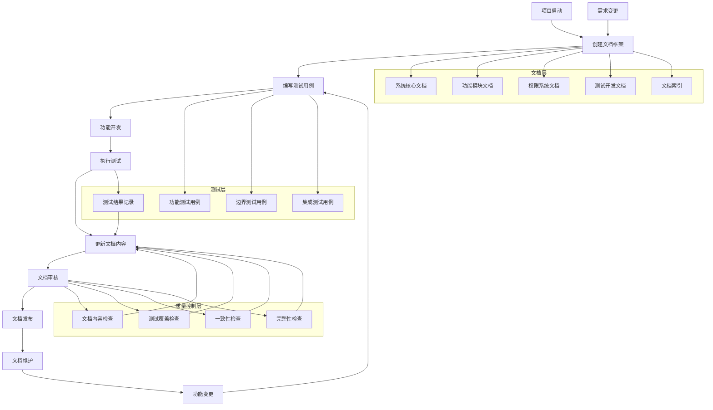
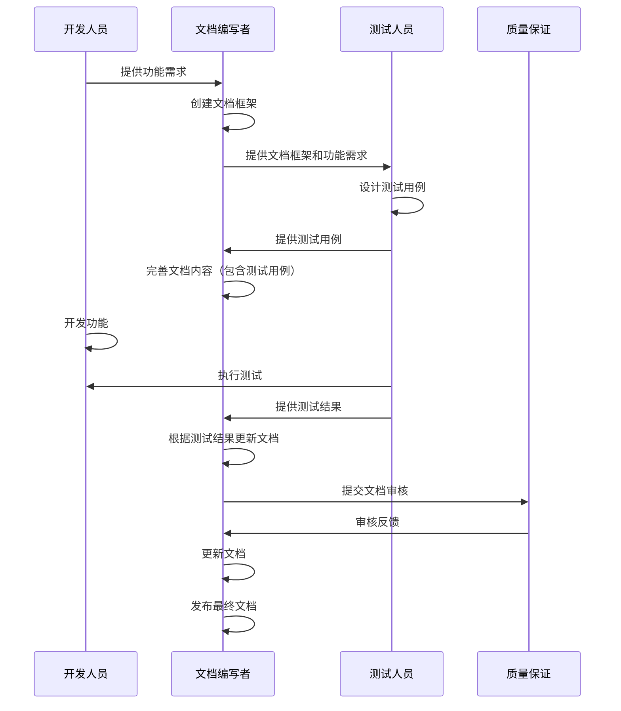
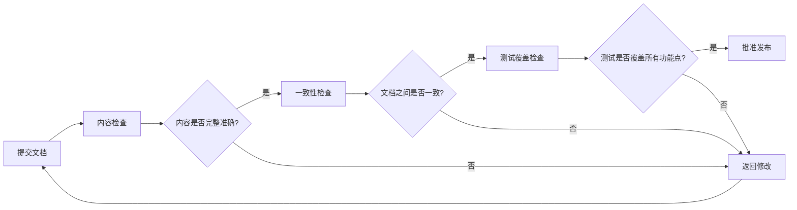

# 文档改进与功能测试 - 设计文档

## 1. 整体架构设计

### 1.1 文档管理架构图



### 1.2 分层设计说明

#### 1.2.1 文档层
- **系统核心文档**：项目整体规划、功能概览、需求文档等
- **功能模块文档**：按功能模块划分的详细文档，包含使用指南、快速参考、测试用例等
- **权限系统文档**：权限管理相关的技术文档
- **测试开发文档**：测试框架、测试工具、测试脚本等
- **文档索引**：统一的文档目录和索引，方便查找和使用

#### 1.2.2 测试层
- **功能测试用例**：验证功能是否符合需求
- **边界测试用例**：验证功能在边界条件下的表现
- **集成测试用例**：验证功能与其他模块的集成
- **测试结果记录**：记录测试执行结果，用于更新文档

#### 1.2.3 质量控制层
- **文档内容检查**：检查文档内容的准确性和完整性
- **测试覆盖检查**：检查测试用例是否覆盖所有功能点
- **一致性检查**：检查文档之间的一致性
- **完整性检查**：检查文档是否包含所有必要信息

## 2. 文档与测试集成模型

### 2.1 测试驱动文档模型



### 2.2 文档内容与测试用例对应关系

| 文档章节 | 对应测试用例 | 测试结果 | 更新记录 |
|---------|-------------|---------|---------|
| 功能概述 | 功能完整性测试 | 通过/失败 | 日期+更新内容 |
| 使用方法 | 功能操作测试 | 通过/失败 | 日期+更新内容 |
| 参数说明 | 参数验证测试 | 通过/失败 | 日期+更新内容 |
| 边界条件 | 边界值测试 | 通过/失败 | 日期+更新内容 |
| 异常处理 | 异常情况测试 | 通过/失败 | 日期+更新内容 |

## 3. 文档更新流程

### 3.1 常规更新流程


### 3.2 紧急更新流程


## 4. 文档索引机制

### 4.1 文档索引结构

```
# 文档索引

## 1. 系统核心文档
- 说明文档.md
- 系统功能文档.md
- 产品需求文档.md
- 用户手册.md

## 2. 功能模块文档

### 2.1 仓库管理
- 功能使用指南.md
- 快速参考.md
- 测试用例.md

### 2.2 车辆管理
- 功能使用指南.md
- 通知系统.md
- 测试用例.md

### 2.3 考勤管理
- 功能使用指南.md
- 测试用例.md

### 2.4 打卡功能
- 功能使用指南.md
- 测试用例.md

### 2.5 请假管理
- 功能使用指南.md
- RLS策略应用.md
- 测试用例.md

## 3. 权限系统文档
- PERMISSION_SYSTEM.md
- PERMISSION_IMPLEMENTATION_SUMMARY.md
- 权限上下文系统实现报告.md
- 权限上下文使用指南.md
- 调度权限完善总结.md

## 4. 测试开发文档
- 测试车辆审核通知.sql
- 测试框架指南.md
```

### 4.2 文档查找方法
1. **按功能模块查找**：根据需要查找的功能，在功能模块目录下查找对应文档
2. **按文档类型查找**：根据需要的文档类型（使用指南、测试用例、技术报告等）查找
3. **通过索引查找**：使用文档索引快速定位所需文档

## 5. 质量控制机制

### 5.1 文档内容质量检查清单

| 检查项 | 检查内容 | 检查方式 |
|-------|---------|---------|
| 完整性 | 文档是否包含所有必要信息 | 人工检查 |
| 准确性 | 文档内容是否与实际功能一致 | 测试验证 |
| 一致性 | 文档之间的内容是否一致 | 自动检查 |
| 可读性 | 文档是否易于理解 | 人工检查 |
| 时效性 | 文档是否是最新版本 | 版本检查 |

### 5.2 测试覆盖检查清单

| 检查项 | 检查内容 | 检查方式 |
|-------|---------|---------|
| 功能覆盖 | 测试用例是否覆盖所有功能点 | 自动检查 |
| 边界覆盖 | 测试用例是否覆盖边界条件 | 人工检查 |
| 异常覆盖 | 测试用例是否覆盖异常情况 | 人工检查 |
| 集成覆盖 | 测试用例是否覆盖模块集成 | 自动检查 |

### 5.3 文档审核流程



## 6. 实施计划

### 6.1 阶段1：文档结构优化（1个工作日）
1. 创建功能模块子目录
2. 迁移根目录下的文档到对应目录
3. 创建文档索引

### 6.2 阶段2：文档内容完善（2个工作日）
1. 为每个功能模块创建测试用例文档
2. 将测试结果整合到文档中
3. 完善文档内容，确保全面准确

### 6.3 阶段3：文档管理标准化（1个工作日）
1. 制定文档创建规范
2. 制定文档更新规范
3. 制定文档维护责任分工

### 6.4 阶段4：质量控制实施（1个工作日）
1. 执行文档内容质量检查
2. 执行测试覆盖检查
3. 执行文档审核

---

**文档版本**：1.0.0
**创建时间**：2025-12-02
**维护人员**：系统管理员
**状态**：已批准