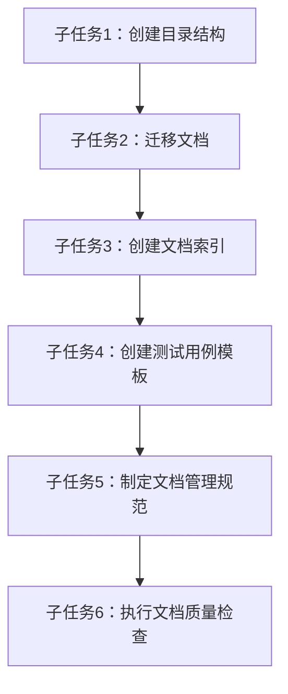

# 文档改进与功能测试 - 原子任务拆分

## 1. 任务拆分概述

根据设计文档，将文档改进与功能测试任务拆分为6个原子子任务，明确每个任务的输入、输出、约束和依赖关系。

## 2. 子任务详细定义

### 2.1 子任务1：创建功能模块目录结构

#### 输入契约
- 设计文档中的目录结构设计
- 现有根目录下的功能使用指南文件列表

#### 输出契约
- 创建docs/功能模块/目录及其子目录
- 目录结构符合设计文档要求

#### 实现约束
- 目录命名使用中文，清晰表达功能模块
- 目录结构与设计文档一致

#### 依赖关系
- 无前置依赖
- 后置依赖：子任务2（文档迁移）

### 2.2 子任务2：迁移根目录下的文档到对应目录

#### 输入契约
- 子任务1创建的目录结构
- 根目录下的功能使用指南文件
- 根目录下的说明文档.md

#### 输出契约
- 根目录下的所有文档已移动到docs目录的对应位置
- 文档移动后保持原有文件名（如需重命名需明确）

#### 实现约束
- 保留文档的原有内容
- 移动后保持文件的完整性

#### 依赖关系
- 前置依赖：子任务1（目录结构创建）
- 后置依赖：子任务3（文档索引创建）

### 2.3 子任务3：创建文档索引

#### 输入契约
- 子任务2迁移后的文档结构
- 设计文档中的文档索引结构

#### 输出契约
- 创建docs/文档索引.md文件
- 索引包含所有文档的目录和简要说明
- 索引格式清晰，便于查找

#### 实现约束
- 索引内容与实际文档结构一致
- 索引格式遵循设计文档要求

#### 依赖关系
- 前置依赖：子任务2（文档迁移）
- 后置依赖：子任务4（测试用例模板创建）

### 2.4 子任务4：为每个功能模块创建测试用例文档模板

#### 输入契约
- 子任务2迁移后的功能文档
- 设计文档中的测试用例与文档对应关系

#### 输出契约
- 为每个功能模块创建测试用例.md文件
- 测试用例包含功能测试、边界测试、异常测试等
- 测试用例模板格式统一

#### 实现约束
- 测试用例模板符合设计文档要求
- 每个功能模块的测试用例覆盖该模块的主要功能

#### 依赖关系
- 前置依赖：子任务3（文档索引创建）
- 后置依赖：子任务5（文档管理规范制定）

### 2.5 子任务5：制定文档管理规范

#### 输入契约
- 设计文档中的文档管理标准化方案
- 项目现有的文档管理实践

#### 输出契约
- 创建docs/系统核心/文档管理规范.md文件
- 规范包含文档创建、更新、维护的流程和标准
- 规范包含文档命名、格式、内容的要求

#### 实现约束
- 规范内容与设计文档一致
- 规范具有可操作性和可执行性

#### 依赖关系
- 前置依赖：子任务4（测试用例模板创建）
- 后置依赖：子任务6（文档质量检查）

### 2.6 子任务6：执行文档质量检查

#### 输入契约
- 子任务5制定的文档管理规范
- 所有迁移和创建的文档

#### 输出契约
- 执行文档内容质量检查
- 执行文档一致性检查
- 执行文档完整性检查
- 生成文档质量检查报告

#### 实现约束
- 检查标准与文档管理规范一致
- 检查报告格式清晰，包含问题和改进建议

#### 依赖关系
- 前置依赖：子任务5（文档管理规范制定）
- 无后置依赖

## 3. 任务依赖图

## 4. 任务执行顺序

1. 子任务1：创建功能模块目录结构
2. 子任务2：迁移根目录下的文档到对应目录
3. 子任务3：创建文档索引
4. 子任务4：为每个功能模块创建测试用例文档模板
5. 子任务5：制定文档管理规范
6. 子任务6：执行文档质量检查

## 5. 任务执行时间计划

| 子任务 | 预计执行时间 | 开始时间 | 结束时间 |
|-------|-------------|---------|---------|
| 子任务1 | 0.5小时 | 第1天 | 第1天 |
| 子任务2 | 1小时 | 第1天 | 第1天 |
| 子任务3 | 1小时 | 第1天 | 第1天 |
| 子任务4 | 2小时 | 第2天 | 第2天 |
| 子任务5 | 1小时 | 第2天 | 第2天 |
| 子任务6 | 1小时 | 第2天 | 第2天 |

## 6. 任务执行验收标准

### 6.1 子任务1验收标准
- ✅ docs/功能模块/目录已创建
- ✅ 功能模块子目录（仓库管理、车辆管理、考勤管理、打卡功能、请假管理）已创建

### 6.2 子任务2验收标准
- ✅ 根目录下的文档已全部移动到docs目录
- ✅ 文档移动到正确的子目录
- ✅ 文档内容保持完整

### 6.3 子任务3验收标准
- ✅ docs/文档索引.md已创建
- ✅ 索引包含所有文档的目录
- ✅ 索引格式清晰，便于查找

### 6.4 子任务4验收标准
- ✅ 每个功能模块目录下都有测试用例.md文件
- ✅ 测试用例包含功能测试、边界测试、异常测试
- ✅ 测试用例格式统一

### 6.5 子任务5验收标准
- ✅ docs/系统核心/文档管理规范.md已创建
- ✅ 规范包含文档创建、更新、维护流程
- ✅ 规范包含文档命名、格式、内容要求

### 6.6 子任务6验收标准
- ✅ 完成文档内容质量检查
- ✅ 完成文档一致性检查
- ✅ 完成文档完整性检查
- ✅ 生成文档质量检查报告

---

**文档版本**：1.0.0
**创建时间**：2025-12-02
**维护人员**：系统管理员
**状态**：已批准