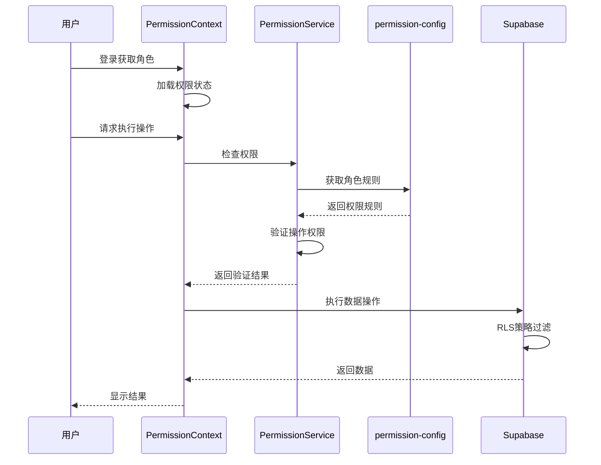

# 权限系统技术实现文档

## 一、概述

本文档详细说明了车队管家小程序权限系统的技术实现，包括前端权限控制、应用层配置和数据库层RLS策略。

### 1.1 设计原则

- **最小权限原则**：用户只能访问其工作所需的最小数据集
- **分层防御**：前端验证 + 应用层控制 + 数据库层RLS三重保护
- **角色为基础**：基于用户角色（users.role）进行权限判断
- **配置化管理**：权限规则通过配置文件管理，便于维护

### 1.2 技术栈

- **前端框架**: React + Taro
- **状态管理**: React Context API
- **后端服务**: Supabase PostgreSQL
- **安全机制**: Row Level Security (RLS)
- **开发语言**: TypeScript

## 二、权限系统架构

### 2.1 整体架构图

```
┌─────────────────────────────────────────────┐
│              前端应用层                      │
│  ┌────────────────────────────────────┐     │
│  │   PermissionContext                │     │
│  │   - 权限状态管理                    │     │
│  │   - 权限验证方法                    │     │
│  │   - 缓存机制                        │     │
│  └────────────────────────────────────┘     │
│                    ↓                         │
│  ┌────────────────────────────────────┐     │
│  │   permission-config.ts             │     │
│  │   - 角色权限规则定义                │     │
│  │   - 数据过滤器配置                  │     │
│  └────────────────────────────────────┘     │
│                    ↓                         │
│  ┌────────────────────────────────────┐     │
│  │   permission-service.ts            │     │
│  │   - 权限检查逻辑                    │     │
│  │   - 规则匹配引擎                    │     │
│  └────────────────────────────────────┘     │
└─────────────────────────────────────────────┘
                     ↓
┌─────────────────────────────────────────────┐
│              Supabase服务层                  │
│  ┌────────────────────────────────────┐     │
│  │   RLS Policies                     │     │
│  │   - 基于角色的策略                  │     │
│  │   - 数据行级过滤                    │     │
│  └────────────────────────────────────┘     │
│                    ↓                         │
│  ┌────────────────────────────────────┐     │
│  │   PostgreSQL Database              │     │
│  │   - users.role 字段                 │     │
│  │   - 数据表与关系                    │     │
│  └────────────────────────────────────┘     │
└─────────────────────────────────────────────┘
```

### 2.2 权限验证流程



## 三、前端权限实现

### 3.1 PermissionContext 上下文

**文件位置**: `src/contexts/PermissionContext.tsx`

#### 核心功能

1. **权限状态管理**
   ```typescript
   interface PermissionContextValue {
     permissions: Set<string>        // 权限集合（缓存）
     isLoading: boolean               // 加载状态
     isLoaded: boolean                // 是否已加载
     
     hasPermission: (code: string) => boolean
     hasAnyPermission: (codes: string[]) => boolean
     hasAllPermissions: (codes: string[]) => boolean
     
     loadPermissions: () => Promise<void>
     refreshPermissions: () => Promise<void>
     clearPermissions: () => void
   }
   ```

2. **权限验证方法**
   ```typescript
   // 权限码格式: tableName:action
   // 示例: "users:select", "notifications:insert"
   const hasPermission = (permissionCode: string): boolean => {
     const [tableName, action] = permissionCode.split(':')
     return checkCurrentUserPermission(tableName, action, user)
   }
   ```

3. **自动加载机制**
   - 用户登录时自动加载权限
   - 用户登出时自动清除权限
   - 支持手动刷新权限

#### 使用示例

```typescript
import { usePermission } from '@/contexts/PermissionContext'

const MyComponent = () => {
  const { hasPermission } = usePermission()
  
  const canViewUsers = hasPermission('users:select')
  const canEditUsers = hasPermission('users:update')
  
  return (
    <View>
      {canViewUsers && <Button>查看用户</Button>}
      {canEditUsers && <Button>编辑用户</Button>}
    </View>
  )
}
```

### 3.2 PermissionGuard 守卫组件

**文件位置**: `src/components/PermissionGuard.tsx`

#### 功能说明

页面级权限控制组件，用于保护需要特定权限才能访问的页面或组件。

#### 使用示例

```typescript
<PermissionGuard 
  requiredPermissions={['users:select']}
  requireAll={false}
  fallback={<AccessDenied />}
>
  <UserManagementPage />
</PermissionGuard>
```

## 四、应用层权限配置

### 4.1 permission-config.ts 配置文件

**文件位置**: `src/config/permission-config.ts`

#### 配置结构

```typescript
export interface TablePermissionRule {
  action: PermissionAction          // 操作类型
  roles: UserRole[]                  // 允许的角色
  filter?: (userId: string) => Record<string, any> | null
  allowAll?: boolean                 // 是否允许访问所有数据
}
```

#### 权限规则示例

```typescript
export const permissionConfig: Record<string, TablePermissionRule[]> = {
  // users表权限配置
  users: [
    {
      action: PermissionAction.SELECT,
      roles: ['BOSS'],
      allowAll: true  // BOSS可以查看所有用户
    },
    {
      action: PermissionAction.SELECT,
      roles: ['PEER_ADMIN', 'MANAGER', 'DRIVER'],
      filter: (userId) => ({ id: userId })  // 只能查看自己
    }
  ],
  
  // leave_applications表权限配置
  leave_applications: [
    {
      action: PermissionAction.SELECT,
      roles: ['BOSS', 'PEER_ADMIN'],
      allowAll: true  // 管理员可以查看所有请假申请
    },
    {
      action: PermissionAction.SELECT,
      roles: ['MANAGER'],
      filter: (userId) => ({ manager_id: userId })  // 车队长查看管辖范围
    },
    {
      action: PermissionAction.SELECT,
      roles: ['DRIVER'],
      filter: (userId) => ({ driver_id: userId })  // 司机只能查看自己
    }
  ]
}
```

### 4.2 权限操作类型

```typescript
export enum PermissionAction {
  SELECT = 'select',  // 查询
  INSERT = 'insert',  // 新增
  UPDATE = 'update',  // 修改
  DELETE = 'delete'   // 删除
}
```

## 五、数据库层RLS策略

### 5.1 RLS策略原则

1. **基于角色判断**：使用 `users.role` 字段判断用户角色
2. **辅助函数支持**：创建权限检查函数简化策略
3. **策略命名规范**：清晰描述策略作用
4. **最小权限原则**：默认拒绝，显式授权

### 5.2 权限辅助函数

```sql
-- 检查是否为管理员（BOSS/PEER_ADMIN）
CREATE OR REPLACE FUNCTION is_admin()
RETURNS BOOLEAN AS $$
BEGIN
    RETURN EXISTS (
        SELECT 1 FROM users
        WHERE id = auth.uid()
        AND role IN ('BOSS', 'PEER_ADMIN')
    );
END;
$$ LANGUAGE plpgsql SECURITY DEFINER STABLE;

-- 检查是否为管理层（包括MANAGER）
CREATE OR REPLACE FUNCTION is_management()
RETURNS BOOLEAN AS $$
BEGIN
    RETURN EXISTS (
        SELECT 1 FROM users
        WHERE id = auth.uid()
        AND role IN ('BOSS', 'PEER_ADMIN', 'MANAGER')
    );
END;
$$ LANGUAGE plpgsql SECURITY DEFINER STABLE;

-- 获取当前用户角色
CREATE OR REPLACE FUNCTION get_current_user_role()
RETURNS TEXT AS $$
BEGIN
    RETURN (SELECT role FROM users WHERE id = auth.uid());
END;
$$ LANGUAGE plpgsql SECURITY DEFINER STABLE;
```

### 5.3 RLS策略示例

#### users表策略

```sql
-- 管理员可以查看所有用户
CREATE POLICY "admins_view_all_users" ON users
  FOR SELECT
  TO authenticated
  USING (is_admin(auth.uid()));

-- 司机可以查看自己
CREATE POLICY "drivers_view_self" ON users
  FOR SELECT
  TO authenticated
  USING (id = auth.uid());

-- 管理员可以更新所有用户
CREATE POLICY "admins_update_all_users" ON users
  FOR UPDATE
  TO authenticated
  USING (is_admin(auth.uid()));

-- 用户可以更新自己
CREATE POLICY "users_update_self" ON users
  FOR UPDATE
  TO authenticated
  USING (id = auth.uid());
```

#### leave_applications表策略

```sql
-- 管理员查看所有请假申请
CREATE POLICY "admins_view_all_leaves" ON leave_applications
  FOR SELECT
  TO authenticated
  USING (is_admin(auth.uid()));

-- 车队长查看管辖范围的请假申请
CREATE POLICY "managers_view_managed_leaves" ON leave_applications
  FOR SELECT
  TO authenticated
  USING (
    EXISTS (
      SELECT 1 FROM warehouse_assignments wa
      WHERE wa.user_id = auth.uid()
      AND wa.warehouse_id = leave_applications.warehouse_id
    )
  );

-- 司机查看自己的请假申请
CREATE POLICY "drivers_view_own_leaves" ON leave_applications
  FOR SELECT
  TO authenticated
  USING (driver_id = auth.uid());
```

## 六、角色权限矩阵

### 6.1 核心数据表权限

| 表名 | BOSS | PEER_ADMIN | MANAGER | DRIVER |
|------|------|------------|---------|---------|
| users | 全部 | 查看全部 | 查看自己 | 查看自己 |
| notifications | 全部 | 创建+查看 | 查看自己 | 查看自己 |
| leave_applications | 全部 | 全部 | 查看管辖+审批 | 查看自己+创建 |
| resignation_applications | 全部 | 全部 | - | 查看自己+创建 |
| attendance | 全部 | 查看全部 | 查看管辖 | 查看自己+创建 |
| piece_work_records | 全部 | 查看全部 | 查看管辖 | 查看自己+创建 |
| warehouses | 全部 | 查看全部 | 查看管辖 | 查看关联 |
| vehicles | 全部 | 查看全部 | 查看管辖 | 查看自己 |

### 6.2 权限等级说明

- **全部**：SELECT, INSERT, UPDATE, DELETE
- **查看全部**：SELECT (所有数据)
- **查看管辖**：SELECT (基于 warehouse_assignments 过滤)
- **查看自己**：SELECT (user_id = auth.uid())
- **创建**：INSERT (自己的数据)
- **审批**：UPDATE (特定字段，如 status, reviewer_id)

## 七、权限验证实现细节

### 7.1 permission-service.ts

```typescript
/**
 * 检查当前用户对指定表的操作权限
 */
export function checkCurrentUserPermission(
  tableName: string,
  action: PermissionAction,
  user: User | null
): PermissionCheckResult {
  if (!user || !user.role) {
    return { hasPermission: false, reason: '用户未登录' }
  }

  const rules = permissionConfig[tableName]
  if (!rules) {
    return { hasPermission: false, reason: '表权限未配置' }
  }

  // 查找匹配的规则
  const matchedRule = rules.find(
    rule => rule.action === action && rule.roles.includes(user.role)
  )

  if (!matchedRule) {
    return { hasPermission: false, reason: '角色无此操作权限' }
  }

  return {
    hasPermission: true,
    filter: matchedRule.filter?.(user.id),
    allowAll: matchedRule.allowAll
  }
}
```

### 7.2 数据查询时应用过滤

```typescript
/**
 * 应用权限过滤查询数据
 */
async function queryWithPermission<T>(
  tableName: string,
  user: User
): Promise<T[]> {
  const permCheck = checkCurrentUserPermission(
    tableName,
    PermissionAction.SELECT,
    user
  )

  if (!permCheck.hasPermission) {
    throw new Error('无权限访问')
  }

  let query = supabase.from(tableName).select('*')

  // 应用过滤条件
  if (!permCheck.allowAll && permCheck.filter) {
    Object.entries(permCheck.filter).forEach(([key, value]) => {
      query = query.eq(key, value)
    })
  }

  const { data, error } = await query
  if (error) throw error
  return data as T[]
}
```

## 八、测试与验证

### 8.1 权限测试用例

```typescript
describe('PermissionContext', () => {
  it('BOSS可以查看所有用户', () => {
    const result = checkCurrentUserPermission(
      'users',
      PermissionAction.SELECT,
      { id: 'boss-id', role: 'BOSS' }
    )
    expect(result.hasPermission).toBe(true)
    expect(result.allowAll).toBe(true)
  })

  it('DRIVER只能查看自己', () => {
    const result = checkCurrentUserPermission(
      'users',
      PermissionAction.SELECT,
      { id: 'driver-id', role: 'DRIVER' }
    )
    expect(result.hasPermission).toBe(true)
    expect(result.filter).toEqual({ id: 'driver-id' })
  })

  it('DRIVER不能查看其他用户', () => {
    const result = checkCurrentUserPermission(
      'users',
      PermissionAction.DELETE,
      { id: 'driver-id', role: 'DRIVER' }
    )
    expect(result.hasPermission).toBe(false)
  })
})
```

### 8.2 RLS策略验证

```sql
-- 验证BOSS可以查看所有用户
SELECT set_config('request.jwt.claims', '{"sub":"boss-user-id"}', true);
SELECT * FROM users;  -- 应返回所有用户

-- 验证DRIVER只能查看自己
SELECT set_config('request.jwt.claims', '{"sub":"driver-user-id"}', true);
SELECT * FROM users;  -- 应只返回该司机的记录
```

## 九、性能优化

### 9.1 前端优化

1. **权限缓存**：使用 Set 数据结构缓存权限，O(1) 查询时间
2. **懒加载**：权限在需要时才加载
3. **批量验证**：使用 hasAnyPermission 和 hasAllPermissions 减少验证次数

### 9.2 数据库优化

1. **索引优化**：为 users.role 字段创建索引
2. **函数缓存**：权限检查函数标记为 STABLE
3. **策略简化**：避免复杂的子查询，使用辅助函数

```sql
-- 为角色字段创建索引
CREATE INDEX idx_users_role ON users(role);

-- 为关联查询创建索引
CREATE INDEX idx_warehouse_assignments_user_id 
ON warehouse_assignments(user_id);
```

## 十、安全最佳实践

### 10.1 防御深度

1. **前端验证**：UI层隐藏无权限的操作按钮
2. **应用层控制**：API调用前检查权限
3. **数据库层保护**：RLS策略确保数据安全

### 10.2 审计日志

```typescript
// 记录权限检查失败的操作
function logPermissionDenied(
  userId: string,
  tableName: string,
  action: string
) {
  console.warn(`权限拒绝: 用户${userId}尝试${action}操作${tableName}`)
  // 可扩展为写入审计日志表
}
```

### 10.3 定期审查

- 每月审查权限配置
- 检查RLS策略完整性
- 验证角色分配的合理性

## 十一、故障排查

### 11.1 常见问题

**问题1**: 用户登录后无法加载权限

**解决方案**:
- 检查 PermissionProvider 是否正确包裹应用
- 确认 user.role 字段存在且有效
- 查看控制台是否有错误日志

**问题2**: 权限验证失败但用户有权限

**解决方案**:
- 检查 permission-config.ts 中的配置
- 确认角色拼写正确（区分大小写）
- 验证 filter 函数返回值

**问题3**: RLS策略未生效

**解决方案**:
- 确认表已启用 RLS：`ALTER TABLE xxx ENABLE ROW LEVEL SECURITY`
- 检查策略是否正确创建
- 验证辅助函数是否存在

### 11.2 调试技巧

```typescript
// 启用权限调试日志
const DEBUG_PERMISSION = true

function checkPermissionWithLog(...args) {
  const result = checkCurrentUserPermission(...args)
  if (DEBUG_PERMISSION) {
    console.log('权限检查:', { args, result })
  }
  return result
}
```

## 十二、未来扩展

### 12.1 动态权限配置

考虑将权限配置存储到数据库，实现运行时动态调整：

```typescript
// 从数据库加载权限配置
async function loadPermissionConfig() {
  const { data } = await supabase
    .from('permission_rules')
    .select('*')
  return transformToConfig(data)
}
```

### 12.2 细粒度权限

支持字段级权限控制：

```typescript
interface FieldPermission {
  tableName: string
  fieldName: string
  roles: UserRole[]
  actions: PermissionAction[]
}
```

### 12.3 权限委托

支持临时权限授予：

```typescript
interface PermissionDelegation {
  fromUserId: string
  toUserId: string
  permissions: string[]
  expiresAt: Date
}
```

## 十三、总结

本权限系统采用三层防御架构，通过前端、应用层和数据库层的协同工作，确保数据安全和访问控制的准确性。系统具有以下特点：

- ✅ **安全可靠**：多层防护，基于角色的访问控制
- ✅ **配置灵活**：权限规则集中配置，易于维护
- ✅ **性能优化**：缓存机制，高效的查询性能
- ✅ **易于扩展**：清晰的架构，支持功能扩展

---

**文档版本**: 1.0.0  
**创建时间**: 2025-12-11  
**维护人员**: 系统开发团队  
**状态**: 已发布
